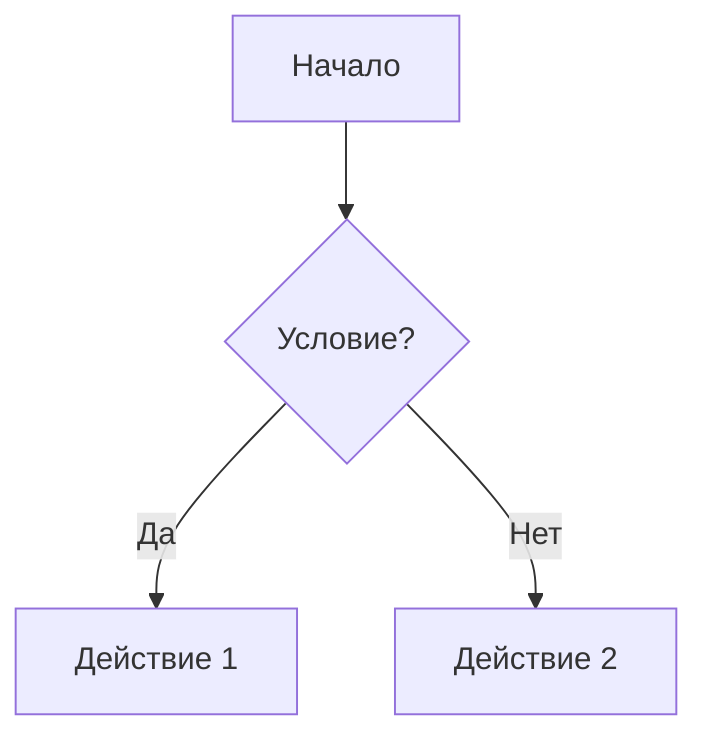

# ДЕТАЛЬНАЯ ИНСТРУКЦИЯ ДЛЯ ГЕНЕРАЦИИ MERMAID ACTIVITY ДИАГРАММ

## КРИТИЧЕСКИ ВАЖНЫЕ ПРАВИЛА

### 1. ОБЯЗАТЕЛЬНЫЙ СИНТАКСИС

**ВСЕГДА начинай код с ключевого слова `flowchart TD` или `flowchart LR` на первой строке, БЕЗ отступов!**



**НЕПРАВИЛЬНО:**
```
  flowchart TD
    A[Начало]
```

**ПРАВИЛЬНО:**
```
flowchart TD
    A[Начало]
```

### 2. ОТСТУПЫ (ТАБУЛЯЦИЯ) - КРИТИЧЕСКИ ВАЖНО!

**Используй ТОЛЬКО пробелы для отступов, НИКОГДА не используй табуляцию (TAB)!**

**Правило отступов:**
- Первая строка: `flowchart TD` или `flowchart LR` (0 пробелов)
- Все последующие строки: **4 пробела** для базового отступа
- Для вложенных блоков (subgraph): **+2 пробела** от предыдущего уровня
- Все узлы одного уровня должны иметь **одинаковый отступ**

**Пример правильной структуры отступов:**
```
flowchart TD
    A[Начало]
    B{Условие?}
    A --> B
    B -->|Да| C[Действие 1]
    B -->|Нет| D[Действие 2]
    C --> E[Конец]
    D --> E
```

**НЕПРАВИЛЬНО (неправильные отступы):**
```
flowchart TD
  A[Начало]  ← НЕПРАВИЛЬНО! 2 пробела вместо 4
    B{Условие?}  ← НЕПРАВИЛЬНО! 4 пробела, но должен быть на том же уровне
```

### 3. НАПРАВЛЕНИЕ ДИАГРАММЫ

**Выбор направления:**
- `flowchart TD` - сверху вниз (Top Down) - **РЕКОМЕНДУЕТСЯ для большинства случаев**
- `flowchart LR` - слева направо (Left Right) - для широких диаграмм
- `flowchart BT` - снизу вверх (Bottom Top) - редко используется
- `flowchart RL` - справа налево (Right Left) - редко используется

**ПРАВИЛЬНО:**
```
flowchart TD
    A[Начало]
    A --> B[Следующий шаг]
```

**НЕПРАВИЛЬНО:**
```
flowchart
    A[Начало]  ← НЕТ НАПРАВЛЕНИЯ!
```

### 4. ФОРМАТЫ УЗЛОВ

**Типы узлов в Activity диаграммах:**

1. **Прямоугольник (действие/процесс):**
   ```
   A[Текст действия]
   ```

2. **Ромб (условие/решение):**
   ```
   B{Условие?}
   ```

3. **Круг (начало/конец):**
   ```
   C((Начало))
   D((Конец))
   ```

4. **Скругленный прямоугольник:**
   ```
   E(Скругленное действие)
   ```

5. **Шестиугольник:**
   ```
   F{{Подготовка}}
   ```

6. **Параллелограмм:**
   ```
   G[/Ввод данных/]
   H[\Вывод данных\]
   ```

**ПРАВИЛЬНО:**
```
flowchart TD
    Start((Начало))
    Input[/Ввод данных/]
    Process[Обработка данных]
    Decision{Данные валидны?}
    Output[\Вывод результата\]
    End((Конец))
    
    Start --> Input
    Input --> Process
    Process --> Decision
    Decision -->|Да| Output
    Decision -->|Нет| Process
    Output --> End
```

**НЕПРАВИЛЬНО:**
```
flowchart TD
    Start[Начало]  ← Используй (( )) для начала/конца
    Process(Обработка)  ← Используй [ ] для процессов
```

### 5. СТРЕЛКИ И СВЯЗИ

**Типы стрелок:**

1. **Обычная стрелка:**
   ```
   A --> B
   ```

2. **Стрелка с текстом:**
   ```
   A -->|Текст| B
   A -->|Да| B
   A -->|Нет| C
   ```

3. **Толстая стрелка:**
   ```
   A ==> B
   ```

4. **Пунктирная стрелка:**
   ```
   A -.-> B
   ```

5. **Пунктирная стрелка с текстом:**
   ```
   A -.->|Текст| B
   ```

**ПРАВИЛЬНО:**
```
flowchart TD
    A[Действие 1]
    B{Условие?}
    C[Действие 2]
    D[Действие 3]
    
    A --> B
    B -->|Да| C
    B -->|Нет| D
```

**НЕПРАВИЛЬНО:**
```
flowchart TD
    A[Действие 1]
    B{Условие?}
    A -> B  ← НЕПРАВИЛЬНО! Используй -->
```

### 6. ПОДГРАФЫ (SUBGRAPH) - ДЛЯ ГРУППИРОВКИ

**Синтаксис подграфов:**
```
flowchart TD
    A[Начало]
    
    subgraph Группа1 ["Название группы"]
        B[Действие 1]
        C[Действие 2]
        B --> C
    end
    
    A --> B
    C --> D[Конец]
```

**ПРАВИЛЬНО:**
```
flowchart TD
    Start((Начало))
    
    subgraph Подготовка ["Этап подготовки"]
        A[Загрузка данных]
        B[Валидация]
        A --> B
    end
    
    subgraph Обработка ["Этап обработки"]
        C[Обработка]
        D[Сохранение]
        C --> D
    end
    
    Start --> A
    B --> C
    D --> End((Конец))
```

**НЕПРАВИЛЬНО:**
```
flowchart TD
    subgraph Группа1
        A[Действие]  ← НЕТ ЗАКРЫТИЯ end!
    B[Другое действие]
```

### 7. НАЗВАНИЯ УЗЛОВ И ТЕКСТ

**Правила для названий узлов:**

1. **НЕ используй специальные символы**, которые могут сломать синтаксис:
   - Кавычки внутри квадратных скобок: `A["Название"]` - можно, но лучше без кавычек
   - Незакрытые скобки: `A[Название` - НЕПРАВИЛЬНО
   - Символы `:`, `;`, `,` в неправильных местах

2. **Можно использовать:**
   - Буквы (русские и английские)
   - Цифры
   - Пробелы
   - Дефисы и подчеркивания: `-`, `_`
   - Вопросительные знаки для условий: `{Условие?}`

3. **Длинные названия:**
   - Можно использовать длинные названия на русском языке
   - Пример: `A[Производственный контроль за соблюдением требований промышленной безопасности]`

**ПРАВИЛЬНО:**
```
flowchart TD
    A[Начало процесса]
    B{Данные валидны?}
    C[Обработка данных]
    D[Производственный контроль за соблюдением требований промышленной безопасности]
```

**НЕПРАВИЛЬНО:**
```
flowchart TD
    A["Начало процесса"]  ← Кавычки не нужны
    B{Данные валидны?}  ← Правильно
    C[Обработка: данных]  ← Двоеточие может вызвать проблемы
```

### 8. ПРОВЕРКА ПЕРЕД ОТПРАВКОЙ

**ОБЯЗАТЕЛЬНО проверь код перед отправкой:**

1. ✅ Код начинается с `flowchart TD` или `flowchart LR` на первой строке БЕЗ отступов
2. ✅ Все узлы имеют правильные отступы (4 пробела для базового уровня)
3. ✅ Все стрелки правильно оформлены (`-->`, `==>`, `-.->`)
4. ✅ Все скобки закрыты (`[`, `]`, `{`, `}`, `(`, `)`)
5. ✅ Нет специальных символов в названиях узлов, которые могут сломать синтаксис
6. ✅ Все подграфы закрыты (`end`)
7. ✅ Все строки имеют правильные отступы (используй пробелы, не табуляцию)

### 9. ПРИМЕРЫ ПРАВИЛЬНОГО КОДА

**Пример 1: Простая Activity диаграмма**
```
flowchart TD
    Start((Начало))
    Input[/Ввод данных/]
    Process[Обработка]
    Decision{Валидно?}
    Output[\Вывод\]
    End((Конец))
    
    Start --> Input
    Input --> Process
    Process --> Decision
    Decision -->|Да| Output
    Decision -->|Нет| Process
    Output --> End
```

**Пример 2: Сложная Activity диаграмма с подграфами**
```
flowchart TD
    Start((Начало процесса))
    
    subgraph Подготовка ["Этап подготовки"]
        A1[Загрузка данных]
        A2[Проверка формата]
        A3[Валидация]
        A1 --> A2
        A2 --> A3
    end
    
    subgraph Обработка ["Этап обработки"]
        B1[Обработка данных]
        B2{Ошибка?}
        B3[Сохранение]
        B1 --> B2
        B2 -->|Нет| B3
        B2 -->|Да| B1
    end
    
    subgraph Завершение ["Этап завершения"]
        C1[Формирование отчета]
        C2[Отправка уведомления]
        C1 --> C2
    end
    
    Start --> A1
    A3 --> B1
    B3 --> C1
    C2 --> End((Конец))
```

**Пример 3: Activity диаграмма с циклами**
```
flowchart TD
    Start((Начало))
    Init[Инициализация]
    Loop{Условие цикла?}
    Action[Действие]
    Update[Обновление]
    End((Конец))
    
    Start --> Init
    Init --> Loop
    Loop -->|Да| Action
    Action --> Update
    Update --> Loop
    Loop -->|Нет| End
```

**Пример 4: Activity диаграмма с параллельными процессами**
```
flowchart TD
    Start((Начало))
    Fork{Разделение}
    Process1[Процесс 1]
    Process2[Процесс 2]
    Process3[Процесс 3]
    Join{Объединение}
    End((Конец))
    
    Start --> Fork
    Fork --> Process1
    Fork --> Process2
    Fork --> Process3
    Process1 --> Join
    Process2 --> Join
    Process3 --> Join
    Join --> End
```

### 10. ЧАСТЫЕ ОШИБКИ И КАК ИХ ИЗБЕЖАТЬ

**Ошибка 1: "Syntax error in text"**
- **Причина:** Неправильный синтаксис, неправильные отступы, специальные символы, незакрытые скобки
- **Решение:** Проверь все правила выше, особенно отступы, скобки и названия узлов

**Ошибка 2: "Parse error on line X"**
- **Причина:** Неправильный формат узла или стрелки на указанной строке
- **Решение:** Проверь синтаксис узла и стрелки на этой строке, убедись что все скобки закрыты

**Ошибка 3: Код не рендерится**
- **Причина:** Код начинается не с `flowchart TD` или `flowchart LR`, или есть лишние символы
- **Решение:** Убедись, что первая строка - это точно `flowchart TD` или `flowchart LR` без пробелов и символов перед ним

**Ошибка 4: "Unknown node shape"**
- **Причина:** Использован неправильный формат узла
- **Решение:** Используй правильные форматы: `[ ]` для прямоугольников, `{ }` для ромбов, `(( ))` для кругов

**Ошибка 5: "Edge not found"**
- **Причина:** Стрелка ссылается на несуществующий узел
- **Решение:** Убедись, что все узлы, на которые ссылаются стрелки, определены в коде

### 11. ФОРМАТИРОВАНИЕ КОДА

**Всегда форматируй код так:**
- Первая строка: `flowchart TD` или `flowchart LR` (без отступов, без пробелов в начале)
- Все последующие строки: узлы и стрелки с отступом 4 пробела
- Для подграфов: увеличивай отступ на 2 пробела внутри подграфа
- Каждая строка заканчивается переводом строки
- Можно использовать пустые строки для разделения логических блоков (но не обязательно)

**ПРАВИЛЬНО:**
```
flowchart TD
    A[Начало]
    B{Условие?}
    
    A --> B
    B -->|Да| C[Действие 1]
    B -->|Нет| D[Действие 2]
    
    C --> E[Конец]
    D --> E
```

### 12. РУССКИЙ ЯЗЫК

**Все названия узлов должны быть на русском языке!**

- Используй русские названия для всех элементов
- Синтаксис Mermaid остается на английском (`flowchart`, `TD`, `LR`, `subgraph`, `end`)
- Содержимое (названия узлов, текст на стрелках) - на русском

**ПРАВИЛЬНО:**
```
flowchart TD
    Начало((Начало процесса))
    Обработка[Обработка данных]
    Условие{Данные валидны?}
    Конец((Конец))
    
    Начало --> Обработка
    Обработка --> Условие
    Условие -->|Да| Конец
    Условие -->|Нет| Обработка
```

**НЕПРАВИЛЬНО:**
```
flowchart TD
    Start((Start process))
    Process[Process data]
    Condition{Data valid?}
    End((End))
```

### 13. ЦВЕТА И СТИЛИ

**ВАЖНО: Диаграмма должна использовать строгие цвета (белый, черный, серый)!**

- Не используй яркие цвета (зеленый, желтый, фиолетовый, синий)
- Система автоматически заменит цветные элементы на серые оттенки
- Фон: белый
- Текст: черный
- Границы: черный или серый
- Заливка: белый или светло-серый

**ПРАВИЛЬНО (цвета будут применены автоматически):**
```
flowchart TD
    A[Процесс]
    B{Условие}
    A --> B
```

### 14. ФИНАЛЬНАЯ ПРОВЕРКА

**Перед отправкой кода ответь на вопросы:**

1. ✅ Код начинается с `flowchart TD` или `flowchart LR` на первой строке?
2. ✅ Все узлы имеют правильные отступы (4 пробела для базового уровня)?
3. ✅ Все скобки закрыты (`[`, `]`, `{`, `}`, `(`, `)`)?
4. ✅ Все стрелки правильно оформлены (`-->`, `==>`, `-.->`)?
5. ✅ Нет специальных символов в названиях узлов?
6. ✅ Все названия на русском языке?
7. ✅ Все подграфы закрыты (`end`)?
8. ✅ Код можно скопировать и вставить в Mermaid редактор без ошибок?

**Если на все вопросы ответ "ДА" - код готов к отправке!**

---

## РЕЗЮМЕ: ЧТО ДЕЛАТЬ ВСЕГДА

1. ✅ Начинай с `flowchart TD` или `flowchart LR` на первой строке БЕЗ отступов
2. ✅ Используй ТОЛЬКО пробелы для отступов (4 пробела для базового уровня)
3. ✅ Используй правильные форматы узлов: `[ ]` для процессов, `{ }` для условий, `(( ))` для начала/конца
4. ✅ Используй правильные стрелки: `-->` для обычных связей, `-->|Текст|` для связей с текстом
5. ✅ Используй русские названия для всех элементов
6. ✅ Избегай специальных символов в названиях узлов
7. ✅ Проверяй код перед отправкой (все скобки закрыты, правильные отступы)
8. ✅ Закрывай все подграфы (`end`)

## РЕЗЮМЕ: ЧТО НИКОГДА НЕ ДЕЛАТЬ

1. ❌ НЕ начинай код с отступов или других символов перед `flowchart`
2. ❌ НЕ используй табуляцию (TAB) для отступов
3. ❌ НЕ используй неправильные форматы узлов (например, `[ ]` для условий вместо `{ }`)
4. ❌ НЕ используй неправильные стрелки (например, `->` вместо `-->`)
5. ❌ НЕ используй кавычки в названиях узлов (кроме случаев, когда это необходимо)
6. ❌ НЕ используй английские названия для узлов
7. ❌ НЕ забывай закрывать подграфы (`end`)
8. ❌ НЕ отправляй код без проверки всех скобок и отступов

---

## ДОПОЛНИТЕЛЬНЫЕ ПРИМЕРЫ ДЛЯ РАЗНЫХ СЦЕНАРИЕВ

### Пример: Бизнес-процесс с несколькими условиями
```
flowchart TD
    Start((Начало))
    Получение[/Получение заявки/]
    Проверка1{Заявка валидна?}
    Проверка2{Достаточно средств?}
    Обработка[Обработка заявки]
    Уведомление[Отправка уведомления]
    Отклонение[Отклонение заявки]
    End((Конец))
    
    Start --> Получение
    Получение --> Проверка1
    Проверка1 -->|Да| Проверка2
    Проверка1 -->|Нет| Отклонение
    Проверка2 -->|Да| Обработка
    Проверка2 -->|Нет| Отклонение
    Обработка --> Уведомление
    Уведомление --> End
    Отклонение --> End
```

### Пример: Процесс с циклом и обработкой ошибок
```
flowchart TD
    Start((Начало))
    Инициализация[Инициализация системы]
    Попытка[Попытка выполнения]
    Проверка{Успешно?}
    Ошибка[Обработка ошибки]
    Счетчик{Попыток < 3?}
    Успех[Успешное завершение]
    КритическаяОшибка[Критическая ошибка]
    End((Конец))
    
    Start --> Инициализация
    Инициализация --> Попытка
    Попытка --> Проверка
    Проверка -->|Да| Успех
    Проверка -->|Нет| Ошибка
    Ошибка --> Счетчик
    Счетчик -->|Да| Попытка
    Счетчик -->|Нет| КритическаяОшибка
    Успех --> End
    КритическаяОшибка --> End
```

### Пример: Сложный процесс с подграфами и параллельными ветками
```
flowchart TD
    Start((Начало процесса))
    
    subgraph Подготовка ["Этап подготовки"]
        A1[Загрузка данных]
        A2[Валидация входных данных]
        A3{Данные корректны?}
        A1 --> A2
        A2 --> A3
    end
    
    subgraph Обработка ["Этап обработки"]
        B1[Обработка данных]
        B2{Тип обработки?}
        B3[Быстрая обработка]
        B4[Полная обработка]
        B1 --> B2
        B2 -->|Быстрая| B3
        B2 -->|Полная| B4
    end
    
    subgraph Проверка ["Этап проверки"]
        C1[Проверка результата]
        C2{Результат валиден?}
        C3[Корректировка]
        C1 --> C2
        C2 -->|Нет| C3
        C3 --> C1
    end
    
    subgraph Завершение ["Этап завершения"]
        D1[Сохранение результата]
        D2[Формирование отчета]
        D3[Отправка уведомлений]
        D1 --> D2
        D2 --> D3
    end
    
    Start --> A1
    A3 -->|Да| B1
    A3 -->|Нет| End((Конец с ошибкой))
    B3 --> C1
    B4 --> C1
    C2 -->|Да| D1
    D3 --> End((Успешное завершение))
```

---

## КРИТИЧЕСКИ ВАЖНЫЕ МОМЕНТЫ ДЛЯ ИИ-МОДЕЛИ

🚨 **ВНИМАНИЕ! ПЕРЕД ГЕНЕРАЦИЕЙ КОДА ОБЯЗАТЕЛЬНО:**

1. **Проверь направление диаграммы:**
   - Для большинства случаев используй `flowchart TD` (сверху вниз)
   - Для широких процессов используй `flowchart LR` (слева направо)

2. **Проверь отступы:**
   - Первая строка: 0 пробелов (`flowchart TD`)
   - Все остальные строки: минимум 4 пробела
   - Внутри подграфов: +2 пробела к базовому отступу

3. **Проверь форматы узлов:**
   - Процессы/действия: `[Текст]`
   - Условия/решения: `{Текст?}`
   - Начало/конец: `((Текст))`
   - Ввод/вывод: `/Текст/` или `\Текст\`

4. **Проверь стрелки:**
   - Обычная связь: `A --> B`
   - С текстом: `A -->|Текст| B`
   - Толстая: `A ==> B`
   - Пунктирная: `A -.-> B`

5. **Проверь закрытие скобок:**
   - Каждая `[` должна иметь `]`
   - Каждая `{` должна иметь `}`
   - Каждая `(` должна иметь `)`
   - Каждый `subgraph` должен иметь `end`

6. **Проверь русский язык:**
   - Все названия узлов на русском
   - Весь текст на стрелках на русском
   - Синтаксис Mermaid на английском

7. **Проверь перед отправкой:**
   - Код начинается правильно?
   - Все отступы правильные?
   - Все скобки закрыты?
   - Все стрелки правильные?
   - Все названия на русском?

**ЕСЛИ ХОТЬ ОДИН ПУНКТ НЕ ВЫПОЛНЕН - ИСПРАВЬ КОД ПЕРЕД ОТПРАВКОЙ!**

