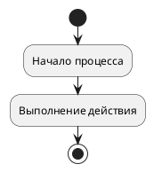

# ДЕТАЛЬНАЯ ИНСТРУКЦИЯ ДЛЯ ГЕНЕРАЦИИ PLANTUML ACTIVITY ДИАГРАММ

## КРИТИЧЕСКИ ВАЖНЫЕ ПРАВИЛА

### 1. ОБЯЗАТЕЛЬНЫЙ СИНТАКСИС

**ВСЕГДА начинай код с `@startuml` и заканчивай `@enduml`!**



**НЕПРАВИЛЬНО:**
```
activity
:Действие;
```

**ПРАВИЛЬНО:**
```
@startuml
start
:Действие;
stop
@enduml
```

### 2. ОТСТУПЫ И ПРОБЕЛЫ - КРИТИЧЕСКИ ВАЖНО!

**PlantUML Activity диаграммы КРИТИЧЕСКИ ЧУВСТВИТЕЛЬНЫ к отступам и пробелам!**

**Правила отступов:**
- Первая строка: `@startuml` (0 пробелов, без отступов)
- Последняя строка: `@enduml` (0 пробелов, без отступов)
- Ключевые слова (start, stop, if, else, endif, fork, fork again, end fork, repeat, while, endwhile, partition): **БЕЗ ОТСТУПОВ** или с **ОДИНАКОВЫМИ отступами** (рекомендуется 0 пробелов)
- Действия (`:действие;`): **БЕЗ ОТСТУПОВ** или с **ОДИНАКОВЫМИ отступами** (рекомендуется 0 пробелов)
- Содержимое внутри блоков (if/else, fork, partition, repeat/while): **ОБЯЗАТЕЛЬНО с отступами!**
  - Строка с ключевым словом (if, else, fork, partition, repeat, while): **0 пробелов**
  - Содержимое внутри блока (действия): **+2 ПРОБЕЛА** к отступу блока
  - Закрывающий тег (endif, end fork, endwhile): **ТОТ ЖЕ отступ**, что и открывающий тег (0 пробелов)

**ПРАВИЛЬНО (без отступов):**
```
@startuml
start
:Начало процесса;
:Выполнение действия;
stop
@enduml
```

**ПРАВИЛЬНО (с отступами для блоков):**
```
@startuml
start
:Начало;
if (Условие?) then
  :Действие при условии;
else
  :Действие иначе;
endif
stop
@enduml
```

**НЕПРАВИЛЬНО (неправильные отступы):**
```
@startuml
start
:Начало;
if (Условие?) then
:Действие при условии;  ← НЕТ ОТСТУПА! ОШИБКА!
else
  :Действие иначе;
endif
stop
@enduml
```

**КРИТИЧЕСКИ ВАЖНО:** 
- Если используешь отступы для действий в блоках - используй их **ВЕЗДЕ ОДИНАКОВО** (+2 пробела)
- Если используешь отступы для блоков - **ОБЯЗАТЕЛЬНО** используй их для содержимого внутри блока
- **НЕ смешивай** строки с отступами и без отступов!
- Ключевые слова (start, stop, if, else, endif, fork, fork again, end fork) должны быть **БЕЗ ОТСТУПОВ** (0 пробелов)

### 3. ДЕЙСТВИЯ (ACTIONS)

**Действия описываются с помощью двоеточия в начале и точки с запятой в конце:**

**Синтаксис:**
```
:Название действия;
:Действие с несколькими словами;
:Очень длинное название действия которое может содержать много слов;
```

**ПРАВИЛЬНО:**
```
@startuml
start
:Начало процесса;
:Загрузка данных из базы;
:Обработка данных пользователя;
:Сохранение результата;
stop
@enduml
```

**НЕПРАВИЛЬНО:**
```
@startuml
start
Действие  ← НЕПРАВИЛЬНО! Нет : и ;
:Действие  ← НЕПРАВИЛЬНО! Нет ;
: Действие;  ← НЕПРАВИЛЬНО! Пробел после :
stop
@enduml
```

**ВАЖНО:**
- **ОБЯЗАТЕЛЬНО** используй двоеточие `:` в начале и точку с запятой `;` в конце
- Названия могут быть на русском языке
- Названия могут содержать пробелы
- Не используй пробел между `:` и текстом действия (рекомендуется: `:Действие;`, а не `: Действие;`)

### 4. УСЛОВНЫЕ ОПЕРАТОРЫ (IF/ELSE)

**Условные операторы используются для ветвления логики:**

**Синтаксис:**
```
if (Условие?) then
  :Действие при истинном условии;
else
  :Действие при ложном условии;
endif
```

**ПРАВИЛЬНО:**
```
@startuml
start
:Начало;
if (Данные валидны?) then
  :Обработка данных;
else
  :Вывод ошибки;
endif
:Завершение;
stop
@enduml
```

**ПРАВИЛЬНО (без else):**
```
@startuml
start
:Начало;
if (Данные валидны?) then
  :Обработка данных;
endif
:Завершение;
stop
@enduml
```

**ПРАВИЛЬНО (вложенные условия):**
```
@startuml
start
:Начало;
if (Условие 1?) then
  if (Условие 2?) then
    :Действие 1;
  else
    :Действие 2;
  endif
else
  :Действие 3;
endif
stop
@enduml
```

**НЕПРАВИЛЬНО:**
```
@startuml
start
:Начало;
if (Условие?) then
:Действие;  ← НЕТ ОТСТУПА! ОШИБКА!
else
  :Действие;
endif
stop
@enduml
```

**КРИТИЧЕСКИ ВАЖНО:**
- Действия внутри блока `if/else` **ОБЯЗАТЕЛЬНО** должны иметь отступ **+2 ПРОБЕЛА**
- Закрывающий тег `endif` должен быть на том же уровне, что и `if` (0 пробелов)
- `then` и `else` должны быть на том же уровне, что и `if` (0 пробелов)

### 5. ПАРАЛЛЕЛЬНЫЕ ПРОЦЕССЫ (FORK/JOIN)

**Для параллельных процессов используются fork и end fork:**

**СинТАКСИС:**
```
fork
  :Действие 1;
fork again
  :Действие 2;
fork again
  :Действие 3;
end fork
```

**ПРАВИЛЬНО:**
```
@startuml
start
:Начало;
fork
  :Обработка данных;
fork again
  :Отправка уведомления;
fork again
  :Логирование;
end fork
:Завершение;
stop
@enduml
```

**НЕПРАВИЛЬНО:**
```
@startuml
start
:Начало;
fork
:Обработка данных;  ← НЕТ ОТСТУПА! ОШИБКА!
fork again
  :Отправка уведомления;
end fork
stop
@enduml
```

**КРИТИЧЕСКИ ВАЖНО:**
- Действия внутри блоков `fork` **ОБЯЗАТЕЛЬНО** должны иметь отступ **+2 ПРОБЕЛА**
- `fork again` должен быть на том же уровне, что и `fork` (0 пробелов)
- Закрывающий тег `end fork` должен быть на том же уровне, что и `fork` (0 пробелов)
- **НЕ используй** `split` и `join` - они устарели! Используй только `fork`, `fork again`, `end fork`

### 6. ЦИКЛЫ (REPEAT/WHILE)

**Для циклов используются repeat и while:**

**Синтаксис repeat:**
```
repeat
  :Действие в цикле;
repeat while (Условие?) is (false)
```

**Синтаксис while:**
```
while (Условие?) is (true)
  :Действие в цикле;
endwhile
```

**ПРАВИЛЬНО (repeat):**
```
@startuml
start
:Инициализация;
repeat
  :Попытка выполнения;
  :Проверка результата;
repeat while (Успешно?) is (false)
:Завершение;
stop
@enduml
```

**ПРАВИЛЬНО (while):**
```
@startuml
start
:Инициализация;
while (Условие цикла?) is (true)
  :Действие в цикле;
  :Обновление данных;
endwhile
:Завершение;
stop
@enduml
```

**НЕПРАВИЛЬНО:**
```
@startuml
start
:Инициализация;
repeat
:Действие;  ← НЕТ ОТСТУПА! ОШИБКА!
repeat while (Условие?) is (false)
stop
@enduml
```

**КРИТИЧЕСКИ ВАЖНО:**
- Действия внутри циклов **ОБЯЗАТЕЛЬНО** должны иметь отступ **+2 ПРОБЕЛА**
- `repeat while` и `endwhile` должны быть на том же уровне, что и `repeat`/`while` (0 пробелов)

### 7. ПАРТИЦИИ (PARTITIONS) - ГРУППИРОВКА

**Для группировки действий используются partition (swimlanes):**

**Синтаксис:**
```
partition Название раздела {
  :Действие 1;
  :Действие 2;
}
```

**ПРАВИЛЬНО:**
```
@startuml
start
partition Подготовка {
  :Загрузка данных;
  :Валидация данных;
}
partition Обработка {
  :Обработка данных;
  :Сохранение результата;
}
stop
@enduml
```

**ПРАВИЛЬНО (несколько разделов):**
```
@startuml
start
partition Пользователь {
  :Ввод данных;
}
partition Система {
  :Обработка данных;
  :Проверка данных;
}
partition БД {
  :Сохранение данных;
}
stop
@enduml
```

**НЕПРАВИЛЬНО:**
```
@startuml
start
partition Подготовка {
:Загрузка данных;  ← НЕТ ОТСТУПА! ОШИБКА!
  :Валидация данных;
}
stop
@enduml
```

**КРИТИЧЕСКИ ВАЖНО:**
- Действия внутри partition **ОБЯЗАТЕЛЬНО** должны иметь отступ **+2 ПРОБЕЛА**
- Открывающая скобка `{` должна быть на той же строке, что и `partition`
- Закрывающая скобка `}` должна быть на том же уровне, что и `partition` (0 пробелов)

### 8. НАЧАЛО И КОНЕЦ (START/STOP)

**Каждая Activity диаграмма должна начинаться с `start` и заканчиваться `stop`:**

**ПРАВИЛЬНО:**
```
@startuml
start
:Действие;
stop
@enduml
```

**ПРАВИЛЬНО (несколько точек окончания):**
```
@startuml
start
if (Условие?) then
  :Действие 1;
  stop
else
  :Действие 2;
  stop
endif
@enduml
```

**НЕПРАВИЛЬНО:**
```
@startuml
:Действие;  ← НЕТ start! ОШИБКА!
stop
@enduml
```

**ВАЖНО:**
- **ОБЯЗАТЕЛЬНО** используй `start` в начале диаграммы
- **ОБЯЗАТЕЛЬНО** используй `stop` для завершения диаграммы
- Может быть несколько `stop` в разных ветках
- `start` и `stop` должны быть **БЕЗ ОТСТУПОВ** (0 пробелов)

### 9. ЦВЕТА - СТРОГИЕ (БЕЛЫЙ, ЧЕРНЫЙ, СЕРЫЙ)

**КРИТИЧЕСКИ ВАЖНО:** Диаграмма должна быть в строгих цветах!

**Используй ТОЛЬКО следующие цвета:**
- Фон действий: **белый** (`#FFFFFF` или `white`)
- Текст: **черный** (`#000000` или `black`)
- Границы: **черный** или **серый** (`#000000`, `#666666`, `#999999`)
- Акценты: **серые оттенки** (`#F5F5F5`, `#E5E5E5`, `#CCCCCC`, `#B3B3B3`)

**Синтаксис для цветов в PlantUML Activity:**

Для задания цветов используй `skinparam activity`:

```
@startuml
skinparam activity {
  BackgroundColor #FFFFFF
  BorderColor #000000
  FontColor #000000
  ArrowColor #000000
  BarColor #666666
}
start
:Действие;
stop
@enduml
```

**ПРАВИЛЬНО (строгие цвета):**
```
@startuml
skinparam activity {
  BackgroundColor #FFFFFF
  BorderColor #000000
  FontColor #000000
  ArrowColor #000000
  BarColor #666666
}
skinparam activityDiamond {
  BackgroundColor #FFFFFF
  BorderColor #000000
  FontColor #000000
}
skinparam partition {
  BackgroundColor #F5F5F5
  BorderColor #666666
  FontColor #000000
}
start
:Действие;
stop
@enduml
```

**НЕПРАВИЛЬНО (яркие цвета):**
```
@startuml
skinparam activity {
  BackgroundColor #00FF00  ← НЕПРАВИЛЬНО! Зеленый цвет
  BorderColor #FFFF00  ← НЕПРАВИЛЬНО! Желтый цвет
  FontColor #FF00FF  ← НЕПРАВИЛЬНО! Фиолетовый цвет
}
start
:Действие;
stop
@enduml
```

**ОБЯЗАТЕЛЬНО добавляй стили для строгих цветов:**

```
@startuml
skinparam activity {
  BackgroundColor #FFFFFF
  BorderColor #000000
  FontColor #000000
  ArrowColor #000000
  BarColor #666666
}
skinparam activityDiamond {
  BackgroundColor #FFFFFF
  BorderColor #000000
  FontColor #000000
}
skinparam partition {
  BackgroundColor #F5F5F5
  BorderColor #666666
  FontColor #000000
}
skinparam activityStart {
  Color #000000
}
skinparam activityEnd {
  Color #000000
}
start
:Действие;
stop
@enduml
```

### 10. ПРОВЕРКА ПЕРЕД ОТПРАВКОЙ

**ОБЯЗАТЕЛЬНО проверь код перед отправкой:**

1.  Код начинается с `@startuml`
2.  Код заканчивается `@enduml`
3.  Есть `start` в начале
4.  Есть `stop` для завершения
5.  Все действия имеют правильный синтаксис (`:действие;`)
6.  Все действия внутри блоков (if/else, fork, partition, repeat/while) имеют отступ **+2 ПРОБЕЛА**
7.  Все закрывающие теги (endif, end fork, endwhile, }) имеют правильный отступ (0 пробелов)
8.  Используются строгие цвета (белый, черный, серый)
9.  Добавлены стили через `skinparam activity`
10.  Нет специальных символов в названиях действий, которые могут сломать синтаксис
11.  Все названия на русском языке

### 11. ПРИМЕРЫ ПРАВИЛЬНОГО КОДА

**Пример 1: Простая Activity диаграмма**
```
@startuml
skinparam activity {
  BackgroundColor #FFFFFF
  BorderColor #000000
  FontColor #000000
  ArrowColor #000000
  BarColor #666666
}
skinparam activityDiamond {
  BackgroundColor #FFFFFF
  BorderColor #000000
  FontColor #000000
}
start
:Начало процесса;
:Ввод данных;
:Обработка данных;
:Вывод результата;
stop
@enduml
```

**Пример 2: Activity диаграмма с условиями**
```
@startuml
skinparam activity {
  BackgroundColor #FFFFFF
  BorderColor #000000
  FontColor #000000
  ArrowColor #000000
  BarColor #666666
}
skinparam activityDiamond {
  BackgroundColor #FFFFFF
  BorderColor #000000
  FontColor #000000
}
start
:Начало процесса;
:Ввод данных;
if (Данные валидны?) then
  :Обработка данных;
  :Сохранение результата;
else
  :Вывод ошибки;
  :Запрос повторного ввода;
endif
:Завершение;
stop
@enduml
```

**Пример 3: Activity диаграмма с параллельными процессами**
```
@startuml
skinparam activity {
  BackgroundColor #FFFFFF
  BorderColor #000000
  FontColor #000000
  ArrowColor #000000
  BarColor #666666
}
skinparam activityDiamond {
  BackgroundColor #FFFFFF
  BorderColor #000000
  FontColor #000000
}
start
:Начало процесса;
fork
  :Обработка данных;
fork again
  :Отправка уведомления;
fork again
  :Логирование события;
end fork
:Завершение;
stop
@enduml
```

**Пример 4: Activity диаграмма с циклами**
```
@startuml
skinparam activity {
  BackgroundColor #FFFFFF
  BorderColor #000000
  FontColor #000000
  ArrowColor #000000
  BarColor #666666
}
skinparam activityDiamond {
  BackgroundColor #FFFFFF
  BorderColor #000000
  FontColor #000000
}
start
:Инициализация системы;
repeat
  :Попытка выполнения;
  :Проверка результата;
repeat while (Успешно?) is (false)
:Завершение;
stop
@enduml
```

**Пример 5: Сложная Activity диаграмма с partition**
```
@startuml
skinparam activity {
  BackgroundColor #FFFFFF
  BorderColor #000000
  FontColor #000000
  ArrowColor #000000
  BarColor #666666
}
skinparam activityDiamond {
  BackgroundColor #FFFFFF
  BorderColor #000000
  FontColor #000000
}
skinparam partition {
  BackgroundColor #F5F5F5
  BorderColor #666666
  FontColor #000000
}
start
partition Подготовка {
  :Загрузка данных;
  :Валидация данных;
}
partition Обработка {
  if (Данные корректны?) then
    :Обработка данных;
    :Сохранение результата;
  else
    :Логирование ошибки;
    stop
  endif
}
partition Завершение {
  :Формирование отчета;
  :Отправка уведомления;
}
stop
@enduml
```

**Пример 6: Сложная Activity диаграмма с вложенными условиями и циклами**
```
@startuml
skinparam activity {
  BackgroundColor #FFFFFF
  BorderColor #000000
  FontColor #000000
  ArrowColor #000000
  BarColor #666666
}
skinparam activityDiamond {
  BackgroundColor #FFFFFF
  BorderColor #000000
  FontColor #000000
}
start
:Начало процесса;
:Инициализация;
repeat
  :Получение данных;
  if (Данные валидны?) then
    if (Тип обработки?) then
      :Быстрая обработка;
    else
      :Полная обработка;
    endif
    :Сохранение результата;
  else
    :Обработка ошибки;
  endif
  :Проверка завершения;
repeat while (Завершено?) is (false)
:Формирование отчета;
stop
@enduml
```

### 12. ЧАСТЫЕ ОШИБКИ И КАК ИХ ИЗБЕЖАТЬ

**Ошибка 1: "Syntax Error" или код не рендерится**
- **Причина:** Неправильный синтаксис, отсутствие `@startuml`/`@enduml`, неправильные отступы, отсутствие `:` или `;` в действиях
- **Решение:** Проверь, что код начинается с `@startuml` и заканчивается `@enduml`, проверь синтаксис действий (`:действие;`), проверь отступы в блоках

**Ошибка 2: "Missing start" или "Missing stop"**
- **Причина:** Отсутствие `start` или `stop`
- **Решение:** Убедись, что есть `start` в начале и `stop` для завершения диаграммы

**Ошибка 3: Неправильные отступы в блоках**
- **Причина:** Действия внутри блоков (if/else, fork, partition) не имеют отступов или имеют неправильные отступы
- **Решение:** Убедись, что все действия внутри блоков имеют отступ **+2 ПРОБЕЛА** от уровня блока

**Ошибка 4: Яркие цвета на диаграмме**
- **Причина:** Не добавлены стили для строгих цветов
- **Решение:** ОБЯЗАТЕЛЬНО добавляй блок `skinparam activity` с настройками цветов (белый, черный, серый)

**Ошибка 5: Неправильный синтаксис действий**
- **Причина:** Отсутствие `:` в начале или `;` в конце действия
- **Решение:** Используй правильный синтаксис: `:Название действия;`

**Ошибка 6: Использование устаревших конструкций**
- **Причина:** Использование `split` и `join` вместо `fork`, `fork again`, `end fork`
- **Решение:** Используй только `fork`, `fork again`, `end fork` для параллельных процессов

### 13. ФОРМАТИРОВАНИЕ КОДА

**Всегда форматируй код так:**
- Первая строка: `@startuml`
- Блок стилей (если нужен): `skinparam activity { ... }`
- `start` (0 пробелов)
- Действия и блоки (0 пробелов для ключевых слов, +2 пробела для действий внутри блоков)
- `stop` (0 пробелов)
- Последняя строка: `@enduml`
- Каждая строка заканчивается переводом строки
- Можно использовать пустые строки для разделения логических блоков (но не обязательно)

**ПРАВИЛЬНО:**
```
@startuml
skinparam activity {
  BackgroundColor #FFFFFF
  BorderColor #000000
  FontColor #000000
}

start
:Начало процесса;

if (Условие?) then
  :Действие 1;
else
  :Действие 2;
endif

:Завершение;
stop
@enduml
```

### 14. РУССКИЙ ЯЗЫК

**Все названия действий должны быть на русском языке!**

- Используй русские названия для всех элементов
- Синтаксис PlantUML остается на английском (`start`, `stop`, `if`, `else`, `endif`, `fork`, `partition`, etc.)
- Содержимое (названия действий, условия) - на русском

**ПРАВИЛЬНО:**
```
@startuml
start
:Начало процесса обработки данных;
:Валидация входных данных;
if (Данные валидны?) then
  :Обработка данных;
else
  :Вывод ошибки валидации;
endif
:Завершение процесса;
stop
@enduml
```

**НЕПРАВИЛЬНО:**
```
@startuml
start
:Start process;
:Validate input data;
if (Data valid?) then
  :Process data;
else
  :Output validation error;
endif
:End process;
stop
@enduml
```

### 15. ФИНАЛЬНАЯ ПРОВЕРКА

**Перед отправкой кода ответь на вопросы:**

1.  Код начинается с `@startuml`?
2.  Код заканчивается `@enduml`?
3.  Есть `start` в начале?
4.  Есть `stop` для завершения?
5.  Все действия имеют правильный синтаксис (`:действие;`)?
6.  Все действия внутри блоков имеют отступ **+2 ПРОБЕЛА**?
7.  Все закрывающие теги имеют правильный отступ (0 пробелов)?
8.  Добавлены стили для строгих цветов (белый, черный, серый)?
9.  Нет специальных символов в названиях действий?
10.  Все названия на русском языке?
11.  Код можно скопировать и вставить в PlantUML редактор БЕЗ ОШИБОК?

**Если на все вопросы ответ "ДА" - код готов к отправке!**

---

## РЕЗЮМЕ: ЧТО ДЕЛАТЬ ВСЕГДА

1.  Начинай с `@startuml` и заканчивай `@enduml`
2.  Используй `start` в начале и `stop` для завершения
3.  Используй правильный синтаксис действий (`:действие;`)
4.  Используй правильные отступы для действий внутри блоков (**+2 ПРОБЕЛА**)
5.  ОБЯЗАТЕЛЬНО добавляй стили для строгих цветов (белый, черный, серый)
6.  Используй русские названия
7.  Используй `fork`, `fork again`, `end fork` для параллельных процессов (НЕ `split`/`join`)
8.  Проверяй код перед отправкой

## РЕЗЮМЕ: ЧТО НИКОГДА НЕ ДЕЛАТЬ

1.  НЕ начинай код без `@startuml`
2.  НЕ заканчивай код без `@enduml`
3.  НЕ забывай `start` и `stop`
4.  НЕ используй неправильный синтаксис действий (всегда `:действие;`)
5.  НЕ используй неправильные отступы в блоках (действия внутри блоков должны иметь +2 пробела)
6.  НЕ используй яркие цвета (зеленый, желтый, фиолетовый) - ТОЛЬКО белый, черный, серый!
7.  НЕ забывай добавлять стили для строгих цветов
8.  НЕ используй `split` и `join` - используй `fork`, `fork again`, `end fork`
9.  НЕ используй английские названия для действий
10.  НЕ отправляй код без проверки

---

## ДОПОЛНИТЕЛЬНАЯ ИНФОРМАЦИЯ

### Официальная документация PlantUML Activity:
https://plantuml.com/ru/activity-diagram-beta

### Основные синтаксические конструкции:

1. **Действия:**
```
:Название действия;
```

2. **Условия:**
```
if (Условие?) then
  :Действие при истинном условии;
else
  :Действие при ложном условии;
endif
```

3. **Параллельные процессы:**
```
fork
  :Действие 1;
fork again
  :Действие 2;
fork again
  :Действие 3;
end fork
```

4. **Циклы (repeat):**
```
repeat
  :Действие в цикле;
repeat while (Условие?) is (false)
```

5. **Циклы (while):**
```
while (Условие?) is (true)
  :Действие в цикле;
endwhile
```

6. **Разделы (partition):**
```
partition Название раздела {
  :Действие 1;
  :Действие 2;
}
```

### Рекомендации по цветам:

**Для строгих диаграмм используй:**
- `BackgroundColor #FFFFFF` - белый фон
- `BorderColor #000000` - черные границы
- `FontColor #000000` - черный текст
- `ArrowColor #000000` - черные стрелки
- `BarColor #666666` - серые разделители

**НЕ используй:**
- `#00FF00` (зеленый)
- `#FFFF00` (желтый)
- `#FF00FF` (фиолетовый)
- `#0000FF` (синий)
- Любые другие яркие цвета

---

## ПОЛНЫЙ ШАБЛОН ДЛЯ КОПИРОВАНИЯ

```
@startuml
skinparam activity {
  BackgroundColor #FFFFFF
  BorderColor #000000
  FontColor #000000
  ArrowColor #000000
  BarColor #666666
}
skinparam activityDiamond {
  BackgroundColor #FFFFFF
  BorderColor #000000
  FontColor #000000
}
skinparam partition {
  BackgroundColor #F5F5F5
  BorderColor #666666
  FontColor #000000
}
skinparam activityStart {
  Color #000000
}
skinparam activityEnd {
  Color #000000
}

start
:НАЧАЛО_ПРОЦЕССА;

if (УСЛОВИЕ?) then
  :ДЕЙСТВИЕ_ПРИ_ИСТИННОМ_УСЛОВИИ;
else
  :ДЕЙСТВИЕ_ПРИ_ЛОЖНОМ_УСЛОВИИ;
endif

fork
  :ПАРАЛЛЕЛЬНОЕ_ДЕЙСТВИЕ_1;
fork again
  :ПАРАЛЛЕЛЬНОЕ_ДЕЙСТВИЕ_2;
end fork

:ЗАВЕРШЕНИЕ_ПРОЦЕССА;
stop
@enduml
```

**Замени `НАЧАЛО_ПРОЦЕССА`, `УСЛОВИЕ?`, `ДЕЙСТВИЕ_ПРИ_ИСТИННОМ_УСЛОВИИ` и т.д. на реальные названия на русском языке!**


