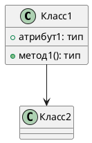

# ДЕТАЛЬНАЯ ИНСТРУКЦИЯ ДЛЯ ГЕНЕРАЦИИ PLANTUML CLASS ДИАГРАММ

## КРИТИЧЕСКИ ВАЖНЫЕ ПРАВИЛА

### 1. ОБЯЗАТЕЛЬНЫЙ СИНТАКСИС

**ВСЕГДА начинай код с `@startuml` и заканчивай `@enduml`!**



**НЕПРАВИЛЬНО:**
```
class Класс1
Класс1 --> Класс2
```

**ПРАВИЛЬНО:**
```
@startuml
class Класс1
Класс1 --> Класс2
@enduml
```

### 2. ОТСТУПЫ И ПРОБЕЛЫ - КРИТИЧЕСКИ ВАЖНО!

**PlantUML Class диаграммы КРИТИЧЕСКИ ЧУВСТВИТЕЛЬНЫ к отступам и пробелам!**

**Правила отступов:**
- Первая строка: `@startuml` (0 пробелов, без отступов)
- Последняя строка: `@enduml` (0 пробелов, без отступов)
- Объявление классов: **БЕЗ ОТСТУПОВ** или с **ОДИНАКОВЫМИ отступами** (рекомендуется 0 пробелов)
- Содержимое внутри классов (атрибуты, методы): **ОБЯЗАТЕЛЬНО с отступами!**
  - Строка с объявлением класса: **0 пробелов**
  - Атрибуты и методы внутри класса: **+2 ПРОБЕЛА** к отступу класса
  - Закрывающая скобка `}`: **ТОТ ЖЕ отступ**, что и открывающая (0 пробелов)

**ПРАВИЛЬНО (без отступов для классов):**
```
@startuml
class Класс1 {
  +атрибут1: String
  +метод1(): void
}
class Класс2
Класс1 --> Класс2
@enduml
```

**ПРАВИЛЬНО (с отступами для содержимого классов):**
```
@startuml
class Класс1 {
  +атрибут1: String
  +метод1(): void
}
class Класс2 {
  +атрибут2: Integer
}
Класс1 --> Класс2
@enduml
```

**НЕПРАВИЛЬНО (неправильные отступы):**
```
@startuml
class Класс1 {
+атрибут1: String  ← НЕТ ОТСТУПА! ОШИБКА!
  +метод1(): void
}
@enduml
```

**КРИТИЧЕСКИ ВАЖНО:** 
- Если используешь отступы для атрибутов и методов в классах - используй их **ВЕЗДЕ ОДИНАКОВО** (+2 пробела)
- Если используешь отступы для содержимого классов - **ОБЯЗАТЕЛЬНО** используй их для всех атрибутов и методов
- **НЕ смешивай** строки с отступами и без отступов!
- Объявления классов должны быть **БЕЗ ОТСТУПОВ** (0 пробелов)

### 3. ОБЪЯВЛЕНИЕ КЛАССОВ

**Классы объявляются с помощью ключевого слова `class`:**

**Синтаксис:**
```
class НазваниеКласса
class НазваниеКласса {
  атрибуты
  методы
}
class "Название с пробелами" as Алиас
```

**ПРАВИЛЬНО:**
```
@startuml
class Пользователь {
  +имя: String
  +email: String
  +авторизоваться(): void
}
class Заказ {
  +номер: Integer
  +дата: Date
  +создать(): void
}
@enduml
```

**НЕПРАВИЛЬНО:**
```
@startuml
class Пользователь
+имя: String  ← НЕПРАВИЛЬНО! Атрибут вне класса
@enduml
```

**ВАЖНО:**
- **ОБЯЗАТЕЛЬНО** используй ключевое слово `class` для объявления классов
- Названия классов могут быть на русском языке
- Для названий с пробелами используй кавычки: `class "Название с пробелами" as Алиас`
- Можно использовать алиасы для длинных названий: `class "Очень длинное название класса" as КороткийАлиас`

### 4. АТРИБУТЫ И МЕТОДЫ

**Атрибуты и методы описываются внутри класса:**

**Синтаксис атрибутов:**
```
+атрибут: тип          (публичный)
-атрибут: тип          (приватный)
#атрибут: тип          (защищенный)
~атрибут: тип          (пакетный)
```

**Синтаксис методов:**
```
+метод(): тип          (публичный)
-метод(): тип          (приватный)
#метод(): тип          (защищенный)
~метод(): тип          (пакетный)
+метод(параметр: тип): тип
```

**ПРАВИЛЬНО:**
```
@startuml
class Пользователь {
  +имя: String
  -пароль: String
  +email: String
  +авторизоваться(логин: String, пароль: String): Boolean
  -проверитьПароль(пароль: String): Boolean
}
@enduml
```

**НЕПРАВИЛЬНО:**
```
@startuml
class Пользователь {
  имя: String  ← НЕПРАВИЛЬНО! Нет модификатора доступа
  авторизоваться()  ← НЕПРАВИЛЬНО! Нет модификатора доступа
}
@enduml
```

**КРИТИЧЕСКИ ВАЖНО:**
- Атрибуты и методы **ОБЯЗАТЕЛЬНО** должны иметь модификатор доступа (`+`, `-`, `#`, `~`)
- Атрибуты и методы внутри класса **ОБЯЗАТЕЛЬНО** должны иметь отступ **+2 ПРОБЕЛА**
- Типы могут быть на русском языке или английском (рекомендуется английский для типов: String, Integer, Boolean, void)

### 5. ОТНОШЕНИЯ МЕЖДУ КЛАССАМИ

**Отношения между классами задаются с помощью стрелок:**

**Типы отношений:**
- `-->` - ассоциация (зависимость)
- `<|--` - наследование (extends)
- `*--` - композиция (часть не может существовать без целого)
- `o--` - агрегация (часть может существовать независимо от целого)
- `<|..` - реализация интерфейса (implements)
- `..>` - более слабая форма зависимости

**ПРАВИЛЬНО:**
```
@startuml
class Пользователь
class Заказ
class Товар
Пользователь --> Заказ
Заказ *-- Товар
@enduml
```

**ПРАВИЛЬНО (с метками):**
```
@startuml
class Пользователь
class Заказ
Пользователь "1" --> "0..*" Заказ : создает
@enduml
```

**НЕПРАВИЛЬНО:**
```
@startuml
class Пользователь
class Заказ
Пользователь -> Заказ  ← НЕПРАВИЛЬНО! Должно быть -->
@enduml
```

**КРИТИЧЕСКИ ВАЖНО:**
- Отношения должны быть **БЕЗ ОТСТУПОВ** (0 пробелов) или с **ОДИНАКОВЫМИ отступами**
- Используй правильные символы для типов отношений
- Можно добавлять метки и кратности: `Класс1 "1" --> "0..*" Класс2 : метка`

### 6. ИНТЕРФЕЙСЫ

**Интерфейсы объявляются с помощью ключевого слова `interface`:**

**Синтаксис:**
```
interface НазваниеИнтерфейса {
  +метод1(): тип
  +метод2(): тип
}
```

**ПРАВИЛЬНО:**
```
@startuml
interface Репозиторий {
  +найти(id: Integer): Объект
  +сохранить(объект: Объект): void
  +удалить(id: Integer): void
}
class ПользовательРепозиторий
ПользовательРепозиторий ..|> Репозиторий
@enduml
```

**НЕПРАВИЛЬНО:**
```
@startuml
interface Репозиторий
+найти(id: Integer): Объект  ← НЕПРАВИЛЬНО! Метод вне интерфейса
@enduml
```

**КРИТИЧЕСКИ ВАЖНО:**
- Интерфейсы объявляются с помощью `interface`
- Методы в интерфейсах **ОБЯЗАТЕЛЬНО** должны иметь отступ **+2 ПРОБЕЛА**
- Реализация интерфейса обозначается `..|>` (пунктирная стрелка с треугольником)

### 7. АБСТРАКТНЫЕ КЛАССЫ

**Абстрактные классы объявляются с помощью ключевого слова `abstract`:**

**Синтаксис:**
```
abstract class НазваниеКласса {
  +абстрактныйМетод(): тип
  {abstract}
  +обычныйМетод(): void
}
```

**ПРАВИЛЬНО:**
```
@startuml
abstract class БазовыйКласс {
  +абстрактныйМетод(): void
  {abstract}
  +обычныйМетод(): void
}
class Наследник
Наследник --|> БазовыйКласс
@enduml
```

**КРИТИЧЕСКИ ВАЖНО:**
- Абстрактные классы объявляются с `abstract class`
- Абстрактные методы помечаются `{abstract}`

### 8. ПАКЕТЫ И ПРОСТРАНСТВА ИМЕН

**Пакеты используются для группировки классов:**

**Синтаксис:**
```
package НазваниеПакета {
  class Класс1
  class Класс2
}
```

**ПРАВИЛЬНО:**
```
@startuml
package Модель {
  class Пользователь
  class Заказ
}
package Сервис {
  class ПользовательСервис
}
ПользовательСервис --> Пользователь
@enduml
```

**КРИТИЧЕСКИ ВАЖНО:**
- Пакеты объявляются с `package НазваниеПакета {`
- Классы внутри пакета **ОБЯЗАТЕЛЬНО** должны иметь отступ **+2 ПРОБЕЛА**
- Закрывающая скобка `}` должна быть на том же уровне, что и `package` (0 пробелов)

### 9. ЦВЕТА - СТРОГИЕ (БЕЛЫЙ, ЧЕРНЫЙ, СЕРЫЙ)

**КРИТИЧЕСКИ ВАЖНО:** Диаграмма должна быть в строгих цветах!

**Используй ТОЛЬКО следующие цвета:**
- Фон классов: **белый** (`#FFFFFF` или `white`)
- Текст: **черный** (`#000000` или `black`)
- Границы: **черный** или **серый** (`#000000`, `#666666`, `#999999`)
- Акценты: **серые оттенки** (`#F5F5F5`, `#E5E5E5`, `#CCCCCC`, `#B3B3B3`)

**Синтаксис для цветов в PlantUML Class:**

Для задания цветов используй `skinparam class`:

```
@startuml
skinparam class {
  BackgroundColor #FFFFFF
  BorderColor #000000
  FontColor #000000
  ArrowColor #000000
  AttributeFontColor #000000
  MethodFontColor #000000
}
skinparam package {
  BackgroundColor #F5F5F5
  BorderColor #666666
  FontColor #000000
}
skinparam interface {
  BackgroundColor #FFFFFF
  BorderColor #000000
  FontColor #000000
}
skinparam arrow {
  Color #000000
}
class Класс1
class Класс2
Класс1 --> Класс2
@enduml
```

**ПРАВИЛЬНО (строгие цвета):**
```
@startuml
skinparam class {
  BackgroundColor #FFFFFF
  BorderColor #000000
  FontColor #000000
  ArrowColor #000000
  AttributeFontColor #000000
  MethodFontColor #000000
}
skinparam package {
  BackgroundColor #F5F5F5
  BorderColor #666666
  FontColor #000000
}
skinparam interface {
  BackgroundColor #FFFFFF
  BorderColor #000000
  FontColor #000000
}
skinparam arrow {
  Color #000000
}
class Пользователь {
  +имя: String
  +email: String
}
class Заказ {
  +номер: Integer
  +дата: Date
}
Пользователь --> Заказ
@enduml
```

**НЕПРАВИЛЬНО (яркие цвета):**
```
@startuml
skinparam class {
  BackgroundColor #00FF00  ← НЕПРАВИЛЬНО! Зеленый цвет
  BorderColor #FFFF00  ← НЕПРАВИЛЬНО! Желтый цвет
  FontColor #FF00FF  ← НЕПРАВИЛЬНО! Фиолетовый цвет
}
class Класс1
@enduml
```

**ОБЯЗАТЕЛЬНО добавляй стили для строгих цветов:**

```
@startuml
skinparam class {
  BackgroundColor #FFFFFF
  BorderColor #000000
  FontColor #000000
  ArrowColor #000000
  AttributeFontColor #000000
  MethodFontColor #000000
  StereotypeFontColor #000000
}
skinparam package {
  BackgroundColor #F5F5F5
  BorderColor #666666
  FontColor #000000
  TitleFontColor #000000
}
skinparam interface {
  BackgroundColor #FFFFFF
  BorderColor #000000
  FontColor #000000
  StereotypeFontColor #000000
}
skinparam arrow {
  Color #000000
  Thickness 1
}
skinparam note {
  BackgroundColor #F5F5F5
  BorderColor #666666
  FontColor #000000
}
class Класс1 {
  +атрибут: String
  +метод(): void
}
@enduml
```

### 10. ПРОВЕРКА ПЕРЕД ОТПРАВКОЙ

**ОБЯЗАТЕЛЬНО проверь код перед отправкой:**

1. ✅ Код начинается с `@startuml`
2. ✅ Код заканчивается `@enduml`
3. ✅ Все классы имеют правильный синтаксис (`class Название`)
4. ✅ Все атрибуты и методы внутри классов имеют отступ **+2 ПРОБЕЛА**
5. ✅ Все закрывающие скобки `}` имеют правильный отступ (0 пробелов)
6. ✅ Используются строгие цвета (белый, черный, серый)
7. ✅ Добавлены стили через `skinparam class`, `skinparam package`, `skinparam interface`, `skinparam arrow`
8. ✅ Нет специальных символов в названиях классов, которые могут сломать синтаксис
9. ✅ Все названия на русском языке
10. ✅ Все отношения правильно оформлены (--> , <|--, *--, o--, ..|>)

### 11. ПРИМЕРЫ ПРАВИЛЬНОГО КОДА

**Пример 1: Простая Class диаграмма**
```
@startuml
skinparam class {
  BackgroundColor #FFFFFF
  BorderColor #000000
  FontColor #000000
  ArrowColor #000000
  AttributeFontColor #000000
  MethodFontColor #000000
}
skinparam arrow {
  Color #000000
}
class Пользователь {
  +имя: String
  +email: String
  +авторизоваться(): Boolean
}
class Заказ {
  +номер: Integer
  +дата: Date
  +создать(): void
}
Пользователь --> Заказ
@enduml
```

**Пример 2: Class диаграмма с наследованием**
```
@startuml
skinparam class {
  BackgroundColor #FFFFFF
  BorderColor #000000
  FontColor #000000
  ArrowColor #000000
  AttributeFontColor #000000
  MethodFontColor #000000
}
skinparam arrow {
  Color #000000
}
abstract class БазовыйКласс {
  +общийАтрибут: String
  +общийМетод(): void
  {abstract}
}
class Наследник1 {
  +специфичныйАтрибут: Integer
  +специфичныйМетод(): void
}
class Наследник2 {
  +другойАтрибут: Boolean
}
Наследник1 --|> БазовыйКласс
Наследник2 --|> БазовыйКласс
@enduml
```

**Пример 3: Class диаграмма с интерфейсами**
```
@startuml
skinparam class {
  BackgroundColor #FFFFFF
  BorderColor #000000
  FontColor #000000
  ArrowColor #000000
  AttributeFontColor #000000
  MethodFontColor #000000
}
skinparam interface {
  BackgroundColor #FFFFFF
  BorderColor #000000
  FontColor #000000
}
skinparam arrow {
  Color #000000
}
interface Репозиторий {
  +найти(id: Integer): Объект
  +сохранить(объект: Объект): void
  +удалить(id: Integer): void
}
class ПользовательРепозиторий {
  +найти(id: Integer): Пользователь
  +сохранить(пользователь: Пользователь): void
  +удалить(id: Integer): void
}
class ЗаказРепозиторий {
  +найти(id: Integer): Заказ
  +сохранить(заказ: Заказ): void
  +удалить(id: Integer): void
}
ПользовательРепозиторий ..|> Репозиторий
ЗаказРепозиторий ..|> Репозиторий
@enduml
```

**Пример 4: Class диаграмма с пакетами**
```
@startuml
skinparam class {
  BackgroundColor #FFFFFF
  BorderColor #000000
  FontColor #000000
  ArrowColor #000000
  AttributeFontColor #000000
  MethodFontColor #000000
}
skinparam package {
  BackgroundColor #F5F5F5
  BorderColor #666666
  FontColor #000000
}
skinparam arrow {
  Color #000000
}
package Модель {
  class Пользователь {
    +имя: String
    +email: String
  }
  class Заказ {
    +номер: Integer
    +дата: Date
  }
}
package Сервис {
  class ПользовательСервис {
    +создатьПользователя(имя: String, email: String): Пользователь
    +найтиПользователя(id: Integer): Пользователь
  }
  class ЗаказСервис {
    +создатьЗаказ(пользователь: Пользователь): Заказ
    +найтиЗаказ(id: Integer): Заказ
  }
}
ПользовательСервис --> Пользователь
ЗаказСервис --> Заказ
Заказ --> Пользователь
@enduml
```

**Пример 5: Сложная Class диаграмма с композицией и агрегацией**
```
@startuml
skinparam class {
  BackgroundColor #FFFFFF
  BorderColor #000000
  FontColor #000000
  ArrowColor #000000
  AttributeFontColor #000000
  MethodFontColor #000000
}
skinparam arrow {
  Color #000000
}
class Заказ {
  +номер: Integer
  +дата: Date
  +создать(): void
  +отменить(): void
}
class Товар {
  +название: String
  +цена: Decimal
  +количество: Integer
}
class Пользователь {
  +имя: String
  +email: String
  +создатьЗаказ(): Заказ
}
class Адрес {
  +город: String
  +улица: String
  +дом: String
}
Пользователь --> Заказ
Заказ *-- Товар
Заказ o-- Адрес
@enduml
```

### 12. ЧАСТЫЕ ОШИБКИ И КАК ИХ ИЗБЕЖАТЬ

**Ошибка 1: "Syntax Error" или код не рендерится**
- **Причина:** Неправильный синтаксис, отсутствие `@startuml`/`@enduml`, неправильные отступы, отсутствие модификаторов доступа
- **Решение:** Проверь, что код начинается с `@startuml` и заканчивается `@enduml`, проверь синтаксис классов, проверь отступы в классах

**Ошибка 2: "Missing class definition" или неправильное отображение**
- **Причина:** Атрибуты или методы вне класса, неправильные отступы
- **Решение:** Убедись, что все атрибуты и методы находятся внутри класса с отступом **+2 ПРОБЕЛА**

**Ошибка 3: Неправильные отступы в классах**
- **Причина:** Атрибуты и методы внутри классов не имеют отступов или имеют неправильные отступы
- **Решение:** Убедись, что все атрибуты и методы внутри классов имеют отступ **+2 ПРОБЕЛА** от уровня класса

**Ошибка 4: Яркие цвета на диаграмме**
- **Причина:** Не добавлены стили для строгих цветов
- **Решение:** ОБЯЗАТЕЛЬНО добавляй блок `skinparam class`, `skinparam package`, `skinparam interface`, `skinparam arrow` с настройками цветов (белый, черный, серый)

**Ошибка 5: Неправильный синтаксис отношений**
- **Причина:** Использование неправильных символов для отношений
- **Решение:** Используй правильные символы: `-->` (ассоциация), `<|--` (наследование), `*--` (композиция), `o--` (агрегация), `..|>` (реализация интерфейса)

**Ошибка 6: Отсутствие модификаторов доступа**
- **Причина:** Атрибуты и методы без модификаторов доступа (`+`, `-`, `#`, `~`)
- **Решение:** Всегда указывай модификатор доступа для атрибутов и методов

### 13. ФОРМАТИРОВАНИЕ КОДА

**Всегда форматируй код так:**
- Первая строка: `@startuml`
- Блок стилей (если нужен): `skinparam class { ... }`, `skinparam package { ... }`, `skinparam interface { ... }`, `skinparam arrow { ... }`
- Объявления классов (0 пробелов)
- Атрибуты и методы внутри классов (+2 пробела)
- Отношения между классами (0 пробелов)
- Последняя строка: `@enduml`
- Каждая строка заканчивается переводом строки
- Можно использовать пустые строки для разделения логических блоков (но не обязательно)

**ПРАВИЛЬНО:**
```
@startuml
skinparam class {
  BackgroundColor #FFFFFF
  BorderColor #000000
  FontColor #000000
}

class Пользователь {
  +имя: String
  +email: String
  +авторизоваться(): Boolean
}

class Заказ {
  +номер: Integer
  +дата: Date
}

Пользователь --> Заказ
@enduml
```

### 14. РУССКИЙ ЯЗЫК

**Все названия классов, атрибутов и методов должны быть на русском языке!**

- Используй русские названия для всех элементов
- Синтаксис PlantUML остается на английском (`class`, `interface`, `package`, `-->`, etc.)
- Содержимое (названия классов, атрибутов, методов) - на русском
- Типы данных могут быть на английском (String, Integer, Boolean, void) или русском

**ПРАВИЛЬНО:**
```
@startuml
class Пользователь {
  +имя: String
  +email: String
  +авторизоваться(логин: String, пароль: String): Boolean
}
class Заказ {
  +номер: Integer
  +дата: Date
  +создать(): void
}
Пользователь --> Заказ
@enduml
```

**НЕПРАВИЛЬНО:**
```
@startuml
class User {
  +name: String
  +email: String
  +login(login: String, password: String): Boolean
}
class Order {
  +number: Integer
  +date: Date
  +create(): void
}
User --> Order
@enduml
```

### 15. ФИНАЛЬНАЯ ПРОВЕРКА

**Перед отправкой кода ответь на вопросы:**

1. ✅ Код начинается с `@startuml`?
2. ✅ Код заканчивается `@enduml`?
3. ✅ Все классы имеют правильный синтаксис (`class Название`)?
4. ✅ Все атрибуты и методы внутри классов имеют отступ **+2 ПРОБЕЛА**?
5. ✅ Все закрывающие скобки имеют правильный отступ (0 пробелов)?
6. ✅ Добавлены стили для строгих цветов (белый, черный, серый)?
7. ✅ Нет специальных символов в названиях классов?
8. ✅ Все названия на русском языке?
9. ✅ Все отношения правильно оформлены?
10. ✅ Все атрибуты и методы имеют модификаторы доступа?
11. ✅ Код можно скопировать и вставить в PlantUML редактор БЕЗ ОШИБОК?

**Если на все вопросы ответ "ДА" - код готов к отправке!**

---

## РЕЗЮМЕ: ЧТО ДЕЛАТЬ ВСЕГДА

1. ✅ Начинай с `@startuml` и заканчивай `@enduml`
2. ✅ Используй правильный синтаксис классов (`class Название`)
3. ✅ Используй правильные отступы для атрибутов и методов внутри классов (**+2 ПРОБЕЛА**)
4. ✅ ОБЯЗАТЕЛЬНО добавляй стили для строгих цветов (белый, черный, серый)
5. ✅ Используй русские названия
6. ✅ Всегда указывай модификаторы доступа для атрибутов и методов (`+`, `-`, `#`, `~`)
7. ✅ Используй правильные символы для отношений (`-->`, `<|--`, `*--`, `o--`, `..|>`)
8. ✅ Проверяй код перед отправкой

## РЕЗЮМЕ: ЧТО НИКОГДА НЕ ДЕЛАТЬ

1. ❌ НЕ начинай код без `@startuml`
2. ❌ НЕ заканчивай код без `@enduml`
3. ❌ НЕ используй неправильный синтаксис классов
4. ❌ НЕ используй неправильные отступы в классах (атрибуты и методы должны иметь +2 пробела)
5. ❌ НЕ используй яркие цвета (зеленый, желтый, фиолетовый) - ТОЛЬКО белый, черный, серый!
6. ❌ НЕ забывай добавлять стили для строгих цветов
7. ❌ НЕ используй английские названия для классов, атрибутов и методов
8. ❌ НЕ забывай указывать модификаторы доступа для атрибутов и методов
9. ❌ НЕ используй неправильные символы для отношений
10. ❌ НЕ отправляй код без проверки

---

## ДОПОЛНИТЕЛЬНАЯ ИНФОРМАЦИЯ

### Официальная документация PlantUML Class:
https://plantuml.com/ru/class-diagram

### Основные синтаксические конструкции:

1. **Классы:**
```
class НазваниеКласса {
  +атрибут: тип
  +метод(): тип
}
```

2. **Интерфейсы:**
```
interface НазваниеИнтерфейса {
  +метод(): тип
}
```

3. **Абстрактные классы:**
```
abstract class НазваниеКласса {
  +абстрактныйМетод(): тип
  {abstract}
}
```

4. **Пакеты:**
```
package НазваниеПакета {
  class Класс1
  class Класс2
}
```

5. **Отношения:**
```
Класс1 --> Класс2          (ассоциация)
Класс1 <|-- Класс2         (наследование)
Класс1 *-- Класс2          (композиция)
Класс1 o-- Класс2          (агрегация)
Класс1 ..|> Интерфейс      (реализация)
```

### Рекомендации по цветам:

**Для строгих диаграмм используй:**
- `BackgroundColor #FFFFFF` - белый фон
- `BorderColor #000000` - черные границы
- `FontColor #000000` - черный текст
- `ArrowColor #000000` - черные стрелки

**НЕ используй:**
- `#00FF00` (зеленый)
- `#FFFF00` (желтый)
- `#FF00FF` (фиолетовый)
- `#0000FF` (синий)
- Любые другие яркие цвета

---

## ПОЛНЫЙ ШАБЛОН ДЛЯ КОПИРОВАНИЯ

```
@startuml
skinparam class {
  BackgroundColor #FFFFFF
  BorderColor #000000
  FontColor #000000
  ArrowColor #000000
  AttributeFontColor #000000
  MethodFontColor #000000
  StereotypeFontColor #000000
}
skinparam package {
  BackgroundColor #F5F5F5
  BorderColor #666666
  FontColor #000000
  TitleFontColor #000000
}
skinparam interface {
  BackgroundColor #FFFFFF
  BorderColor #000000
  FontColor #000000
  StereotypeFontColor #000000
}
skinparam arrow {
  Color #000000
  Thickness 1
}
skinparam note {
  BackgroundColor #F5F5F5
  BorderColor #666666
  FontColor #000000
}

class НАЗВАНИЕ_КЛАССА_1 {
  +атрибут1: тип
  +метод1(): тип
}

class НАЗВАНИЕ_КЛАССА_2 {
  +атрибут2: тип
  +метод2(): тип
}

НАЗВАНИЕ_КЛАССА_1 --> НАЗВАНИЕ_КЛАССА_2
@enduml
```

**Замени `НАЗВАНИЕ_КЛАССА_1`, `НАЗВАНИЕ_КЛАССА_2`, `атрибут1`, `метод1()` и т.д. на реальные названия на русском языке!**

