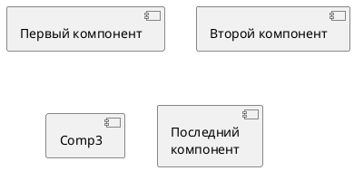

# ДЕТАЛЬНАЯ ИНСТРУКЦИЯ ДЛЯ ГЕНЕРАЦИИ PLANTUML COMPONENT ДИАГРАММ

## КРИТИЧЕСКИ ВАЖНЫЕ ПРАВИЛА

### 1. ОБЯЗАТЕЛЬНЫЙ СИНТАКСИС

**ВСЕГДА начинай код с `@startuml` и заканчивай `@enduml`!**



**НЕПРАВИЛЬНО:**
```
component
[Первый компонент]
```

**ПРАВИЛЬНО:**
```
@startuml
[Первый компонент]
@enduml
```

### 2. КОМПОНЕНТЫ - ОБЯЗАТЕЛЬНЫЕ КВАДРАТНЫЕ СКОБКИ ИЛИ КЛЮЧЕВОЕ СЛОВО

**Компоненты должны быть заключены в квадратные скобки `[]` или использовать ключевое слово `component`!**

**Правило компонентов:**
- Формат 1: `[Название компонента]` - квадратные скобки
- Формат 2: `component НазваниеКомпонента` - ключевое слово
- Формат 3: `component [Название\nкомпонента]` - комбинация с многострочным текстом
- Можно использовать алиас: `[Компонент] as Comp1` или `component Comp1 as [Компонент]`

**ПРАВИЛЬНО:**
```
@startuml
[Первый компонент]
[Второй компонент] as Comp2
component Comp3
component [Последний\nкомпонент] as Comp4
@enduml
```

**НЕПРАВИЛЬНО:**
```
@startuml
Первый компонент  ← НЕПРАВИЛЬНО! Нет квадратных скобок или component
component  ← НЕПРАВИЛЬНО! Нет названия
@enduml
```

### 3. ИНТЕРФЕЙСЫ - КРУГЛЫЕ СКОБКИ

**Для обозначения интерфейса используется символ `()` (потому что он выглядит как круг)!**

**Правило интерфейсов:**
- Формат 1: `() "Название интерфейса"` - круглые скобки с кавычками
- Формат 2: `interface НазваниеИнтерфейса` - ключевое слово
- Формат 3: `() "Первый интерфейс"` или `() "Другой интерфейс" as Interf2`
- Можно использовать алиас: `() "Интерфейс" as Interf1`

**ПРАВИЛЬНО:**
```
@startuml
() "Первый интерфейс"
() "Другой интерфейс" as Interf2
interface Interf3
interface "Последний\nинтерфейс" as Interf4
@enduml
```

**НЕПРАВИЛЬНО:**
```
@startuml
"Первый интерфейс"  ← НЕПРАВИЛЬНО! Нет круглых скобок или interface
interface  ← НЕПРАВИЛЬНО! Нет названия
@enduml
```

### 4. ОТСТУПЫ И ПРОБЕЛЫ - КРИТИЧЕСКИ ВАЖНО!

**Используй ПРОБЕЛЫ для отступов, НИКОГДА не используй табуляцию (TAB)!**

**Правило отступов:**
- Первая строка: `@startuml` (0 пробелов)
- Все последующие строки: **2 пробела** для базового отступа (если нужна группировка)
- Для вложенных блоков (package, node, folder, frame, cloud, database): **+2 пробела** от предыдущего уровня
- Все элементы одного уровня должны иметь **одинаковый отступ**

**Пример правильной структуры отступов:**
```
@startuml
[Первый компонент]
[Второй компонент] as Comp2
() "Интерфейс" as Interf1
[Первый компонент] ..> Interf1 : use
@enduml
```

**НЕПРАВИЛЬНО (неправильные отступы):**
```
@startuml
[Первый компонент]  ← Правильно
[Второй компонент] as Comp2  ← Правильно
  () "Интерфейс" as Interf1  ← НЕПРАВИЛЬНО! Лишний отступ
[Первый компонент] ..> Interf1 : use  ← Правильно
@enduml
```

**ВАЖНО:** Для простых диаграмм отступы не обязательны, но для группировки (package, node, etc.) они критичны!

### 5. СВЯЗИ МЕЖДУ КОМПОНЕНТАМИ

**Отношения между элементами создаются с помощью комбинации точечных линий (`..`), прямых линий (`--`) и стрелок (`-->`, `<--`, `..>`, `<..`).**

**Типы связей:**
1. **Зависимость (использование):**
   ```
   [Компонент1] ..> [Компонент2] : use
   [Компонент1] ..> () "Интерфейс" : use
   ```

2. **Ассоциация:**
   ```
   [Компонент1] -- [Компонент2]
   [Компонент1] --> [Компонент2]
   ```

3. **Реализация:**
   ```
   [Компонент] ..|> () "Интерфейс"
   ```

4. **Композиция:**
   ```
   [Компонент1] *-- [Компонент2]
   ```

5. **Агрегация:**
   ```
   [Компонент1] o-- [Компонент2]
   ```

**ПРАВИЛЬНО:**
```
@startuml
[DataAccess]
[First Component]
[First Component] ..> HTTP : use
DataAccess - [First Component]
@enduml
```

**НЕПРАВИЛЬНО:**
```
@startuml
[First Component]
[First Component] -> HTTP : use  ← НЕПРАВИЛЬНО! Используй ..> для зависимости
@enduml
```

### 6. ГРУППИРОВКА КОМПОНЕНТОВ

**Вы можете использовать несколько ключевых слов для группировки компонентов и интерфейсов:**
- `package` - пакет
- `node` - узел
- `folder` - папка
- `frame` - рамка
- `cloud` - облако
- `database` - база данных

**Синтаксис группировки:**
```
@startuml
package "Название группы" {
  [Компонент 1]
  [Компонент 2]
  () "Интерфейс"
}

node "Другая группа" {
  [Компонент 3]
  [Компонент 4]
}
@enduml
```

**ПРАВИЛЬНО (с отступами внутри групп):**
```
@startuml
package "Некоторые группы" {
  HTTP - [First Component]
  [Another Component]
}

node "Другие группы" {
  FTP - [Second Component]
  [First Component] --> FTP
}

cloud {
  [Example 1]
}

database "MySql" {
  folder "Это моя папка" {
    [Folder 3]
  }
  frame "Foo" {
    [Frame 4]
  }
}

[Another Component] --> [Example 1]
[Example 1] --> [Folder 3]
[Folder 3] --> [Frame 4]
@enduml
```

**НЕПРАВИЛЬНО (без отступов внутри групп):**
```
@startuml
package "Группа" {
[Компонент 1]  ← НЕПРАВИЛЬНО! Нет отступа внутри package
[Компонент 2]
}
@enduml
```

**ПРАВИЛЬНО:**
```
@startuml
package "Группа" {
  [Компонент 1]  ← Правильно! 2 пробела отступа
  [Компонент 2]  ← Правильно! 2 пробела отступа
}
@enduml
```

### 7. НАПРАВЛЕНИЕ СТРЕЛОК

**По умолчанию, связи между компонентами ориентированы вертикально. Можно создавать горизонтальные связи с помощью одного тире (или точки):**

**ПРАВИЛЬНО:**
```
@startuml
[Component] --> Interface1
[Component] -> Interface2
@enduml
```

**Также можно изменять направления, перевернув связь:**
```
@startuml
Interface1 <-- [Component]
Interface2 <- [Component]
@enduml
```

### 8. ЗАМЕТКИ (NOTES)

**Вы можете использовать ключевые слова `note left of`, `note right of`, `note top of`, `note bottom of` для заданий меток, относящихся к одному объекту.**

**Синтаксис заметок:**
```
@startuml
[Component]
() "Interface" as Interf1
[Component] ..> Interf1 : use

note left of Interf1 : Web Service only
note right of [Component]
  Заметка может быть
  на нескольких строках
end note
@enduml
```

**ПРАВИЛЬНО:**
```
@startuml
interface "Data Access" as DA
DA - [First Component]
[First Component] ..> HTTP : use

note left of HTTP : Web Service only
note right of [First Component]
  Заметка также может
  быть на нескольких строках
end note
@enduml
```

### 9. НАЗВАНИЯ КОМПОНЕНТОВ И ИНТЕРФЕЙСОВ

**Правила для названий:**

1. **НЕ используй специальные символы**, которые могут сломать синтаксис:
   - Незакрытые квадратные скобки: `[Компонент` - НЕПРАВИЛЬНО
   - Незакрытые круглые скобки: `(Интерфейс` - НЕПРАВИЛЬНО
   - Символы `:`, `;` в неправильных местах (кроме меток на стрелках)

2. **Можно использовать:**
   - Буквы (русские и английские)
   - Цифры
   - Пробелы
   - Дефисы и подчеркивания: `-`, `_`
   - Многострочный текст: `[Компонент\nс переносом]` или `component [Компонент\nс переносом]`

3. **Длинные названия:**
   - Можно использовать длинные названия на русском языке
   - Пример: `[Производственный контроль за соблюдением требований промышленной безопасности]`
   - Для многострочного текста используй `\n`: `[Компонент\nс длинным\nназванием]`

**ПРАВИЛЬНО:**
```
@startuml
[СМК МП]
[Внешние факторы]
[Внутренние факторы]
[Производственный контроль за соблюдением требований промышленной безопасности]
@enduml
```

**НЕПРАВИЛЬНО:**
```
@startuml
["Внешние факторы"]  ← НЕПРАВИЛЬНО! Кавычки не нужны внутри []
[(Внутренние факторы)]  ← НЕПРАВИЛЬНО! Круглые скобки внутри квадратных
@enduml
```

### 10. ЦВЕТА - СТРОГИЕ (БЕЛЫЙ, ЧЕРНЫЙ, СЕРЫЙ)

**КРИТИЧЕСКИ ВАЖНО:** Диаграмма должна быть в строгих цветах!

**Используй ТОЛЬКО следующие цвета:**
- Фон компонентов: **белый** (`#FFFFFF` или `white`)
- Текст: **черный** (`#000000` или `black`)
- Границы: **черный** или **серый** (`#000000`, `#666666`, `#999999`)
- Акценты: **серые оттенки** (`#F5F5F5`, `#E5E5E5`, `#CCCCCC`, `#B3B3B3`)

**Синтаксис для цветов в PlantUML Component:**

Для задания цветов используй `skinparam`:

```
@startuml
skinparam component {
  BackgroundColor white
  BorderColor #000000
  FontColor #000000
  ArrowColor #000000
}
skinparam interface {
  BackgroundColor white
  BorderColor #000000
  FontColor #000000
}
skinparam package {
  BackgroundColor #F5F5F5
  BorderColor #666666
  FontColor #000000
  TitleFontColor #000000
}
skinparam node {
  BackgroundColor #F5F5F5
  BorderColor #666666
  FontColor #000000
}
skinparam folder {
  BackgroundColor #F5F5F5
  BorderColor #666666
  FontColor #000000
}
skinparam frame {
  BackgroundColor #F5F5F5
  BorderColor #666666
  FontColor #000000
}
skinparam cloud {
  BackgroundColor #F5F5F5
  BorderColor #666666
  FontColor #000000
}
skinparam database {
  BackgroundColor #F5F5F5
  BorderColor #666666
  FontColor #000000
}
skinparam arrow {
  Color #000000
  Thickness 1
}
skinparam note {
  BackgroundColor #F5F5F5
  BorderColor #666666
  FontColor #000000
}

[Первый компонент]
[Второй компонент]
[Первый компонент] --> [Второй компонент]
@enduml
```

**ПРАВИЛЬНО (строгие цвета):**
```
@startuml
skinparam component {
  BackgroundColor white
  BorderColor #000000
  FontColor #000000
  ArrowColor #000000
}
skinparam interface {
  BackgroundColor white
  BorderColor #000000
  FontColor #000000
}
skinparam arrow {
  Color #000000
  Thickness 1
}

[Первый компонент]
[Второй компонент]
() "Интерфейс" as Interf1
[Первый компонент] ..> Interf1 : use
[Первый компонент] --> [Второй компонент]
@enduml
```

**НЕПРАВИЛЬНО (яркие цвета):**
```
@startuml
[Первый компонент] #00FF00  ← НЕПРАВИЛЬНО! Зеленый цвет
[Второй компонент] #FFFF00  ← НЕПРАВИЛЬНО! Желтый цвет
() "Интерфейс" #FF00FF  ← НЕПРАВИЛЬНО! Фиолетовый цвет
@enduml
```

**ОБЯЗАТЕЛЬНО добавляй стили для строгих цветов в начале кода (после @startuml):**

```
@startuml
skinparam component {
  BackgroundColor white
  BorderColor #000000
  FontColor #000000
  ArrowColor #000000
}
skinparam interface {
  BackgroundColor white
  BorderColor #000000
  FontColor #000000
}
skinparam package {
  BackgroundColor #F5F5F5
  BorderColor #666666
  FontColor #000000
  TitleFontColor #000000
}
skinparam arrow {
  Color #000000
  Thickness 1
}
skinparam note {
  BackgroundColor #F5F5F5
  BorderColor #666666
  FontColor #000000
}

[Компонент 1]
[Компонент 2]
@enduml
```

### 11. ПОРТЫ (PORTS)

**Вы можете добавлять порты с ключевыми словами `port`, `portin` и `portout`.**

**Port (обычный порт):**
```
@startuml
[Component] component C {
  port p1
  port p2
  port p3
  component c1
}
C --> p1
C --> p2
C --> p3
p1 --> c1
p2 --> c1
@enduml
```

**PortIn (входящий порт):**
```
@startuml
[Component] component C {
  portin p1
  portin p2
  portin p3
  component c1
}
C --> p1
C --> p2
C --> p3
p1 --> c1
p2 --> c1
@enduml
```

**PortOut (исходящий порт):**
```
@startuml
component C {
  portout p1
  portout p2
  portout p3
  component c1
}
[Output] as O
p1 --> O
p2 --> O
p3 --> O
c1 --> p1
@enduml
```

**Смешивание PortIn и PortOut:**
```
@startuml
[Input] as I
component C {
  portin p1
  portin p2
  portin p3
  portout po1
  portout po2
  portout po3
  component c1
}
[Output] as O
I --> p1
I --> p2
I --> p3
p1 --> c1
p2 --> c1
po1 --> O
po2 --> O
po3 --> O
c1 --> po1
@enduml
```

### 12. ПРОВЕРКА ПЕРЕД ОТПРАВКОЙ

**ОБЯЗАТЕЛЬНО проверь код перед отправкой:**

1. ✅ Код начинается с `@startuml`
2. ✅ Код заканчивается `@enduml`
3. ✅ Все компоненты заключены в квадратные скобки `[]` или используют `component`
4. ✅ Все интерфейсы используют круглые скобки `()` или `interface`
5. ✅ Все связи правильно оформлены (`-->`, `..>`, `--`, `..`)
6. ✅ Используются строгие цвета (белый, черный, серый) через `skinparam`
7. ✅ Нет специальных символов в названиях компонентов, которые могут сломать синтаксис
8. ✅ Все названия на русском языке
9. ✅ Стили для строгих цветов добавлены в начале кода
10. ✅ Если используются группы (package, node, etc.), внутри них есть отступы (2 пробела)

### 13. ПРИМЕРЫ ПРАВИЛЬНОГО КОДА

**Пример 1: Простая Component диаграмма со строгими цветами**
```
@startuml
skinparam component {
  BackgroundColor white
  BorderColor #000000
  FontColor #000000
  ArrowColor #000000
}
skinparam interface {
  BackgroundColor white
  BorderColor #000000
  FontColor #000000
}
skinparam arrow {
  Color #000000
  Thickness 1
}

[Управление проектом]
[Планирование]
[Реализация]
[Завершение]

[Управление проектом] --> [Планирование]
[Планирование] --> [Реализация]
[Реализация] --> [Завершение]
@enduml
```

**Пример 2: Component диаграмма с интерфейсами**
```
@startuml
skinparam component {
  BackgroundColor white
  BorderColor #000000
  FontColor #000000
  ArrowColor #000000
}
skinparam interface {
  BackgroundColor white
  BorderColor #000000
  FontColor #000000
}
skinparam arrow {
  Color #000000
  Thickness 1
}

[DataAccess]
[First Component]
() "HTTP Interface" as HTTP
[First Component] ..> HTTP : use
DataAccess - [First Component]
@enduml
```

**Пример 3: Component диаграмма с группировкой**
```
@startuml
skinparam component {
  BackgroundColor white
  BorderColor #000000
  FontColor #000000
  ArrowColor #000000
}
skinparam interface {
  BackgroundColor white
  BorderColor #000000
  FontColor #000000
}
skinparam package {
  BackgroundColor #F5F5F5
  BorderColor #666666
  FontColor #000000
  TitleFontColor #000000
}
skinparam arrow {
  Color #000000
  Thickness 1
}

package "Некоторые группы" {
  HTTP - [First Component]
  [Another Component]
}

node "Другие группы" {
  FTP - [Second Component]
  [First Component] --> FTP
}

[Another Component] --> [Example 1]
@enduml
```

**Пример 4: Component диаграмма с заметками**
```
@startuml
skinparam component {
  BackgroundColor white
  BorderColor #000000
  FontColor #000000
  ArrowColor #000000
}
skinparam interface {
  BackgroundColor white
  BorderColor #000000
  FontColor #000000
}
skinparam note {
  BackgroundColor #F5F5F5
  BorderColor #666666
  FontColor #000000
}
skinparam arrow {
  Color #000000
  Thickness 1
}

interface "Data Access" as DA
DA - [First Component]
[First Component] ..> HTTP : use

note left of HTTP : Web Service only
note right of [First Component]
  Заметка также может
  быть на нескольких строках
end note
@enduml
```

**Пример 5: Component диаграмма с портами**
```
@startuml
skinparam component {
  BackgroundColor white
  BorderColor #000000
  FontColor #000000
  ArrowColor #000000
}
skinparam arrow {
  Color #000000
  Thickness 1
}

[Component] component C {
  portin p1
  portin p2
  portout po1
  portout po2
  component c1
}
[Input] as I
[Output] as O

I --> p1
I --> p2
p1 --> c1
p2 --> c1
po1 --> O
po2 --> O
c1 --> po1
@enduml
```

### 14. ЧАСТЫЕ ОШИБКИ И КАК ИХ ИЗБЕЖАТЬ

**Ошибка 1: "Syntax Error" или код не рендерится**
- **Причина:** Неправильный синтаксис, отсутствие `@startuml`/`@enduml`, неправильные скобки
- **Решение:** Проверь, что код начинается с `@startuml` и заканчивается `@enduml`, проверь все скобки

**Ошибка 2: Компоненты не отображаются**
- **Причина:** Компоненты не заключены в квадратные скобки `[]` или не используют `component`
- **Решение:** Убедись, что все компоненты имеют формат `[Название]` или `component Название`

**Ошибка 3: Интерфейсы не отображаются**
- **Причина:** Интерфейсы не используют круглые скобки `()` или не используют `interface`
- **Решение:** Убедись, что все интерфейсы имеют формат `() "Название"` или `interface Название`

**Ошибка 4: Яркие цвета на диаграмме**
- **Причина:** Не добавлены стили для строгих цветов
- **Решение:** ОБЯЗАТЕЛЬНО добавляй блок `skinparam` с настройками цветов (белый, черный, серый) в начале кода

**Ошибка 5: Специальные символы в названиях**
- **Причина:** Кавычки, скобки или другие символы в названиях компонентов
- **Решение:** Используй только буквы, цифры, пробелы, дефисы и подчеркивания

**Ошибка 6: Неправильные отступы в группах**
- **Причина:** Элементы внутри package, node, folder и т.д. не имеют отступов
- **Решение:** Все элементы внутри групп должны иметь отступ 2 пробела

**Ошибка 7: Неправильные связи**
- **Причина:** Использование неправильных символов для связей (`->` вместо `-->` или `..>`)
- **Решение:** Используй правильные символы: `-->` для ассоциации, `..>` для зависимости

### 15. ФОРМАТИРОВАНИЕ КОДА

**Всегда форматируй код так:**
- Первая строка: `@startuml`
- Блок стилей (ОБЯЗАТЕЛЬНО): `skinparam` для строгих цветов
- Объявления компонентов и интерфейсов
- Связи между компонентами
- Последняя строка: `@enduml`
- Каждая строка заканчивается переводом строки
- Для групп (package, node, etc.): используй отступы 2 пробела внутри

**ПРАВИЛЬНО:**
```
@startuml
skinparam component {
  BackgroundColor white
  BorderColor #000000
  FontColor #000000
}
skinparam arrow {
  Color #000000
}

[Первый компонент]
[Второй компонент]
[Первый компонент] --> [Второй компонент]
@enduml
```

### 16. РУССКИЙ ЯЗЫК

**Все названия компонентов, интерфейсов и других элементов должны быть на русском языке!**

- Используй русские названия для всех элементов
- Синтаксис PlantUML остается на английском (`@startuml`, `@enduml`, `component`, `interface`, `skinparam`)
- Содержимое (названия компонентов, интерфейсов) - на русском

**ПРАВИЛЬНО:**
```
@startuml
[Система управления качеством]
[Внешние факторы]
[Внутренние факторы]
@enduml
```

**НЕПРАВИЛЬНО:**
```
@startuml
[Quality Management System]
[External factors]
[Internal factors]
@enduml
```

### 17. ФИНАЛЬНАЯ ПРОВЕРКА

**Перед отправкой кода ответь на вопросы:**

1. ✅ Код начинается с `@startuml`?
2. ✅ Код заканчивается `@enduml`?
3. ✅ Все компоненты заключены в квадратные скобки `[]` или используют `component`?
4. ✅ Все интерфейсы используют круглые скобки `()` или `interface`?
5. ✅ Добавлены стили для строгих цветов (белый, черный, серый) через `skinparam`?
6. ✅ Нет специальных символов в названиях компонентов?
7. ✅ Все названия на русском языке?
8. ✅ Все связи правильно оформлены (`-->`, `..>`, `--`, `..`)?
9. ✅ Если используются группы, внутри них есть отступы (2 пробела)?
10. ✅ Код можно скопировать и вставить в PlantUML редактор БЕЗ ОШИБОК?

**Если на все вопросы ответ "ДА" - код готов к отправке!**

---

## РЕЗЮМЕ: ЧТО ДЕЛАТЬ ВСЕГДА

1. ✅ Начинай с `@startuml` и заканчивай `@enduml`
2. ✅ Используй квадратные скобки `[]` или `component` для компонентов
3. ✅ Используй круглые скобки `()` или `interface` для интерфейсов
4. ✅ ОБЯЗАТЕЛЬНО добавляй стили для строгих цветов (белый, черный, серый) через `skinparam` в начале кода
5. ✅ Используй правильные связи (`-->`, `..>`, `--`, `..`)
6. ✅ Используй русские названия
7. ✅ Избегай специальных символов в названиях компонентов
8. ✅ Для групп используй отступы 2 пробела внутри
9. ✅ Проверяй код перед отправкой

## РЕЗЮМЕ: ЧТО НИКОГДА НЕ ДЕЛАТЬ

1. ❌ НЕ начинай код без `@startuml`
2. ❌ НЕ заканчивай код без `@enduml`
3. ❌ НЕ используй компоненты без квадратных скобок `[]` или `component`
4. ❌ НЕ используй интерфейсы без круглых скобок `()` или `interface`
5. ❌ НЕ используй яркие цвета (зеленый, желтый, фиолетовый) - ТОЛЬКО белый, черный, серый!
6. ❌ НЕ забывай добавлять стили для строгих цветов через `skinparam`
7. ❌ НЕ используй кавычки или скобки в названиях компонентов (кроме случаев, когда они нужны)
8. ❌ НЕ используй английские названия для компонентов и интерфейсов
9. ❌ НЕ забывай про отступы внутри групп (package, node, etc.)
10. ❌ НЕ отправляй код без проверки

---

## ДОПОЛНИТЕЛЬНАЯ ИНФОРМАЦИЯ

### Официальная документация PlantUML Component:
https://plantuml.com/ru/component-diagram

### Основные синтаксические конструкции:

1. **Компоненты:**
```
[Название компонента]
component НазваниеКомпонента
[Название\nкомпонента] as Алиас
component НазваниеКомпонента as Алиас
```

2. **Интерфейсы:**
```
() "Название интерфейса"
interface НазваниеИнтерфейса
() "Название\nинтерфейса" as Алиас
interface НазваниеИнтерфейса as Алиас
```

3. **Связи:**
```
[Компонент1] --> [Компонент2]  (ассоциация)
[Компонент1] ..> [Компонент2] : use  (зависимость)
[Компонент] ..|> () "Интерфейс"  (реализация)
[Компонент1] *-- [Компонент2]  (композиция)
[Компонент1] o-- [Компонент2]  (агрегация)
```

4. **Группировка:**
```
package "Название" {
  [Компонент 1]
  [Компонент 2]
}

node "Название" {
  [Компонент 3]
}

folder "Название" {
  [Компонент 4]
}

frame "Название" {
  [Компонент 5]
}

cloud {
  [Компонент 6]
}

database "Название" {
  [Компонент 7]
}
```

5. **Заметки:**
```
note left of [Компонент] : Текст заметки
note right of [Компонент] : Текст заметки
note top of [Компонент] : Текст заметки
note bottom of [Компонент] : Текст заметки

note right of [Компонент]
  Многострочная
  заметка
end note
```

6. **Порты:**
```
component C {
  port p1
  portin p2
  portout p3
  component c1
}
```

### Рекомендации по цветам:

**Для строгих диаграмм используй:**
- `BackgroundColor white` - белый фон
- `FontColor #000000` или `black` - черный текст
- `BorderColor #000000` или `#666666` - черные или серые границы
- `ArrowColor #000000` - черные стрелки
- `TitleFontColor #000000` - черный цвет заголовков

**НЕ используй:**
- `#00FF00` (зеленый)
- `#FFFF00` (желтый)
- `#FF00FF` (фиолетовый)
- `#0000FF` (синий)
- Любые другие яркие цвета

---

## ПОЛНЫЙ ШАБЛОН ДЛЯ КОПИРОВАНИЯ

```
@startuml
skinparam component {
  BackgroundColor white
  BorderColor #000000
  FontColor #000000
  ArrowColor #000000
}
skinparam interface {
  BackgroundColor white
  BorderColor #000000
  FontColor #000000
}
skinparam package {
  BackgroundColor #F5F5F5
  BorderColor #666666
  FontColor #000000
  TitleFontColor #000000
}
skinparam node {
  BackgroundColor #F5F5F5
  BorderColor #666666
  FontColor #000000
}
skinparam folder {
  BackgroundColor #F5F5F5
  BorderColor #666666
  FontColor #000000
}
skinparam frame {
  BackgroundColor #F5F5F5
  BorderColor #666666
  FontColor #000000
}
skinparam cloud {
  BackgroundColor #F5F5F5
  BorderColor #666666
  FontColor #000000
}
skinparam database {
  BackgroundColor #F5F5F5
  BorderColor #666666
  FontColor #000000
}
skinparam arrow {
  Color #000000
  Thickness 1
}
skinparam note {
  BackgroundColor #F5F5F5
  BorderColor #666666
  FontColor #000000
}

[КОМПОНЕНТ_1]
[КОМПОНЕНТ_2] as Comp2
() "ИНТЕРФЕЙС_1" as Interf1

[КОМПОНЕНТ_1] --> [КОМПОНЕНТ_2]
[КОМПОНЕНТ_1] ..> Interf1 : use
@enduml
```

**Замени `КОМПОНЕНТ_1`, `КОМПОНЕНТ_2`, `ИНТЕРФЕЙС_1` на реальные названия на русском языке!**

