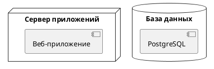

# ДЕТАЛЬНАЯ ИНСТРУКЦИЯ ДЛЯ ГЕНЕРАЦИИ PLANTUML DEPLOYMENT ДИАГРАММ

## КРИТИЧЕСКИ ВАЖНЫЕ ПРАВИЛА

### 1. ОБЯЗАТЕЛЬНЫЙ СИНТАКСИС

**ВСЕГДА начинай код с `@startuml` и заканчивай `@enduml`!**



**НЕПРАВИЛЬНО:**
```
deployment
node "Сервер"
```

**ПРАВИЛЬНО:**
```
@startuml
node "Сервер приложений" {
  [Веб-приложение]
}
@enduml
```

### 2. УНИКАЛЬНОСТЬ ИМЕН ЭЛЕМЕНТОВ - КРИТИЧЕСКИ ВАЖНО!

**🚨 КРИТИЧЕСКИ ВАЖНО: В PlantUML НЕ МОЖЕТ БЫТЬ ДВУХ ЭЛЕМЕНТОВ С ОДИНАКОВЫМ ИМЕНЕМ!**

**Правило уникальности:**
- Каждый node, artifact, component, database и любой другой элемент ДОЛЖЕН иметь УНИКАЛЬНОЕ имя
- Если элемент с таким же именем уже существует, PlantUML выдаст ошибку: "This element (X) is already defined"
- ОДИН элемент не может быть одновременно node и artifact с одинаковым именем
- ОДИН элемент не может быть определен дважды в разных узлах с одинаковым именем

**НЕПРАВИЛЬНО (вызовет ошибку "This element is already defined"):**
```
@startuml
node "Сервер" {
  [Веб-приложение]
}
node "Клиент" {
  [Веб-приложение]  ← ОШИБКА! Элемент с таким именем уже существует!
}
@enduml
```

**ПРАВИЛЬНО (используй алиасы для элементов с одинаковыми названиями):**
```
@startuml
node "Сервер" {
  [Веб-приложение] as WebAppServer
}
node "Клиент" {
  [Веб-приложение] as WebAppClient  ← Правильно! Используем алиас
}
@enduml
```

**ПРАВИЛЬНО (используй разные имена):**
```
@startuml
node "Сервер" {
  [Веб-приложение сервера]
}
node "Клиент" {
  [Веб-приложение клиента]  ← Правильно! Разные имена
}
@enduml
```

**КРИТИЧЕСКИ ВАЖНО: ИМЯ NODE И КОМПОНЕНТОВ ВНУТРИ NODE НЕ МОГУТ СОВПАДАТЬ!**

**🚨 ОСОБЕННО ВАЖНО: Имя node и имена компонентов/артефактов ВНУТРИ этого node НЕ МОГУТ БЫТЬ ОДИНАКОВЫМИ!**

**НЕПРАВИЛЬНО (вызовет ошибку "This element (X) is already defined"):**
```
@startuml
node "AI Service API" {
  [AI Service API]  ← ОШИБКА! Имя компонента совпадает с именем node!
}
@enduml
```

**НЕПРАВИЛЬНО (вызовет ошибку "This element (X) is already defined"):**
```
@startuml
node "CDN" {
  [CDN]  ← ОШИБКА! Имя компонента совпадает с именем node!
}
@enduml
```

**ПРАВИЛЬНО (используй разные имена для node и компонентов внутри):**
```
@startuml
node "AI Service API" {
  [AI Service] as AIService  ← Правильно! Имя компонента отличается от имени node
}
@enduml
```

**ПРАВИЛЬНО (используй разные имена):**
```
@startuml
node "AI Service API" {
  [API сервис]  ← Правильно! Имя компонента отличается от имени node
}
@enduml
```

**ПРАВИЛЬНО (используй алиасы):**
```
@startuml
node "AI Service API" {
  [AI Service API Component] as AIServiceComp  ← Правильно! Используем алиас и другое имя
}
@enduml
```

**ПРАВИЛЬНО (пример из реального кода):**
```
@startuml
node "CDN" {
  [Статические файлы Frontend SPA]  ← Правильно! Имя компонента отличается от имени node
}
node "Application Server" {
  [Backend API]  ← Правильно! Имя компонента отличается от имени node
  [Контейнер c Backend API]  ← Правильно! Имя компонента отличается от имени node
}
node "AI Service Server" {
  [AI Service API] as AIServiceAPI  ← Правильно! Используем алиас, чтобы избежать конфликта
}
@enduml
```

**ВАЖНО:**
- Если элемент используется в разных контекстах (например, в разных узлах), ОБЯЗАТЕЛЬНО используй алиасы
- **КРИТИЧЕСКИ ВАЖНО:** Имя node и имена компонентов/артефактов внутри этого node НЕ МОГУТ СОВПАДАТЬ!
- Всегда проверяй, что имена элементов уникальны перед генерацией кода
- Используй алиасы (`as Алиас`) для всех элементов, которые могут иметь конфликтующие имена
- Если node называется "X", то компоненты внутри него НЕ МОГУТ называться "X" - используй другие имена или алиасы!

### 3. ОТСТУПЫ И ПРОБЕЛЫ - КРИТИЧЕСКИ ВАЖНО!

**Используй ПРОБЕЛЫ для отступов, НИКОГДА не используй табуляцию (TAB)!**

**Правило отступов:**
- Первая строка: `@startuml` (0 пробелов)
- Все последующие строки: **2 пробела** для базового отступа внутри node/package/database/etc.
- Для вложенных элементов внутри node: **+2 пробела** от предыдущего уровня
- Все элементы одного уровня должны иметь **одинаковый отступ**

**Пример правильной структуры отступов:**
```
@startuml
node "Сервер приложений" {
  [Веб-приложение]
  [API сервис]
}
database "База данных" {
  [PostgreSQL]
}
@enduml
```

**НЕПРАВИЛЬНО (неправильные отступы):**
```
@startuml
node "Сервер приложений" {
[Веб-приложение]  ← НЕПРАВИЛЬНО! Нет отступа внутри node
  [API сервис]  ← Правильно
}
@enduml
```

**КРИТИЧЕСКИ ВАЖНО:** Без правильных отступов PlantUML не сможет правильно распарсить вложенные элементы! Всегда используй 2 пробела для элементов внутри node/package/database/etc.

### 4. ТИПЫ ЭЛЕМЕНТОВ DEPLOYMENT ДИАГРАММЫ

**PlantUML поддерживает множество типов элементов для Deployment диаграмм:**

#### 4.1. Node (Узел)
**Узел представляет физический или логический узел развертывания (сервер, рабочая станция, устройство).**

**Формат:**
```
node "Название узла" {
  [элементы внутри узла]
}
```

**🚨 КРИТИЧЕСКИ ВАЖНО: Имя node и имена компонентов/артефактов внутри этого node НЕ МОГУТ СОВПАДАТЬ!**

**ПРАВИЛЬНО:**
```
@startuml
node "Сервер приложений" {
  [Веб-приложение]  ← Правильно! Имя компонента отличается от имени node
  [API сервис]  ← Правильно! Имя компонента отличается от имени node
}
@enduml
```

**НЕПРАВИЛЬНО (название без кавычек):**
```
@startuml
node Сервер приложений {  ← НЕПРАВИЛЬНО! Название должно быть в кавычках
  [Веб-приложение]
}
@enduml
```

**НЕПРАВИЛЬНО (имя компонента совпадает с именем node):**
```
@startuml
node "AI Service API" {
  [AI Service API]  ← ОШИБКА! Имя компонента совпадает с именем node!
}
@enduml
```

**ПРАВИЛЬНО (используй разные имена или алиасы):**
```
@startuml
node "AI Service API" {
  [AI Service] as AIService  ← Правильно! Используем алиас и другое имя
}
@enduml
```

#### 4.2. Artifact (Артефакт)
**Артефакт представляет физический файл или компонент, который развертывается на узле.**

**Формат:**
```
artifact "Название артефакта"
```

**ПРАВИЛЬНО:**
```
@startuml
node "Сервер" {
  artifact "app.war"
  artifact "config.properties"
}
@enduml
```

#### 4.3. Component (Компонент)
**Компонент представляет логический компонент системы.**

**Формат:**
```
[Название компонента]
или
component "Название компонента"
```

**ПРАВИЛЬНО:**
```
@startuml
node "Сервер" {
  [Веб-компонент]
  [Бизнес-логика]
}
@enduml
```

#### 4.4. Database (База данных)
**База данных представляет хранилище данных.**

**Формат:**
```
database "Название БД" {
  [элементы внутри БД]
}
```

**ПРАВИЛЬНО:**
```
@startuml
database "Основная БД" {
  [PostgreSQL]
  [Redis]
}
@enduml
```

#### 4.5. Cloud (Облако)
**Облако представляет облачный сервис или инфраструктуру.**

**Формат:**
```
cloud "Название облака" {
  [элементы внутри облака]
}
```

**ПРАВИЛЬНО:**
```
@startuml
cloud "AWS" {
  [S3]
  [EC2]
}
@enduml
```

#### 4.6. Folder (Папка)
**Папка представляет логическую группировку элементов.**

**Формат:**
```
folder "Название папки" {
  [элементы внутри папки]
}
```

**ПРАВИЛЬНО:**
```
@startuml
folder "Внешние сервисы" {
  [API Gateway]
  [Auth Service]
}
@enduml
```

#### 4.7. Frame (Рамка)
**Рамка представляет границу системы или подсистемы.**

**Формат:**
```
frame "Название рамки" {
  [элементы внутри рамки]
}
```

**ПРАВИЛЬНО:**
```
@startuml
frame "Продакшн окружение" {
  node "Сервер 1" {
    [Приложение]
  }
}
@enduml
```

#### 4.8. Package (Пакет)
**Пакет представляет логическую группировку элементов.**

**Формат:**
```
package "Название пакета" {
  [элементы внутри пакета]
}
```

**ПРАВИЛЬНО:**
```
@startuml
package "Модуль 1" {
  [Компонент 1]
  [Компонент 2]
}
@enduml
```

#### 4.9. Storage (Хранилище)
**Хранилище представляет физическое или логическое хранилище данных.**

**Формат:**
```
storage "Название хранилища" {
  [элементы внутри хранилища]
}
```

**ПРАВИЛЬНО:**
```
@startuml
storage "Файловое хранилище" {
  [NFS]
  [S3]
}
@enduml
```

#### 4.10. Actor (Актор)
**Актор представляет пользователя или внешнюю систему.**

**Формат:**
```
actor "Название актора"
или
:Название актора:
```

**ПРАВИЛЬНО:**
```
@startuml
actor "Пользователь" as User
:Администратор: as Admin
@enduml
```

#### 4.11. Usecase (Вариант использования)
**Вариант использования представляет функциональность системы.**

**Формат:**
```
(Название варианта использования)
или
usecase "Название варианта использования"
```

**ПРАВИЛЬНО:**
```
@startuml
actor "Пользователь" as User
(Вход в систему)
User --> (Вход в систему)
@enduml
```

#### 4.12. Interface (Интерфейс)
**Интерфейс представляет контракт или API.**

**Формат:**
```
() "Название интерфейса"
или
interface "Название интерфейса"
```

**ПРАВИЛЬНО:**
```
@startuml
node "Сервер" {
  [Компонент] as Comp1
}
() "REST API" as API1
Comp1 ..> API1 : implements
@enduml
```

#### 4.13. File (Файл)
**Файл представляет физический файл.**

**Формат:**
```
file "Название файла"
```

**ПРАВИЛЬНО:**
```
@startuml
node "Сервер" {
  file "config.xml"
  file "log.txt"
}
@enduml
```

#### 4.14. Queue (Очередь)
**Очередь представляет очередь сообщений или задач.**

**Формат:**
```
queue "Название очереди"
```

**ПРАВИЛЬНО:**
```
@startuml
node "Сервер" {
  queue "Очередь задач"
  queue "Очередь сообщений"
}
@enduml
```

#### 4.15. Stack (Стек)
**Стек представляет стек технологий.**

**Формат:**
```
stack "Название стека" {
  [элементы внутри стека]
}
```

**ПРАВИЛЬНО:**
```
@startuml
stack "Технологический стек" {
  [Java]
  [Spring]
  [PostgreSQL]
}
@enduml
```

#### 4.16. Rectangle (Прямоугольник)
**Прямоугольник представляет общий элемент.**

**Формат:**
```
rectangle "Название прямоугольника" {
  [элементы внутри прямоугольника]
}
```

**ПРАВИЛЬНО:**
```
@startuml
rectangle "Группа компонентов" {
  [Компонент 1]
  [Компонент 2]
}
@enduml
```

#### 4.17. Card (Карточка)
**Карточка представляет карточку или элемент интерфейса.**

**Формат:**
```
card "Название карточки" {
  [элементы внутри карточки]
}
```

**ПРАВИЛЬНО:**
```
@startuml
card "Мобильное приложение" {
  [Экран входа]
  [Экран главный]
}
@enduml
```

#### 4.18. Hexagon (Шестиугольник)
**Шестиугольник представляет специальный элемент.**

**Формат:**
```
hexagon "Название шестиугольника" {
  [элементы внутри шестиугольника]
}
```

**ПРАВИЛЬНО:**
```
@startuml
hexagon "Микросервис" {
  [API]
  [Бизнес-логика]
}
@enduml
```

#### 4.19. Circle (Круг)
**Круг представляет специальный элемент.**

**Формат:**
```
circle "Название круга" {
  [элементы внутри круга]
}
```

**ПРАВИЛЬНО:**
```
@startuml
circle "Центральный узел" {
  [Сервис]
}
@enduml
```

#### 4.20. Collections (Коллекции)
**Коллекции представляют набор элементов.**

**Формат:**
```
collections "Название коллекции" {
  [элементы внутри коллекции]
}
```

**ПРАВИЛЬНО:**
```
@startuml
collections "Набор сервисов" {
  [Сервис 1]
  [Сервис 2]
}
@enduml
```

#### 4.21. Process (Процесс)
**Процесс представляет процесс или задачу.**

**Формат:**
```
process "Название процесса" {
  [элементы внутри процесса]
}
```

**ПРАВИЛЬНО:**
```
@startuml
process "Обработка данных" {
  [Валидация]
  [Трансформация]
}
@enduml
```

#### 4.22. Person (Персона)
**Персона представляет человека или роль.**

**Формат:**
```
person "Название персоны"
```

**ПРАВИЛЬНО:**
```
@startuml
person "Администратор" as Admin
person "Пользователь" as User
@enduml
```

#### 4.23. Agent (Агент)
**Агент представляет автономный агент или систему.**

**Формат:**
```
agent "Название агента"
```

**ПРАВИЛЬНО:**
```
@startuml
agent "Автоматический агент" as Agent1
@enduml
```

#### 4.24. Boundary (Граница)
**Граница представляет границу системы.**

**Формат:**
```
boundary "Название границы" {
  [элементы внутри границы]
}
```

**ПРАВИЛЬНО:**
```
@startuml
boundary "Граница системы" {
  [Внутренние компоненты]
}
@enduml
```

#### 4.25. Control (Управление)
**Управление представляет контроллер или управляющий компонент.**

**Формат:**
```
control "Название контроллера" {
  [элементы внутри контроллера]
}
```

**ПРАВИЛЬНО:**
```
@startuml
control "Контроллер API" {
  [Обработка запросов]
}
@enduml
```

#### 4.26. Entity (Сущность)
**Сущность представляет сущность данных.**

**Формат:**
```
entity "Название сущности" {
  [элементы внутри сущности]
}
```

**ПРАВИЛЬНО:**
```
@startuml
entity "Пользователь" {
  [ID]
  [Имя]
}
@enduml
```

#### 4.27. Label (Метка)
**Метка представляет текстовую метку или аннотацию.**

**Формат:**
```
label "Текст метки"
```

**ПРАВИЛЬНО:**
```
@startuml
node "Сервер" {
  [Приложение]
  label "Версия 1.0"
}
@enduml
```

### 5. СВЯЗИ МЕЖДУ ЭЛЕМЕНТАМИ

**Отношения между элементами создаются с помощью различных типов стрелок и линий.**

#### 5.1. Простая связь (ассоциация)
```
Элемент1 -- Элемент2
Элемент1 --> Элемент2
Элемент1 <-- Элемент2
Элемент1 <--> Элемент2
```

**ПРАВИЛЬНО:**
```
@startuml
node "Сервер" {
  [Приложение] as App
}
database "БД" {
  [PostgreSQL] as DB
}
App --> DB
@enduml
```

#### 5.2. Пунктирная связь (зависимость)
```
Элемент1 .. Элемент2
Элемент1 ..> Элемент2
Элемент1 <.. Элемент2
Элемент1 <..> Элемент2
```

**ПРАВИЛЬНО:**
```
@startuml
node "Сервер" {
  [Приложение] as App
}
cloud "AWS" {
  [S3] as Storage
}
App ..> Storage : использует
@enduml
```

#### 5.3. Связь с меткой
```
Элемент1 --> Элемент2 : метка
Элемент1 ..> Элемент2 : метка
```

**ПРАВИЛЬНО:**
```
@startuml
node "Сервер" {
  [Приложение] as App
}
database "БД" {
  [PostgreSQL] as DB
}
App --> DB : читает/записывает
@enduml
```

#### 5.4. Различные типы стрелок

**Типы стрелок:**
- `-->` - простая стрелка (ассоциация)
- `..>` - пунктирная стрелка (зависимость)
- `<--` - обратная простая стрелка
- `<..` - обратная пунктирная стрелка
- `<-->` - двунаправленная простая связь
- `<..>` - двунаправленная пунктирная связь
- `--*` - композиция
- `--o` - агрегация
- `--#` - ассоциация с ромбом
- `--+` - наследование
- `--^` - обобщение
- `--(0` - связь с меткой

**ПРАВИЛЬНО:**
```
@startuml
node "Сервер" {
  [Компонент 1] as Comp1
  [Компонент 2] as Comp2
}
Comp1 --> Comp2 : использует
Comp1 ..> Comp2 : зависит от
Comp1 --* Comp2 : содержит
@enduml
```

### 6. ВЛОЖЕННОСТЬ ЭЛЕМЕНТОВ

**Элементы могут быть вложены друг в друга для создания иерархической структуры.**

**ПРАВИЛЬНО:**
```
@startuml
node "Сервер приложений" {
  [Веб-приложение] as WebApp
  [API сервис] as API
  database "Кэш" {
    [Redis] as Cache
  }
}
database "Основная БД" {
  [PostgreSQL] as DB
}
WebApp --> API
API --> Cache
API --> DB
@enduml
```

**НЕПРАВИЛЬНО (неправильная вложенность):**
```
@startuml
node "Сервер приложений" {
  [Веб-приложение] as WebApp
  [API сервис] as API
database "Кэш" {  ← НЕПРАВИЛЬНО! database должен быть внутри node с правильным отступом
    [Redis] as Cache
  }
}
@enduml
```

**КРИТИЧЕСКИ ВАЖНО:** Все вложенные элементы должны иметь правильный отступ (2 пробела на уровень вложенности)!

### 7. ПОРТЫ (PORT, PORTIN, PORTOUT)

**Порты позволяют создавать точки подключения для элементов.**

#### 7.1. Port (Порт)
```
node "Узел" {
  port "Порт1"
  port "Порт2"
  [Компонент]
}
```

**ПРАВИЛЬНО:**
```
@startuml
node "Сервер" {
  port p1
  port p2
  [Приложение] as App
}
[Внешний сервис] as Ext
Ext --> p1
p1 --> App
@enduml
```

#### 7.2. PortIn (Входящий порт)
```
node "Узел" {
  portin "Порт1"
  portin "Порт2"
  [Компонент]
}
```

**ПРАВИЛЬНО:**
```
@startuml
node "Сервер" {
  portin p1
  portin p2
  [Приложение] as App
}
[Внешний сервис] as Ext
Ext --> p1
p1 --> App
@enduml
```

#### 7.3. PortOut (Исходящий порт)
```
node "Узел" {
  portout "Порт1"
  portout "Порт2"
  [Компонент]
}
```

**ПРАВИЛЬНО:**
```
@startuml
node "Сервер" {
  portout p1
  portout p2
  [Приложение] as App
}
[Внешний сервис] as Ext
App --> p1
p1 --> Ext
@enduml
```

#### 7.4. Смешанные порты
```
node "Узел" {
  portin "Входящий порт"
  portout "Исходящий порт"
  [Компонент]
}
```

**ПРАВИЛЬНО:**
```
@startuml
node "Сервер" {
  portin pin1
  portout pout1
  [Приложение] as App
}
[Внешний сервис 1] as Ext1
[Внешний сервис 2] as Ext2
Ext1 --> pin1
pin1 --> App
App --> pout1
pout1 --> Ext2
@enduml
```

### 8. НАПРАВЛЕНИЕ ДИАГРАММЫ

**Можно изменить направление диаграммы с помощью директивы `left to right direction`.**

#### 8.1. Top to bottom (по умолчанию)
```
@startuml
node "Сервер 1" {
  [Приложение 1]
}
node "Сервер 2" {
  [Приложение 2]
}
@enduml
```

#### 8.2. Left to right
```
@startuml
left to right direction
node "Сервер 1" {
  [Приложение 1]
}
node "Сервер 2" {
  [Приложение 2]
}
@enduml
```

**КРИТИЧЕСКИ ВАЖНО:** Директива `left to right direction` должна быть на отдельной строке после `@startuml`!

### 9. МНОГОСТРОЧНЫЕ НАЗВАНИЯ

**Для многострочных названий используй символ `\n` (перевод строки).**

**ПРАВИЛЬНО:**
```
@startuml
node "Сервер\nприложений" {
  [Веб-приложение]
}
@enduml
```

**ПРАВИЛЬНО (с квадратными скобками):**
```
@startuml
node "Сервер" {
  [Веб-приложение\nверсия 1.0]
}
@enduml
```

### 10. ДЛИННЫЕ ОПИСАНИЯ В КВАДРАТНЫХ СКОБКАХ

**Для длинных описаний элементов можно использовать квадратные скобки с многострочным текстом.**

**Формат:**
```
элемент элемент [
  Это длинное описание
  с несколькими строками
  и форматированием
]
```

**ПРАВИЛЬНО:**
```
@startuml
node node [
  Это сервер приложений
  - Версия: 2.0
  - ОС: Linux
  - RAM: 16GB
]
@enduml
```

**ПРАВИЛЬНО (для database):**
```
@startuml
database database [
  Это база данных
  - Тип: PostgreSQL
  - Версия: 14
  - Размер: 100GB
]
@enduml
```

### 11. АЛИАСЫ - КРИТИЧЕСКИ ВАЖНО!

**Алиасы позволяют использовать короткие имена для элементов и избегать конфликтов имен.**

**Формат:**
```
элемент "Длинное название" as КороткоеИмя
```

**ПРАВИЛЬНО:**
```
@startuml
node "Сервер приложений версия 2.0" as Server1 {
  [Веб-приложение] as WebApp
  [API сервис] as API
}
database "Основная база данных PostgreSQL" as MainDB {
  [PostgreSQL] as DB
}
WebApp --> API
API --> DB
@enduml
```

**КРИТИЧЕСКИ ВАЖНО:** Всегда используй алиасы для элементов, которые могут иметь конфликтующие имена или длинные названия!

### 12. ЦВЕТА - СТРОГИЕ (БЕЛЫЙ, ЧЕРНЫЙ, СЕРЫЙ)

**КРИТИЧЕСКИ ВАЖНО:** Диаграмма должна быть в строгих цветах!

**Используй ТОЛЬКО следующие цвета:**
- Фон элементов: **белый** (`#FFFFFF` или `white`)
- Текст: **черный** (`#000000` или `black`)
- Границы: **черный** или **серый** (`#000000`, `#666666`, `#999999`)
- Акценты: **серые оттенки** (`#F5F5F5`, `#E5E5E5`, `#CCCCCC`, `#B3B3B3`)

**Синтаксис для цветов в PlantUML Deployment:**

Для задания цветов используй `skinparam`:

```
skinparam backgroundColor white
skinparam node {
  BackgroundColor white
  BorderColor #000000
  FontColor #000000
}
skinparam database {
  BackgroundColor white
  BorderColor #000000
  FontColor #000000
}
skinparam component {
  BackgroundColor white
  BorderColor #000000
  FontColor #000000
}
skinparam artifact {
  BackgroundColor white
  BorderColor #000000
  FontColor #000000
}
skinparam cloud {
  BackgroundColor #F5F5F5
  BorderColor #666666
  FontColor #000000
}
skinparam folder {
  BackgroundColor #F5F5F5
  BorderColor #666666
  FontColor #000000
}
skinparam frame {
  BackgroundColor #F5F5F5
  BorderColor #666666
  FontColor #000000
}
skinparam package {
  BackgroundColor #F5F5F5
  BorderColor #666666
  FontColor #000000
}
skinparam storage {
  BackgroundColor #F5F5F5
  BorderColor #666666
  FontColor #000000
}
skinparam arrow {
  Color #000000
  Thickness 1
}
skinparam note {
  BackgroundColor #F5F5F5
  BorderColor #666666
  FontColor #000000
}
```

**ПРАВИЛЬНО (строгие цвета):**
```
@startuml
skinparam backgroundColor white
skinparam node {
  BackgroundColor white
  BorderColor #000000
  FontColor #000000
}
skinparam database {
  BackgroundColor white
  BorderColor #000000
  FontColor #000000
}
skinparam component {
  BackgroundColor white
  BorderColor #000000
  FontColor #000000
}
skinparam arrow {
  Color #000000
  Thickness 1
}

node "Сервер" {
  [Веб-приложение]
}
database "БД" {
  [PostgreSQL]
}
@enduml
```

**НЕПРАВИЛЬНО (яркие цвета):**
```
@startuml
node "Сервер" #00FF00 {  ← НЕПРАВИЛЬНО! Зеленый цвет
  [Веб-приложение] #FFFF00  ← НЕПРАВИЛЬНО! Желтый цвет
}
database "БД" #FF00FF {  ← НЕПРАВИЛЬНО! Фиолетовый цвет
  [PostgreSQL]
}
@enduml
```

**ОБЯЗАТЕЛЬНО добавляй стили для строгих цветов в начале кода (после @startuml)!**

### 13. ПРОВЕРКА ПЕРЕД ОТПРАВКОЙ

**ОБЯЗАТЕЛЬНО проверь код перед отправкой:**

1. ✅ Код начинается с `@startuml`
2. ✅ Код заканчивается `@enduml`
3. ✅ Все элементы имеют уникальные имена (или используются алиасы)
4. ✅ **КРИТИЧЕСКИ ВАЖНО:** Имена node и компонентов/артефактов внутри этих node НЕ СОВПАДАЮТ!
5. ✅ Все вложенные элементы имеют правильные отступы (2 пробела на уровень)
6. ✅ Используются строгие цвета (белый, черный, серый) через skinparam
7. ✅ Нет специальных символов в названиях элементов, которые могут сломать синтаксис
8. ✅ Все названия на русском языке
9. ✅ Все скобки правильно закрыты
10. ✅ Все стрелки правильно оформлены
11. ✅ Код можно скопировать и вставить в PlantUML редактор БЕЗ ОШИБОК

### 14. ПРИМЕРЫ ПРАВИЛЬНОГО КОДА

**Пример 1: Простая Deployment диаграмма со строгими цветами**
```
@startuml
skinparam backgroundColor white
skinparam node {
  BackgroundColor white
  BorderColor #000000
  FontColor #000000
}
skinparam database {
  BackgroundColor white
  BorderColor #000000
  FontColor #000000
}
skinparam component {
  BackgroundColor white
  BorderColor #000000
  FontColor #000000
}
skinparam arrow {
  Color #000000
  Thickness 1
}

node "Сервер приложений" {
  [Веб-приложение] as WebApp
  [API сервис] as API
}
database "База данных" {
  [PostgreSQL] as DB
}
WebApp --> API
API --> DB
@enduml
```

**Пример 2: Сложная Deployment диаграмма с несколькими узлами**
```
@startuml
skinparam backgroundColor white
skinparam node {
  BackgroundColor white
  BorderColor #000000
  FontColor #000000
}
skinparam database {
  BackgroundColor white
  BorderColor #000000
  FontColor #000000
}
skinparam component {
  BackgroundColor white
  BorderColor #000000
  FontColor #000000
}
skinparam cloud {
  BackgroundColor #F5F5F5
  BorderColor #666666
  FontColor #000000
}
skinparam arrow {
  Color #000000
  Thickness 1
}

node "Веб-сервер" {
  [Nginx] as Nginx
  [Веб-приложение] as WebApp
}
node "Сервер приложений" {
  [API сервис] as API
  [Бизнес-логика] as Business
}
database "Основная БД" {
  [PostgreSQL] as DB
}
database "Кэш" {
  [Redis] as Cache
}
cloud "AWS" {
  [S3] as Storage
}
Nginx --> WebApp
WebApp --> API
API --> Business
Business --> DB
Business --> Cache
Business ..> Storage : использует
@enduml
```

**Пример 3: Deployment диаграмма с портами**
```
@startuml
skinparam backgroundColor white
skinparam node {
  BackgroundColor white
  BorderColor #000000
  FontColor #000000
}
skinparam component {
  BackgroundColor white
  BorderColor #000000
  FontColor #000000
}
skinparam arrow {
  Color #000000
  Thickness 1
}

node "Сервер" {
  portin pin1
  portout pout1
  [Приложение] as App
}
[Внешний сервис 1] as Ext1
[Внешний сервис 2] as Ext2
Ext1 --> pin1
pin1 --> App
App --> pout1
pout1 --> Ext2
@enduml
```

**Пример 4: Deployment диаграмма с вложенностью**
```
@startuml
skinparam backgroundColor white
skinparam node {
  BackgroundColor white
  BorderColor #000000
  FontColor #000000
}
skinparam database {
  BackgroundColor white
  BorderColor #000000
  FontColor #000000
}
skinparam component {
  BackgroundColor white
  BorderColor #000000
  FontColor #000000
}
skinparam arrow {
  Color #000000
  Thickness 1
}

node "Сервер приложений" {
  [Веб-приложение] as WebApp
  [API сервис] as API
  database "Кэш" {
    [Redis] as Cache
  }
}
database "Основная БД" {
  [PostgreSQL] as DB
}
WebApp --> API
API --> Cache
API --> DB
@enduml
```

**Пример 5: Deployment диаграмма с направлением left to right**
```
@startuml
left to right direction
skinparam backgroundColor white
skinparam node {
  BackgroundColor white
  BorderColor #000000
  FontColor #000000
}
skinparam database {
  BackgroundColor white
  BorderColor #000000
  FontColor #000000
}
skinparam component {
  BackgroundColor white
  BorderColor #000000
  FontColor #000000
}
skinparam arrow {
  Color #000000
  Thickness 1
}

node "Клиент" {
  [Браузер] as Browser
}
node "Сервер" {
  [Веб-приложение] as WebApp
}
database "БД" {
  [PostgreSQL] as DB
}
Browser --> WebApp
WebApp --> DB
@enduml
```

### 15. ЧАСТЫЕ ОШИБКИ И КАК ИХ ИЗБЕЖАТЬ

**Ошибка 1: "Syntax Error" или код не рендерится**
- **Причина:** Неправильный синтаксис, отсутствие `@startuml`/`@enduml`, неправильные отступы
- **Решение:** Проверь, что код начинается с `@startuml` и заканчивается `@enduml`, проверь отступы (2 пробела на уровень)

**Ошибка 2: "This element (X) is already defined"**
- **Причина:** Два элемента с одинаковым именем
- **Решение:** Используй алиасы (`as Алиас`) для элементов с одинаковыми или похожими названиями
- **ОСОБЕННО ВАЖНО:** Если ошибка возникает для node и компонента внутри него - это значит, что имя node совпадает с именем компонента внутри него! Например: `node "AI Service API" { [AI Service API] }` - здесь имя node "AI Service API" совпадает с именем компонента "[AI Service API]". **РЕШЕНИЕ:** Используй разные имена для node и компонентов внутри него, или используй алиасы!

**Ошибка 3: Неправильная вложенность элементов**
- **Причина:** Неправильные отступы внутри node/package/database/etc.
- **Решение:** Всегда используй 2 пробела для элементов внутри node/package/database/etc.

**Ошибка 4: Яркие цвета на диаграмме**
- **Причина:** Не добавлены стили для строгих цветов
- **Решение:** ОБЯЗАТЕЛЬНО добавляй блок `skinparam` с настройками цветов (белый, черный, серый) в начале кода

**Ошибка 5: Специальные символы в названиях**
- **Причина:** Кавычки, скобки или другие символы в названиях элементов
- **Решение:** Используй только буквы, цифры, пробелы, дефисы и подчеркивания. Для названий с пробелами используй кавычки: `node "Название с пробелами"`

**Ошибка 6: Незакрытые скобки**
- **Причина:** Открывающая скобка `{` без закрывающей `}`
- **Решение:** Проверь, что все открывающие скобки имеют соответствующие закрывающие скобки

**Ошибка 7: Неправильные стрелки**
- **Причина:** Неправильный синтаксис стрелок
- **Решение:** Используй правильные типы стрелок: `-->`, `..>`, `<--`, `<..`, и т.д.

### 16. ФОРМАТИРОВАНИЕ КОДА

**Всегда форматируй код так:**
- Первая строка: `@startuml`
- Блок стилей (если нужен): `skinparam ...`
- Директива направления (если нужна): `left to right direction`
- Элементы диаграммы с правильными отступами
- Последняя строка: `@enduml`
- Каждая строка заканчивается переводом строки
- Используй пробелы для отступов (2 пробела на уровень), НИКОГДА не используй табуляцию!

**ПРАВИЛЬНО:**
```
@startuml
skinparam backgroundColor white
skinparam node {
  BackgroundColor white
  BorderColor #000000
  FontColor #000000
}
skinparam arrow {
  Color #000000
  Thickness 1
}

node "Сервер" {
  [Приложение] as App
}
database "БД" {
  [PostgreSQL] as DB
}
App --> DB
@enduml
```

### 17. РУССКИЙ ЯЗЫК

**Все названия элементов должны быть на русском языке!**

- Используй русские названия для всех элементов
- Синтаксис PlantUML остается на английском (`@startuml`, `@enduml`, `node`, `database`, `skinparam`, etc.)
- Содержимое (названия узлов, компонентов, баз данных) - на русском

**ПРАВИЛЬНО:**
```
@startuml
node "Сервер приложений" {
  [Веб-приложение]
}
database "База данных" {
  [PostgreSQL]
}
@enduml
```

**НЕПРАВИЛЬНО:**
```
@startuml
node "Application Server" {
  [Web Application]
}
database "Database" {
  [PostgreSQL]
}
@enduml
```

### 18. ФИНАЛЬНАЯ ПРОВЕРКА

**Перед отправкой кода ответь на вопросы:**

1. ✅ Код начинается с `@startuml`?
2. ✅ Код заканчивается `@enduml`?
3. ✅ Все элементы имеют уникальные имена (или используются алиасы)?
4. ✅ **КРИТИЧЕСКИ ВАЖНО:** Имена node и компонентов/артефактов внутри этих node НЕ СОВПАДАЮТ?
5. ✅ Все вложенные элементы имеют правильные отступы (2 пробела на уровень)?
6. ✅ Добавлены стили для строгих цветов (белый, черный, серый) через skinparam?
7. ✅ Нет специальных символов в названиях элементов?
8. ✅ Все названия на русском языке?
9. ✅ Все скобки правильно закрыты?
10. ✅ Все стрелки правильно оформлены?
11. ✅ Код можно скопировать и вставить в PlantUML редактор БЕЗ ОШИБОК?

**Если на все вопросы ответ "ДА" - код готов к отправке!**

---

## РЕЗЮМЕ: ЧТО ДЕЛАТЬ ВСЕГДА

1. ✅ Начинай с `@startuml` и заканчивай `@enduml`
2. ✅ Используй правильные отступы (2 пробела на уровень вложенности)
3. ✅ Используй алиасы для элементов с одинаковыми или похожими названиями
4. ✅ **КРИТИЧЕСКИ ВАЖНО:** Имена node и компонентов/артефактов внутри этих node НЕ СОВПАДАЮТ!
5. ✅ ОБЯЗАТЕЛЬНО добавляй стили для строгих цветов (белый, черный, серый) через skinparam
6. ✅ Используй русские названия
7. ✅ Избегай специальных символов в названиях элементов
8. ✅ Проверяй код перед отправкой
9. ✅ Используй правильные типы элементов (node, database, component, artifact, etc.)
10. ✅ Используй правильные типы стрелок (-->, ..>, <--, <.., etc.)
11. ✅ Всегда проверяй уникальность имен элементов

## РЕЗЮМЕ: ЧТО НИКОГДА НЕ ДЕЛАТЬ

1. ❌ НЕ начинай код без `@startuml`
2. ❌ НЕ заканчивай код без `@enduml`
3. ❌ НЕ используй одинаковые имена для разных элементов (используй алиасы!)
4. ❌ **КРИТИЧЕСКИ ВАЖНО:** НЕ используй одинаковое имя для node и компонентов/артефактов внутри этого node!
5. ❌ НЕ используй табуляцию для отступов (используй пробелы!)
6. ❌ НЕ используй яркие цвета (зеленый, желтый, фиолетовый) - ТОЛЬКО белый, черный, серый!
7. ❌ НЕ забывай добавлять стили для строгих цветов через skinparam
8. ❌ НЕ используй кавычки или скобки в названиях элементов (кроме случаев, когда они нужны для названий с пробелами)
9. ❌ НЕ используй английские названия для элементов
10. ❌ НЕ отправляй код без проверки
11. ❌ НЕ забывай закрывать все скобки

---

## ДОПОЛНИТЕЛЬНАЯ ИНФОРМАЦИЯ

### Официальная документация PlantUML Deployment:
https://plantuml.com/ru/deployment-diagram

### Основные синтаксические конструкции:

1. **Базовый синтаксис:**
```
@startuml
node "Название узла" {
  [Компонент]
}
@enduml
```

2. **Стили для строгих цветов:**
```
@startuml
skinparam backgroundColor white
skinparam node {
  BackgroundColor white
  BorderColor #000000
  FontColor #000000
}
skinparam arrow {
  Color #000000
  Thickness 1
}
...
@enduml
```

3. **Направление диаграммы:**
```
@startuml
left to right direction
...
@enduml
```

### Рекомендации по цветам:

**Для строгих диаграмм используй:**
- `BackgroundColor white` - белый фон
- `FontColor #000000` или `black` - черный текст
- `BorderColor #000000` или `#666666` - черные или серые границы
- `Color #000000` для стрелок - черные стрелки

**НЕ используй:**
- `#00FF00` (зеленый)
- `#FFFF00` (желтый)
- `#FF00FF` (фиолетовый)
- `#0000FF` (синий)
- Любые другие яркие цвета

---

## ПОЛНЫЙ ШАБЛОН ДЛЯ КОПИРОВАНИЯ

```
@startuml
skinparam backgroundColor white
skinparam node {
  BackgroundColor white
  BorderColor #000000
  FontColor #000000
}
skinparam database {
  BackgroundColor white
  BorderColor #000000
  FontColor #000000
}
skinparam component {
  BackgroundColor white
  BorderColor #000000
  FontColor #000000
}
skinparam artifact {
  BackgroundColor white
  BorderColor #000000
  FontColor #000000
}
skinparam cloud {
  BackgroundColor #F5F5F5
  BorderColor #666666
  FontColor #000000
}
skinparam folder {
  BackgroundColor #F5F5F5
  BorderColor #666666
  FontColor #000000
}
skinparam frame {
  BackgroundColor #F5F5F5
  BorderColor #666666
  FontColor #000000
}
skinparam package {
  BackgroundColor #F5F5F5
  BorderColor #666666
  FontColor #000000
}
skinparam storage {
  BackgroundColor #F5F5F5
  BorderColor #666666
  FontColor #000000
}
skinparam arrow {
  Color #000000
  Thickness 1
}
skinparam note {
  BackgroundColor #F5F5F5
  BorderColor #666666
  FontColor #000000
}

node "НАЗВАНИЕ_УЗЛА_1" {
  [КОМПОНЕНТ_1] as Comp1
  [КОМПОНЕНТ_2] as Comp2
}
node "НАЗВАНИЕ_УЗЛА_2" {
  [КОМПОНЕНТ_3] as Comp3
}
database "НАЗВАНИЕ_БД" {
  [НАЗВАНИЕ_БД_КОМПОНЕНТ] as DBComp
}

Comp1 --> Comp2
Comp2 --> Comp3
Comp3 --> DBComp
@enduml
```

**Замени `НАЗВАНИЕ_УЗЛА_1`, `КОМПОНЕНТ_1` и т.д. на реальные названия на русском языке!**

