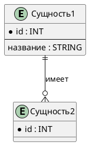

# ДЕТАЛЬНАЯ ИНСТРУКЦИЯ ДЛЯ ГЕНЕРАЦИИ PLANTUML ER ДИАГРАММ

## КРИТИЧЕСКИ ВАЖНЫЕ ПРАВИЛА

### 1. ОБЯЗАТЕЛЬНЫЙ СИНТАКСИС

**ВСЕГДА начинай код с `@startuml` и заканчивай `@enduml`!**



**НЕПРАВИЛЬНО:**
```
entity Сущность1
entity Сущность2
```

**ПРАВИЛЬНО:**
```
@startuml
entity "Сущность1" as E1 {
  * id : INT
}
entity "Сущность2" as E2 {
  * id : INT
}
E1 ||--o{ E2
@enduml
```

### 2. ОТСТУПЫ И ПРОБЕЛЫ - КРИТИЧЕСКИ ВАЖНО!

**КРИТИЧЕСКИ ВАЖНО:** Без правильных отступов и пробелов диаграмма НЕ будет рендериться!

**Правило отступов:**
- Первая строка: `@startuml` (0 пробелов)
- Блок стилей (если есть): без отступов для `skinparam` команд
- Сущности: определение сущности с `entity` начинается с начала строки (0 пробелов)
- Внутри сущности (атрибуты): РОВНО 2 ПРОБЕЛА отступа (ОБЯЗАТЕЛЬНО!)
- Разделитель `--`: РОВНО 2 ПРОБЕЛА отступа (ОБЯЗАТЕЛЬНО!)
- Связи: начинаются с начала строки (0 пробелов)
- Последняя строка: `@enduml` (0 пробелов)

**СТРОГАЯ СХЕМА ОТСТУПОВ:**
```
@startuml                                    ← 0 пробелов
skinparam entity {                           ← 0 пробелов
  BackgroundColor white                      ← 2 пробела
  BorderColor #000000                        ← 2 пробела
}                                            ← 0 пробелов
entity "Сущность1" as E1 {                   ← 0 пробелов
  * id : INT                                 ← 2 пробела (ОБЯЗАТЕЛЬНО!)
  --                                         ← 2 пробела (ОБЯЗАТЕЛЬНО!)
  название : STRING                          ← 2 пробела (ОБЯЗАТЕЛЬНО!)
}                                            ← 0 пробелов
E1 ||--o{ E2 : "имеет"                       ← 0 пробелов
@enduml                                      ← 0 пробелов
```

**НЕПРАВИЛЬНО (вызовет ошибку!):**
```
@startuml
entity "Сущность1" {
* id : INT                                    ← НЕТ ОТСТУПА! ОШИБКА!
--                                            ← НЕТ ОТСТУПА! ОШИБКА!
название : STRING                             ← НЕТ ОТСТУПА! ОШИБКА!
}
@enduml
```

**НЕПРАВИЛЬНО (неправильные отступы):**
```
@startuml
entity "Сущность1" {
    * id : INT                                ← 4 ПРОБЕЛА - НЕПРАВИЛЬНО! Должно быть 2!
    --
    название : STRING
}
@enduml
```

**ПРАВИЛЬНО:**
```
@startuml
entity "Сущность1" {
  * id : INT                                  ← 2 ПРОБЕЛА - ПРАВИЛЬНО!
  --
  название : STRING                           ← 2 ПРОБЕЛА - ПРАВИЛЬНО!
}
@enduml
```

**КРИТИЧЕСКИ ВАЖНО:** Используй ТОЛЬКО ПРОБЕЛЫ для отступов! НИКОГДА НЕ используй ТАБУЛЯЦИЮ (TAB)!

### 3. СУЩНОСТИ (ENTITY)

**Синтаксис сущности:**
- Используй ключевое слово `entity` (НЕ `class`!)
- Название сущности в кавычках: `entity "Название"`
- Можно использовать алиасы: `entity "Название" as Алиас`
- Атрибуты внутри фигурных скобок `{ }`
- Атрибуты с отступом РОВНО 2 ПРОБЕЛА

**ПРАВИЛЬНО:**
```
@startuml
entity "Пользователь" as User {
  * user_id : INT
  --
  имя : STRING
  email : STRING
  дата_регистрации : DATE
}
@enduml
```

**НЕПРАВИЛЬНО:**
```
@startuml
entity Пользователь {                        ← НЕТ КАВЫЧЕК! НЕПРАВИЛЬНО!
* user_id : INT                              ← НЕТ ОТСТУПА! ОШИБКА!
email : STRING                               ← НЕТ ОТСТУПА! ОШИБКА!
}
@enduml
```

### 4. ОБЯЗАТЕЛЬНЫЕ АТРИБУТЫ - МОДИФИКАТОР `*`

**КРИТИЧЕСКИ ВАЖНО:** Для обязательных (идентифицирующих) атрибутов используй модификатор `*`!

**Правило модификатора `*`:**
- Символ `*` указывается ПЕРЕД именем атрибута
- ОБЯЗАТЕЛЬНО должен быть ПРОБЕЛ после `*` и перед именем атрибута!
- `*` указывает, что атрибут является обязательным/идентифицирующим

**ПРАВИЛЬНО:**
```
@startuml
entity "Сущность1" {
  * id : INT                                  ← ПРОБЕЛ после * - ПРАВИЛЬНО!
  * код : STRING                              ← ПРОБЕЛ после * - ПРАВИЛЬНО!
  --
  название : STRING                           ← Без * - необязательный атрибут
}
@enduml
```

**НЕПРАВИЛЬНО:**
```
@startuml
entity "Сущность1" {
  *id : INT                                   ← НЕТ ПРОБЕЛА после *! ОШИБКА!
  *код : STRING                               ← НЕТ ПРОБЕЛА после *! ОШИБКА!
}
@enduml
```

**КРИТИЧЕСКИ ВАЖНО:** Если нужен жирный текст в атрибуте, используй `* *жирный текст*` (две звездочки с пробелом между ними)!

**Пример с жирным текстом:**
```
@startuml
entity "Сущность1" {
  обычный атрибут : STRING
  * *жирный обязательный атрибут* : INT       ← Пробел между * и * для жирного текста
  --
  другой атрибут : STRING
}
@enduml
```

### 5. РАЗДЕЛИТЕЛЬ `--` (ДВОЙНОЙ ДЕФИС)

**Используй двойной дефис `--` для разделения обязательных и необязательных атрибутов:**
- Обязательные атрибуты (с `*`) идут ДО `--`
- Необязательные атрибуты (без `*`) идут ПОСЛЕ `--`
- `--` должен иметь отступ РОВНО 2 ПРОБЕЛА

**ПРАВИЛЬНО:**
```
@startuml
entity "Пользователь" {
  * user_id : INT                             ← Обязательный (до --)
  * email : STRING                            ← Обязательный (до --)
  --                                          ← Разделитель (2 пробела)
  имя : STRING                                ← Необязательный (после --)
  фамилия : STRING                            ← Необязательный (после --)
  дата_рождения : DATE                        ← Необязательный (после --)
}
@enduml
```

**НЕПРАВИЛЬНО:**
```
@startuml
entity "Пользователь" {
  * user_id : INT
--                                            ← НЕТ ОТСТУПА! ОШИБКА!
  имя : STRING
}
@enduml
```

**НЕПРАВИЛЬНО:**
```
@startuml
entity "Пользователь" {
  * user_id : INT
    --                                        ← 4 ПРОБЕЛА! НЕПРАВИЛЬНО! Должно быть 2!
  имя : STRING
}
@enduml
```

### 6. СВЯЗИ МЕЖДУ СУЩНОСТЯМИ - INFORMATION ENGINEERING NOTATION

**КРИТИЧЕСКИ ВАЖНО:** Используй нотацию Information Engineering для связей!

**Типы связей (кардинальность):**

| Тип связи | Символ | Описание |
|-----------|--------|----------|
| Zero or One | `\|o--` | Ноль или один |
| Exactly One | `\|\|--` | Ровно один (один к одному, обязательная) |
| Zero or Many | `}o--` | Ноль или много (многие к одному, необязательная) |
| One or Many | `}\|--` | Один или много (многие к одному, обязательная) |

**Направление связи:**
- Связь читается СЛЕВА НАПРАВО
- `E1 ||--o{ E2` означает: "E1 имеет один или много E2" (один к одному или ко многим)

**ПРАВИЛЬНО:**
```
@startuml
entity "Сущность1" as E1 {
  * id : INT
}
entity "Сущность2" as E2 {
  * id : INT
  e1_id : INT
}

E1 ||--o{ E2 : "имеет"                       ← Один к одному или ко многим
E1 |o--o| E3 : "связано"                     ← Ноль или один к нулю или одному
E1 }o--o{ E4 : "связано"                     ← Ноль или много к нулю или многим
@enduml
```

**Примеры правильных связей:**
```
E1 ||--o{ E2                                 ← Один к одному или ко многим
E1 |o--o| E2                                 ← Ноль или один к нулю или одному
E1 }o--|| E2                                 ← Ноль или много к ровно одному (многие к одному, необязательная)
E1 }|--|| E2                                 ← Один или много к ровно одному (многие к одному, обязательная)
E1 }o--o{ E2                                 ← Ноль или много к нулю или многим (многие ко многим, необязательная)
E1 }|--o{ E2                                 ← Один или много к нулю или многим (многие ко многим, обязательная)
```

**НЕПРАВИЛЬНО:**
```
@startuml
entity "Сущность1" as E1
entity "Сущность2" as E2
E1 -> E2                                      ← НЕПРАВИЛЬНО! Используй нотацию Information Engineering!
E1 -- E2                                      ← НЕПРАВИЛЬНО! Используй нотацию Information Engineering!
@enduml
```

**КРИТИЧЕСКИ ВАЖНО:** Связи начинаются с начала строки (0 пробелов отступа)!

### 7. НАЗВАНИЯ СВЯЗЕЙ (LABELS)

**Можно добавлять названия связей после символов связи:**
- Формат: `E1 ||--o{ E2 : "Название связи"`
- Название в кавычках (двойных или одинарных)
- Названия на русском языке

**ПРАВИЛЬНО:**
```
@startuml
entity "Пользователь" as User {
  * user_id : INT
}
entity "Заказ" as Order {
  * order_id : INT
  user_id : INT
}

User ||--o{ Order : "размещает"              ← Название связи
User }o--o{ Order : "имеет"                  ← Название связи
@enduml
```

### 8. АЛИАСЫ (ALIASES)

**Используй алиасы для упрощения записи связей:**
- Формат: `entity "Длинное название" as Алиас`
- Алиасы используются в связях вместо полных названий
- Алиасы должны быть уникальными

**ПРАВИЛЬНО:**
```
@startuml
entity "Пользователь системы" as User {
  * user_id : INT
}
entity "Заказ на товары" as Order {
  * order_id : INT
  user_id : INT
}

User ||--o{ Order : "размещает"              ← Используем алиас User вместо "Пользователь системы"
@enduml
```

**НЕПРАВИЛЬНО:**
```
@startuml
entity "Пользователь системы" as User {
  * user_id : INT
}
entity "Заказ на товары" as User {            ← ОШИБКА! Алиас User уже используется!
  * order_id : INT
}
@enduml
```

### 9. ЦВЕТА - СТРОГИЕ (БЕЛЫЙ, ЧЕРНЫЙ, СЕРЫЙ)

**КРИТИЧЕСКИ ВАЖНО:** Диаграмма должна быть в строгих цветах!

**Используй ТОЛЬКО следующие цвета:**
- Фон сущностей: **белый** (`white` или `#FFFFFF`)
- Текст: **черный** (`black` или `#000000`)
- Границы: **черный** или **серый** (`#000000`, `#666666`, `#999999`)
- Линии связей: **черный** (`#000000`)
- Акценты: **серые оттенки** (`#F5F5F5`, `#E5E5E5`, `#CCCCCC`, `#B3B3B3`)

**ОБЯЗАТЕЛЬНО добавляй стили для строгих цветов:**

```
@startuml
skinparam linetype ortho
skinparam backgroundColor white
skinparam entity {
  BackgroundColor white
  BorderColor #000000
  FontColor #000000
}
skinparam arrow {
  Color #000000
  Thickness 1
}
skinparam arrowFontColor #000000

entity "Сущность1" as E1 {
  * id : INT
}

entity "Сущность2" as E2 {
  * id : INT
}

E1 ||--o{ E2
@enduml
```

**НЕПРАВИЛЬНО (яркие цвета):**
```
@startuml
skinparam entity {
  BackgroundColor #00FF00                    ← НЕПРАВИЛЬНО! Зеленый цвет
  BorderColor #FFFF00                        ← НЕПРАВИЛЬНО! Желтый цвет
  FontColor #FF00FF                          ← НЕПРАВИЛЬНО! Фиолетовый цвет
}
@enduml
```

**ПРАВИЛЬНО (строгие цвета):**
```
@startuml
skinparam linetype ortho
skinparam backgroundColor white
skinparam entity {
  BackgroundColor white
  BorderColor #000000
  FontColor #000000
}
skinparam arrow {
  Color #000000
  Thickness 1
}
skinparam arrowFontColor #000000

entity "Сущность1" as E1 {
  * id : INT
}
@enduml
```

### 10. LINETYPE ORTHO - ДЛЯ ПРАВИЛЬНЫХ СВЯЗЕЙ

**КРИТИЧЕСКИ ВАЖНО:** Используй `skinparam linetype ortho` для правильного отображения связей!

**Проблема:** Без `linetype ortho` связи могут отображаться под углом, и "вороньи лапки" (crow's feet) могут выглядеть неправильно.

**Решение:** Всегда добавляй `skinparam linetype ortho` в начало диаграммы!

**ПРАВИЛЬНО:**
```
@startuml
skinparam linetype ortho                     ← ОБЯЗАТЕЛЬНО!
skinparam backgroundColor white
skinparam entity {
  BackgroundColor white
  BorderColor #000000
  FontColor #000000
}

entity "Сущность1" as E1 {
  * id : INT
}
@enduml
```

### 11. СТЕРЕОТИПЫ И МЕТКИ

**Можно использовать стереотипы для атрибутов:**
- Формат: `атрибут : тип <<стереотип>>`
- Пример: `* id : INT <<PK>>` (Primary Key)
- Пример: `* id : INT <<FK>>` (Foreign Key)
- Пример: `* id : INT <<generated>>` (автогенерируемый)

**ПРАВИЛЬНО:**
```
@startuml
entity "Сущность1" as E1 {
  * e1_id : INT <<PK>>                       ← Primary Key
  --
  название : STRING
}
entity "Сущность2" as E2 {
  * e2_id : INT <<PK>>
  e1_id : INT <<FK>>                         ← Foreign Key
}
E1 ||--o{ E2
@enduml
```

### 12. ПРОВЕРКА ПЕРЕД ОТПРАВКОЙ

**ОБЯЗАТЕЛЬНО проверь код перед отправкой:**

1. ✅ Код начинается с `@startuml`
2. ✅ Код заканчивается `@enduml`
3. ✅ Все сущности используют ключевое слово `entity` (не `class`!)
4. ✅ Все атрибуты внутри сущностей имеют отступ РОВНО 2 ПРОБЕЛА
5. ✅ Все модификаторы `*` имеют пробел после `*` и перед именем атрибута
6. ✅ Разделитель `--` имеет отступ РОВНО 2 ПРОБЕЛА
7. ✅ Все связи используют нотацию Information Engineering (`||--`, `}o--`, и т.д.)
8. ✅ Все связи начинаются с начала строки (0 пробелов)
9. ✅ Используются строгие цвета (белый, черный, серый)
10. ✅ Добавлен `skinparam linetype ortho`
11. ✅ Все стили для строгих цветов добавлены
12. ✅ Все названия на русском языке
13. ✅ Код можно скопировать и вставить в PlantUML редактор БЕЗ ОШИБОК

### 13. ПРИМЕРЫ ПРАВИЛЬНОГО КОДА

**Пример 1: Простая ER диаграмма со строгими цветами**

```
@startuml
skinparam linetype ortho
skinparam backgroundColor white
skinparam entity {
  BackgroundColor white
  BorderColor #000000
  FontColor #000000
}
skinparam arrow {
  Color #000000
  Thickness 1
}
skinparam arrowFontColor #000000

entity "Пользователь" as User {
  * user_id : INT
  --
  имя : STRING
  email : STRING
  дата_регистрации : DATE
}

entity "Заказ" as Order {
  * order_id : INT
  user_id : INT
  --
  дата_заказа : DATE
  сумма : DECIMAL
}

User ||--o{ Order : "размещает"
@enduml
```

**Пример 2: Сложная ER диаграмма с несколькими связями**

```
@startuml
skinparam linetype ortho
skinparam backgroundColor white
skinparam entity {
  BackgroundColor white
  BorderColor #000000
  FontColor #000000
}
skinparam arrow {
  Color #000000
  Thickness 1
}
skinparam arrowFontColor #000000

entity "Пользователь" as User {
  * user_id : INT
  --
  имя : STRING
  email : STRING
}

entity "Заказ" as Order {
  * order_id : INT
  user_id : INT
  --
  дата_заказа : DATE
  статус : STRING
}

entity "Товар" as Product {
  * product_id : INT
  --
  название : STRING
  цена : DECIMAL
  количество : INT
}

entity "Заказ_Товар" as OrderProduct {
  * order_id : INT
  * product_id : INT
  --
  количество : INT
  цена : DECIMAL
}

User ||--o{ Order : "размещает"
Order }o--o{ OrderProduct : "содержит"
Product }o--o{ OrderProduct : "входит_в"
@enduml
```

**Пример 3: Полный пример из официальной документации**

```
@startuml
skinparam linetype ortho
skinparam backgroundColor white
skinparam entity {
  BackgroundColor white
  BorderColor #000000
  FontColor #000000
}
skinparam arrow {
  Color #000000
  Thickness 1
}
skinparam arrowFontColor #000000

hide circle

entity "Entity01" as e01 {
  * e1_id : number <<generated>>
  --
  * name : text
  description : text
}

entity "Entity02" as e02 {
  * e2_id : number <<generated>>
  e1_id : number <<FK>>
  --
  other_details : text
}

entity "Entity03" as e03 {
  * e3_id : number <<generated>>
  e1_id : number <<FK>>
  --
  other_details : text
}

entity "Entity04" as e04 {
  * e4_id : number <<generated>>
  e1_id : number <<FK>>
  --
  other_details : text
}

e01 ||--o{ e02
e01 |o--o{ e03
e01 |o--o{ e04
@enduml
```

### 14. ЧАСТЫЕ ОШИБКИ И КАК ИХ ИЗБЕЖАТЬ

**Ошибка 1: "Syntax Error" или код не рендерится**
- **Причина:** Неправильный синтаксис, отсутствие `@startuml`/`@enduml`, неправильные отступы, отсутствие пробелов
- **Решение:** Проверь, что код начинается с `@startuml` и заканчивается `@enduml`, проверь отступы (ровно 2 пробела для атрибутов), проверь пробелы после `*`

**Ошибка 2: Атрибуты не отображаются или отображаются неправильно**
- **Причина:** Неправильные отступы (не 2 пробела), отсутствие пробелов после `*`, неправильный синтаксис
- **Решение:** Убедись, что все атрибуты имеют отступ ровно 2 пробела, после `*` есть пробел, разделитель `--` имеет отступ 2 пробела

**Ошибка 3: Связи не отображаются или отображаются неправильно**
- **Причина:** Неправильная нотация связей, отсутствие `skinparam linetype ortho`, неправильные символы
- **Решение:** Используй нотацию Information Engineering (`||--`, `}o--`, и т.д.), добавь `skinparam linetype ortho`, проверь, что связи начинаются с начала строки (0 пробелов)

**Ошибка 4: Яркие цвета на диаграмме**
- **Причина:** Не добавлены стили для строгих цветов
- **Решение:** ОБЯЗАТЕЛЬНО добавляй блок `skinparam` с настройками цветов (белый, черный, серый)

**Ошибка 5: "Вороньи лапки" отображаются под углом**
- **Причина:** Отсутствует `skinparam linetype ortho`
- **Решение:** Всегда добавляй `skinparam linetype ortho` в начало диаграммы

**Ошибка 6: Атрибуты с модификатором `*` не отображаются как обязательные**
- **Причина:** Отсутствует пробел после `*`
- **Решение:** Всегда добавляй пробел после `*`: `* id : INT` (НЕ `*id : INT`!)

### 15. ФОРМАТИРОВАНИЕ КОДА

**Всегда форматируй код так:**
- Первая строка: `@startuml`
- Блок стилей (если нужен): `skinparam` команды
- Сущности: определение с `entity` на новой строке, атрибуты с отступом 2 пробела
- Связи: на новых строках, с начала строки (0 пробелов)
- Последняя строка: `@enduml`
- Каждая строка заканчивается переводом строки
- Используй ТОЛЬКО ПРОБЕЛЫ для отступов (не табуляцию!)

**ПРАВИЛЬНО:**
```
@startuml
skinparam linetype ortho
skinparam backgroundColor white
skinparam entity {
  BackgroundColor white
  BorderColor #000000
  FontColor #000000
}
skinparam arrow {
  Color #000000
  Thickness 1
}

entity "Сущность1" as E1 {
  * id : INT
  --
  название : STRING
}

entity "Сущность2" as E2 {
  * id : INT
}

E1 ||--o{ E2 : "имеет"
@enduml
```

### 16. РУССКИЙ ЯЗЫК

**Все названия сущностей, атрибутов и связей должны быть на русском языке!**

- Используй русские названия для всех элементов
- Синтаксис PlantUML остается на английском (`entity`, `skinparam`, `@startuml`, `@enduml`)
- Содержимое (названия сущностей, атрибутов, связей) - на русском

**ПРАВИЛЬНО:**
```
@startuml
entity "Пользователь" as User {
  * user_id : INT
  --
  имя : STRING
  email : STRING
}
@enduml
```

**НЕПРАВИЛЬНО:**
```
@startuml
entity "User" as User {                      ← Английское название
  * user_id : INT
  --
  name : STRING                              ← Английское название
  email : STRING
}
@enduml
```

### 17. ФИНАЛЬНАЯ ПРОВЕРКА

**Перед отправкой кода ответь на вопросы:**

1. ✅ Код начинается с `@startuml`?
2. ✅ Код заканчивается `@enduml`?
3. ✅ Все сущности используют `entity` (не `class`)?
4. ✅ Все атрибуты имеют отступ РОВНО 2 ПРОБЕЛА?
5. ✅ Все модификаторы `*` имеют пробел после `*`?
6. ✅ Разделитель `--` имеет отступ РОВНО 2 ПРОБЕЛА?
7. ✅ Все связи используют нотацию Information Engineering?
8. ✅ Все связи начинаются с начала строки (0 пробелов)?
9. ✅ Добавлен `skinparam linetype ortho`?
10. ✅ Добавлены стили для строгих цветов (белый, черный, серый)?
11. ✅ Все названия на русском языке?
12. ✅ Код можно скопировать и вставить в PlantUML редактор БЕЗ ОШИБОК?

**Если на все вопросы ответ "ДА" - код готов к отправке!**

---

## РЕЗЮМЕ: ЧТО ДЕЛАТЬ ВСЕГДА

1. ✅ Начинай с `@startuml` и заканчивай `@enduml`
2. ✅ Используй ключевое слово `entity` (не `class`!)
3. ✅ Все атрибуты внутри сущностей имеют отступ РОВНО 2 ПРОБЕЛА
4. ✅ Все модификаторы `*` имеют пробел после `*` и перед именем атрибута
5. ✅ Разделитель `--` имеет отступ РОВНО 2 ПРОБЕЛА
6. ✅ Используй нотацию Information Engineering для связей (`||--`, `}o--`, и т.д.)
7. ✅ Все связи начинаются с начала строки (0 пробелов)
8. ✅ ОБЯЗАТЕЛЬНО добавляй `skinparam linetype ortho`
9. ✅ ОБЯЗАТЕЛЬНО добавляй стили для строгих цветов (белый, черный, серый)
10. ✅ Используй русские названия
11. ✅ Проверяй код перед отправкой

## РЕЗЮМЕ: ЧТО НИКОГДА НЕ ДЕЛАТЬ

1. ❌ НЕ начинай код без `@startuml`
2. ❌ НЕ заканчивай код без `@enduml`
3. ❌ НЕ используй `class` вместо `entity`
4. ❌ НЕ используй неправильные отступы (не 2 пробела для атрибутов)
5. ❌ НЕ забывай пробел после `*` в модификаторе обязательных атрибутов
6. ❌ НЕ используй неправильную нотацию связей (не `->` или `--`)
7. ❌ НЕ используй яркие цвета (зеленый, желтый, фиолетовый) - ТОЛЬКО белый, черный, серый!
8. ❌ НЕ забывай добавлять `skinparam linetype ortho`
9. ❌ НЕ забывай добавлять стили для строгих цветов
10. ❌ НЕ используй английские названия для сущностей, атрибутов и связей
11. ❌ НЕ отправляй код без проверки

---

## ДОПОЛНИТЕЛЬНАЯ ИНФОРМАЦИЯ

### Официальная документация PlantUML ER диаграмм:
https://plantuml.com/ru/ie-diagram

### Основные синтаксические конструкции:

1. **Сущности:**
```
entity "Название" as Алиас {
  * обязательный_атрибут : тип
  --
  необязательный_атрибут : тип
}
```

2. **Связи (Information Engineering Notation):**
```
E1 ||--o{ E2 : "название связи"              ← Один к одному или ко многим
E1 |o--o| E2 : "название связи"              ← Ноль или один к нулю или одному
E1 }o--|| E2 : "название связи"              ← Ноль или много к ровно одному
E1 }|--|| E2 : "название связи"              ← Один или много к ровно одному
E1 }o--o{ E2 : "название связи"              ← Ноль или много к нулю или многим
```

3. **Стили для строгих цветов:**
```
skinparam linetype ortho
skinparam backgroundColor white
skinparam entity {
  BackgroundColor white
  BorderColor #000000
  FontColor #000000
}
skinparam arrow {
  Color #000000
  Thickness 1
}
skinparam arrowFontColor #000000
```

### Рекомендации по цветам:

**Для строгих диаграмм используй:**
- `BackgroundColor white` - белый фон
- `FontColor #000000` или `black` - черный текст
- `BorderColor #000000` или `#666666` - черные или серые границы
- `Color #000000` для стрелок - черные линии связей

**НЕ используй:**
- `#00FF00` (зеленый)
- `#FFFF00` (желтый)
- `#FF00FF` (фиолетовый)
- `#0000FF` (синий)
- Любые другие яркие цвета

---

## ПОЛНЫЙ ШАБЛОН ДЛЯ КОПИРОВАНИЯ

```
@startuml
skinparam linetype ortho
skinparam backgroundColor white
skinparam entity {
  BackgroundColor white
  BorderColor #000000
  FontColor #000000
}
skinparam arrow {
  Color #000000
  Thickness 1
}
skinparam arrowFontColor #000000

entity "Сущность1" as E1 {
  * e1_id : INT
  --
  название : STRING
  описание : TEXT
}

entity "Сущность2" as E2 {
  * e2_id : INT
  e1_id : INT
  --
  название : STRING
}

E1 ||--o{ E2 : "имеет"
@enduml
```

**Замени `Сущность1`, `Сущность2`, названия атрибутов и связей на реальные названия на русском языке!**

