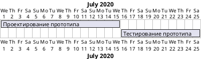

# ДЕТАЛЬНАЯ ИНСТРУКЦИЯ ДЛЯ ГЕНЕРАЦИИ PLANTUML GANTT ДИАГРАММ

## КРИТИЧЕСКИ ВАЖНЫЕ ПРАВИЛА

### 1. ОБЯЗАТЕЛЬНЫЙ СИНТАКСИС

**ВСЕГДА начинай код с `@startgantt` и заканчивай `@endgantt`!**



**НЕПРАВИЛЬНО:**
```
gantt
[Задача 1] requires 5 days
```

**ПРАВИЛЬНО:**
```
@startgantt
[Задача 1] requires 5 days
Project starts 2024-01-01
[Задача 1] starts 2024-01-01
@endgantt
```

### 2. ОТСТУПЫ И ПРОБЕЛЫ - КРИТИЧЕСКИ ВАЖНО!

**Используй ПРОБЕЛЫ для отступов, НИКОГДА не используй табуляцию (TAB)!**

**Правило отступов:**
- Первая строка: `@startgantt` (0 пробелов)
- Все последующие строки: **ОБЯЗАТЕЛЬНО использовать отступы для читаемости**
- Рекомендуется использовать **2 ПРОБЕЛА** для базового отступа
- Все элементы одного уровня должны иметь **одинаковый отступ**

**ПРАВИЛЬНО (с отступами для читаемости):**
```
@startgantt
  [Проектирование прототипа] requires 15 days
  [Тестирование прототипа] requires 10 days
  Project starts 2020-07-01
  [Проектирование прототипа] starts 2020-07-01
  [Тестирование прототипа] starts 2020-07-16
@endgantt
```

**ПРАВИЛЬНО (без отступов, но с правильным синтаксисом):**
```
@startgantt
[Проектирование прототипа] requires 15 days
[Тестирование прототипа] requires 10 days
Project starts 2020-07-01
[Проектирование прототипа] starts 2020-07-01
[Тестирование прототипа] starts 2020-07-16
@endgantt
```

**КРИТИЧЕСКИ ВАЖНО:** 
- Отступы помогают читаемости кода, но НЕ являются обязательными для синтаксиса Gantt диаграмм
- Главное - правильный синтаксис: `@startgantt` ... `@endgantt`, правильные глаголы (requires, starts, ends, etc.)
- НЕ используй табуляцию (TAB) - только ПРОБЕЛЫ!

### 3. ОБЪЯВЛЕНИЕ ЗАДАЧ

**Задачи определяются с помощью квадратных скобок `[Название задачи]`.**

**Основные глаголы для задач:**
- `requires` - определяет объем работы (продолжительность)
- `starts` - определяет дату начала
- `ends` - определяет дату окончания

**ПРАВИЛЬНО:**
```
@startgantt
[Проектирование прототипа] requires 15 days
[Тестирование прототипа] requires 10 days
@endgantt
```

**НЕПРАВИЛЬНО:**
```
@startgantt
Проектирование прототипа requires 15 days  ← НЕПРАВИЛЬНО! Нет квадратных скобок
[Проектирование прототипа] - 15 days  ← НЕПРАВИЛЬНО! Неправильный глагол
@endgantt
```

### 4. ОБЪЕМ РАБОТЫ (ПРОДОЛЖИТЕЛЬНОСТЬ)

**Объем работы для каждой задачи задается с помощью глагола `requires`.**

**Форматы продолжительности:**
- `requires 1 day` - один день
- `requires 5 days` - пять дней
- `requires 1 week` - одна неделя (7 дней)
- `requires 2 weeks` - две недели
- `requires 1 week and 4 days` - одна неделя и четыре дня

**ПРАВИЛЬНО:**
```
@startgantt
[Задача 1 (1 день)] requires 1 day
[Задача 2 (5 дней)] requires 5 days
[Задача 3 (1 неделя)] requires 1 week
[Задача 4 (1 неделя и 4 дня)] requires 1 week and 4 days
[Задача 5 (2 недели)] requires 2 weeks
@endgantt
```

**ВАЖНО:** 
- Под неделей обычно понимается промежуток времени, состоящий из семи дней
- Если некоторые дни считаются "закрытыми" (например, выходные), неделя может быть переформулирована в терминах "незакрытых" дней

### 5. НАЧАЛО ЗАДАЧ

**Дата начала определяется с помощью глагола `starts`.**

**Форматы даты:**
- `starts 2020-07-01` - конкретная дата (формат YYYY-MM-DD)
- `starts D+0` - относительно начала проекта (D+0 = день начала проекта)
- `starts D+15` - через 15 дней после начала проекта

**ПРАВИЛЬНО (с конкретными датами):**
```
@startgantt
[Проектирование прототипа] requires 15 days
[Тестирование прототипа] requires 10 days
Project starts 2020-07-01
[Проектирование прототипа] starts 2020-07-01
[Тестирование прототипа] starts 2020-07-16
@endgantt
```

**ПРАВИЛЬНО (относительные даты):**
```
@startgantt
[Проектирование прототипа] requires 15 days
[Тестирование прототипа] requires 10 days
[Проектирование прототипа] starts D+0
[Тестирование прототипа] starts D+15
@endgantt
```

**НЕПРАВИЛЬНО:**
```
@startgantt
[Проектирование прототипа] requires 15 days
[Проектирование прототипа] starts 01.07.2020  ← НЕПРАВИЛЬНО! Формат даты должен быть YYYY-MM-DD
@endgantt
```

### 6. ОКОНЧАНИЕ ЗАДАЧ

**Дата окончания определяется с помощью глагола `ends`.**

**Форматы даты:**
- `ends 2020-07-15` - конкретная дата (формат YYYY-MM-DD)
- `ends D+14` - через 14 дней после начала проекта

**ПРАВИЛЬНО:**
```
@startgantt
[Проектирование прототипа] requires 15 days
[Тестирование прототипа] requires 10 days
Project starts 2020-07-01
[Проектирование прототипа] ends 2020-07-15
[Тестирование прототипа] ends 2020-07-25
@endgantt
```

**ПРАВИЛЬНО (относительные даты):**
```
@startgantt
[Проектирование прототипа] requires 15 days
[Тестирование прототипа] requires 10 days
[Проектирование прототипа] ends D+14
[Тестирование прототипа] ends D+24
@endgantt
```

### 7. ПРОЕКТ

**Начало проекта определяется с помощью `Project starts дата`.**

**ПРАВИЛЬНО:**
```
@startgantt
Project starts 2020-07-01
[Проектирование прототипа] requires 15 days
[Проектирование прототипа] starts 2020-07-01
@endgantt
```

**ВАЖНО:** 
- `Project starts` должен быть указан ДО определения задач, если используются конкретные даты
- Если используются относительные даты (D+0, D+15 и т.д.), `Project starts` не обязателен

### 8. ЗАВИСИМОСТИ МЕЖДУ ЗАДАЧАМИ

**Зависимости между задачами задаются с помощью стрелки `->`.**

**Формат:**
```
[Задача 1] -> [Задача 2]
```

**ПРАВИЛЬНО:**
```
@startgantt
[Проектирование прототипа] requires 15 days
[Тестирование прототипа] requires 10 days
Project starts 2020-07-01
[Проектирование прототипа] starts 2020-07-01
[Тестирование прототипа] starts 2020-07-16
[Проектирование прототипа] -> [Тестирование прототипа]
@endgantt
```

**НЕПРАВИЛЬНО:**
```
@startgantt
[Проектирование прототипа] requires 15 days
[Тестирование прототипа] requires 10 days
Проектирование прототипа -> Тестирование прототипа  ← НЕПРАВИЛЬНО! Нет квадратных скобок
@endgantt
```

### 9. ПОСЛЕДОВАТЕЛЬНОСТЬ ЗАДАЧ С КЛЮЧЕВЫМ СЛОВОМ `then`

**Для последовательных задач можно использовать ключевое слово `then`.**

**Формат:**
```
[Задача 1] requires X days
then [Задача 2] requires Y days
```

**ПРАВИЛЬНО:**
```
@startgantt
[Задача 1] requires 1 day
then [Задача 2] requires 2 days
then [Задача 3] requires 2 days
@endgantt
```

**ВАЖНО:** 
- `then` используется для создания последовательности задач
- Задача с `then` автоматически начинается после завершения предыдущей задачи

### 10. ЦВЕТА - СТРОГИЕ (БЕЛЫЙ, ЧЕРНЫЙ, СЕРЫЙ)

**КРИТИЧЕСКИ ВАЖНО:** Диаграмма должна быть в строгих цветах!

**Используй ТОЛЬКО следующие цвета:**
- Фон задач: **белый** (`white` или `#FFFFFF`)
- Текст: **черный** (`black` или `#000000`)
- Границы: **черный** или **серый** (`#000000`, `#666666`, `#999999`)
- Акценты: **серые оттенки** (`#F5F5F5`, `#E5E5E5`, `#CCCCCC`, `#B3B3B3`)

**Синтаксис для цветов в PlantUML Gantt:**

Для задания цветов используй `skinparam`:

```
skinparam backgroundColor white
skinparam task {
  BackgroundColor white
  FontColor black
  BorderColor #000000
}
```

**ПРАВИЛЬНО (строгие цвета):**
```
@startgantt
skinparam backgroundColor white
skinparam task {
  BackgroundColor white
  FontColor black
  BorderColor #000000
}
skinparam arrow {
  Color #000000
}
skinparam timeline {
  BackgroundColor white
  FontColor black
  LineColor #666666
}
Project starts 2020-07-01
[Проектирование прототипа] requires 15 days
[Тестирование прототипа] requires 10 days
[Проектирование прототипа] starts 2020-07-01
[Тестирование прототипа] starts 2020-07-16
@endgantt
```

**НЕПРАВИЛЬНО (яркие цвета):**
```
@startgantt
[Проектирование прототипа] #00FF00  ← НЕПРАВИЛЬНО! Зеленый цвет
[Тестирование прототипа] #FFFF00  ← НЕПРАВИЛЬНО! Желтый цвет
@endgantt
```

**ОБЯЗАТЕЛЬНО добавляй стили для строгих цветов:**

```
@startgantt
skinparam backgroundColor white
skinparam task {
  BackgroundColor white
  FontColor black
  BorderColor #000000
}
skinparam taskArrow {
  Color #000000
}
skinparam timeline {
  BackgroundColor white
  FontColor black
  LineColor #666666
  GridColor #E5E5E5
}
skinparam milestone {
  BackgroundColor white
  FontColor black
  BorderColor #000000
}
skinparam arrow {
  Color #000000
}
skinparam title {
  BackgroundColor white
  FontColor black
}
Project starts 2020-07-01
[Проектирование прототипа] requires 15 days
[Тестирование прототипа] requires 10 days
[Проектирование прототипа] starts 2020-07-01
[Тестирование прототипа] starts 2020-07-16
@endgantt
```

### 11. ВЕХИ (MILESTONES)

**Вехи определяются с помощью ключевого слова `happens`.**

**Формат:**
```
[Название вехи] happens на дату или относительно задачи
```

**ПРАВИЛЬНО:**
```
@startgantt
Project starts 2020-07-01
[Проектирование прототипа] requires 15 days
[Проектирование прототипа] starts 2020-07-01
[Завершение проектирования] happens 2020-07-15
@endgantt
```

**ПРАВИЛЬНО (относительно задачи):**
```
@startgantt
Project starts 2020-07-01
[Проектирование прототипа] requires 15 days
[Проектирование прототипа] starts 2020-07-01
[Завершение проектирования] happens 1 day after [Проектирование прототипа]'s end
@endgantt
```

### 12. СТАТУС ЗАВЕРШЕНИЯ

**Для указания статуса завершения задачи используй ключевое слово `is` с параметрами:**
- `is done` - задача выполнена
- `is open` - задача открыта (не выполнена)

**ПРАВИЛЬНО:**
```
@startgantt
Project starts 2020-07-01
[Проектирование прототипа] requires 15 days
[Проектирование прототипа] starts 2020-07-01
[Проектирование прототипа] is done
[Тестирование прототипа] requires 10 days
[Тестирование прототипа] starts 2020-07-16
[Тестирование прототипа] is open
@endgantt
```

**ВАЖНО:** 
- Статус `is done` обычно отображается зачеркнутой задачей
- Статус `is open` обычно отображается как активная задача

### 13. НАЗВАНИЯ ЗАДАЧ

**Правила для названий задач:**

1. **НЕ используй специальные символы**, которые могут сломать синтаксис:
   - Кавычки внутри названий (кроме случаев, когда они нужны)
   - Символы `:`, `;` в начале строки (используются PlantUML для других целей)

2. **Можно использовать:**
   - Буквы (русские и английские)
   - Цифры
   - Пробелы
   - Дефисы и подчеркивания: `-`, `_`
   - Запятые и точки в тексте

3. **Длинные названия:**
   - Можно использовать длинные названия на русском языке
   - Пример: `[Производственный контроль за соблюдением требований промышленной безопасности]`

**ПРАВИЛЬНО:**
```
@startgantt
[Проектирование прототипа] requires 15 days
[Тестирование прототипа] requires 10 days
[Разработка документации] requires 5 days
@endgantt
```

**НЕПРАВИЛЬНО:**
```
@startgantt
["Проектирование прототипа"] requires 15 days  ← НЕПРАВИЛЬНО! Кавычки не нужны
[Проектирование: прототипа] requires 15 days  ← НЕПРАВИЛЬНО! Двоеточие может сломать синтаксис
@endgantt
```

### 14. КАЛЕНДАРЬ И РАБОЧИЕ ДНИ

**Для определения нерабочих дней используй `saturday are closed` и `sunday are closed`.**

**ПРАВИЛЬНО:**
```
@startgantt
Project starts 2020-07-01
saturday are closed
sunday are closed
[Проектирование прототипа] requires 15 days
[Проектирование прототипа] starts 2020-07-01
@endgantt
```

**ВАЖНО:** 
- По умолчанию все дни считаются рабочими
- Можно указать конкретные дни недели как нерабочие
- Можно указать конкретные даты как нерабочие: `2020-07-04 is closed`

### 15. ПРОВЕРКА ПЕРЕД ОТПРАВКОЙ

**ОБЯЗАТЕЛЬНО проверь код перед отправкой:**

1.  Код начинается с `@startgantt`
2.  Код заканчивается `@endgantt`
3.  Все задачи объявлены с квадратными скобками `[Название задачи]`
4.  Все задачи имеют глагол `requires` для продолжительности
5.  Все даты в формате YYYY-MM-DD (если используются конкретные даты)
6.  Используются строгие цвета (белый, черный, серый)
7.  Нет специальных символов в названиях задач, которые могут сломать синтаксис
8.  Все названия на русском языке
9.  Стили для строгих цветов добавлены

### 16. ПРИМЕРЫ ПРАВИЛЬНОГО КОДА

**Пример 1: Простая Gantt диаграмма со строгими цветами**
```
@startgantt
skinparam backgroundColor white
skinparam task {
  BackgroundColor white
  FontColor black
  BorderColor #000000
}
skinparam arrow {
  Color #000000
}
skinparam timeline {
  BackgroundColor white
  FontColor black
  LineColor #666666
  GridColor #E5E5E5
}
Project starts 2020-07-01
[Проектирование прототипа] requires 15 days
[Тестирование прототипа] requires 10 days
[Проектирование прототипа] starts 2020-07-01
[Тестирование прототипа] starts 2020-07-16
@endgantt
```

**Пример 2: Gantt диаграмма с зависимостями**
```
@startgantt
skinparam backgroundColor white
skinparam task {
  BackgroundColor white
  FontColor black
  BorderColor #000000
}
skinparam taskArrow {
  Color #000000
}
skinparam timeline {
  BackgroundColor white
  FontColor black
  LineColor #666666
  GridColor #E5E5E5
}
Project starts 2020-07-01
[Проектирование прототипа] requires 15 days
[Тестирование прототипа] requires 10 days
[Разработка документации] requires 5 days
[Проектирование прототипа] starts 2020-07-01
[Тестирование прототипа] starts 2020-07-16
[Разработка документации] starts 2020-07-16
[Проектирование прототипа] -> [Тестирование прототипа]
[Проектирование прототипа] -> [Разработка документации]
@endgantt
```

**Пример 3: Gantt диаграмма с вехами**
```
@startgantt
skinparam backgroundColor white
skinparam task {
  BackgroundColor white
  FontColor black
  BorderColor #000000
}
skinparam milestone {
  BackgroundColor white
  FontColor black
  BorderColor #000000
}
skinparam timeline {
  BackgroundColor white
  FontColor black
  LineColor #666666
  GridColor #E5E5E5
}
Project starts 2020-07-01
[Проектирование прототипа] requires 15 days
[Тестирование прототипа] requires 10 days
[Проектирование прототипа] starts 2020-07-01
[Тестирование прототипа] starts 2020-07-16
[Завершение проектирования] happens 2020-07-15
[Завершение тестирования] happens 2020-07-25
@endgantt
```

**Пример 4: Gantt диаграмма с последовательными задачами (then)**
```
@startgantt
skinparam backgroundColor white
skinparam task {
  BackgroundColor white
  FontColor black
  BorderColor #000000
}
skinparam timeline {
  BackgroundColor white
  FontColor black
  LineColor #666666
  GridColor #E5E5E5
}
Project starts 2020-07-01
[Задача 1] requires 1 day
then [Задача 2] requires 2 days
then [Задача 3] requires 2 days
then [Задача 4] requires 1 day
then [Задача 5] requires 2 days
@endgantt
```

**Пример 5: Gantt диаграмма с нерабочими днями**
```
@startgantt
skinparam backgroundColor white
skinparam task {
  BackgroundColor white
  FontColor black
  BorderColor #000000
}
skinparam timeline {
  BackgroundColor white
  FontColor black
  LineColor #666666
  GridColor #E5E5E5
}
Project starts 2020-07-01
saturday are closed
sunday are closed
[Проектирование прототипа] requires 15 days
[Тестирование прототипа] requires 10 days
[Проектирование прототипа] starts 2020-07-01
[Тестирование прототипа] starts 2020-07-16
@endgantt
```

### 17. ЧАСТЫЕ ОШИБКИ И КАК ИХ ИЗБЕЖАТЬ

**Ошибка 1: "Syntax Error" или код не рендерится**
- **Причина:** Неправильный синтаксис, отсутствие `@startgantt`/`@endgantt`, неправильные глаголы
- **Решение:** Проверь, что код начинается с `@startgantt` и заканчивается `@endgantt`, проверь правильность глаголов (requires, starts, ends)

**Ошибка 2: "Unknown keyword" или неправильный формат даты**
- **Причина:** Неправильный формат даты (не YYYY-MM-DD), неправильные глаголы
- **Решение:** Убедись, что все даты в формате YYYY-MM-DD, используй правильные глаголы (requires, starts, ends)

**Ошибка 3: Задачи не отображаются**
- **Причина:** Не указана продолжительность (`requires`), не указана дата начала (`starts`)
- **Решение:** Убедись, что каждая задача имеет `requires` для продолжительности и `starts` для даты начала (или используй `then`)

**Ошибка 4: Яркие цвета на диаграмме**
- **Причина:** Не добавлены стили для строгих цветов
- **Решение:** ОБЯЗАТЕЛЬНО добавляй блок `skinparam` с настройками цветов (белый, черный, серый)

**Ошибка 5: Специальные символы в названиях**
- **Причина:** Кавычки, двоеточия или другие символы в названиях задач
- **Решение:** Используй только буквы, цифры, пробелы, дефисы и подчеркивания

### 18. ФОРМАТИРОВАНИЕ КОДА

**Всегда форматируй код так:**
- Первая строка: `@startgantt`
- Блок стилей (если нужен): `skinparam` блоки
- Определение начала проекта: `Project starts дата` (если используются конкретные даты)
- Объявление задач: `[Название задачи] requires X days`
- Даты начала: `[Название задачи] starts дата`
- Зависимости: `[Задача 1] -> [Задача 2]`
- Последняя строка: `@endgantt`
- Каждая строка заканчивается переводом строки
- Можно использовать отступы (пробелы) для читаемости, но это не обязательно

**ПРАВИЛЬНО:**
```
@startgantt
skinparam backgroundColor white
skinparam task {
  BackgroundColor white
  FontColor black
  BorderColor #000000
}
Project starts 2020-07-01
[Проектирование прототипа] requires 15 days
[Тестирование прототипа] requires 10 days
[Проектирование прототипа] starts 2020-07-01
[Тестирование прототипа] starts 2020-07-16
@endgantt
```

### 19. РУССКИЙ ЯЗЫК

**Все названия задач должны быть на русском языке!**

- Используй русские названия для всех элементов
- Синтаксис PlantUML остается на английском (`@startgantt`, `@endgantt`, `requires`, `starts`, `ends`, `skinparam`)
- Содержимое (названия задач) - на русском

**ПРАВИЛЬНО:**
```
@startgantt
[Проектирование прототипа] requires 15 days
[Тестирование прототипа] requires 10 days
@endgantt
```

**НЕПРАВИЛЬНО:**
```
@startgantt
[Prototype design] requires 15 days
[Test prototype] requires 10 days
@endgantt
```

### 20. ФИНАЛЬНАЯ ПРОВЕРКА

**Перед отправкой кода ответь на вопросы:**

1.  Код начинается с `@startgantt`?
2.  Код заканчивается `@endgantt`?
3.  Все задачи объявлены с квадратными скобками `[Название задачи]`?
4.  Все задачи имеют `requires` для продолжительности?
5.  Все задачи имеют `starts` для даты начала (или используется `then`)?
6.  Все даты в формате YYYY-MM-DD (если используются конкретные даты)?
7.  Добавлены стили для строгих цветов (белый, черный, серый)?
8.  Нет специальных символов в названиях задач?
9.  Все названия на русском языке?
10.  Код можно скопировать и вставить в PlantUML редактор БЕЗ ОШИБОК?

**Если на все вопросы ответ "ДА" - код готов к отправке!**

---

## РЕЗЮМЕ: ЧТО ДЕЛАТЬ ВСЕГДА

1.  Начинай с `@startgantt` и заканчивай `@endgantt`
2.  Используй квадратные скобки `[Название задачи]` для всех задач
3.  Используй глагол `requires` для продолжительности
4.  Используй глагол `starts` для даты начала
5.  Используй формат даты YYYY-MM-DD (если используются конкретные даты)
6.  ОБЯЗАТЕЛЬНО добавляй стили для строгих цветов (белый, черный, серый) через `skinparam`
7.  Используй русские названия
8.  Избегай специальных символов в названиях задач
9.  Проверяй код перед отправкой

## РЕЗЮМЕ: ЧТО НИКОГДА НЕ ДЕЛАТЬ

1.  НЕ начинай код без `@startgantt`
2.  НЕ заканчивай код без `@endgantt`
3.  НЕ используй задачи без квадратных скобок `[Название задачи]`
4.  НЕ забывай указывать `requires` для продолжительности
5.  НЕ используй неправильный формат даты (только YYYY-MM-DD)
6.  НЕ используй яркие цвета (зеленый, желтый, фиолетовый) - ТОЛЬКО белый, черный, серый!
7.  НЕ забывай добавлять стили для строгих цветов через `skinparam`
8.  НЕ используй кавычки или специальные символы в названиях задач (кроме случаев, когда они нужны)
9.  НЕ используй английские названия для задач
10.  НЕ отправляй код без проверки

---

## ДОПОЛНИТЕЛЬНАЯ ИНФОРМАЦИЯ

### Официальная документация PlantUML Gantt:
https://plantuml.com/ru/gantt-diagram

### Основные синтаксические конструкции:

1. **Базовый синтаксис:**
```
@startgantt
[Задача] requires X days
Project starts YYYY-MM-DD
[Задача] starts YYYY-MM-DD
@endgantt
```

2. **Зависимости:**
```
[Задача 1] -> [Задача 2]
```

3. **Последовательность:**
```
[Задача 1] requires X days
then [Задача 2] requires Y days
```

4. **Вехи:**
```
[Веха] happens YYYY-MM-DD
```

### Рекомендации по цветам:

**Для строгих диаграмм используй:**
- `skinparam backgroundColor white` - белый фон
- `skinparam task { BackgroundColor white; FontColor black; BorderColor #000000 }` - белые задачи, черный текст и границы
- `skinparam timeline { BackgroundColor white; FontColor black; LineColor #666666 }` - белая временная шкала, черный текст, серые линии
- `skinparam arrow { Color #000000 }` - черные стрелки

**НЕ используй:**
- `#00FF00` (зеленый)
- `#FFFF00` (желтый)
- `#FF00FF` (фиолетовый)
- `#0000FF` (синий)
- Любые другие яркие цвета

---

## ПОЛНЫЙ ШАБЛОН ДЛЯ КОПИРОВАНИЯ

```
@startgantt
skinparam backgroundColor white
skinparam task {
  BackgroundColor white
  FontColor black
  BorderColor #000000
}
skinparam taskArrow {
  Color #000000
}
skinparam timeline {
  BackgroundColor white
  FontColor black
  LineColor #666666
  GridColor #E5E5E5
}
skinparam milestone {
  BackgroundColor white
  FontColor black
  BorderColor #000000
}
skinparam arrow {
  Color #000000
}
skinparam title {
  BackgroundColor white
  FontColor black
}
Project starts YYYY-MM-DD
[НАЗВАНИЕ_ЗАДАЧИ_1] requires X days
[НАЗВАНИЕ_ЗАДАЧИ_2] requires Y days
[НАЗВАНИЕ_ЗАДАЧИ_1] starts YYYY-MM-DD
[НАЗВАНИЕ_ЗАДАЧИ_2] starts YYYY-MM-DD
[НАЗВАНИЕ_ЗАДАЧИ_1] -> [НАЗВАНИЕ_ЗАДАЧИ_2]
@endgantt
```

**Замени `НАЗВАНИЕ_ЗАДАЧИ_1`, `НАЗВАНИЕ_ЗАДАЧИ_2`, `X`, `Y`, `YYYY-MM-DD` на реальные значения на русском языке!**

