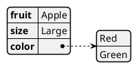

# ДЕТАЛЬНАЯ ИНСТРУКЦИЯ ДЛЯ ГЕНЕРАЦИИ PLANTUML JSON ДИАГРАММ

## КРИТИЧЕСКИ ВАЖНЫЕ ПРАВИЛА

### 1. ОБЯЗАТЕЛЬНЫЙ СИНТАКСИС

**ВСЕГДА начинай код с `@startjson` и заканчивай `@endjson`!**



**НЕПРАВИЛЬНО:**
```
json
{
  "fruit": "Apple"
}
```

**ПРАВИЛЬНО:**
```
@startjson
{
  "fruit": "Apple"
}
@endjson
```

### 2. ОТСТУПЫ И ПРОБЕЛЫ - КРИТИЧЕСКИ ВАЖНО!

**КРИТИЧЕСКИ ВАЖНО:** JSON диаграммы требуют правильных отступов для корректного рендеринга!

**Правила отступов:**
- Используй ТАБУЛЯЦИЮ или ПРОБЕЛЫ для отступов внутри JSON объектов и массивов
- Каждый уровень вложенности должен иметь отступ +2 ПРОБЕЛА (или 1 TAB)
- Отступы помогают PlantUML правильно распарсить структуру JSON

**ПРАВИЛЬНО (с отступами):**
```
@startjson
{
  "firstName": "John",
  "lastName": "Smith",
  "address": {
    "streetAddress": "21 2nd Street",
    "city": "New York"
  }
}
@endjson
```

**НЕПРАВИЛЬНО (без отступов):**
```
@startjson
{"firstName":"John","lastName":"Smith","address":{"streetAddress":"21 2nd Street","city":"New York"}}
@endjson
```

**КРИТИЧЕСКИ ВАЖНО:** Без правильных отступов диаграмма может не отрендериться или отрендериться неправильно!

### 3. СТРУКТУРА JSON

**JSON поддерживает следующие типы данных:**
- `null` - null значение
- `true` / `false` - булевы значения
- Числа: `123`, `-1`, `-1.1`, `0.5`
- Строки: `"текст"` (ОБЯЗАТЕЛЬНО в двойных кавычках!)
- Объекты: `{ "ключ": "значение" }`
- Массивы: `[ "элемент1", "элемент2" ]`

**ПРАВИЛЬНО:**
```
@startjson
{
  "null": null,
  "true": true,
  "false": false,
  "number": 123,
  "string": "текст",
  "object": {
    "key": "value"
  },
  "array": [1, 2, 3]
}
@endjson
```

**НЕПРАВИЛЬНО:**
```
@startjson
{
  null: null,  ← НЕПРАВИЛЬНО! Ключи должны быть в кавычках
  'string': 'text',  ← НЕПРАВИЛЬНО! Используй двойные кавычки
  array: [1, 2, 3]  ← НЕПРАВИЛЬНО! Ключ должен быть в кавычках
}
@endjson
```

### 4. КАВЫЧКИ - ОБЯЗАТЕЛЬНО ДВОЙНЫЕ!

**КРИТИЧЕСКИ ВАЖНО:** В JSON используются ТОЛЬКО двойные кавычки (`"`)!

- Ключи объектов: `"ключ"` (ОБЯЗАТЕЛЬНО в кавычках!)
- Строковые значения: `"значение"` (ОБЯЗАТЕЛЬНО в кавычках!)
- НЕ используй одинарные кавычки (`'`)!
- НЕ используй обратные кавычки (`` ` ``)!

**ПРАВИЛЬНО:**
```
@startjson
{
  "name": "Иван",
  "age": 30,
  "city": "Москва"
}
@endjson
```

**НЕПРАВИЛЬНО:**
```
@startjson
{
  'name': 'Иван',  ← НЕПРАВИЛЬНО! Одинарные кавычки
  name: "Иван",  ← НЕПРАВИЛЬНО! Ключ без кавычек
  "name": `Иван`  ← НЕПРАВИЛЬНО! Обратные кавычки
}
@endjson
```

### 5. ЭКРАНИРОВАНИЕ СИМВОЛОВ

**В строках JSON нужно экранировать специальные символы:**
- `\n` - новая строка
- `\r` - возврат каретки
- `\t` - табуляция
- `\"` - двойная кавычка
- `\\` - обратный слэш

**ПРАВИЛЬНО:**
```
@startjson
{
  "text": "Строка 1\nСтрока 2",
  "path": "C:\\Users\\Name",
  "quote": "Он сказал: \"Привет\""
}
@endjson
```

### 6. МАССИВЫ И ОБЪЕКТЫ

**Массивы:**
- Начинаются с `[` и заканчиваются `]`
- Элементы разделяются запятыми
- Могут содержать любые типы данных

**Объекты:**
- Начинаются с `{` и заканчиваются `}`
- Пары ключ-значение разделяются запятыми
- Ключи ОБЯЗАТЕЛЬНО в двойных кавычках

**ПРАВИЛЬНО:**
```
@startjson
{
  "numbers": [1, 2, 3],
  "strings": ["a", "b", "c"],
  "mixed": ["mix", null, true, 1, {"k": "v"}],
  "nested": {
    "array": [1, 2, 3],
    "object": {
      "key": "value"
    }
  }
}
@endjson
```

**НЕПРАВИЛЬНО:**
```
@startjson
{
  numbers: [1, 2, 3],  ← НЕПРАВИЛЬНО! Ключ без кавычек
  "array": [1, 2, 3,],  ← НЕПРАВИЛЬНО! Запятая после последнего элемента
  "object": {key: "value"}  ← НЕПРАВИЛЬНО! Ключ объекта без кавычек
}
@endjson
```

### 7. ЦВЕТА - СТРОГИЕ (БЕЛЫЙ, ЧЕРНЫЙ, СЕРЫЙ)

**КРИТИЧЕСКИ ВАЖНО:** Диаграмма должна быть в строгих цветах!

**Используй ТОЛЬКО следующие цвета:**
- Фон узлов: **белый** (`#FFFFFF` или `white`)
- Текст: **черный** (`#000000` или `black`)
- Границы: **черный** или **серый** (`#000000`, `#666666`, `#999999`)
- Акценты: **серые оттенки** (`#F5F5F5`, `#E5E5E5`, `#CCCCCC`, `#B3B3B3`)

**Синтаксис для цветов в PlantUML JSON:**

Для задания цветов используй блок `<style>`:

```
@startjson
<style>
jsonDiagram {
  node {
    BackGroundColor white
    FontColor black
    LineColor #000000
    BorderColor #000000
  }
  arrow {
    BackGroundColor #F5F5F5
    LineColor #000000
    LineThickness 1
  }
  highlight {
    BackGroundColor #E5E5E5
    FontColor black
    FontStyle normal
  }
}
</style>
{
  "fruit": "Apple",
  "size": "Large"
}
@endjson
```

**ПРАВИЛЬНО (строгие цвета):**
```
@startjson
<style>
jsonDiagram {
  node {
    BackGroundColor white
    FontColor black
    LineColor #000000
    BorderColor #000000
  }
  arrow {
    LineColor #000000
    LineThickness 1
  }
  highlight {
    BackGroundColor #E5E5E5
    FontColor black
  }
}
</style>
{
  "firstName": "John",
  "lastName": "Smith"
}
@endjson
```

**НЕПРАВИЛЬНО (яркие цвета):**
```
@startjson
<style>
jsonDiagram {
  node {
    BackGroundColor green  ← НЕПРАВИЛЬНО! Зеленый цвет
    FontColor yellow  ← НЕПРАВИЛЬНО! Желтый цвет
  }
}
</style>
{
  "fruit": "Apple"
}
@endjson
```

**ОБЯЗАТЕЛЬНО добавляй стили для строгих цветов:**

```
@startjson
<style>
jsonDiagram {
  node {
    BackGroundColor white
    FontColor black
    LineColor #000000
    BorderColor #000000
    FontName Helvetica
    FontSize 12
    FontStyle normal
    RoundCorner 0
    LineThickness 1
    LineStyle 1-0
    separator {
      LineThickness 0.5
      LineColor #666666
      LineStyle 1-0
    }
  }
  arrow {
    BackGroundColor #F5F5F5
    LineColor #000000
    LineThickness 1
    LineStyle 1-0
  }
  highlight {
    BackGroundColor #E5E5E5
    FontColor black
    FontStyle normal
  }
}
</style>
{
  "firstName": "John",
  "lastName": "Smith"
}
@endjson
```

### 8. ПОДСВЕТКА ЭЛЕМЕНТОВ (#highlight)

**Можно подсвечивать элементы JSON с помощью директивы `#highlight`:**

**Синтаксис:**
- `#highlight "ключ"` - подсветить ключ верхнего уровня
- `#highlight "ключ" / "вложенный_ключ"` - подсветить вложенный ключ
- `#highlight "массив" / "0"` - подсветить элемент массива по индексу

**ПРАВИЛЬНО:**
```
@startjson
#highlight "lastName"
#highlight "address" / "city"
#highlight "phoneNumbers" / "0" / "number"
{
  "firstName": "John",
  "lastName": "Smith",
  "address": {
    "streetAddress": "21 2nd Street",
    "city": "New York"
  },
  "phoneNumbers": [
    {
      "type": "home",
      "number": "212 555-1234"
    }
  ]
}
@endjson
```

**Разные стили для разных подсветок:**
```
@startjson
<style>
  .h1 {
    BackGroundColor #E5E5E5
    FontColor black
    FontStyle normal
  }
  .h2 {
    BackGroundColor #CCCCCC
    FontColor black
    FontStyle normal
  }
</style>
#highlight "lastName"
#highlight "address" / "city" <<h1>>
#highlight "phoneNumbers" / "0" / "number" <<h2>>
{
  "firstName": "John",
  "lastName": "Smith",
  "address": {
    "city": "New York"
  },
  "phoneNumbers": [
    {
      "number": "212 555-1234"
    }
  ]
}
@endjson
```

### 9. МИНИМАЛЬНЫЕ ПРИМЕРЫ

**Минимальный массив чисел:**
```
@startjson
[1, 2, 3]
@endjson
```

**Минимальный массив строк:**
```
@startjson
["1a", "2b", "3c"]
@endjson
```

**Минимальный массив булевых значений:**
```
@startjson
[true, false, true]
@endjson
```

**Пустой массив:**
```
@startjson
[]
@endjson
```

**Пустой объект:**
```
@startjson
{}
@endjson
```

### 10. СЛОЖНЫЕ СТРУКТУРЫ

**Массив объектов (таблица):**
```
@startjson
[
  {
    "name": "Mark McGwire",
    "hr": 65,
    "avg": 0.278
  },
  {
    "name": "Sammy Sosa",
    "hr": 63,
    "avg": 0.288
  }
]
@endjson
```

**Вложенные объекты:**
```
@startjson
{
  "firstName": "John",
  "lastName": "Smith",
  "address": {
    "streetAddress": "21 2nd Street",
    "city": "New York",
    "state": "NY",
    "postalCode": "10021-3100"
  },
  "phoneNumbers": [
    {
      "type": "home",
      "number": "212 555-1234"
    },
    {
      "type": "office",
      "number": "646 555-4567"
    }
  ]
}
@endjson
```

### 11. ПРОВЕРКА ПЕРЕД ОТПРАВКОЙ

**ОБЯЗАТЕЛЬНО проверь код перед отправкой:**

1.  Код начинается с `@startjson`
2.  Код заканчивается `@endjson`
3.  Все ключи объектов в двойных кавычках
4.  Все строковые значения в двойных кавычках
5.  Правильные отступы для вложенных структур
6.  Все запятые на месте (но нет запятой после последнего элемента)
7.  Все скобки и квадратные скобки закрыты
8.  Используются строгие цвета (белый, черный, серый)
9.  Стили для строгих цветов добавлены
10.  JSON валидный (можно проверить в JSON валидаторе)

### 12. ПРИМЕРЫ ПРАВИЛЬНОГО КОДА

**Пример 1: Простая JSON диаграмма со строгими цветами**
```
@startjson
<style>
jsonDiagram {
  node {
    BackGroundColor white
    FontColor black
    LineColor #000000
    BorderColor #000000
  }
  arrow {
    LineColor #000000
    LineThickness 1
  }
  highlight {
    BackGroundColor #E5E5E5
    FontColor black
  }
}
</style>
{
  "fruit": "Apple",
  "size": "Large",
  "color": ["Red", "Green"]
}
@endjson
```

**Пример 2: Сложная JSON структура**
```
@startjson
<style>
jsonDiagram {
  node {
    BackGroundColor white
    FontColor black
    LineColor #000000
    BorderColor #000000
    FontName Helvetica
    FontSize 12
    FontStyle normal
    RoundCorner 0
    LineThickness 1
    separator {
      LineThickness 0.5
      LineColor #666666
    }
  }
  arrow {
    LineColor #000000
    LineThickness 1
  }
  highlight {
    BackGroundColor #E5E5E5
    FontColor black
  }
}
</style>
{
  "firstName": "John",
  "lastName": "Smith",
  "isAlive": true,
  "age": 27,
  "address": {
    "streetAddress": "21 2nd Street",
    "city": "New York",
    "state": "NY",
    "postalCode": "10021-3100"
  },
  "phoneNumbers": [
    {
      "type": "home",
      "number": "212 555-1234"
    },
    {
      "type": "office",
      "number": "646 555-4567"
    }
  ],
  "children": [],
  "spouse": null
}
@endjson
```

**Пример 3: Массив объектов (таблица)**
```
@startjson
<style>
jsonDiagram {
  node {
    BackGroundColor white
    FontColor black
    LineColor #000000
    BorderColor #000000
  }
  arrow {
    LineColor #000000
    LineThickness 1
  }
  highlight {
    BackGroundColor #E5E5E5
    FontColor black
  }
}
</style>
[
  {
    "name": "Mark McGwire",
    "hr": 65,
    "avg": 0.278
  },
  {
    "name": "Sammy Sosa",
    "hr": 63,
    "avg": 0.288
  }
]
@endjson
```

**Пример 4: С подсветкой элементов**
```
@startjson
<style>
jsonDiagram {
  node {
    BackGroundColor white
    FontColor black
    LineColor #000000
    BorderColor #000000
  }
  arrow {
    LineColor #000000
    LineThickness 1
  }
  highlight {
    BackGroundColor #E5E5E5
    FontColor black
  }
}
</style>
#highlight "lastName"
#highlight "address" / "city"
{
  "firstName": "John",
  "lastName": "Smith",
  "address": {
    "streetAddress": "21 2nd Street",
    "city": "New York",
    "state": "NY"
  }
}
@endjson
```

### 13. ЧАСТЫЕ ОШИБКИ И КАК ИХ ИЗБЕЖАТЬ

**Ошибка 1: "Syntax Error" или код не рендерится**
- **Причина:** Неправильный синтаксис JSON, отсутствие `@startjson`/`@endjson`, неправильные кавычки, отсутствие отступов
- **Решение:** Проверь, что код начинается с `@startjson` и заканчивается `@endjson`, проверь все кавычки (только двойные), проверь отступы

**Ошибка 2: "Invalid JSON"**
- **Причина:** Неправильный формат JSON (одинарные кавычки, ключи без кавычек, запятая после последнего элемента)
- **Решение:** Используй только двойные кавычки, все ключи в кавычках, убери запятую после последнего элемента

**Ошибка 3: Диаграмма не отображается или отображается неправильно**
- **Причина:** Отсутствие отступов, неправильная структура JSON
- **Решение:** Добавь правильные отступы для вложенных структур (2 пробела на уровень)

**Ошибка 4: Яркие цвета на диаграмме**
- **Причина:** Не добавлены стили для строгих цветов
- **Решение:** ОБЯЗАТЕЛЬНО добавляй блок `<style>` с настройками цветов (белый, черный, серый)

**Ошибка 5: Специальные символы в строках**
- **Причина:** Не экранированы специальные символы в строках
- **Решение:** Используй экранирование: `\n` для новой строки, `\"` для кавычек, `\\` для обратного слэша

### 14. ФОРМАТИРОВАНИЕ КОДА

**Всегда форматируй код так:**
- Первая строка: `@startjson`
- Блок стилей (если нужен): `<style>...</style>`
- Директивы подсветки (если нужны): `#highlight ...`
- JSON структура с правильными отступами
- Последняя строка: `@endjson`
- Каждая строка заканчивается переводом строки
- Используй отступы (2 пробела или 1 TAB) для вложенных структур

**ПРАВИЛЬНО:**
```
@startjson
<style>
jsonDiagram {
  node {
    BackGroundColor white
    FontColor black
    LineColor #000000
    BorderColor #000000
  }
}
</style>
{
  "firstName": "John",
  "lastName": "Smith",
  "address": {
    "streetAddress": "21 2nd Street",
    "city": "New York"
  }
}
@endjson
```

### 15. РУССКИЙ ЯЗЫК

**Все значения в JSON должны быть на русском языке!**

- Используй русские названия для всех значений
- Ключи можно оставить на английском (стандарт JSON) или использовать русские
- Синтаксис PlantUML остается на английском (`@startjson`, `@endjson`, `<style>`)
- Содержимое (значения) - на русском

**ПРАВИЛЬНО:**
```
@startjson
{
  "firstName": "Иван",
  "lastName": "Петров",
  "city": "Москва"
}
@endjson
```

**НЕПРАВИЛЬНО:**
```
@startjson
{
  "firstName": "John",
  "lastName": "Smith",
  "city": "New York"
}
@endjson
```

### 16. ФИНАЛЬНАЯ ПРОВЕРКА

**Перед отправкой кода ответь на вопросы:**

1.  Код начинается с `@startjson`?
2.  Код заканчивается `@endjson`?
3.  Все ключи объектов в двойных кавычках?
4.  Все строковые значения в двойных кавычках?
5.  Правильные отступы для вложенных структур?
6.  Нет запятой после последнего элемента в массивах/объектах?
7.  Все скобки и квадратные скобки закрыты?
8.  Добавлены стили для строгих цветов (белый, черный, серый)?
9.  Все значения на русском языке?
10.  JSON валидный (можно проверить в JSON валидаторе)?
11.  Код можно скопировать и вставить в PlantUML редактор БЕЗ ОШИБОК?

**Если на все вопросы ответ "ДА" - код готов к отправке!**

---

## РЕЗЮМЕ: ЧТО ДЕЛАТЬ ВСЕГДА

1.  Начинай с `@startjson` и заканчивай `@endjson`
2.  Используй только двойные кавычки для ключей и строк
3.  Добавляй правильные отступы для вложенных структур (2 пробела на уровень)
4.  ОБЯЗАТЕЛЬНО добавляй стили для строгих цветов (белый, черный, серый)
5.  Используй русские значения
6.  Проверяй валидность JSON перед отправкой
7.  Проверяй код перед отправкой

## РЕЗЮМЕ: ЧТО НИКОГДА НЕ ДЕЛАТЬ

1.  НЕ начинай код без `@startjson`
2.  НЕ заканчивай код без `@endjson`
3.  НЕ используй одинарные кавычки - ТОЛЬКО двойные!
4.  НЕ забывай кавычки у ключей объектов
5.  НЕ используй запятую после последнего элемента
6.  НЕ используй яркие цвета (зеленый, желтый, фиолетовый) - ТОЛЬКО белый, черный, серый!
7.  НЕ забывай добавлять стили для строгих цветов
8.  НЕ забывай отступы для вложенных структур
9.  НЕ используй английские значения - используй русские!
10.  НЕ отправляй код без проверки

---

## ДОПОЛНИТЕЛЬНАЯ ИНФОРМАЦИЯ

### Официальная документация PlantUML JSON:
https://plantuml.com/ru/json

### Основные синтаксические конструкции:

1. **Базовый синтаксис:**
```
@startjson
{
  "ключ": "значение"
}
@endjson
```

2. **Стили:**
```
@startjson
<style>
jsonDiagram {
  node {
    BackGroundColor white
    FontColor black
    LineColor #000000
    BorderColor #000000
  }
}
</style>
{
  "ключ": "значение"
}
@endjson
```

3. **Подсветка:**
```
@startjson
#highlight "ключ"
{
  "ключ": "значение"
}
@endjson
```

### Рекомендации по цветам:

**Для строгих диаграмм используй:**
- `BackGroundColor white` - белый фон
- `FontColor black` - черный текст
- `LineColor #000000` или `#666666` - черные или серые линии
- `BorderColor #000000` или `#666666` - черные или серые границы

**НЕ используй:**
- `#00FF00` (зеленый)
- `#FFFF00` (желтый)
- `#FF00FF` (фиолетовый)
- `#0000FF` (синий)
- Любые другие яркие цвета

---

## ПОЛНЫЙ ШАБЛОН ДЛЯ КОПИРОВАНИЯ

```
@startjson
<style>
jsonDiagram {
  node {
    BackGroundColor white
    FontColor black
    LineColor #000000
    BorderColor #000000
    FontName Helvetica
    FontSize 12
    FontStyle normal
    RoundCorner 0
    LineThickness 1
    LineStyle 1-0
    separator {
      LineThickness 0.5
      LineColor #666666
      LineStyle 1-0
    }
  }
  arrow {
    BackGroundColor #F5F5F5
    LineColor #000000
    LineThickness 1
    LineStyle 1-0
  }
  highlight {
    BackGroundColor #E5E5E5
    FontColor black
    FontStyle normal
  }
}
</style>
{
  "ключ1": "значение1",
  "ключ2": "значение2",
  "объект": {
    "вложенный_ключ": "вложенное_значение"
  },
  "массив": [
    "элемент1",
    "элемент2",
    "элемент3"
  ]
}
@endjson
```

**Замени `ключ1`, `значение1` и т.д. на реальные данные на русском языке!**


