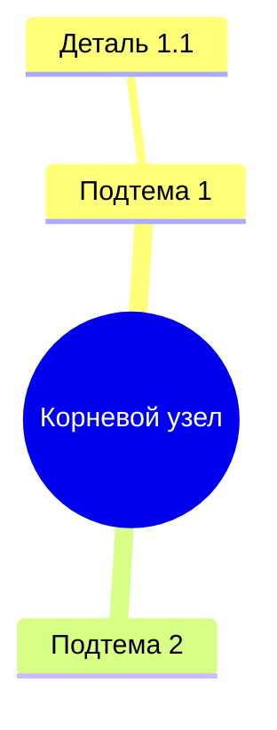

# ДЕТАЛЬНАЯ ИНСТРУКЦИЯ ДЛЯ ГЕНЕРАЦИИ MERMAID MINDMAP ДИАГРАММ

## КРИТИЧЕСКИ ВАЖНЫЕ ПРАВИЛА

### 1. ОБЯЗАТЕЛЬНЫЙ СИНТАКСИС

**ВСЕГДА начинай код с ключевого слова `mindmap` на первой строке, БЕЗ отступов!**



**НЕПРАВИЛЬНО:**
```
  mindmap
    root((Корневой узел))
```

**ПРАВИЛЬНО:**
```
mindmap
  root((Корневой узел))
```

### 2. ОТСТУПЫ (ТАБУЛЯЦИЯ) - КРИТИЧЕСКИ ВАЖНО!

**Используй ТОЛЬКО пробелы для отступов, НИКОГДА не используй табуляцию (TAB)!**

**Правило отступов:**
- Первая строка после `mindmap`: **2 пробела** (корневой узел)
- Каждый следующий уровень: **+2 пробела** от предыдущего уровня
- Все узлы одного уровня должны иметь **одинаковый отступ**

**Пример правильной структуры отступов:**
```
mindmap
  root((Корневой узел))
    Подтема 1
      Деталь 1.1
        Поддеталь 1.1.1
      Деталь 1.2
    Подтема 2
      Деталь 2.1
    Подтема 3
```

**НЕПРАВИЛЬНО (неправильные отступы):**
```
mindmap
  root((Корневой узел))
   Подтема 1  ← НЕПРАВИЛЬНО! 1 пробел вместо 2
      Деталь 1.1  ← НЕПРАВИЛЬНО! 4 пробела вместо 4
```

### 3. КОРНЕВОЙ УЗЕЛ - ОБЯЗАТЕЛЬНО ОДИН!

**В MindMap может быть ТОЛЬКО ОДИН корневой узел!**

**ПРАВИЛЬНО:**
```
mindmap
  root((СМК МП))
    Внешние факторы
    Внутренние факторы
```

**НЕПРАВИЛЬНО (несколько корневых узлов):**
```
mindmap
  root((СМК МП))
  root((Внешние факторы))  ← ОШИБКА! Не может быть два корневых узла
```

**Если в описании несколько основных тем, выбери ОДНУ главную тему как корневой узел, а остальные сделай подтемами первого уровня!**

### 4. СИНТАКСИС КОРНЕВОГО УЗЛА

**Корневой узел ОБЯЗАТЕЛЬНО должен быть на второй строке (после `mindmap`) с отступом 2 пробела!**

**Формат корневого узла:**
- `root((Название))` - предпочтительный формат
- Или просто `Название` (без root) - тоже допустимо, но менее явно

**ПРАВИЛЬНО:**
```
mindmap
  root((СМК МП))
```

**ПРАВИЛЬНО (альтернатива):**
```
mindmap
  СМК МП
```

**НЕПРАВИЛЬНО:**
```
mindmap
root((СМК МП))  ← НЕТ ОТСТУПА!
```

### 5. ИЕРАРХИЯ И СТРУКТУРА

**Каждый узел должен иметь родителя (кроме корневого)!**

**ПРАВИЛЬНАЯ ИЕРАРХИЯ:**
```
mindmap
  root((СМК МП))
    Внешние факторы
      Рынок
      Требования
      Общество
    Внутренние факторы
      Активы компании
      Внутренние заинтересованные стороны
```

**НЕПРАВИЛЬНО (узел без родителя):**
```
mindmap
  root((СМК МП))
    Внешние факторы
  Внутренние факторы  ← ОШИБКА! Нет родителя, находится на том же уровне, что и корневой узел
```

**Если видишь ошибку "There can be only one root. No parent could be found for...", это значит:**
- У тебя несколько узлов на уровне корневого узла (2 пробела отступа)
- Или узел имеет неправильный отступ и не может найти родителя

### 6. НАЗВАНИЯ УЗЛОВ

**Правила для названий узлов:**

1. **НЕ используй специальные символы**, которые могут сломать синтаксис:
   - Кавычки внутри названий: `"Название"` - НЕПРАВИЛЬНО
   - Скобки (кроме двойных скобок для корневого узла): `(Название)` - НЕПРАВИЛЬНО
   - Символы `:`, `;`, `,` в неправильных местах

2. **Можно использовать:**
   - Буквы (русские и английские)
   - Цифры
   - Пробелы
   - Дефисы и подчеркивания: `-`, `_`

3. **Длинные названия:**
   - Можно использовать длинные названия на русском языке
   - Пример: `Производственный контроль за соблюдением требований промышленной безопасности`

**ПРАВИЛЬНО:**
```
mindmap
  root((СМК МП))
    Внешние факторы
    Внутренние факторы
    Производственный контроль за соблюдением требований промышленной безопасности
```

**НЕПРАВИЛЬНО:**
```
mindmap
  root((СМК МП))
    "Внешние факторы"  ← НЕПРАВИЛЬНО! Кавычки не нужны
    Внутренние (факторы)  ← НЕПРАВИЛЬНО! Скобки не нужны
```

### 7. ПРОВЕРКА ПЕРЕД ОТПРАВКОЙ

**ОБЯЗАТЕЛЬНО проверь код перед отправкой:**

1.  Код начинается с `mindmap` на первой строке БЕЗ отступов
2.  Корневой узел на второй строке с отступом 2 пробела
3.  Только ОДИН корневой узел
4.  Все узлы имеют правильные отступы (кратные 2 пробелам)
5.  Каждый узел (кроме корневого) имеет родителя
6.  Нет специальных символов в названиях узлов
7.  Все строки имеют правильные отступы (используй пробелы, не табуляцию)

### 8. ПРИМЕРЫ ПРАВИЛЬНОГО КОДА

**Пример 1: Простая MindMap**
```
mindmap
  root((Управление проектом))
    Планирование
      Задачи
      Ресурсы
    Реализация
      Разработка
      Тестирование
    Завершение
      Документация
      Сдача
```

**Пример 2: Сложная MindMap с глубокой иерархией**
```
mindmap
  root((СМК МП))
    Внешние факторы
      Факторы производства
      Внешние заинтересованные стороны
      Рынок
      Требования
      Общество
      Опасные производственные объекты
    Внутренние факторы
      Документированная информация
      Процессная модель СМК
      Мониторинг, измерения, анализ и оценка
      Результативность функционирования процессов СМК
      Производственный контроль за соблюдением требований промышленной безопасности
      Экспертиза промышленной безопасности
      Цифровизация процессов мониторинга, измерения, анализа и оценки
      Активы компании
      Внутренние заинтересованные стороны
    Цели СМК
```

**Пример 3: MindMap с одним корневым узлом и множеством подтем**
```
mindmap
  root((Образование))
    Дошкольное образование
      Детский сад
      Подготовка к школе
    Школьное образование
      Начальная школа
      Средняя школа
      Старшая школа
    Высшее образование
      Бакалавриат
      Магистратура
      Аспирантура
    Дополнительное образование
      Курсы
      Семинары
      Тренинги
```

### 9. ЧАСТЫЕ ОШИБКИ И КАК ИХ ИЗБЕЖАТЬ

**Ошибка 1: "There can be only one root. No parent could be found for..."**
- **Причина:** Несколько узлов на уровне корневого узла (2 пробела отступа)
- **Решение:** Убедись, что только ОДИН узел имеет отступ 2 пробела, все остальные должны иметь больший отступ

**Ошибка 2: "Syntax error in text"**
- **Причина:** Неправильный синтаксис, неправильные отступы, специальные символы
- **Решение:** Проверь все правила выше, особенно отступы и названия узлов

**Ошибка 3: Код не рендерится**
- **Причина:** Код начинается не с `mindmap`, или есть лишние символы
- **Решение:** Убедись, что первая строка - это точно `mindmap` без пробелов и символов перед ним

### 10. ФОРМАТИРОВАНИЕ КОДА

**Всегда форматируй код так:**
- Первая строка: `mindmap` (без отступов, без пробелов в начале)
- Вторая строка: корневой узел с отступом 2 пробела
- Последующие строки: узлы с правильными отступами
- Каждая строка заканчивается переводом строки
- Нет пустых строк между узлами одного уровня (но можно для читаемости между разными ветками)

**ПРАВИЛЬНО:**
```
mindmap
  root((Главная тема))
    Подтема 1
      Деталь 1.1
      Деталь 1.2
    Подтема 2
      Деталь 2.1
```

### 11. РУССКИЙ ЯЗЫК

**Все названия узлов должны быть на русском языке!**

- Используй русские названия для всех элементов
- Синтаксис Mermaid остается на английском (`mindmap`, `root`)
- Содержимое (названия узлов) - на русском

**ПРАВИЛЬНО:**
```
mindmap
  root((Система управления качеством))
    Внешние факторы
    Внутренние факторы
```

**НЕПРАВИЛЬНО:**
```
mindmap
  root((Quality Management System))
    External factors
    Internal factors
```

### 12. ФИНАЛЬНАЯ ПРОВЕРКА

**Перед отправкой кода ответь на вопросы:**

1.  Код начинается с `mindmap` на первой строке?
2.  Есть только ОДИН корневой узел?
3.  Корневой узел имеет отступ 2 пробела?
4.  Все остальные узлы имеют правильные отступы (кратные 2)?
5.  Каждый узел (кроме корневого) имеет родителя?
6.  Нет специальных символов в названиях?
7.  Все названия на русском языке?
8.  Код можно скопировать и вставить в Mermaid редактор без ошибок?

**Если на все вопросы ответ "ДА" - код готов к отправке!**

---

## РЕЗЮМЕ: ЧТО ДЕЛАТЬ ВСЕГДА

1.  Начинай с `mindmap` на первой строке БЕЗ отступов
2.  Используй ТОЛЬКО пробелы для отступов (2, 4, 6, 8...)
3.  Создавай ТОЛЬКО ОДИН корневой узел
4.  Проверяй, что каждый узел имеет родителя
5.  Используй русские названия
6.  Избегай специальных символов в названиях
7.  Проверяй код перед отправкой

## РЕЗЮМЕ: ЧТО НИКОГДА НЕ ДЕЛАТЬ

1.  НЕ начинай код с отступов или других символов перед `mindmap`
2.  НЕ создавай несколько корневых узлов
3.  НЕ используй табуляцию (TAB) для отступов
4.  НЕ создавай узлы без родителя
5.  НЕ используй кавычки или скобки в названиях узлов (кроме двойных скобок для корневого узла)
6.  НЕ используй английские названия для узлов
7.  НЕ отправляй код без проверки


