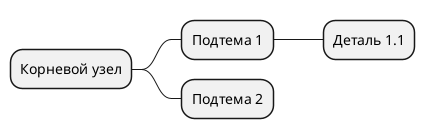

# ДЕТАЛЬНАЯ ИНСТРУКЦИЯ ДЛЯ ГЕНЕРАЦИИ PLANTUML MINDMAP ДИАГРАММ

## КРИТИЧЕСКИ ВАЖНЫЕ ПРАВИЛА

### 1. ОБЯЗАТЕЛЬНЫЙ СИНТАКСИС

**ВСЕГДА начинай код с `@startmindmap` и заканчивай `@endmindmap`!**



**НЕПРАВИЛЬНО:**
```
mindmap
* Корневой узел
```

**ПРАВИЛЬНО:**
```
@startmindmap
* Корневой узел
@endmindmap
```

### 2. ЗВЕЗДОЧКИ И ОТСТУПЫ - КРИТИЧЕСКИ ВАЖНО!

**Звездочки (*) определяют уровень иерархии!**

**Правило звездочек:**
- Корневой узел: **ОДНА звездочка** `*`
- Первый уровень: **ДВЕ звездочки** `**`
- Второй уровень: **ТРИ звездочки** `***`
- Третий уровень: **ЧЕТЫРЕ звездочки** `****`
- И так далее...

**КРИТИЧЕСКИ ВАЖНО:** Количество звездочек должно быть РОВНО столько, сколько нужно. Не используй больше или меньше!

**Пример правильной структуры звездочек:**
```
@startmindmap
* Корневой узел
** Подтема 1
*** Деталь 1.1
**** Поддеталь 1.1.1
*** Деталь 1.2
** Подтема 2
*** Деталь 2.1
@endmindmap
```

**НЕПРАВИЛЬНО (неправильные звездочки):**
```
@startmindmap
* Корневой узел
* Подтема 1  ← НЕПРАВИЛЬНО! Должно быть ** (две звездочки)
*** Деталь 1.1  ← НЕПРАВИЛЬНО! Пропущен уровень **
@endmindmap
```

### 3. ОТСТУПЫ - ТАБУЛЯЦИЯ ИЛИ ПРОБЕЛЫ

**Используй ТАБУЛЯЦИЮ или ПРОБЕЛЫ для читаемости, но звездочки ОБЯЗАТЕЛЬНЫ!**

**ПРАВИЛЬНО (с табуляцией для читаемости):**
```
@startmindmap
* Корневой узел
	** Подтема 1
		*** Деталь 1.1
	** Подтема 2
@endmindmap
```

**ПРАВИЛЬНО (без отступов, только звездочки):**
```
@startmindmap
* Корневой узел
** Подтема 1
*** Деталь 1.1
** Подтема 2
@endmindmap
```

**КРИТИЧЕСКИ ВАЖНО:** Звездочки определяют уровень, а не отступы! Но отступы (табуляция или пробелы) помогают читаемости кода.

### 4. КОРНЕВОЙ УЗЕЛ - ОБЯЗАТЕЛЬНО ОДИН!

**В MindMap может быть ТОЛЬКО ОДИН корневой узел (одна звездочка `*`)!**

**ПРАВИЛЬНО:**
```
@startmindmap
* СМК МП
** Внешние факторы
** Внутренние факторы
@endmindmap
```

**НЕПРАВИЛЬНО (несколько корневых узлов):**
```
@startmindmap
* СМК МП
* Внешние факторы  ← ОШИБКА! Не может быть два корневых узла
@endmindmap
```

**Если в описании несколько основных тем, выбери ОДНУ главную тему как корневой узел (`*`), а остальные сделай подтемами первого уровня (`**`)!**

### 5. ИЕРАРХИЯ И СТРУКТУРА

**Каждый уровень должен иметь правильное количество звездочек!**

**ПРАВИЛЬНАЯ ИЕРАРХИЯ:**
```
@startmindmap
* Корневой узел (1 звездочка)
** Подтема первого уровня (2 звездочки)
*** Деталь второго уровня (3 звездочки)
**** Поддеталь третьего уровня (4 звездочки)
*** Деталь второго уровня (3 звездочки - возврат на уровень)
** Подтема первого уровня (2 звездочки - возврат на уровень)
@endmindmap
```

**НЕПРАВИЛЬНО (нарушение иерархии):**
```
@startmindmap
* Корневой узел
** Подтема 1
**** Поддеталь 1.1  ← ОШИБКА! Пропущен уровень ***
** Подтема 2
@endmindmap
```

**ВАЖНО:** Не пропускай уровни! Если есть `**`, следующий уровень должен быть `***`, а не `****`!

### 6. НАЗВАНИЯ УЗЛОВ

**Правила для названий узлов:**

1. **НЕ используй специальные символы**, которые могут сломать синтаксис:
   - Кавычки внутри названий (кроме случаев, когда они нужны)
   - Скобки `()` в названиях (могут конфликтовать с синтаксисом)
   - Символы `:`, `;` в начале строки (используются PlantUML для других целей)

2. **Можно использовать:**
   - Буквы (русские и английские)
   - Цифры
   - Пробелы
   - Дефисы и подчеркивания: `-`, `_`
   - Запятые и точки в тексте

3. **Длинные названия:**
   - Можно использовать длинные названия на русском языке
   - Пример: `* Производственный контроль за соблюдением требований промышленной безопасности`

**ПРАВИЛЬНО:**
```
@startmindmap
* СМК МП
** Внешние факторы
** Внутренние факторы
** Производственный контроль за соблюдением требований промышленной безопасности
@endmindmap
```

**НЕПРАВИЛЬНО:**
```
@startmindmap
* СМК МП
** "Внешние факторы"  ← НЕПРАВИЛЬНО! Кавычки не нужны
** Внутренние (факторы)  ← НЕПРАВИЛЬНО! Скобки могут сломать синтаксис
@endmindmap
```

### 7. ЦВЕТА - СТРОГИЕ (БЕЛЫЙ, ЧЕРНЫЙ, СЕРЫЙ)

**КРИТИЧЕСКИ ВАЖНО:** Диаграмма должна быть в строгих цветах!

**Используй ТОЛЬКО следующие цвета:**
- Фон узлов: **белый** (`#FFFFFF` или `white`)
- Текст: **черный** (`#000000` или `black`)
- Границы: **черный** или **серый** (`#000000`, `#666666`, `#999999`)
- Акценты: **серые оттенки** (`#F5F5F5`, `#E5E5E5`, `#CCCCCC`, `#B3B3B3`)

**Синтаксис для цветов в PlantUML MindMap:**

Для задания цветов узлов используй синтаксис `[#цвет]`:

```
@startmindmap
*[#FFFFFF] Корневой узел
** Подтема 1
** Подтема 2
@endmindmap
```

**ПРАВИЛЬНО (строгие цвета):**
```
@startmindmap
<style>
mindmapDiagram {
  node {
    BackgroundColor white
    FontColor black
    LineColor #000000
  }
}
</style>
* Корневой узел
** Подтема 1
** Подтема 2
@endmindmap
```

**НЕПРАВИЛЬНО (яркие цвета):**
```
@startmindmap
*[#00FF00] Корневой узел  ← НЕПРАВИЛЬНО! Зеленый цвет
**[#FFFF00] Подтема 1  ← НЕПРАВИЛЬНО! Желтый цвет
**[#FF00FF] Подтема 2  ← НЕПРАВИЛЬНО! Фиолетовый цвет
@endmindmap
```

**ОБЯЗАТЕЛЬНО добавляй стили для строгих цветов:**

```
@startmindmap
<style>
mindmapDiagram {
  node {
    BackgroundColor white
    FontColor black
    LineColor #000000
    BorderColor #000000
  }
  rootNode {
    BackgroundColor white
    FontColor black
    LineColor #000000
    BorderColor #000000
  }
  leafNode {
    BackgroundColor white
    FontColor black
    LineColor #666666
    BorderColor #666666
  }
  arrow {
    LineColor #000000
  }
}
</style>
* Корневой узел
** Подтема 1
*** Деталь 1.1
** Подтема 2
@endmindmap
```

### 8. МНОГОСТРОЧНЫЕ БЛОКИ

**Для многострочного текста используй символы `:` и `;`:**

```
@startmindmap
* Корневой узел
**:Пример 1
Это многострочный текст
Строка 1
Строка 2
;
** Подтема 2
@endmindmap
```

**ПРАВИЛЬНО:**
```
@startmindmap
* Проект
**:Описание проекта
Детальное описание проекта
с несколькими строками
текста
;
** Задачи
@endmindmap
```

### 9. НАПРАВЛЕНИЕ РАЗВЕРТКИ

**Для изменения направления используй арифметические символы:**

- `+` - ветвление вправо
- `-` - ветвление влево
- Можно комбинировать: `++` для правой стороны, `--` для левой

```
@startmindmap
+ Корневой узел
++ Подтема справа 1
++ Подтема справа 2
-- Подтема слева 1
-- Подтема слева 2
@endmindmap
```

**Для строгих цветов с направлением:**
```
@startmindmap
<style>
mindmapDiagram {
  node {
    BackgroundColor white
    FontColor black
    LineColor #000000
  }
}
</style>
+ Корневой узел
++ Подтема 1
+++ Деталь 1.1
-- Подтема 2
@endmindmap
```

### 10. ПРОВЕРКА ПЕРЕД ОТПРАВКОЙ

**ОБЯЗАТЕЛЬНО проверь код перед отправкой:**

1. ✅ Код начинается с `@startmindmap`
2. ✅ Код заканчивается `@endmindmap`
3. ✅ Только ОДИН корневой узел (`*` или `+` или `-`)
4. ✅ Все уровни имеют правильное количество звездочек (`*`, `**`, `***`, и т.д.)
5. ✅ Нет пропусков в уровнях (не должно быть `**` сразу после `****`)
6. ✅ Используются строгие цвета (белый, черный, серый)
7. ✅ Нет специальных символов в названиях узлов, которые могут сломать синтаксис
8. ✅ Все названия на русском языке
9. ✅ Стили для строгих цветов добавлены

### 11. ПРИМЕРЫ ПРАВИЛЬНОГО КОДА

**Пример 1: Простая MindMap со строгими цветами**
```
@startmindmap
<style>
mindmapDiagram {
  node {
    BackgroundColor white
    FontColor black
    LineColor #000000
    BorderColor #000000
  }
  rootNode {
    BackgroundColor white
    FontColor black
    LineColor #000000
    BorderColor #000000
  }
  leafNode {
    BackgroundColor white
    FontColor black
    LineColor #666666
    BorderColor #666666
  }
  arrow {
    LineColor #000000
  }
}
</style>
* Управление проектом
** Планирование
*** Задачи
*** Ресурсы
** Реализация
*** Разработка
*** Тестирование
** Завершение
*** Документация
*** Сдача
@endmindmap
```

**Пример 2: Сложная MindMap с глубокой иерархией**
```
@startmindmap
<style>
mindmapDiagram {
  node {
    BackgroundColor white
    FontColor black
    LineColor #000000
    BorderColor #000000
  }
  rootNode {
    BackgroundColor white
    FontColor black
    LineColor #000000
    BorderColor #000000
  }
  leafNode {
    BackgroundColor white
    FontColor black
    LineColor #666666
    BorderColor #666666
  }
  arrow {
    LineColor #000000
  }
}
</style>
* СМК МП
** Внешние факторы
*** Факторы производства
*** Внешние заинтересованные стороны
*** Рынок
*** Требования
*** Общество
*** Опасные производственные объекты
** Внутренние факторы
*** Документированная информация
*** Процессная модель СМК
*** Мониторинг, измерения, анализ и оценка
*** Результативность функционирования процессов СМК
*** Производственный контроль за соблюдением требований промышленной безопасности
*** Экспертиза промышленной безопасности
*** Цифровизация процессов мониторинга, измерения, анализа и оценки
*** Активы компании
*** Внутренние заинтересованные стороны
** Цели СМК
@endmindmap
```

**Пример 3: MindMap с направлением развертки**
```
@startmindmap
<style>
mindmapDiagram {
  node {
    BackgroundColor white
    FontColor black
    LineColor #000000
    BorderColor #000000
  }
  rootNode {
    BackgroundColor white
    FontColor black
    LineColor #000000
    BorderColor #000000
  }
  leafNode {
    BackgroundColor white
    FontColor black
    LineColor #666666
    BorderColor #666666
  }
  arrow {
    LineColor #000000
  }
}
</style>
+ Корневой узел
++ Подтема справа 1
+++ Деталь 1.1
++ Подтема справа 2
-- Подтема слева 1
--- Деталь 2.1
-- Подтема слева 2
@endmindmap
```

### 12. ЧАСТЫЕ ОШИБКИ И КАК ИХ ИЗБЕЖАТЬ

**Ошибка 1: "Syntax Error" или код не рендерится**
- **Причина:** Неправильный синтаксис, отсутствие `@startmindmap`/`@endmindmap`, неправильные звездочки
- **Решение:** Проверь, что код начинается с `@startmindmap` и заканчивается `@endmindmap`, проверь количество звездочек

**Ошибка 2: "Multiple root nodes" или неправильная иерархия**
- **Причина:** Несколько узлов с одной звездочкой (`*`)
- **Решение:** Убедись, что только ОДИН узел имеет одну звездочку (`*`), все остальные должны иметь `**` или больше

**Ошибка 3: Пропущенные уровни иерархии**
- **Причина:** Пропуск уровня (например, `**` сразу после `****`)
- **Решение:** Проверь, что уровни идут последовательно: `*` → `**` → `***` → `****`

**Ошибка 4: Яркие цвета на диаграмме**
- **Причина:** Не добавлены стили для строгих цветов
- **Решение:** ОБЯЗАТЕЛЬНО добавляй блок `<style>` с настройками цветов (белый, черный, серый)

**Ошибка 5: Специальные символы в названиях**
- **Причина:** Кавычки, скобки или другие символы в названиях узлов
- **Решение:** Используй только буквы, цифры, пробелы, дефисы и подчеркивания

### 13. ФОРМАТИРОВАНИЕ КОДА

**Всегда форматируй код так:**
- Первая строка: `@startmindmap`
- Блок стилей (если нужен): `<style>...</style>`
- Корневой узел с одной звездочкой `*`
- Последующие уровни с правильным количеством звездочек
- Последняя строка: `@endmindmap`
- Каждая строка заканчивается переводом строки
- Можно использовать табуляцию или пробелы для читаемости (но звездочки обязательны!)

**ПРАВИЛЬНО:**
```
@startmindmap
<style>
mindmapDiagram {
  node {
    BackgroundColor white
    FontColor black
    LineColor #000000
  }
}
</style>
* Корневой узел
** Подтема 1
*** Деталь 1.1
** Подтема 2
@endmindmap
```

### 14. РУССКИЙ ЯЗЫК

**Все названия узлов должны быть на русском языке!**

- Используй русские названия для всех элементов
- Синтаксис PlantUML остается на английском (`@startmindmap`, `@endmindmap`, `<style>`)
- Содержимое (названия узлов) - на русском

**ПРАВИЛЬНО:**
```
@startmindmap
* Система управления качеством
** Внешние факторы
** Внутренние факторы
@endmindmap
```

**НЕПРАВИЛЬНО:**
```
@startmindmap
* Quality Management System
** External factors
** Internal factors
@endmindmap
```

### 15. ФИНАЛЬНАЯ ПРОВЕРКА

**Перед отправкой кода ответь на вопросы:**

1. ✅ Код начинается с `@startmindmap`?
2. ✅ Код заканчивается `@endmindmap`?
3. ✅ Есть только ОДИН корневой узел (`*`)?
4. ✅ Все уровни имеют правильное количество звездочек (`*`, `**`, `***`, и т.д.)?
5. ✅ Нет пропусков в уровнях?
6. ✅ Добавлены стили для строгих цветов (белый, черный, серый)?
7. ✅ Нет специальных символов в названиях узлов?
8. ✅ Все названия на русском языке?
9. ✅ Код можно скопировать и вставить в PlantUML редактор БЕЗ ОШИБОК?

**Если на все вопросы ответ "ДА" - код готов к отправке!**

---

## РЕЗЮМЕ: ЧТО ДЕЛАТЬ ВСЕГДА

1. ✅ Начинай с `@startmindmap` и заканчивай `@endmindmap`
2. ✅ Используй правильное количество звездочек (`*`, `**`, `***`, и т.д.)
3. ✅ Создавай ТОЛЬКО ОДИН корневой узел (`*`)
4. ✅ Проверяй, что уровни идут последовательно (не пропускай уровни)
5. ✅ ОБЯЗАТЕЛЬНО добавляй стили для строгих цветов (белый, черный, серый)
6. ✅ Используй русские названия
7. ✅ Избегай специальных символов в названиях узлов
8. ✅ Проверяй код перед отправкой

## РЕЗЮМЕ: ЧТО НИКОГДА НЕ ДЕЛАТЬ

1. ❌ НЕ начинай код без `@startmindmap`
2. ❌ НЕ заканчивай код без `@endmindmap`
3. ❌ НЕ создавай несколько корневых узлов
4. ❌ НЕ используй неправильное количество звездочек
5. ❌ НЕ пропускай уровни иерархии
6. ❌ НЕ используй яркие цвета (зеленый, желтый, фиолетовый) - ТОЛЬКО белый, черный, серый!
7. ❌ НЕ забывай добавлять стили для строгих цветов
8. ❌ НЕ используй кавычки или скобки в названиях узлов (кроме случаев, когда они нужны)
9. ❌ НЕ используй английские названия для узлов
10. ❌ НЕ отправляй код без проверки

---

## ДОПОЛНИТЕЛЬНАЯ ИНФОРМАЦИЯ

### Официальная документация PlantUML MindMap:
https://plantuml.com/ru/mindmap-diagram

### Основные синтаксические конструкции:

1. **OrgMode синтаксис** (рекомендуется):
```
@startmindmap
* Корневой узел
** Подтема 1
*** Деталь 1.1
@endmindmap
```

2. **Markdown синтаксис**:
```
@startmindmap
* Корневой узел
  * Подтема 1
    * Деталь 1.1
@endmindmap
```

3. **Арифметическая нотация**:
```
@startmindmap
+ Корневой узел
++ Подтема справа 1
-- Подтема слева 1
@endmindmap
```

### Рекомендации по цветам:

**Для строгих диаграмм используй:**
- `BackgroundColor white` - белый фон
- `FontColor black` - черный текст
- `LineColor #000000` или `#666666` - черные или серые линии
- `BorderColor #000000` или `#666666` - черные или серые границы

**НЕ используй:**
- `#00FF00` (зеленый)
- `#FFFF00` (желтый)
- `#FF00FF` (фиолетовый)
- `#0000FF` (синий)
- Любые другие яркие цвета

---

## ПОЛНЫЙ ШАБЛОН ДЛЯ КОПИРОВАНИЯ

```
@startmindmap
<style>
mindmapDiagram {
  node {
    BackgroundColor white
    FontColor black
    LineColor #000000
    BorderColor #000000
  }
  rootNode {
    BackgroundColor white
    FontColor black
    LineColor #000000
    BorderColor #000000
  }
  leafNode {
    BackgroundColor white
    FontColor black
    LineColor #666666
    BorderColor #666666
  }
  arrow {
    LineColor #000000
  }
}
</style>
* КОРНЕВОЙ_УЗЕЛ
** Подтема_первого_уровня_1
*** Деталь_второго_уровня_1.1
**** Поддеталь_третьего_уровня_1.1.1
*** Деталь_второго_уровня_1.2
** Подтема_первого_уровня_2
*** Деталь_второго_уровня_2.1
@endmindmap
```

**Замени `КОРНЕВОЙ_УЗЕЛ`, `Подтема_первого_уровня_1` и т.д. на реальные названия на русском языке!**

