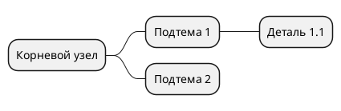

# ДЕТАЛЬНАЯ ИНСТРУКЦИЯ ДЛЯ ГЕНЕРАЦИИ PLANTUML MINDMAP ДИАГРАММ

## ОБЯЗАТЕЛЬНЫЕ ПРАВИЛА ДЛЯ СЕРВИСА CONTEXT

1. **Не добавляй блок `<style>...</style>`** — используется стандартное оформление PlantUML; блок стилей сразу после `@startmindmap` часто вызывает ошибку парсера.
2. **Иерархию задавай только префиксами `+`:** корень — одна строка с `+ `, дети — `++ `, далее `+++ `, `++++ ` и т.д. Без пропусков уровней.
3. **Не используй префиксы `-` (`--`, `---`, …)** — ветки «влево» не использовать; все подузлы — через дополнительный символ `+` в префиксе строки.
4. Ниже в документе для справки приведена нотация со звёздочками `*` (OrgMode); **в генерируемом для Context коде предпочитай только `+`.**

---

## КРИТИЧЕСКИ ВАЖНЫЕ ПРАВИЛА

### 1. ОБЯЗАТЕЛЬНЫЙ СИНТАКСИС

**ВСЕГДА начинай код с `@startmindmap` и заканчивай `@endmindmap`!**
**ВТОРАЯ строка кода ОБЯЗАТЕЛЬНО должна быть ровно: `skinparam defaultFontName Arial`**


```plantuml
@startmindmap
skinparam defaultFontName Arial
* Корневой узел
** Подтема 1
*** Деталь 1.1
** Подтема 2
@endmindmap
```

**НЕПРАВИЛЬНО:**
```
mindmap
* Корневой узел
```

**ПРАВИЛЬНО:**
```
@startmindmap
* Корневой узел
@endmindmap
```

### 2. ЗВЕЗДОЧКИ И ОТСТУПЫ - КРИТИЧЕСКИ ВАЖНО!

**Звездочки (*) определяют уровень иерархии!**

**Правило звездочек:**
- Корневой узел: **ОДНА звездочка** `*`
- Первый уровень: **ДВЕ звездочки** `**`
- Второй уровень: **ТРИ звездочки** `***`
- Третий уровень: **ЧЕТЫРЕ звездочки** `****`
- И так далее...

**КРИТИЧЕСКИ ВАЖНО:** Количество звездочек должно быть РОВНО столько, сколько нужно. Не используй больше или меньше!

**Пример правильной структуры звездочек:**
```
@startmindmap
* Корневой узел
** Подтема 1
*** Деталь 1.1
**** Поддеталь 1.1.1
*** Деталь 1.2
** Подтема 2
*** Деталь 2.1
@endmindmap
```

**НЕПРАВИЛЬНО (неправильные звездочки):**
```
@startmindmap
* Корневой узел
* Подтема 1  ← НЕПРАВИЛЬНО! Должно быть ** (две звездочки)
*** Деталь 1.1  ← НЕПРАВИЛЬНО! Пропущен уровень **
@endmindmap
```

### 3. ОТСТУПЫ - ТАБУЛЯЦИЯ ИЛИ ПРОБЕЛЫ

**Используй ТАБУЛЯЦИЮ или ПРОБЕЛЫ для читаемости, но звездочки ОБЯЗАТЕЛЬНЫ!**

**ПРАВИЛЬНО (с табуляцией для читаемости):**
```
@startmindmap
* Корневой узел
	** Подтема 1
		*** Деталь 1.1
	** Подтема 2
@endmindmap
```

**ПРАВИЛЬНО (без отступов, только звездочки):**
```
@startmindmap
* Корневой узел
** Подтема 1
*** Деталь 1.1
** Подтема 2
@endmindmap
```

**КРИТИЧЕСКИ ВАЖНО:** Звездочки определяют уровень, а не отступы! Но отступы (табуляция или пробелы) помогают читаемости кода.

### 4. КОРНЕВОЙ УЗЕЛ - ОБЯЗАТЕЛЬНО ОДИН!

**В MindMap может быть ТОЛЬКО ОДИН корневой узел (одна звездочка `*`)!**

**ПРАВИЛЬНО:**
```
@startmindmap
* СМК МП
** Внешние факторы
** Внутренние факторы
@endmindmap
```

**НЕПРАВИЛЬНО (несколько корневых узлов):**
```
@startmindmap
* СМК МП
* Внешние факторы  ← ОШИБКА! Не может быть два корневых узла
@endmindmap
```

**Если в описании несколько основных тем, выбери ОДНУ главную тему как корневой узел (`*`), а остальные сделай подтемами первого уровня (`**`)!**

### 5. ИЕРАРХИЯ И СТРУКТУРА

**Каждый уровень должен иметь правильное количество звездочек!**

**ПРАВИЛЬНАЯ ИЕРАРХИЯ:**
```
@startmindmap
* Корневой узел (1 звездочка)
** Подтема первого уровня (2 звездочки)
*** Деталь второго уровня (3 звездочки)
**** Поддеталь третьего уровня (4 звездочки)
*** Деталь второго уровня (3 звездочки - возврат на уровень)
** Подтема первого уровня (2 звездочки - возврат на уровень)
@endmindmap
```

**НЕПРАВИЛЬНО (нарушение иерархии):**
```
@startmindmap
* Корневой узел
** Подтема 1
**** Поддеталь 1.1  ← ОШИБКА! Пропущен уровень ***
** Подтема 2
@endmindmap
```

**ВАЖНО:** Не пропускай уровни! Если есть `**`, следующий уровень должен быть `***`, а не `****`!

### 6. НАЗВАНИЯ УЗЛОВ

**Правила для названий узлов:**

1. **НЕ используй специальные символы**, которые могут сломать синтаксис:
   - Кавычки внутри названий (кроме случаев, когда они нужны)
   - Скобки `()` в названиях (могут конфликтовать с синтаксисом)
   - Символы `:`, `;` в начале строки (используются PlantUML для других целей)

2. **Можно использовать:**
   - Буквы (русские и английские)
   - Цифры
   - Пробелы
   - Дефисы и подчеркивания: `-`, `_`
   - Запятые и точки в тексте

3. **Длинные названия:**
   - Можно использовать длинные названия на русском языке
   - Пример: `* Производственный контроль за соблюдением требований промышленной безопасности`

**ПРАВИЛЬНО:**
```
@startmindmap
* СМК МП
** Внешние факторы
** Внутренние факторы
** Производственный контроль за соблюдением требований промышленной безопасности
@endmindmap
```

**НЕПРАВИЛЬНО:**
```
@startmindmap
* СМК МП
** "Внешние факторы"  ← НЕПРАВИЛЬНО! Кавычки не нужны
** Внутренние (факторы)  ← НЕПРАВИЛЬНО! Скобки могут сломать синтаксис
@endmindmap
```

### 7. ЦВЕТА И ОФОРМЛЕНИЕ

**Для сервиса Context:** не вставляй `<style>...</style>`. Цвета и шрифты — **по умолчанию PlantUML** (нейтральный вид диаграммы).

При необходимости отдельного акцента узла допустим синтаксис `[#цвет]` у узла — только сдержанные цвета (белый, серый, чёрный), **без** ярких зелёного/жёлтого/фиолетового.

**НЕПРАВИЛЬНО (яркие цвета):**
```
@startmindmap
+[#00FF00] Корневой узел
++[#FFFF00] Подтема 1
@endmindmap
```

### 8. МНОГОСТРОЧНЫЕ БЛОКИ

**Для многострочного текста используй символы `:` и `;`:**

```
@startmindmap
* Корневой узел
**:Пример 1
Это многострочный текст
Строка 1
Строка 2
;
** Подтема 2
@endmindmap
```

**ПРАВИЛЬНО:**
```
@startmindmap
* Проект
**:Описание проекта
Детальное описание проекта
с несколькими строками
текста
;
** Задачи
@endmindmap
```

### 9. АРИФМЕТИЧЕСКАЯ НОТАЦИЯ ТОЛЬКО С «+» (ДЛЯ CONTEXT)

**Используй только `+` для уровней иерархии** (корень `+`, дети `++`, внуки `+++`, правнуки `++++` и т.д.).

**Не используй `-`** (ветки «влево»): смешение `+` и `-` часто приводит к ошибке **error42L** в PlantUML. Все подузлы, в том числе бывшие «слева», оформляй как следующий уровень `+` (например, четыре подпункта под узлом `+++ Тема` — это четыре строки с префиксом `++++ `).

**Правильно (только плюсы):**
```
@startmindmap
+ Корневая тема
++ Раздел A
+++ Пункт A.1
++ Раздел B
+++ Подтема
++++ Детализация 1
++++ Детализация 2
@endmindmap
```

### 10. ПРОВЕРКА ПЕРЕД ОТПРАВКОЙ

**ОБЯЗАТЕЛЬНО проверь код перед отправкой:**

1.  Код начинается с `@startmindmap`
2.  Код заканчивается `@endmindmap`
3.  Только ОДИН корневой узел (одна строка с префиксом `+ `)
4.  Уровни задаются только `+`, `++`, `+++`, … без пропусков
5.  Нет строк, начинающихся с `-`
6.  Нет блока `<style>`
7.  Нет специальных символов в названиях узлов, которые могут сломать синтаксис
8.  Все названия на русском языке

### 11. ПРИМЕРЫ ПРАВИЛЬНОГО КОДА (CONTEXT: БЕЗ `<style>`, ТОЛЬКО `+`)

**Пример 1: простая карта**
```
@startmindmap
+ Управление проектом
++ Планирование
+++ Задачи
+++ Ресурсы
++ Реализация
+++ Разработка
+++ Тестирование
@endmindmap
```

**Пример 2: глубокая иерархия (включая подузлы четвёртого уровня под одним `+++`)**
```
@startmindmap
+ СМК МП, эксплуатирующего ОПО
++ Внешние факторы
+++ Факторы производства
+++ Внешние заинтересованные стороны
+++ Рынок
+++ Требования (нормативные, технические, законодательные)
+++ Общество (экологические, социальные требования)
++ Внутренние факторы
+++ Опасные производственные объекты (ОПО)
+++ Документированная информация
+++ Процессная модель СМК
+++ Мониторинг, измерения, анализ и оценка
++++ Результативность функционирования процессов СМК
++++ Производственный контроль за соблюдением требований промышленной безопасности
++++ Экспертиза промышленной безопасности
++++ Цифровизация процессов мониторинга, измерения, анализа и оценки
+++ Активы компании
+++ Внутренние заинтересованные стороны
+++ Цели СМК
@endmindmap
```

### 12. ЧАСТЫЕ ОШИБКИ И КАК ИХ ИЗБЕЖАТЬ

**Ошибка 1: "Syntax Error" или код не рендерится**
- **Причина:** Неправильный синтаксис, отсутствие `@startmindmap`/`@endmindmap`, неправильные звездочки
- **Решение:** Проверь, что код начинается с `@startmindmap` и заканчивается `@endmindmap`, проверь количество звездочек

**Ошибка 2: "Multiple root nodes" или неправильная иерархия**
- **Причина:** Несколько узлов с одной звездочкой (`*`)
- **Решение:** Убедись, что только ОДИН узел имеет одну звездочку (`*`), все остальные должны иметь `**` или больше

**Ошибка 3: Пропущенные уровни иерархии**
- **Причина:** Пропуск уровня (например, `**` сразу после `****`)
- **Решение:** Проверь, что уровни идут последовательно: `*` → `**` → `***` → `****`

**Ошибка 4: Syntax Error сразу после `@startmindmap`**
- **Причина:** Блок `<style>` не поддерживается или не допускается в используемой версии движка
- **Решение:** Не вставляй `<style>`; используй оформление по умолчанию

**Ошибка 5: error42L при смешении `+` и `-`**
- **Причина:** Левые ветки с `-` после правых с `+`
- **Решение:** Задавай все уровни только префиксами `+` (`++`, `+++`, `++++`, …)

**Ошибка 6: Специальные символы в названиях**
- **Причина:** Кавычки, скобки или другие символы в названиях узлов
- **Решение:** Используй только буквы, цифры, пробелы, дефисы и подчеркивания

### 13. ФОРМАТИРОВАНИЕ КОДА

**Всегда форматируй код так:**
- Первая строка: `@startmindmap`
- Без блока `<style>`
- Корневой узел: одна строка с префиксом `+ `
- Дочерние уровни: `++ `, `+++ `, …
- Последняя строка: `@endmindmap`
- Каждая строка заканчивается переводом строки

**ПРАВИЛЬНО:**
```
@startmindmap
+ Корневой узел
++ Подтема 1
+++ Деталь 1.1
++ Подтема 2
@endmindmap
```

### 14. РУССКИЙ ЯЗЫК

**Все названия узлов должны быть на русском языке!**

- Используй русские названия для всех элементов
- Синтаксис PlantUML остается на английском (`@startmindmap`, `@endmindmap`)
- Содержимое (названия узлов) - на русском

**ПРАВИЛЬНО (для Context — с `+`):**
```
@startmindmap
+ Система управления качеством
++ Внешние факторы
++ Внутренние факторы
@endmindmap
```

**НЕПРАВИЛЬНО:**
```
@startmindmap
* Quality Management System
** External factors
** Internal factors
@endmindmap
```

### 15. ФИНАЛЬНАЯ ПРОВЕРКА

**Перед отправкой кода ответь на вопросы:**

1.  Код начинается с `@startmindmap`?
2.  Код заканчивается `@endmindmap`?
3.  Есть только ОДИН корневой узел (одна строка `+ ...`)?
4.  Все уровни заданы только `+`, `++`, `+++`, …?
5.  Нет пропусков в уровнях и нет префиксов `-`?
6.  Нет блока `<style>`?
7.  Нет специальных символов в названиях узлов?
8.  Все названия на русском языке?
9.  Код можно скопировать и вставить в PlantUML редактор БЕЗ ОШИБОК?

**Если на все вопросы ответ "ДА" - код готов к отправке!**

---

## РЕЗЮМЕ: ЧТО ДЕЛАТЬ ВСЕГДА

1.  Начинай с `@startmindmap` и заканчивай `@endmindmap`
2.  Используй только префиксы `+`, `++`, `+++`, … для уровней (для Context)
3.  Создавай ТОЛЬКО ОДИН корневой узел (`+ ...`)
4.  Проверяй, что уровни идут последовательно (не пропускай уровни)
5.  НЕ добавляй `<style>` — оформление по умолчанию PlantUML
6.  Используй русские названия
7.  Избегай специальных символов в названиях узлов
8.  Проверяй код перед отправкой

## РЕЗЮМЕ: ЧТО НИКОГДА НЕ ДЕЛАТЬ

1.  НЕ начинай код без `@startmindmap`
2.  НЕ заканчивай код без `@endmindmap`
3.  НЕ создавай несколько корневых узлов
4.  НЕ используй префиксы `-` (`--`, `---`, …) для веток
5.  НЕ пропускай уровни иерархии
6.  НЕ вставляй блок `<style>...</style>`
7.  НЕ используй яркие «кричащие» цвета в `[#...]` без необходимости
8.  НЕ используй кавычки или скобки в названиях узлов (кроме случаев, когда они нужны)
9.  НЕ используй английские названия для узлов
10.  НЕ отправляй код без проверки

---

## ДОПОЛНИТЕЛЬНАЯ ИНФОРМАЦИЯ

### Официальная документация PlantUML MindMap:
https://plantuml.com/ru/mindmap-diagram

### Основные синтаксические конструкции:

1. **OrgMode синтаксис** (рекомендуется):
```
@startmindmap
* Корневой узел
** Подтема 1
*** Деталь 1.1
@endmindmap
```

2. **Markdown синтаксис**:
```
@startmindmap
* Корневой узел
  * Подтема 1
    * Деталь 1.1
@endmindmap
```

3. **Арифметическая нотация (для Context — только `+`, без `-`)**:
```
@startmindmap
+ Корневой узел
++ Подтема 1
+++ Деталь 1.1
++ Подтема 2
@endmindmap
```

### Рекомендации по цветам:

В сервисе Context блок `<style>` не используется. Если задаёшь цвет узла через `[#цвет]`, **избегай** ярких тонов.

**НЕ используй (для `[#...]` у узлов):**
- `#00FF00` (зеленый)
- `#FFFF00` (желтый)
- `#FF00FF` (фиолетовый)
- `#0000FF` (синий)
- Любые другие яркие цвета

---

## ПОЛНЫЙ ШАБЛОН ДЛЯ КОПИРОВАНИЯ (CONTEXT)

```
@startmindmap
+ КОРНЕВОЙ_УЗЕЛ
++ Подтема_первого_уровня_1
+++ Деталь_второго_уровня_1.1
++++ Поддеталь_третьего_уровня_1.1.1
+++ Деталь_второго_уровня_1.2
++ Подтема_первого_уровня_2
+++ Деталь_второго_уровня_2.1
@endmindmap
```

**Замени `КОРНЕВОЙ_УЗЕЛ`, `Подтема_первого_уровня_1` и т.д. на реальные названия на русском языке!**


