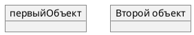

# ДЕТАЛЬНАЯ ИНСТРУКЦИЯ ДЛЯ ГЕНЕРАЦИИ PLANTUML OBJECT ДИАГРАММ

## КРИТИЧЕСКИ ВАЖНЫЕ ПРАВИЛА

### 1. ОБЯЗАТЕЛЬНЫЙ СИНТАКСИС

**ВСЕГДА начинай код с `@startuml` и заканчивай `@enduml`!**



**НЕПРАВИЛЬНО:**
```
object первыйОбъект
object второйОбъект
```

**ПРАВИЛЬНО:**
```
@startuml
object первыйОбъект
object второйОбъект
@enduml
```

### 2. ОТСТУПЫ И ПРОБЕЛЫ - КРИТИЧЕСКИ ВАЖНО!

**КРИТИЧЕСКИ ВАЖНО:** Правильные отступы и пробелы критически важны для рендеринга диаграммы!

**Правила отступов:**
- Первая строка: `@startuml` (0 пробелов, без отступов)
- Определения объектов: можно без отступов или с отступами для читаемости (2-4 пробела)
- Поля объектов: **ОБЯЗАТЕЛЬНО с отступом** (2-4 пробела) для читаемости
- Связи между объектами: можно без отступов или с отступами для читаемости
- Последняя строка: `@enduml` (0 пробелов)

**ПРАВИЛЬНО (с отступами для читаемости):**
```
@startuml
object пользователь
  пользователь : имя = "Иван"
  пользователь : возраст = 30

object заказ
  заказ : номер = 12345
  заказ : сумма = 5000

пользователь --> заказ
@enduml
```

**ПРАВИЛЬНО (без отступов, минималистично):**
```
@startuml
object пользователь
пользователь : имя = "Иван"
пользователь : возраст = 30
object заказ
заказ : номер = 12345
заказ : сумма = 5000
пользователь --> заказ
@enduml
```

**НЕПРАВИЛЬНО (неправильные отступы):**
```
@startuml
  object пользователь  ← НЕПРАВИЛЬНО! @startuml должен быть без отступов
пользователь : имя = "Иван"  ← ОШИБКА! Нет отступа перед полем
  @enduml  ← НЕПРАВИЛЬНО! @enduml должен быть без отступов
```

**КРИТИЧЕСКИ ВАЖНО:** 
- `@startuml` и `@enduml` ВСЕГДА без отступов (0 пробелов)
- Поля объектов (`объект : поле = значение`) лучше с отступом (2-4 пробела) для читаемости
- Можно использовать табуляцию или пробелы, но будь последовательным!

### 3. ОПРЕДЕЛЕНИЕ ОБЪЕКТОВ

**Синтаксис определения объектов:**

1. **Простое определение:**
   ```
   object имяОбъекта
   ```

2. **С кавычками (если имя содержит пробелы или специальные символы):**
   ```
   object "Имя объекта с пробелами"
   ```

3. **С псевдонимом (алиасом):**
   ```
   object "Длинное имя объекта" as короткоеИмя
   ```

**ПРАВИЛЬНО:**
```
@startuml
object пользователь
object "Система заказов" as система
object "Администратор системы"
@enduml
```

**НЕПРАВИЛЬНО:**
```
@startuml
object пользователь системы  ← НЕПРАВИЛЬНО! Используй кавычки для пробелов
object "Система" as система заказов  ← НЕПРАВИЛЬНО! Псевдоним не может содержать пробелы
@enduml
```

### 4. ДОБАВЛЕНИЕ ПОЛЕЙ (АТРИБУТОВ) К ОБЪЕКТАМ

**Синтаксис для добавления полей:**

1. **По одному полю:**
   ```
   объект : имяПоля = значение
   ```

2. **Несколько полей подряд:**
   ```
   объект : поле1 = значение1
   объект : поле2 = значение2
   объект : поле3 = значение3
   ```

3. **Блок полей (в фигурных скобках):**
   ```
   object объект {
     поле1 = значение1
     поле2 = значение2
     поле3 = значение3
   }
   ```

**ПРАВИЛЬНО (по одному полю):**
```
@startuml
object пользователь
  пользователь : имя = "Иван"
  пользователь : возраст = 30
  пользователь : email = "ivan@example.com"
@enduml
```

**ПРАВИЛЬНО (блок полей):**
```
@startuml
object пользователь {
  имя = "Иван"
  возраст = 30
  email = "ivan@example.com"
}
@enduml
```

**НЕПРАВИЛЬНО:**
```
@startuml
object пользователь
пользователь: имя = "Иван"  ← ОШИБКА! Нет пробела после двоеточия
пользователь : имя="Иван"  ← ОШИБКА! Нет пробелов вокруг знака =
@enduml
```

**КРИТИЧЕСКИ ВАЖНО:**
- После имени объекта должно быть **пробел**, затем **двоеточие**, затем **пробел**, затем имя поля
- Формат: `объект : поле = значение` (пробелы обязательны!)
- Значения строк должны быть в кавычках: `"строка"`
- Числовые значения без кавычек: `30`, `123.45`

### 5. ВЗАИМОСВЯЗИ МЕЖДУ ОБЪЕКТАМИ

**Типы связей в PlantUML Object диаграммах:**

| **Тип** | **Символ** | **Назначение** |
|---------|------------|----------------|
| Расширение (наследование) | `<|--` | Специализация объекта в иерархии |
| Реализация | `<|..` | Реализация интерфейса объектом |
| Композиция | `*--` | Часть не может существовать без целого |
| Агрегация | `o--` | Часть может существовать независимо от целого |
| Зависимость | `-->` | Объект использует другой объект |
| Слабая зависимость | `..>` | Более слабая форма зависимости |

**ПРАВИЛЬНО (простые связи):**
```
@startuml
object объект1
object объект2
object объект3

объект1 --> объект2
объект2 *-- объект3
@enduml
```

**ПРАВИЛЬНО (с метками):**
```
@startuml
object пользователь
object заказ

пользователь --> заказ : создает
@enduml
```

**ПРАВИЛЬНО (с кратностями):**
```
@startuml
object пользователь
object заказ

пользователь "1" --> "много" заказ : создает
@enduml
```

**ПРАВИЛЬНО (с метками в начале и конце):**
```
@startuml
object объект1
object объект2

объект1 "начало" --> "конец" объект2
@enduml
```

**НЕПРАВИЛЬНО:**
```
@startuml
object объект1
object объект2
объект1->объект2  ← ОШИБКА! Должно быть -->
объект1 --> объект2:метка  ← ОШИБКА! Нет пробела перед меткой
@enduml
```

**КРИТИЧЕСКИ ВАЖНО:**
- Связи должны быть правильно оформлены: `-->`, `<|--`, `*--`, `o--`, `..>`
- Для меток используй двоеточие с пробелом: `объект1 --> объект2 : метка`
- Для кратностей используй кавычки: `объект1 "1" --> "много" объект2`

### 6. ПРИМЕР АССОЦИАЦИИ ОБЪЕКТОВ (С РОМБОМ)

**Для ассоциации с ромбом (diamond):**

```
@startuml
object объект1
object объект2
diamond ромб
object объект3

объект1 --> ромб
объект2 --> ромб
ромб --> объект3
@enduml
```

**ПРАВИЛЬНО:**
```
@startuml
object заказ
object товар1
object товар2
diamond составЗаказа
object итог

заказ --> составЗаказа
товар1 --> составЗаказа
товар2 --> составЗаказа
составЗаказа --> итог
@enduml
```

### 7. MAP TABLE (АССОЦИАТИВНЫЙ МАССИВ)

**Для определения map table или ассоциативного массива:**

```
@startuml
map "Название Map" as имяMap {
  ключ1 => значение1
  ключ2 => значение2
  ключ3 => значение3
}
@enduml
```

**ПРАВИЛЬНО:**
```
@startuml
map CapitalCity {
  UK => London
  USA => Washington
  Germany => Berlin
}
@enduml
```

**ПРАВИЛЬНО (с связью с объектом):**
```
@startuml
object London
map CapitalCity {
  UK *-> London
  USA => Washington
  Germany => Berlin
}
@enduml
```

**КРИТИЧЕСКИ ВАЖНО:**
- Используй `=>` для разделения ключа и значения
- Используй `*->` для связи с объектом
- Все элементы map должны быть внутри фигурных скобок `{}`

### 8. ЦВЕТА - СТРОГИЕ (БЕЛЫЙ, ЧЕРНЫЙ, СЕРЫЙ)

**КРИТИЧЕСКИ ВАЖНО:** Диаграмма должна быть в строгих цветах!

**Используй ТОЛЬКО следующие цвета:**
- Фон объектов: **белый** (`#FFFFFF` или `white`)
- Текст: **черный** (`#000000` или `black`)
- Границы: **черный** или **серый** (`#000000`, `#666666`, `#999999`)
- Акценты: **серые оттенки** (`#F5F5F5`, `#E5E5E5`, `#CCCCCC`, `#B3B3B3`)

**Синтаксис для цветов в PlantUML Object диаграммах:**

**ОБЯЗАТЕЛЬНО добавляй стили для строгих цветов:**

```
@startuml
skinparam backgroundColor white
skinparam object {
  BackgroundColor white
  FontColor black
  BorderColor #000000
  ArrowColor #000000
}
skinparam objectArrowColor #000000
skinparam classArrowColor #000000

object пользователь
  пользователь : имя = "Иван"
  пользователь : возраст = 30

object заказ
  заказ : номер = 12345
  заказ : сумма = 5000

пользователь --> заказ
@enduml
```

**ПРАВИЛЬНО (строгие цвета):**
```
@startuml
skinparam backgroundColor white
skinparam object {
  BackgroundColor white
  FontColor black
  BorderColor #000000
  ArrowColor #000000
}
skinparam objectArrowColor #000000

object пользователь {
  имя = "Иван"
  возраст = 30
}

object заказ {
  номер = 12345
  сумма = 5000
}

пользователь --> заказ
@enduml
```

**НЕПРАВИЛЬНО (яркие цвета):**
```
@startuml
skinparam object {
  BackgroundColor #00FF00  ← НЕПРАВИЛЬНО! Зеленый цвет
  FontColor #FFFF00  ← НЕПРАВИЛЬНО! Желтый цвет
  BorderColor #FF00FF  ← НЕПРАВИЛЬНО! Фиолетовый цвет
}
@enduml
```

**ОБЯЗАТЕЛЬНО добавляй стили для строгих цветов в начале кода!**

### 9. ПРОВЕРКА ПЕРЕД ОТПРАВКОЙ

**ОБЯЗАТЕЛЬНО проверь код перед отправкой:**

1. ✅ Код начинается с `@startuml`
2. ✅ Код заканчивается `@enduml`
3. ✅ Все объекты правильно определены (`object имяОбъекта`)
4. ✅ Все поля правильно оформлены (`объект : поле = значение` с пробелами)
5. ✅ Все связи правильно оформлены (`-->`, `<|--`, `*--`, `o--`, `..>`)
6. ✅ Используются строгие цвета (белый, черный, серый)
7. ✅ Нет специальных символов в названиях объектов, которые могут сломать синтаксис
8. ✅ Все названия на русском языке
9. ✅ Стили для строгих цветов добавлены (`skinparam`)
10. ✅ Правильные отступы (0 пробелов для `@startuml` и `@enduml`, 2-4 пробела для полей)

### 10. ПРИМЕРЫ ПРАВИЛЬНОГО КОДА

**Пример 1: Простая Object диаграмма со строгими цветами**
```
@startuml
skinparam backgroundColor white
skinparam object {
  BackgroundColor white
  FontColor black
  BorderColor #000000
  ArrowColor #000000
}
skinparam objectArrowColor #000000

object пользователь {
  имя = "Иван"
  возраст = 30
  email = "ivan@example.com"
}

object заказ {
  номер = 12345
  сумма = 5000
  дата = "2024-01-15"
}

пользователь --> заказ : создает
@enduml
```

**Пример 2: Сложная Object диаграмма с несколькими объектами и связями**
```
@startuml
skinparam backgroundColor white
skinparam object {
  BackgroundColor white
  FontColor black
  BorderColor #000000
  ArrowColor #000000
}
skinparam objectArrowColor #000000

object пользователь {
  имя = "Иван"
  возраст = 30
}

object заказ {
  номер = 12345
  сумма = 5000
}

object товар {
  название = "Товар 1"
  цена = 1000
  количество = 5
}

object оплата {
  способ = "Карта"
  статус = "Оплачено"
}

пользователь "1" --> "много" заказ : создает
заказ *-- товар : содержит
заказ --> оплата : оплачивается
@enduml
```

**Пример 3: Object диаграмма с композицией и агрегацией**
```
@startuml
skinparam backgroundColor white
skinparam object {
  BackgroundColor white
  FontColor black
  BorderColor #000000
  ArrowColor #000000
}
skinparam objectArrowColor #000000

object заказ {
  номер = 12345
  дата = "2024-01-15"
}

object товар1 {
  название = "Товар 1"
  цена = 1000
}

object товар2 {
  название = "Товар 2"
  цена = 2000
}

object клиент {
  имя = "Иван"
  телефон = "+7-999-123-45-67"
}

заказ *-- товар1 : содержит
заказ *-- товар2 : содержит
клиент o-- заказ : размещает
@enduml
```

**Пример 4: Object диаграмма с ассоциацией (ромб)**
```
@startuml
skinparam backgroundColor white
skinparam object {
  BackgroundColor white
  FontColor black
  BorderColor #000000
  ArrowColor #000000
}
skinparam objectArrowColor #000000

object заказ
object товар1
object товар2
diamond составЗаказа
object итог

заказ --> составЗаказа
товар1 --> составЗаказа
товар2 --> составЗаказа
составЗаказа --> итог
@enduml
```

**Пример 5: Object диаграмма с Map table**
```
@startuml
skinparam backgroundColor white
skinparam object {
  BackgroundColor white
  FontColor black
  BorderColor #000000
  ArrowColor #000000
}
skinparam objectArrowColor #000000

object London
object Washington
object Berlin

map CapitalCity {
  UK *-> London
  USA *-> Washington
  Germany *-> Berlin
}
@enduml
```

### 11. ЧАСТЫЕ ОШИБКИ И КАК ИХ ИЗБЕЖАТЬ

**Ошибка 1: "Syntax Error" или код не рендерится**
- **Причина:** Неправильный синтаксис, отсутствие `@startuml`/`@enduml`, неправильные пробелы
- **Решение:** Проверь, что код начинается с `@startuml` и заканчивается `@enduml`, проверь пробелы в полях (`объект : поле = значение`)

**Ошибка 2: "Parse error" или неправильное отображение полей**
- **Причина:** Неправильный формат полей (нет пробелов после двоеточия или вокруг знака `=`)
- **Решение:** Используй правильный формат: `объект : поле = значение` (с пробелами!)

**Ошибка 3: Неправильные связи**
- **Причина:** Неправильный синтаксис связей (`->` вместо `-->`, отсутствие пробелов)
- **Решение:** Используй правильные символы: `-->`, `<|--`, `*--`, `o--`, `..>`

**Ошибка 4: Яркие цвета на диаграмме**
- **Причина:** Не добавлены стили для строгих цветов
- **Решение:** ОБЯЗАТЕЛЬНО добавляй блок `skinparam` с настройками цветов (белый, черный, серый)

**Ошибка 5: Специальные символы в названиях**
- **Причина:** Кавычки, скобки или другие символы в названиях объектов без кавычек
- **Решение:** Используй кавычки для названий с пробелами: `object "Имя с пробелами"`

**Ошибка 6: Неправильные отступы**
- **Причина:** Отступы перед `@startuml` или `@enduml`, неправильные отступы для полей
- **Решение:** `@startuml` и `@enduml` без отступов (0 пробелов), поля с отступом 2-4 пробела

### 12. ФОРМАТИРОВАНИЕ КОДА

**Всегда форматируй код так:**
- Первая строка: `@startuml` (0 пробелов)
- Блок стилей (если нужен): `skinparam ...` (0 пробелов)
- Определения объектов: `object имяОбъекта` (0 пробелов или 2-4 пробела для читаемости)
- Поля объектов: `объект : поле = значение` (2-4 пробела отступа для читаемости)
- Связи: `объект1 --> объект2` (0 пробелов или 2-4 пробела для читаемости)
- Последняя строка: `@enduml` (0 пробелов)
- Каждая строка заканчивается переводом строки

**ПРАВИЛЬНО:**
```
@startuml
skinparam backgroundColor white
skinparam object {
  BackgroundColor white
  FontColor black
  BorderColor #000000
}
object пользователь
  пользователь : имя = "Иван"
  пользователь : возраст = 30
object заказ
  заказ : номер = 12345
пользователь --> заказ
@enduml
```

### 13. РУССКИЙ ЯЗЫК

**Все названия объектов и полей должны быть на русском языке!**

- Используй русские названия для всех элементов
- Синтаксис PlantUML остается на английском (`@startuml`, `@enduml`, `object`, `skinparam`)
- Содержимое (названия объектов, полей, метки связей) - на русском

**ПРАВИЛЬНО:**
```
@startuml
object пользователь
  пользователь : имя = "Иван"
  пользователь : возраст = 30
object заказ
  заказ : номер = 12345
пользователь --> заказ : создает
@enduml
```

**НЕПРАВИЛЬНО:**
```
@startuml
object user
  user : name = "Ivan"
  user : age = 30
object order
  order : number = 12345
user --> order : creates
@enduml
```

### 14. ФИНАЛЬНАЯ ПРОВЕРКА

**Перед отправкой кода ответь на вопросы:**

1. ✅ Код начинается с `@startuml`?
2. ✅ Код заканчивается `@enduml`?
3. ✅ Все объекты правильно определены?
4. ✅ Все поля правильно оформлены (`объект : поле = значение` с пробелами)?
5. ✅ Все связи правильно оформлены?
6. ✅ Добавлены стили для строгих цветов (белый, черный, серый)?
7. ✅ Нет специальных символов в названиях объектов?
8. ✅ Все названия на русском языке?
9. ✅ Правильные отступы (`@startuml` и `@enduml` без отступов)?
10. ✅ Код можно скопировать и вставить в PlantUML редактор БЕЗ ОШИБОК?

**Если на все вопросы ответ "ДА" - код готов к отправке!**

---

## РЕЗЮМЕ: ЧТО ДЕЛАТЬ ВСЕГДА

1. ✅ Начинай с `@startuml` и заканчивай `@enduml`
2. ✅ Используй правильный синтаксис для объектов (`object имяОбъекта`)
3. ✅ Используй правильный формат для полей (`объект : поле = значение` с пробелами!)
4. ✅ Используй правильные символы для связей (`-->`, `<|--`, `*--`, `o--`, `..>`)
5. ✅ ОБЯЗАТЕЛЬНО добавляй стили для строгих цветов (белый, черный, серый)
6. ✅ Используй русские названия
7. ✅ Избегай специальных символов в названиях объектов (используй кавычки для пробелов)
8. ✅ Проверяй код перед отправкой
9. ✅ Правильные отступы (`@startuml` и `@enduml` без отступов, поля с отступом 2-4 пробела)

## РЕЗЮМЕ: ЧТО НИКОГДА НЕ ДЕЛАТЬ

1. ❌ НЕ начинай код без `@startuml`
2. ❌ НЕ заканчивай код без `@enduml`
3. ❌ НЕ используй неправильный формат полей (без пробелов после двоеточия или вокруг `=`)
4. ❌ НЕ используй неправильные символы для связей (`->` вместо `-->`)
5. ❌ НЕ используй яркие цвета (зеленый, желтый, фиолетовый) - ТОЛЬКО белый, черный, серый!
6. ❌ НЕ забывай добавлять стили для строгих цветов (`skinparam`)
7. ❌ НЕ используй пробелы в названиях объектов без кавычек
8. ❌ НЕ используй английские названия для объектов и полей
9. ❌ НЕ добавляй отступы перед `@startuml` или `@enduml`
10. ❌ НЕ отправляй код без проверки

---

## ДОПОЛНИТЕЛЬНАЯ ИНФОРМАЦИЯ

### Официальная документация PlantUML Object Diagram:
https://plantuml.com/ru/object-diagram

### Основные синтаксические конструкции:

1. **Определение объектов:**
```
@startuml
object имяОбъекта
object "Имя с пробелами"
object "Длинное имя" as короткоеИмя
@enduml
```

2. **Добавление полей:**
```
@startuml
object объект
  объект : поле1 = значение1
  объект : поле2 = значение2
@enduml
```

3. **Блок полей:**
```
@startuml
object объект {
  поле1 = значение1
  поле2 = значение2
}
@enduml
```

4. **Связи между объектами:**
```
@startuml
object объект1
object объект2
объект1 --> объект2 : метка
объект1 "1" --> "много" объект2
@enduml
```

### Рекомендации по цветам:

**Для строгих диаграмм используй:**
- `BackgroundColor white` - белый фон
- `FontColor black` - черный текст
- `BorderColor #000000` или `#666666` - черные или серые границы
- `ArrowColor #000000` - черные стрелки

**НЕ используй:**
- `#00FF00` (зеленый)
- `#FFFF00` (желтый)
- `#FF00FF` (фиолетовый)
- `#0000FF` (синий)
- Любые другие яркие цвета

---

## ПОЛНЫЙ ШАБЛОН ДЛЯ КОПИРОВАНИЯ

```
@startuml
skinparam backgroundColor white
skinparam object {
  BackgroundColor white
  FontColor black
  BorderColor #000000
  ArrowColor #000000
}
skinparam objectArrowColor #000000

object ОБЪЕКТ1 {
  поле1 = значение1
  поле2 = значение2
}

object ОБЪЕКТ2 {
  поле1 = значение1
  поле2 = значение2
}

ОБЪЕКТ1 --> ОБЪЕКТ2 : метка_связи
@enduml
```

**Замени `ОБЪЕКТ1`, `ОБЪЕКТ2`, `поле1`, `значение1` и т.д. на реальные названия на русском языке!**

---

## КРИТИЧЕСКИ ВАЖНЫЕ МОМЕНТЫ ДЛЯ ИИ-МОДЕЛИ

🚨 **ВНИМАНИЕ! ПЕРЕД ГЕНЕРАЦИЕЙ КОДА ОБЯЗАТЕЛЬНО:**

1. **Проверь синтаксис:**
   - Код начинается с `@startuml`?
   - Код заканчивается `@enduml`?
   - Все объекты правильно определены?

2. **Проверь поля:**
   - Формат: `объект : поле = значение` (с пробелами!)
   - Все значения строк в кавычках?
   - Числовые значения без кавычек?

3. **Проверь связи:**
   - Правильные символы: `-->`, `<|--`, `*--`, `o--`, `..>`?
   - Метки с пробелом: `объект1 --> объект2 : метка`?

4. **Проверь цвета:**
   - Добавлены стили `skinparam`?
   - Используются только белый, черный, серый?

5. **Проверь отступы:**
   - `@startuml` и `@enduml` без отступов (0 пробелов)?
   - Поля с отступом 2-4 пробела?

6. **Проверь русский язык:**
   - Все названия объектов на русском?
   - Все поля на русском?
   - Все метки на русском?

7. **Проверь перед отправкой:**
   - Код начинается правильно?
   - Все поля правильно оформлены?
   - Все связи правильные?
   - Все названия на русском?
   - Цвета строгие?

**ЕСЛИ ХОТЬ ОДИН ПУНКТ НЕ ВЫПОЛНЕН - ИСПРАВЬ КОД ПЕРЕД ОТПРАВКОЙ!**

