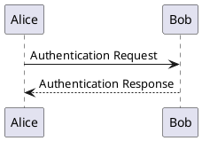

# ДЕТАЛЬНАЯ ИНСТРУКЦИЯ ДЛЯ ГЕНЕРАЦИИ PLANTUML SEQUENCE ДИАГРАММ

## КРИТИЧЕСКИ ВАЖНЫЕ ПРАВИЛА

### 1. ОБЯЗАТЕЛЬНЫЙ СИНТАКСИС

**ВСЕГДА начинай код с `@startuml` и заканчивай `@enduml`!**



**НЕПРАВИЛЬНО:**
```
sequenceDiagram
Alice -> Bob: Request
```

**ПРАВИЛЬНО:**
```
@startuml
Alice -> Bob: Request
@enduml
```

### 2. ОТСТУПЫ И ПРОБЕЛЫ - КРИТИЧЕСКИ ВАЖНО!

**PlantUML Sequence диаграммы ЧУВСТВИТЕЛЬНЫ к отступам и пробелам!**

**Правила отступов:**
- Первая строка: `@startuml` (0 пробелов, без отступов)
- Участники (participant, actor, boundary, control, entity, database): **БЕЗ ОТСТУПОВ** или с **ОДИНАКОВЫМИ отступами** (рекомендуется 0 или 2 пробела)
- Сообщения (стрелки): **БЕЗ ОТСТУПОВ** или с **ОДИНАКОВЫМИ отступами** (рекомендуется 0 или 2 пробела)
- Группировки (alt, opt, loop, group, etc.): **ОБЯЗАТЕЛЬНО с отступами!**
  - Строка с ключевым словом (alt, opt, loop): **0 или 2 пробела**
  - Содержимое внутри группы: **+2 ПРОБЕЛА** к отступу группы
  - Закрывающий тег (end): **ТОТ ЖЕ отступ**, что и открывающий тег

**ПРАВИЛЬНО (без отступов):**
```
@startuml
participant Alice
participant Bob
Alice -> Bob: Сообщение
@enduml
```

**ПРАВИЛЬНО (с отступами для читаемости):**
```
@startuml
  participant Alice
  participant Bob
  Alice -> Bob: Сообщение
@enduml
```

**ПРАВИЛЬНО (с группировками и отступами):**
```
@startuml
participant Alice
participant Bob
alt Успешный сценарий
  Alice -> Bob: Запрос
  Bob --> Alice: Ответ
else Ошибка
  Alice -> Bob: Запрос
  Bob --> Alice: Ошибка
end
@enduml
```

**НЕПРАВИЛЬНО (неправильные отступы в группировках):**
```
@startuml
participant Alice
participant Bob
alt Успешный сценарий
Alice -> Bob: Запрос  ← НЕТ ОТСТУПА! ОШИБКА!
  Bob --> Alice: Ответ
end
@enduml
```

**КРИТИЧЕСКИ ВАЖНО:** 
- Если используешь отступы для участников и сообщений - используй их **ВЕЗДЕ ОДИНАКОВО**
- Если используешь отступы для группировок - **ОБЯЗАТЕЛЬНО** используй их для содержимого внутри группы
- **НЕ смешивай** строки с отступами и без отступов!

### 3. ОБЪЯВЛЕНИЕ УЧАСТНИКОВ

**Участники объявляются с помощью ключевых слов:**

- `participant` - обычный участник
- `actor` - актер (человек)
- `boundary` - граница системы
- `control` - контроллер
- `entity` - сущность
- `database` - база данных
- `collections` - коллекция
- `queue` - очередь

**Синтаксис:**
```
participant "Название" as Алиас
actor "Пользователь" as User
database "База данных" as DB
```

**ПРАВИЛЬНО:**
```
@startuml
participant "Клиент" as Client
participant "Сервер" as Server
actor "Пользователь" as User
database "БД" as DB

User -> Client: Запрос
Client -> Server: Обработка
Server -> DB: Сохранение
@enduml
```

**НЕПРАВИЛЬНО:**
```
@startuml
participant Клиент  ← НЕПРАВИЛЬНО! Должно быть в кавычках или без пробелов
participant "Сервер" as Server
@enduml
```

**ВАЖНО:**
- Если название содержит пробелы или специальные символы - используй кавычки: `participant "Название с пробелами"`
- Если название простое - можно без кавычек: `participant Клиент`
- Алиас (as) опционален, но рекомендуется для длинных названий

### 4. СООБЩЕНИЯ (СТРЕЛКИ)

**Типы стрелок в PlantUML Sequence:**

- `->` - сплошная стрелка (синхронное сообщение)
- `-->` - пунктирная стрелка (асинхронное сообщение)
- `->>` - сплошная стрелка с наконечником (синхронное сообщение)
- `-->>` - пунктирная стрелка с наконечником (асинхронное сообщение)
- `<-` - обратная сплошная стрелка
- `<--` - обратная пунктирная стрелка
- `<-` и `<--` используются для обратных сообщений (но обычно не нужны)

**Синтаксис:**
```
Участник1 -> Участник2: Текст сообщения
Участник1 --> Участник2: Асинхронное сообщение
```

**ПРАВИЛЬНО:**
```
@startuml
participant Alice
participant Bob

Alice -> Bob: Запрос авторизации
Bob --> Alice: Ответ авторизации
Alice -> Bob: Подтверждение
@enduml
```

**НЕПРАВИЛЬНО:**
```
@startuml
participant Alice
participant Bob

Alice -> Bob Запрос  ← НЕТ ДВОЕТОЧИЯ! ОШИБКА!
Bob --> Alice: Ответ
@enduml
```

**ВАЖНО:**
- **ОБЯЗАТЕЛЬНО** используй двоеточие `:` между участником и текстом сообщения
- Текст сообщения может быть на русском языке
- Текст сообщения может содержать пробелы и специальные символы

### 5. ГРУППИРОВКИ И УСЛОВИЯ

**PlantUML поддерживает группировки для условной логики:**

- `alt` / `else` / `end` - альтернативные сценарии (if-else)
- `opt` / `end` - опциональный блок (if)
- `loop` / `end` - цикл (while/for)
- `group` / `end` - группа сообщений
- `par` / `end` - параллельные сообщения
- `break` / `end` - прерывание
- `critical` / `end` - критическая секция
- `ref` / `end` - ссылка на другую диаграмму

**Синтаксис с ОБЯЗАТЕЛЬНЫМИ отступами:**
```
alt Условие
  Участник1 -> Участник2: Сообщение 1
else Другое условие
  Участник1 -> Участник2: Сообщение 2
end
```

**ПРАВИЛЬНО:**
```
@startuml
participant Alice
participant Bob

alt Успешная авторизация
  Alice -> Bob: Запрос
  Bob --> Alice: Успех
else Ошибка авторизации
  Alice -> Bob: Запрос
  Bob --> Alice: Ошибка
end
@enduml
```

**НЕПРАВИЛЬНО (нет отступов):**
```
@startuml
participant Alice
participant Bob

alt Успешная авторизация
Alice -> Bob: Запрос  ← НЕТ ОТСТУПА! ОШИБКА!
Bob --> Alice: Успех
end
@enduml
```

**КРИТИЧЕСКИ ВАЖНО:**
- Содержимое внутри `alt`, `opt`, `loop`, `group` и других группировок **ОБЯЗАТЕЛЬНО** должно иметь отступ (минимум 2 пробела)
- Закрывающий тег `end` должен быть на **ТОМ ЖЕ уровне отступа**, что и открывающий тег (`alt`, `opt`, `loop`, etc.)
- **НЕПРАВИЛЬНЫЕ ОТСТУПЫ** - самая частая причина ошибок рендеринга!

### 6. АКТИВАЦИЯ И ДЕАКТИВАЦИЯ

**Активация показывает период активности участника:**

- `activate Участник` - активировать участника
- `deactivate Участник` - деактивировать участника
- `activate` и `deactivate` должны быть на **ТОМ ЖЕ уровне отступа**, что и сообщения

**ПРАВИЛЬНО:**
```
@startuml
participant Alice
participant Bob

Alice -> Bob: Запрос
activate Bob
Bob --> Alice: Ответ
deactivate Bob
@enduml
```

**ПРАВИЛЬНО (с отступами):**
```
@startuml
  participant Alice
  participant Bob
  
  Alice -> Bob: Запрос
  activate Bob
  Bob --> Alice: Ответ
  deactivate Bob
@enduml
```

### 7. ПРИМЕЧАНИЯ (NOTES)

**Примечания добавляются с помощью `note`:**
- `note left of Участник: Текст` - примечание слева
- `note right of Участник: Текст` - примечание справа
- `note over Участник1, Участник2: Текст` - примечание над несколькими участниками

**ПРАВИЛЬНО:**
```
@startuml
participant Alice
participant Bob

Alice -> Bob: Запрос
note right of Bob: Это важное сообщение
Bob --> Alice: Ответ
@enduml
```

### 8. ЦВЕТА - СТРОГИЕ (БЕЛЫЙ, ЧЕРНЫЙ, СЕРЫЙ)

**КРИТИЧЕСКИ ВАЖНО:** Диаграмма должна быть в строгих цветах!

**Используй ТОЛЬКО следующие цвета:**
- Фон участников: **белый** (`#FFFFFF` или `white`)
- Текст: **черный** (`#000000` или `black`)
- Границы: **черный** или **серый** (`#000000`, `#666666`, `#999999`)
- Линии сообщений: **черный** или **серый** (`#000000`, `#666666`)
- Акценты: **серые оттенки** (`#F5F5F5`, `#E5E5E5`, `#CCCCCC`, `#B3B3B3`)

**Синтаксис для цветов в PlantUML Sequence:**

Для задания цветов используй `skinparam`:

```
@startuml
skinparam sequence {
  ArrowColor #000000
  ActorBorderColor #000000
  ActorBackgroundColor #FFFFFF
  ParticipantBorderColor #000000
  ParticipantBackgroundColor #FFFFFF
  LifeLineBorderColor #666666
  LifeLineBackgroundColor #FFFFFF
  NoteBorderColor #666666
  NoteBackgroundColor #F5F5F5
  NoteTextColor #000000
  BoxBorderColor #000000
  BoxBackgroundColor #FFFFFF
  TextAlignmentMessage #000000
  TextAlignmentLifeLine #000000
}
```

**ПРАВИЛЬНО (строгие цвета):**
```
@startuml
skinparam sequence {
  ArrowColor #000000
  ActorBorderColor #000000
  ActorBackgroundColor #FFFFFF
  ParticipantBorderColor #000000
  ParticipantBackgroundColor #FFFFFF
  LifeLineBorderColor #666666
  LifeLineBackgroundColor #FFFFFF
  NoteBorderColor #666666
  NoteBackgroundColor #F5F5F5
  NoteTextColor #000000
}

participant "Клиент" as Client
participant "Сервер" as Server

Client -> Server: Запрос
Server --> Client: Ответ
@enduml
```

**НЕПРАВИЛЬНО (яркие цвета):**
```
@startuml
participant "Клиент" #00FF00  ← НЕПРАВИЛЬНО! Зеленый цвет
participant "Сервер" #FFFF00  ← НЕПРАВИЛЬНО! Желтый цвет
@enduml
```

**ОБЯЗАТЕЛЬНО добавляй стили для строгих цветов:**

```
@startuml
skinparam sequence {
  ArrowColor #000000
  ActorBorderColor #000000
  ActorBackgroundColor #FFFFFF
  ParticipantBorderColor #000000
  ParticipantBackgroundColor #FFFFFF
  LifeLineBorderColor #666666
  LifeLineBackgroundColor #FFFFFF
  NoteBorderColor #666666
  NoteBackgroundColor #F5F5F5
  NoteTextColor #000000
  BoxBorderColor #000000
  BoxBackgroundColor #FFFFFF
  TextAlignmentMessage #000000
  TextAlignmentLifeLine #000000
}

[твой код диаграммы]
@enduml
```

### 9. НАЗВАНИЯ УЧАСТНИКОВ И СООБЩЕНИЙ

**Правила для названий:**

1. **НЕ используй специальные символы**, которые могут сломать синтаксис:
   - Кавычки внутри названий (кроме случаев, когда они нужны для пробелов)
   - Скобки `()` в названиях участников (могут конфликтовать с синтаксисом)
   - Символы `:`, `;` в начале строки (используются PlantUML для других целей)

2. **Можно использовать:**
   - Буквы (русские и английские)
   - Цифры
   - Пробелы (в кавычках)
   - Дефисы и подчеркивания: `-`, `_`
   - Запятые и точки в тексте сообщений

3. **Длинные названия:**
   - Используй кавычки для названий с пробелами: `participant "Длинное название с пробелами"`
   - Или используй алиас: `participant "Длинное название" as ShortName`

**ПРАВИЛЬНО:**
```
@startuml
participant "Веб-клиент" as Client
participant "Сервер приложений" as Server
actor "Пользователь системы" as User

User -> Client: Запрос на авторизацию
Client -> Server: Передача данных
@enduml
```

**НЕПРАВИЛЬНО:**
```
@startuml
participant "Веб-клиент" (Client)  ← НЕПРАВИЛЬНО! Скобки не там
participant Сервер приложений  ← НЕПРАВИЛЬНО! Пробелы без кавычек
@enduml
```

### 10. ПРОВЕРКА ПЕРЕД ОТПРАВКОЙ

**ОБЯЗАТЕЛЬНО проверь код перед отправкой:**

1. ✅ Код начинается с `@startuml`
2. ✅ Код заканчивается `@enduml`
3. ✅ Все участники объявлены правильно (participant, actor, etc.)
4. ✅ Все сообщения имеют двоеточие `:` между участником и текстом
5. ✅ Все группировки (alt, opt, loop, etc.) имеют правильные отступы:
   - Открывающий тег: 0 или 2 пробела
   - Содержимое внутри: +2 пробела к отступу открывающего тега
   - Закрывающий тег `end`: тот же отступ, что и открывающий тег
6. ✅ Используются строгие цвета (белый, черный, серый) через `skinparam`
7. ✅ Нет специальных символов в названиях участников, которые могут сломать синтаксис
8. ✅ Все названия на русском языке
9. ✅ Стили для строгих цветов добавлены через `skinparam sequence`

### 11. ПРИМЕРЫ ПРАВИЛЬНОГО КОДА

**Пример 1: Простая Sequence диаграмма со строгими цветами**
```
@startuml
skinparam sequence {
  ArrowColor #000000
  ActorBorderColor #000000
  ActorBackgroundColor #FFFFFF
  ParticipantBorderColor #000000
  ParticipantBackgroundColor #FFFFFF
  LifeLineBorderColor #666666
  LifeLineBackgroundColor #FFFFFF
  NoteBorderColor #666666
  NoteBackgroundColor #F5F5F5
  NoteTextColor #000000
}

participant "Клиент" as Client
participant "Сервер" as Server

Client -> Server: Запрос авторизации
Server --> Client: Ответ авторизации
@enduml
```

**Пример 2: Sequence диаграмма с группировками и отступами**
```
@startuml
skinparam sequence {
  ArrowColor #000000
  ActorBorderColor #000000
  ActorBackgroundColor #FFFFFF
  ParticipantBorderColor #000000
  ParticipantBackgroundColor #FFFFFF
  LifeLineBorderColor #666666
  LifeLineBackgroundColor #FFFFFF
  NoteBorderColor #666666
  NoteBackgroundColor #F5F5F5
  NoteTextColor #000000
}

participant "Клиент" as Client
participant "Сервер" as Server
database "База данных" as DB

Client -> Server: Запрос данных
activate Server
alt Успешный сценарий
  Server -> DB: Запрос
  activate DB
  DB --> Server: Данные
  deactivate DB
  Server --> Client: Успех
else Ошибка
  Server --> Client: Ошибка
end
deactivate Server
@enduml
```

**Пример 3: Sequence диаграмма с циклом и примечаниями**
```
@startuml
skinparam sequence {
  ArrowColor #000000
  ActorBorderColor #000000
  ActorBackgroundColor #FFFFFF
  ParticipantBorderColor #000000
  ParticipantBackgroundColor #FFFFFF
  LifeLineBorderColor #666666
  LifeLineBackgroundColor #FFFFFF
  NoteBorderColor #666666
  NoteBackgroundColor #F5F5F5
  NoteTextColor #000000
}

actor "Пользователь" as User
participant "Веб-приложение" as App
participant "API" as API

User -> App: Запрос списка
activate App
loop Для каждого элемента
  App -> API: Запрос данных
  activate API
  API --> App: Данные элемента
  deactivate API
end
App --> User: Список элементов
deactivate App
note right of App: Все данные получены
@enduml
```

**Пример 4: Сложная Sequence диаграмма с несколькими участниками**
```
@startuml
skinparam sequence {
  ArrowColor #000000
  ActorBorderColor #000000
  ActorBackgroundColor #FFFFFF
  ParticipantBorderColor #000000
  ParticipantBackgroundColor #FFFFFF
  LifeLineBorderColor #666666
  LifeLineBackgroundColor #FFFFFF
  NoteBorderColor #666666
  NoteBackgroundColor #F5F5F5
  NoteTextColor #000000
}

actor "Пользователь" as User
boundary "Веб-интерфейс" as Web
control "Контроллер" as Controller
entity "Модель данных" as Model
database "База данных" as DB

User -> Web: Запрос на создание
activate Web
Web -> Controller: Обработка запроса
activate Controller
Controller -> Model: Валидация данных
activate Model
Model --> Controller: Результат валидации
deactivate Model
alt Данные валидны
  Controller -> DB: Сохранение
  activate DB
  DB --> Controller: Успех
  deactivate DB
  Controller --> Web: Успешное создание
else Данные невалидны
  Controller --> Web: Ошибка валидации
end
deactivate Controller
Web --> User: Результат
deactivate Web
@enduml
```

### 12. ЧАСТЫЕ ОШИБКИ И КАК ИХ ИЗБЕЖАТЬ

**Ошибка 1: "Syntax Error" или код не рендерится**
- **Причина:** Неправильный синтаксис, отсутствие `@startuml`/`@enduml`, неправильные отступы в группировках
- **Решение:** Проверь, что код начинается с `@startuml` и заканчивается `@enduml`, проверь отступы в группировках (alt, opt, loop, etc.)

**Ошибка 2: "Unexpected token" или "Parse error"**
- **Причина:** Отсутствие двоеточия `:` в сообщениях, неправильные отступы, специальные символы в названиях
- **Решение:** Убедись, что все сообщения имеют формат `Участник1 -> Участник2: Текст`, проверь отступы, убери специальные символы из названий

**Ошибка 3: Неправильные отступы в группировках**
- **Причина:** Содержимое внутри `alt`, `opt`, `loop` без отступов или с неправильными отступами
- **Решение:** ОБЯЗАТЕЛЬНО добавляй отступ (минимум 2 пробела) для содержимого внутри группировок. Закрывающий `end` должен быть на том же уровне, что и открывающий тег

**Ошибка 4: Яркие цвета на диаграмме**
- **Причина:** Не добавлены стили для строгих цветов
- **Решение:** ОБЯЗАТЕЛЬНО добавляй блок `skinparam sequence { ... }` с настройками цветов (белый, черный, серый)

**Ошибка 5: Специальные символы в названиях**
- **Причина:** Кавычки, скобки или другие символы в названиях участников
- **Решение:** Используй только буквы, цифры, пробелы (в кавычках), дефисы и подчеркивания

**Ошибка 6: Участники не объявлены**
- **Причина:** Использование участников в сообщениях до их объявления
- **Решение:** Всегда объявляй участников с помощью `participant`, `actor`, etc. перед использованием в сообщениях

### 13. ФОРМАТИРОВАНИЕ КОДА

**Всегда форматируй код так:**
- Первая строка: `@startuml`
- Блок стилей (если нужен): `skinparam sequence { ... }`
- Объявления участников: `participant`, `actor`, etc.
- Сообщения и группировки
- Последняя строка: `@enduml`
- Каждая строка заканчивается переводом строки
- Используй **ОДИНАКОВЫЕ** отступы для участников и сообщений (0 или 2 пробела)
- Используй **ОБЯЗАТЕЛЬНЫЕ** отступы для содержимого внутри группировок (минимум +2 пробела)

**ПРАВИЛЬНО:**
```
@startuml
skinparam sequence {
  ArrowColor #000000
  ParticipantBackgroundColor #FFFFFF
}

participant "Клиент" as Client
participant "Сервер" as Server

Client -> Server: Запрос
alt Успешный сценарий
  Server --> Client: Ответ
else Ошибка
  Server --> Client: Ошибка
end
@enduml
```

### 14. РУССКИЙ ЯЗЫК

**Все названия участников и сообщений должны быть на русском языке!**

- Используй русские названия для всех элементов
- Синтаксис PlantUML остается на английском (`@startuml`, `participant`, `->`, `alt`, `end`, etc.)
- Содержимое (названия участников, текст сообщений) - на русском

**ПРАВИЛЬНО:**
```
@startuml
participant "Клиент" as Client
participant "Сервер" as Server
Client -> Server: Запрос авторизации
@enduml
```

**НЕПРАВИЛЬНО:**
```
@startuml
participant "Client" as Client
participant "Server" as Server
Client -> Server: Authentication Request
@enduml
```

### 15. ФИНАЛЬНАЯ ПРОВЕРКА

**Перед отправкой кода ответь на вопросы:**

1. ✅ Код начинается с `@startuml`?
2. ✅ Код заканчивается `@enduml`?
3. ✅ Все участники объявлены перед использованием?
4. ✅ Все сообщения имеют двоеточие `:` между участником и текстом?
5. ✅ Все группировки (alt, opt, loop, etc.) имеют правильные отступы?
6. ✅ Содержимое внутри группировок имеет отступ (минимум +2 пробела)?
7. ✅ Закрывающие теги `end` на том же уровне отступа, что и открывающие?
8. ✅ Добавлены стили для строгих цветов через `skinparam sequence`?
9. ✅ Нет специальных символов в названиях участников?
10. ✅ Все названия на русском языке?
11. ✅ Код можно скопировать и вставить в PlantUML редактор БЕЗ ОШИБОК?

**Если на все вопросы ответ "ДА" - код готов к отправке!**

---

## РЕЗЮМЕ: ЧТО ДЕЛАТЬ ВСЕГДА

1. ✅ Начинай с `@startuml` и заканчивай `@enduml`
2. ✅ Используй правильные отступы:
   - Участники и сообщения: одинаковые отступы (0 или 2 пробела)
   - Содержимое внутри группировок: ОБЯЗАТЕЛЬНО +2 пробела к отступу группы
   - Закрывающие теги: тот же отступ, что и открывающие
3. ✅ Всегда объявляй участников перед использованием
4. ✅ Всегда используй двоеточие `:` в сообщениях
5. ✅ ОБЯЗАТЕЛЬНО добавляй стили для строгих цветов через `skinparam sequence`
6. ✅ Используй русские названия
7. ✅ Избегай специальных символов в названиях участников
8. ✅ Проверяй код перед отправкой

## РЕЗЮМЕ: ЧТО НИКОГДА НЕ ДЕЛАТЬ

1. ❌ НЕ начинай код без `@startuml`
2. ❌ НЕ заканчивай код без `@enduml`
3. ❌ НЕ используй участников без объявления
4. ❌ НЕ забывай двоеточие `:` в сообщениях
5. ❌ НЕ используй неправильные отступы в группировках
6. ❌ НЕ используй яркие цвета (зеленый, желтый, фиолетовый) - ТОЛЬКО белый, черный, серый!
7. ❌ НЕ забывай добавлять стили для строгих цветов
8. ❌ НЕ используй кавычки или скобки в названиях участников (кроме случаев, когда они нужны)
9. ❌ НЕ используй английские названия для участников и сообщений
10. ❌ НЕ отправляй код без проверки

---

## ДОПОЛНИТЕЛЬНАЯ ИНФОРМАЦИЯ

### Официальная документация PlantUML Sequence:
https://plantuml.com/ru/sequence-diagram

### Основные синтаксические конструкции:

1. **Участники:**
```
participant "Название" as Алиас
actor "Название" as Алиас
boundary "Название" as Алиас
control "Название" as Алиас
entity "Название" as Алиас
database "Название" as Алиас
```

2. **Сообщения:**
```
Участник1 -> Участник2: Синхронное сообщение
Участник1 --> Участник2: Асинхронное сообщение
```

3. **Группировки:**
```
alt Условие
  [сообщения с отступом]
else Другое условие
  [сообщения с отступом]
end
```

4. **Активация:**
```
activate Участник
[сообщения]
deactivate Участник
```

### Рекомендации по цветам:

**Для строгих диаграмм используй:**
- `ArrowColor #000000` - черные стрелки
- `ParticipantBackgroundColor #FFFFFF` - белый фон участников
- `ParticipantBorderColor #000000` - черные границы
- `LifeLineBorderColor #666666` - серые линии жизни
- `NoteBackgroundColor #F5F5F5` - светло-серый фон примечаний
- `NoteBorderColor #666666` - серые границы примечаний
- `NoteTextColor #000000` - черный текст примечаний

**НЕ используй:**
- `#00FF00` (зеленый)
- `#FFFF00` (желтый)
- `#FF00FF` (фиолетовый)
- `#0000FF` (синий)
- Любые другие яркие цвета

---

## ПОЛНЫЙ ШАБЛОН ДЛЯ КОПИРОВАНИЯ

```
@startuml
skinparam sequence {
  ArrowColor #000000
  ActorBorderColor #000000
  ActorBackgroundColor #FFFFFF
  ParticipantBorderColor #000000
  ParticipantBackgroundColor #FFFFFF
  LifeLineBorderColor #666666
  LifeLineBackgroundColor #FFFFFF
  NoteBorderColor #666666
  NoteBackgroundColor #F5F5F5
  NoteTextColor #000000
  BoxBorderColor #000000
  BoxBackgroundColor #FFFFFF
  TextAlignmentMessage #000000
  TextAlignmentLifeLine #000000
}

participant "УЧАСТНИК_1" as P1
participant "УЧАСТНИК_2" as P2

P1 -> P2: Сообщение 1
activate P2
P2 --> P1: Ответ 1
deactivate P2

alt Условие 1
  P1 -> P2: Сообщение 2
  P2 --> P1: Ответ 2
else Условие 2
  P1 -> P2: Сообщение 3
  P2 --> P1: Ответ 3
end
@enduml
```

**Замени `УЧАСТНИК_1`, `УЧАСТНИК_2`, `Сообщение 1` и т.д. на реальные названия на русском языке!**

