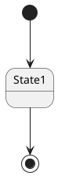

# ДЕТАЛЬНАЯ ИНСТРУКЦИЯ ДЛЯ ГЕНЕРАЦИИ PLANTUML STATECHART ДИАГРАММ

## КРИТИЧЕСКИ ВАЖНЫЕ ПРАВИЛА

### 1. ОБЯЗАТЕЛЬНЫЙ СИНТАКСИС

**ВСЕГДА начинай код с `@startuml` и заканчивай `@enduml`!**



**НЕПРАВИЛЬНО:**
```
state diagram
[*] --> State1
```

**ПРАВИЛЬНО:**
```
@startuml
[*] --> State1
State1 --> [*]
@enduml
```

### 2. ОТСТУПЫ И ПРОБЕЛЫ - КРИТИЧЕСКИ ВАЖНО!

**PlantUML State диаграммы КРИТИЧЕСКИ ЧУВСТВИТЕЛЬНЫ к отступам и пробелам!**

**Правила отступов:**
- Первая строка: `@startuml` (0 пробелов, без отступов)
- Последняя строка: `@enduml` (0 пробелов, без отступов)
- Объявления состояний (`state`, `[*]`): **БЕЗ ОТСТУПОВ** или с **ОДИНАКОВЫМИ отступами** (рекомендуется 0 пробелов)
- Переходы (`-->`, `->`): **БЕЗ ОТСТУПОВ** или с **ОДИНАКОВЫМИ отступами** (рекомендуется 0 пробелов)
- Содержимое внутри составных состояний (`state Name { ... }`): **ОБЯЗАТЕЛЬНО с отступами!**
  - Строка с объявлением состояния (`state Name {`): **0 пробелов**
  - Содержимое внутри состояния (переходы, описания): **+2 ПРОБЕЛА** к отступу блока
  - Закрывающая скобка (`}`): **ТОТ ЖЕ отступ**, что и открывающая строка (0 пробелов)

**ПРАВИЛЬНО (без отступов):**
```
@startuml
[*] --> State1
State1 --> State2
State2 --> [*]
@enduml
```

**ПРАВИЛЬНО (с отступами для составных состояний):**
```
@startuml
[*] --> State1
state State1 {
  [*] --> SubState1
  SubState1 --> SubState2
  SubState2 --> [*]
}
State1 --> State2
State2 --> [*]
@enduml
```

**НЕПРАВИЛЬНО (неправильные отступы):**
```
@startuml
[*] --> State1
state State1 {
[*] --> SubState1  ← НЕТ ОТСТУПА! ОШИБКА!
  SubState2 --> [*]
}
@enduml
```

**КРИТИЧЕСКИ ВАЖНО:** 
- Если используешь отступы для содержимого внутри составных состояний - используй их **ВЕЗДЕ ОДИНАКОВО** (+2 пробела)
- Если используешь отступы для блоков - **ОБЯЗАТЕЛЬНО** используй их для содержимого внутри блока
- **НЕ смешивай** строки с отступами и без отступов!
- Переходы и объявления состояний должны быть **БЕЗ ОТСТУПОВ** (0 пробелов), кроме случаев, когда они внутри составных состояний

### 3. НАЧАЛЬНОЕ И КОНЕЧНОЕ СОСТОЯНИЯ

**Для начального и конечного состояний используется `[*]` (звездочка в квадратных скобках):**

**ПРАВИЛЬНО:**
```
@startuml
[*] --> State1
State1 --> [*]
@enduml
```

**НЕПРАВИЛЬНО:**
```
@startuml
start --> State1  ← НЕПРАВИЛЬНО! Используй [*]
State1 --> end  ← НЕПРАВИЛЬНО! Используй [*]
@enduml
```

**ВАЖНО:**
- **ОБЯЗАТЕЛЬНО** используй `[*]` для начального и конечного состояний
- Может быть несколько конечных состояний `[*]` в разных ветках
- Начальное состояние `[*]` обычно одно

### 4. ПЕРЕХОДЫ МЕЖДУ СОСТОЯНИЯМИ

**Переходы обозначаются стрелками `-->` или `->`:**

**Синтаксис:**
```
State1 --> State2
State1 -> State2 : Событие
State1 --> State2 : Событие / Действие
State1 --> State2 : Событие [Условие] / Действие
```

**ПРАВИЛЬНО:**
```
@startuml
[*] --> State1
State1 --> State2 : Событие1
State2 --> State3 : Событие2 / Действие1
State3 --> [*] : Событие3 [Условие] / Действие2
@enduml
```

**НЕПРАВИЛЬНО:**
```
@startuml
[*] --> State1
State1 --> State2 Событие1  ← НЕПРАВИЛЬНО! Нет : после стрелки
State2 -- State3 : Событие2  ← НЕПРАВИЛЬНО! Должна быть одна стрелка
@enduml
```

**ВАЖНО:**
- Используй `-->` для переходов (рекомендуется) или `->`
- Для подписей переходов используй `:` после стрелки
- Формат: `State1 --> State2 : Описание`
- Можно использовать расширенный формат: `State1 --> State2 : Событие [Условие] / Действие`

### 5. ОПИСАНИЯ СОСТОЯНИЙ

**Для добавления описаний состояний используй двоеточие:**

**Синтаксис:**
```
State1 : Описание состояния
State1 : Первая строка описания
State1 : Вторая строка описания
```

**ПРАВИЛЬНО:**
```
@startuml
[*] --> State1
State1 : Это описание состояния
State1 : Многострочное описание
State1 : Строка 1
State1 : Строка 2
State1 --> State2
@enduml
```

**НЕПРАВИЛЬНО:**
```
@startuml
[*] --> State1
State1 Описание  ← НЕПРАВИЛЬНО! Нужно :
State1:Описание  ← НЕПРАВИЛЬНО! Нужен пробел после :
@enduml
```

**ВАЖНО:**
- Используй `:` после названия состояния для описания
- **ОБЯЗАТЕЛЬНО** должен быть пробел между `:` и текстом: `State1 : Описание`
- Можно использовать несколько строк описания

### 6. СОСТАВНЫЕ СОСТОЯНИЯ

**Для создания составных состояний используй `state Name { ... }`:**

**ПРАВИЛЬНО:**
```
@startuml
[*] --> State1
state State1 {
  [*] --> SubState1
  SubState1 --> SubState2
  SubState2 --> [*]
}
State1 --> State2
State2 --> [*]
@enduml
```

**ПРАВИЛЬНО (вложенные состояния):**
```
@startuml
[*] --> State1
state State1 {
  state SubState1 {
    [*] --> InnerState1
    InnerState1 --> InnerState2
    InnerState2 --> [*]
  }
  SubState1 --> SubState2
  SubState2 --> [*]
}
@enduml
```

**НЕПРАВИЛЬНО:**
```
@startuml
[*] --> State1
state State1 {
[*] --> SubState1  ← НЕТ ОТСТУПА! ОШИБКА!
SubState1 --> SubState2  ← НЕТ ОТСТУПА! ОШИБКА!
}
@enduml
```

**КРИТИЧЕСКИ ВАЖНО:**
- Содержимое внутри составного состояния **ОБЯЗАТЕЛЬНО** должно иметь отступ **+2 ПРОБЕЛА**
- Закрывающая скобка `}` должна быть на том же уровне, что и `state` (0 пробелов)
- Можно создавать вложенные состояния (состояния внутри состояний)

### 7. ИСТОРИЯ СОСТОЯНИЙ [H] И [H*]

**Для истории состояний используй `[H]` (недавняя история) и `[H*]` (глубокая история):**

**Синтаксис:**
```
State1 --> [H]
State2 --> [H*]
State3 --> State1[H*]
```

**ПРАВИЛЬНО:**
```
@startuml
[*] --> State1
State1 --> State2
state State2 {
  [*] --> SubState1
  SubState1 --> SubState2
  SubState2 --> [*]
}
State2 --> State3
State3 --> [H] : Возврат к недавней истории
State1 --> State2[H*] : Возврат к глубокой истории
@enduml
```

**ВАЖНО:**
- `[H]` - возврат к недавней истории (shallow history)
- `[H*]` - возврат к глубокой истории (deep history)
- Можно использовать в переходах: `State1 --> State2[H*]`

### 8. ВЕТВЛЕНИЕ И СЛИЯНИЕ (FORK/JOIN)

**Для ветвления и слияния используй стереотипы `<<fork>>` и `<<join>>`:**

**ПРАВИЛЬНО:**
```
@startuml
state fork_state <<fork>>
[*] --> fork_state
fork_state --> State2
fork_state --> State3
State2 --> join_state
State3 --> join_state
state join_state <<join>>
join_state --> State4
State4 --> [*]
@enduml
```

**ВАЖНО:**
- Используй `state имя <<fork>>` для ветвления
- Используй `state имя <<join>>` для слияния
- Состояния fork и join должны быть объявлены перед использованием

### 9. УСЛОВИЯ ВЫБОРА (CHOICE)

**Для условий выбора используй стереотип `<<choice>>`:**

**ПРАВИЛЬНО:**
```
@startuml
[*] --> State1
State1 --> choice_state
state choice_state <<choice>>
choice_state --> State2 : Условие1
choice_state --> State3 : Условие2
choice_state --> State4 : Иначе
State2 --> [*]
State3 --> [*]
State4 --> [*]
@enduml
```

**ВАЖНО:**
- Используй `state имя <<choice>>` для условий выбора
- Из choice должно быть несколько переходов с условиями
- Один переход может быть без условия (иначе)

### 10. ДЛИННЫЕ ИМЕНА СОСТОЯНИЙ

**Для длинных имен состояний используй `state` с `as`:**

**ПРАВИЛЬНО:**
```
@startuml
state "Очень длинное название состояния" as LongState
[*] --> LongState
LongState --> State2
@enduml
```

**ПРАВИЛЬНО (с переносами строк):**
```
@startuml
state "Длинное название\\nс переносом строк" as LongState
[*] --> LongState
LongState --> State2
@enduml
```

**ВАЖНО:**
- Используй кавычки для длинных названий: `state "Название" as Alias`
- Можно использовать `\\n` для переноса строк
- Затем используй alias в переходах: `Alias --> State2`

### 11. ЦВЕТА - СТРОГИЕ (БЕЛЫЙ, ЧЕРНЫЙ, СЕРЫЙ)

**КРИТИЧЕСКИ ВАЖНО:** Диаграмма должна быть в строгих цветах!

**Используй ТОЛЬКО следующие цвета:**
- Фон состояний: **белый** (`#FFFFFF` или `white`)
- Текст: **черный** (`#000000` или `black`)
- Границы: **черный** или **серый** (`#000000`, `#666666`, `#999999`)
- Стрелки: **черный** или **серый** (`#000000`, `#666666`)
- Акценты: **серые оттенки** (`#F5F5F5`, `#E5E5E5`, `#CCCCCC`, `#B3B3B3`)

**Синтаксис для цветов в PlantUML State:**

Для задания цветов используй `skinparam`:

```
@startuml
skinparam state {
  BackgroundColor #FFFFFF
  BorderColor #000000
  FontColor #000000
  ArrowColor #000000
}
[*] --> State1
State1 --> [*]
@enduml
```

**ПРАВИЛЬНО (строгие цвета):**
```
@startuml
skinparam state {
  BackgroundColor #FFFFFF
  BorderColor #000000
  FontColor #000000
  ArrowColor #000000
}
skinparam stateArrow {
  Color #000000
}
skinparam note {
  BackgroundColor #F5F5F5
  BorderColor #666666
  FontColor #000000
}
[*] --> State1
State1 : Описание состояния
State1 --> State2
State2 --> [*]
@enduml
```

**НЕПРАВИЛЬНО (яркие цвета):**
```
@startuml
skinparam state {
  BackgroundColor #00FF00  ← НЕПРАВИЛЬНО! Зеленый цвет
  BorderColor #FFFF00  ← НЕПРАВИЛЬНО! Желтый цвет
  FontColor #FF00FF  ← НЕПРАВИЛЬНО! Фиолетовый цвет
}
[*] --> State1
State1 --> [*]
@enduml
```

**ОБЯЗАТЕЛЬНО добавляй стили для строгих цветов:**

```
@startuml
skinparam state {
  BackgroundColor #FFFFFF
  BorderColor #000000
  FontColor #000000
  ArrowColor #000000
}
skinparam stateArrow {
  Color #000000
}
skinparam stateBody {
  BackgroundColor #FFFFFF
  BorderColor #000000
}
skinparam note {
  BackgroundColor #F5F5F5
  BorderColor #666666
  FontColor #000000
}
skinparam arrow {
  Color #000000
  FontColor #000000
}
[*] --> State1
State1 --> State2
State2 --> [*]
@enduml
```

### 12. ИЗМЕНЕНИЕ ОТОБРАЖЕНИЯ СОСТОЯНИЙ

**Для скрытия пустых описаний используй `hide empty description`:**

**ПРАВИЛЬНО:**
```
@startuml
hide empty description
[*] --> State1
State1 : Это описание видно
State1 --> State2
State2 --> [*]
@enduml
```

**ВАЖНО:**
- `hide empty description` скрывает состояния без описаний, делая их простыми прямоугольниками
- Используй в начале диаграммы, сразу после `@startuml`

### 13. ПРОВЕРКА ПЕРЕД ОТПРАВКОЙ

**ОБЯЗАТЕЛЬНО проверь код перед отправкой:**

1.  Код начинается с `@startuml`
2.  Код заканчивается `@enduml`
3.  Все переходы имеют правильный синтаксис (`-->` или `->`)
4.  Все начальные и конечные состояния используют `[*]`
5.  Все содержимое внутри составных состояний имеет отступ **+2 ПРОБЕЛА**
6.  Все закрывающие скобки `}` имеют правильный отступ (0 пробелов)
7.  Используются строгие цвета (белый, черный, серый)
8.  Добавлены стили через `skinparam state`
9.  Нет специальных символов в названиях состояний, которые могут сломать синтаксис
10.  Все названия на русском языке

### 14. ПРИМЕРЫ ПРАВИЛЬНОГО КОДА

**Пример 1: Простая State диаграмма со строгими цветами**
```
@startuml
skinparam state {
  BackgroundColor #FFFFFF
  BorderColor #000000
  FontColor #000000
  ArrowColor #000000
}
skinparam stateArrow {
  Color #000000
}
skinparam arrow {
  Color #000000
  FontColor #000000
}
[*] --> State1
State1 : Начальное состояние
State1 --> State2 : Событие1
State2 : Промежуточное состояние
State2 --> State3 : Событие2
State3 : Финальное состояние
State3 --> [*]
@enduml
```

**Пример 2: State диаграмма с составными состояниями**
```
@startuml
skinparam state {
  BackgroundColor #FFFFFF
  BorderColor #000000
  FontColor #000000
  ArrowColor #000000
}
skinparam stateBody {
  BackgroundColor #FFFFFF
  BorderColor #000000
}
skinparam stateArrow {
  Color #000000
}
skinparam arrow {
  Color #000000
  FontColor #000000
}
[*] --> State1
state State1 {
  [*] --> SubState1
  SubState1 : Подсостояние 1
  SubState1 --> SubState2 : Переход
  SubState2 : Подсостояние 2
  SubState2 --> [*]
}
State1 --> State2 : Событие
State2 : Конечное состояние
State2 --> [*]
@enduml
```

**Пример 3: State диаграмма с историей состояний**
```
@startuml
skinparam state {
  BackgroundColor #FFFFFF
  BorderColor #000000
  FontColor #000000
  ArrowColor #000000
}
skinparam stateArrow {
  Color #000000
}
skinparam arrow {
  Color #000000
  FontColor #000000
}
[*] --> State1
State1 --> State2 : Начало работы
state State2 {
  [*] --> Working
  Working : Работа
  Working --> Paused : Пауза
  Paused : На паузе
  Paused --> Working : Продолжить
  Working --> [*]
}
State2 --> State3 : Завершение
State3 --> State2[H*] : Возобновление
State3 --> [*]
@enduml
```

**Пример 4: State диаграмма с ветвлением и слиянием**
```
@startuml
skinparam state {
  BackgroundColor #FFFFFF
  BorderColor #000000
  FontColor #000000
  ArrowColor #000000
}
skinparam stateArrow {
  Color #000000
}
skinparam arrow {
  Color #000000
  FontColor #000000
}
[*] --> State1
State1 --> fork_state
state fork_state <<fork>>
fork_state --> State2
fork_state --> State3
State2 : Параллельная ветка 1
State3 : Параллельная ветка 2
State2 --> join_state
State3 --> join_state
state join_state <<join>>
join_state --> State4
State4 : Слияние завершено
State4 --> [*]
@enduml
```

**Пример 5: State диаграмма с условиями выбора**
```
@startuml
skinparam state {
  BackgroundColor #FFFFFF
  BorderColor #000000
  FontColor #000000
  ArrowColor #000000
}
skinparam stateArrow {
  Color #000000
}
skinparam arrow {
  Color #000000
  FontColor #000000
}
[*] --> State1
State1 --> choice_state
state choice_state <<choice>>
choice_state --> State2 : Условие выполнено
choice_state --> State3 : Условие не выполнено
State2 : Состояние при истинном условии
State3 : Состояние при ложном условии
State2 --> [*]
State3 --> [*]
@enduml
```

**Пример 6: Сложная State диаграмма с вложенными состояниями**
```
@startuml
skinparam state {
  BackgroundColor #FFFFFF
  BorderColor #000000
  FontColor #000000
  ArrowColor #000000
}
skinparam stateBody {
  BackgroundColor #FFFFFF
  BorderColor #000000
}
skinparam stateArrow {
  Color #000000
}
skinparam arrow {
  Color #000000
  FontColor #000000
}
[*] --> NotShooting
state NotShooting {
  [*] --> Idle
  Idle : Ожидание
  Idle --> Configuring : EvConfig
  Configuring : Настройка
  Configuring --> Idle : EvConfig
}
state Configuring {
  [*] --> NewValueSelection
  NewValueSelection : Выбор нового значения
  NewValueSelection --> NewValuePreview : EvNewValue
  NewValuePreview : Предпросмотр нового значения
  NewValuePreview --> NewValueSelection : EvNewValueRejected
  NewValuePreview --> NewValueSelection : EvNewValueSaved
  state NewValuePreview {
    State1 --> State2
  }
}
NotShooting --> Configuring : Переход
Configuring --> NotShooting : Возврат
@enduml
```

### 15. ЧАСТЫЕ ОШИБКИ И КАК ИХ ИЗБЕЖАТЬ

**Ошибка 1: "Syntax Error" или код не рендерится**
- **Причина:** Неправильный синтаксис, отсутствие `@startuml`/`@enduml`, неправильные отступы, отсутствие `[*]` для начального/конечного состояния
- **Решение:** Проверь, что код начинается с `@startuml` и заканчивается `@enduml`, проверь синтаксис переходов (`-->`), проверь отступы в составных состояниях

**Ошибка 2: "Missing start state" или "Missing end state"**
- **Причина:** Отсутствие `[*]` для начального или конечного состояния
- **Решение:** Убедись, что есть `[*] --> State1` в начале и `StateN --> [*]` для завершения диаграммы

**Ошибка 3: Неправильные отступы в составных состояниях**
- **Причина:** Содержимое внутри составных состояний не имеет отступов или имеет неправильные отступы
- **Решение:** Убедись, что все содержимое внутри `state Name { ... }` имеет отступ **+2 ПРОБЕЛА** от уровня блока

**Ошибка 4: Яркие цвета на диаграмме**
- **Причина:** Не добавлены стили для строгих цветов
- **Решение:** ОБЯЗАТЕЛЬНО добавляй блок `skinparam state` с настройками цветов (белый, черный, серый)

**Ошибка 5: Неправильный синтаксис переходов**
- **Причина:** Использование неправильных символов для переходов (`--`, `==>`, etc.)
- **Решение:** Используй правильный синтаксис: `-->` или `->` для переходов

**Ошибка 6: Использование start/end вместо [*]**
- **Причина:** Использование `start` и `end` вместо `[*]`
- **Решение:** Используй только `[*]` для начального и конечного состояний

### 16. ФОРМАТИРОВАНИЕ КОДА

**Всегда форматируй код так:**
- Первая строка: `@startuml`
- Блок стилей (если нужен): `skinparam state { ... }`
- Объявления состояний и переходов (0 пробелов для основных элементов)
- Содержимое внутри составных состояний (+2 пробела)
- Закрывающие скобки (0 пробелов)
- Последняя строка: `@enduml`
- Каждая строка заканчивается переводом строки
- Можно использовать пустые строки для разделения логических блоков (но не обязательно)

**ПРАВИЛЬНО:**
```
@startuml
skinparam state {
  BackgroundColor #FFFFFF
  BorderColor #000000
  FontColor #000000
}

[*] --> State1
State1 : Описание состояния

state State1 {
  [*] --> SubState1
  SubState1 --> SubState2
  SubState2 --> [*]
}

State1 --> State2
State2 --> [*]
@enduml
```

### 17. РУССКИЙ ЯЗЫК

**Все названия состояний должны быть на русском языке!**

- Используй русские названия для всех элементов
- Синтаксис PlantUML остается на английском (`@startuml`, `@enduml`, `state`, `[*]`, `skinparam`, etc.)
- Содержимое (названия состояний, события, действия) - на русском

**ПРАВИЛЬНО:**
```
@startuml
[*] --> НачальноеСостояние
НачальноеСостояние : Описание начального состояния
НачальноеСостояние --> ПромежуточноеСостояние : Событие1
ПромежуточноеСостояние : Описание промежуточного состояния
ПромежуточноеСостояние --> КонечноеСостояние : Событие2
КонечноеСостояние --> [*]
@enduml
```

**НЕПРАВИЛЬНО:**
```
@startuml
[*] --> InitialState
InitialState --> IntermediateState : Event1
IntermediateState --> FinalState : Event2
FinalState --> [*]
@enduml
```

### 18. ФИНАЛЬНАЯ ПРОВЕРКА

**Перед отправкой кода ответь на вопросы:**

1.  Код начинается с `@startuml`?
2.  Код заканчивается `@enduml`?
3.  Все начальные и конечные состояния используют `[*]`?
4.  Все переходы имеют правильный синтаксис (`-->` или `->`)?
5.  Все содержимое внутри составных состояний имеет отступ **+2 ПРОБЕЛА**?
6.  Все закрывающие скобки имеют правильный отступ (0 пробелов)?
7.  Добавлены стили для строгих цветов (белый, черный, серый)?
8.  Нет специальных символов в названиях состояний?
9.  Все названия на русском языке?
10.  Код можно скопировать и вставить в PlantUML редактор БЕЗ ОШИБОК?

**Если на все вопросы ответ "ДА" - код готов к отправке!**

---

## РЕЗЮМЕ: ЧТО ДЕЛАТЬ ВСЕГДА

1.  Начинай с `@startuml` и заканчивай `@enduml`
2.  Используй `[*]` для начального и конечного состояний
3.  Используй правильный синтаксис переходов (`-->` или `->`)
4.  Используй правильные отступы для содержимого внутри составных состояний (**+2 ПРОБЕЛА**)
5.  ОБЯЗАТЕЛЬНО добавляй стили для строгих цветов (белый, черный, серый)
6.  Используй русские названия
7.  Проверяй код перед отправкой

## РЕЗЮМЕ: ЧТО НИКОГДА НЕ ДЕЛАТЬ

1.  НЕ начинай код без `@startuml`
2.  НЕ заканчивай код без `@enduml`
3.  НЕ используй `start` и `end` вместо `[*]`
4.  НЕ используй неправильный синтаксис переходов (всегда `-->` или `->`)
5.  НЕ используй неправильные отступы в составных состояниях (содержимое должно иметь +2 пробела)
6.  НЕ используй яркие цвета (зеленый, желтый, фиолетовый) - ТОЛЬКО белый, черный, серый!
7.  НЕ забывай добавлять стили для строгих цветов
8.  НЕ используй английские названия для состояний
9.  НЕ отправляй код без проверки

---

## ДОПОЛНИТЕЛЬНАЯ ИНФОРМАЦИЯ

### Официальная документация PlantUML State Diagram:
https://plantuml.com/ru/state-diagram

### Основные синтаксические конструкции:

1. **Начальное и конечное состояния:**
```
[*] --> State1
State1 --> [*]
```

2. **Переходы:**
```
State1 --> State2
State1 --> State2 : Событие
State1 --> State2 : Событие / Действие
State1 --> State2 : Событие [Условие] / Действие
```

3. **Описания состояний:**
```
State1 : Описание состояния
State1 : Многострочное описание
State1 : Строка 1
State1 : Строка 2
```

4. **Составные состояния:**
```
state State1 {
  [*] --> SubState1
  SubState1 --> SubState2
  SubState2 --> [*]
}
```

5. **История состояний:**
```
State1 --> [H]
State2 --> [H*]
State3 --> State1[H*]
```

6. **Ветвление и слияние:**
```
state fork_state <<fork>>
[*] --> fork_state
fork_state --> State2
fork_state --> State3
State2 --> join_state
State3 --> join_state
state join_state <<join>>
join_state --> State4
```

7. **Условия выбора:**
```
state choice_state <<choice>>
State1 --> choice_state
choice_state --> State2 : Условие1
choice_state --> State3 : Условие2
```

8. **Длинные имена:**
```
state "Очень длинное название состояния" as LongState
[*] --> LongState
```

### Рекомендации по цветам:

**Для строгих диаграмм используй:**
- `BackgroundColor #FFFFFF` - белый фон
- `BorderColor #000000` - черные границы
- `FontColor #000000` - черный текст
- `ArrowColor #000000` - черные стрелки

**НЕ используй:**
- `#00FF00` (зеленый)
- `#FFFF00` (желтый)
- `#FF00FF` (фиолетовый)
- `#0000FF` (синий)
- Любые другие яркие цвета

---

## ПОЛНЫЙ ШАБЛОН ДЛЯ КОПИРОВАНИЯ

```
@startuml
skinparam state {
  BackgroundColor #FFFFFF
  BorderColor #000000
  FontColor #000000
  ArrowColor #000000
}
skinparam stateBody {
  BackgroundColor #FFFFFF
  BorderColor #000000
}
skinparam stateArrow {
  Color #000000
}
skinparam arrow {
  Color #000000
  FontColor #000000
}

[*] --> НАЧАЛЬНОЕ_СОСТОЯНИЕ
НАЧАЛЬНОЕ_СОСТОЯНИЕ : Описание начального состояния

state СОСТАВНОЕ_СОСТОЯНИЕ {
  [*] --> ПОДСОСТОЯНИЕ_1
  ПОДСОСТОЯНИЕ_1 : Описание подсостояния 1
  ПОДСОСТОЯНИЕ_1 --> ПОДСОСТОЯНИЕ_2 : Событие
  ПОДСОСТОЯНИЕ_2 : Описание подсостояния 2
  ПОДСОСТОЯНИЕ_2 --> [*]
}

НАЧАЛЬНОЕ_СОСТОЯНИЕ --> ПРОМЕЖУТОЧНОЕ_СОСТОЯНИЕ : Событие1
ПРОМЕЖУТОЧНОЕ_СОСТОЯНИЕ : Описание промежуточного состояния
ПРОМЕЖУТОЧНОЕ_СОСТОЯНИЕ --> КОНЕЧНОЕ_СОСТОЯНИЕ : Событие2
КОНЕЧНОЕ_СОСТОЯНИЕ : Описание конечного состояния
КОНЕЧНОЕ_СОСТОЯНИЕ --> [*]

@enduml
```

**Замени `НАЧАЛЬНОЕ_СОСТОЯНИЕ`, `ПРОМЕЖУТОЧНОЕ_СОСТОЯНИЕ`, `КОНЕЧНОЕ_СОСТОЯНИЕ` и т.д. на реальные названия на русском языке!**


