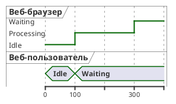

# ДЕТАЛЬНАЯ ИНСТРУКЦИЯ ДЛЯ ГЕНЕРАЦИИ PLANTUML TIMING ДИАГРАММ

## КРИТИЧЕСКИ ВАЖНЫЕ ПРАВИЛА

### 1. ОБЯЗАТЕЛЬНЫЙ СИНТАКСИС

**ВСЕГДА начинай код с `@startuml` и заканчивай `@enduml`!**



**НЕПРАВИЛЬНО:**
```
timing
robust "Веб-браузер" as WB
```

**ПРАВИЛЬНО:**
```
@startuml
robust "Веб-браузер" as WB
@0
WB is Idle
@enduml
```

### 2. ОТСТУПЫ И ПРОБЕЛЫ - КРИТИЧЕСКИ ВАЖНО!

**Используй ПРОБЕЛЫ для отступов, НИКОГДА не используй табуляцию (TAB)!**

**Правило отступов:**
- Первая строка: `@startuml` (0 пробелов)
- Объявление участников: без отступов (0 пробелов)
- Маркеры времени (`@0`, `@100` и т.д.): без отступов (0 пробелов)
- Изменения состояний (`WU is Idle`): ОБЯЗАТЕЛЬНО с отступом РОВНО 2 ПРОБЕЛА после маркера времени
- Последняя строка: `@enduml` (0 пробелов)

**Пример правильной структуры отступов:**
```
@startuml
robust "Веб-браузер" as WB
concise "Веб-пользователь" as WU

@0
  WU is Idle
  WB is Idle

@100
  WU is Waiting
  WB is Processing

@300
  WB is Waiting

@enduml
```

**НЕПРАВИЛЬНО (вызовет ошибку рендеринга):**
```
@startuml
robust "Веб-браузер" as WB
@0
WU is Idle  ← НЕПРАВИЛЬНО! Нет отступа после @0
@100
WB is Processing  ← НЕПРАВИЛЬНО! Нет отступа после @100
@enduml
```

**КРИТИЧЕСКИ ВАЖНО:** Без правильных отступов (2 ПРОБЕЛА после маркера времени) PlantUML не сможет правильно распарсить изменения состояний! Всегда используй 2 пробела для строк с `is` после маркера времени!

### 3. ОБЪЯВЛЕНИЕ УЧАСТНИКОВ (ПАРТИЦИПАНТОВ)

**В Timing Diagram используются разные типы сигналов:**

#### 3.1. Robust (Робастный сигнал)
**Используется для сложных сигналов с множеством состояний.**

**Формат:**
```
robust "Название" as Алиас
```

**Пример:**
```
robust "Веб-браузер" as WB
robust "DNS резолвер" as DNS
```

**КРИТИЧЕСКИ ВАЖНО:** После ключевого слова `robust` ОБЯЗАТЕЛЬНО должен быть ПРОБЕЛ, затем название в кавычках, затем (опционально) `as Алиас`!

#### 3.2. Concise (Упрощенный сигнал)
**Используется для упрощенных сигналов, показывающих движение данных.**

**Формат:**
```
concise "Название" as Алиас
```

**Пример:**
```
concise "Веб-пользователь" as WU
concise "Данные" as Data
```

#### 3.3. Binary (Бинарный сигнал)
**Используется для бинарных сигналов с двумя состояниями (high/low).**

**Формат:**
```
binary "Название" as Алиас
```

**Пример:**
```
binary "Включение" as EN
binary "Готовность" as RDY
```

**Состояния для binary:**
- `high` - высокий уровень
- `low` - низкий уровень
- `down` - понижение (переход вниз)
- `up` - повышение (переход вверх)

#### 3.4. Clock (Тактовый сигнал)
**Используется для тактовых сигналов с периодическими переходами.**

**Формат:**
```
clock "Название" as Алиас with period ПЕРИОД
```

**Дополнительные параметры:**
- `pulse ДЛИТЕЛЬНОСТЬ` - длительность импульса
- `offset СМЕЩЕНИЕ` - смещение по времени

**Пример:**
```
clock "Clock_0" as C0 with period 50
clock "Clock_1" as C1 with period 50 pulse 15 offset 10
```

**КРИТИЧЕСКИ ВАЖНО:** После ключевых слов (`clock`, `with`, `period`, `pulse`, `offset`) ОБЯЗАТЕЛЬНО должны быть ПРОБЕЛЫ!

#### 3.5. Analog (Аналоговый сигнал)
**Используется для аналоговых сигналов с непрерывными значениями.**

**Формат:**
```
analog "Название" as Алиас
```

**Для масштабирования:**
```
analog "Название" between МИНИМУМ and МАКСИМУМ as Алиас
```

**Пример:**
```
analog "Напряжение" as VDD
analog "Ток" between 0 and 10 as Current
```

#### 3.6. Rectangle (Прямоугольный сигнал)
**Используется для прямоугольных сигналов (аналог concise, но в прямоугольной форме).**

**Формат:**
```
rectangle "Название" as Алиас
```

**Пример:**
```
rectangle "Прямоугольный пользователь" as RWU
```

**КРИТИЧЕСКИ ВАЖНО:** Все участники должны быть объявлены ПЕРЕД использованием маркеров времени (`@0`, `@100` и т.д.)! Объявление участников идет в начале диаграммы, сразу после `@startuml`!

### 4. МАРКЕРЫ ВРЕМЕНИ И СОСТОЯНИЯ

**Маркеры времени определяют момент изменения состояния участников.**

**Формат:**
```
@ВРЕМЯ
  Участник1 is Состояние1
  Участник2 is Состояние2
```

**Правила:**
- Маркер времени начинается с символа `@` и за ним следует число (время в условных единицах)
- После маркера времени ОБЯЗАТЕЛЬНО должна быть ПУСТАЯ СТРОКА, затем строки с состояниями с отступом 2 ПРОБЕЛА
- Каждая строка с состоянием имеет формат: `Алиас is Состояние`
- Между `Алиас` и `is` должен быть ПРОБЕЛ
- Между `is` и `Состояние` должен быть ПРОБЕЛ
- Можно указывать несколько участников в одном маркере времени

**ПРАВИЛЬНО:**
```
@0
  WU is Idle
  WB is Idle

@100
  WU is Waiting
  WB is Processing

@300
  WB is Waiting
```

**НЕПРАВИЛЬНО:**
```
@0 WU is Idle  ← НЕПРАВИЛЬНО! Состояние должно быть на следующей строке с отступом
@100WU is Waiting  ← НЕПРАВИЛЬНО! Нет пробела между @100 и WU, и нет отступа
@100
WU is Waiting  ← НЕПРАВИЛЬНО! Нет отступа (2 пробела) перед WU
```

**КРИТИЧЕСКИ ВАЖНО:** После каждого маркера времени (`@0`, `@100` и т.д.) ОБЯЗАТЕЛЬНО должна быть ПУСТАЯ СТРОКА, затем все изменения состояний с отступом РОВНО 2 ПРОБЕЛА!

### 5. ОТНОСИТЕЛЬНОЕ ВРЕМЯ

**Можно использовать относительное время с символом `+`.**

**Формат:**
```
@+ОТСТУП
  Участник is Состояние
```

**Пример:**
```
@0
  WU is Idle
  WB is Idle

@+100
  WU -> WB : URL
  WU is Waiting
  WB is Processing

@+200
  WB is Waiting
```

**КРИТИЧЕСКИ ВАЖНО:** Относительное время (`@+100`) добавляется к предыдущему маркеру времени. После `@+` ОБЯЗАТЕЛЬНО должно быть число БЕЗ ПРОБЕЛА!

### 6. ЯКОРНЫЕ ТОЧКИ (ANCHOR POINTS)

**Можно использовать якорные точки для ссылки на определенные моменты времени.**

**Формат:**
```
@ВРЕМЯ as :ИМЯ_ЯКОРЯ
```

**Пример:**
```
@0 as :start
@5 as :en_high
@10 as :en_low

@:start
  EN is low
  db is "0x0000"

@:en_high
  EN is high

@:en_low
  EN is low

@:en_high-2 as :en_highMinus2
@:en_highMinus2
  db is "0xf23a"
```

**КРИТИЧЕСКИ ВАЖНО:** Имена якорных точек должны начинаться с `:` (двоеточие)!

### 7. ОРИЕНТАЦИЯ ПО УЧАСТНИКУ

**Вместо хронологического порядка можно определять временные интервалы для каждого участника отдельно.**

**Формат:**
```
@Участник
ВРЕМЯ1 is Состояние1
+ОТСТУП is Состояние2
+ОТСТУП is Состояние3
```

**Пример:**
```
@WB
0 is idle
+200 is Proc.
+100 is Waiting

@WU
0 is Waiting
+500 is ok
```

**КРИТИЧЕСКИ ВАЖНО:** При ориентации по участнику используется формат `ВРЕМЯ is Состояние` БЕЗ отступов (0 пробелов)!

### 8. МАСШТАБИРОВАНИЕ

**Можно установить масштаб диаграммы.**

**Формат:**
```
scale ВРЕМЯ as ПИКСЕЛИ pixels
```

**Пример:**
```
scale 100 as 50 pixels

@WU
0 is Waiting
+500 is ok
```

**КРИТИЧЕСКИ ВАЖНО:** Масштаб должен быть указан ПОСЛЕ объявления участников, но ПЕРЕД маркерами времени!

### 9. СООБЩЕНИЯ (MESSAGES)

**Можно добавлять сообщения между участниками.**

**Формат:**
```
Участник1 -> Участник2 : Текст сообщения
```

**Пример:**
```
@0
  WU is Idle
  WB is Idle

@100
  WU -> WB : URL
  WU is Waiting
  WB is Processing
```

**КРИТИЧЕСКИ ВАЖНО:** Сообщения указываются ВНУТРИ блока маркера времени, с отступом 2 ПРОБЕЛА, после строки с маркером времени и ПУСТОЙ строки!

### 10. АНАЛОГОВЫЕ СИГНАЛЫ - МАСШТАБИРОВАНИЕ И НАСТРОЙКА

**Для аналоговых сигналов можно настроить масштаб, метки и высоту.**

**Формат масштабирования:**
```
analog "Название" between МИНИМУМ and МАКСИМУМ as Алиас
```

**Формат настройки меток:**
```
Алиас ticks num on multiple ЧИСЛО
```

**Формат настройки высоты:**
```
Алиас is ПИКСЕЛИ pixels height
```

**Пример:**
```
analog "Vcore" as VDD
analog "VCC" between -4.5 and 6.5 as VCC
VCC ticks num on multiple 3
VCC is 200 pixels height

@0
  VDD is 0
  VCC is 3

@2
  VDD is 0

@3
  VDD is 6
  VCC is 6
  VDD@1 -> VCC@2 : "test"
```

**КРИТИЧЕСКИ ВАЖНО:** Настройки масштаба, меток и высоты для аналоговых сигналов указываются ПОСЛЕ объявления участника, но ПЕРЕД маркерами времени!

### 11. УПОРЯДОЧИВАНИЕ СОСТОЯНИЙ ROBUST СИГНАЛОВ

**Для robust сигналов можно упорядочить состояния.**

**Формат:**
```
Алиас has Состояние1, Состояние2, Состояние3
```

**С метками:**
```
Алиас has "Метка1" as Состояние1
Алиас has "Метка2" as Состояние2
```

**Пример:**
```
robust "Flow rate" as rate
rate has high,low,none

@0
  rate is high

@5
  rate is none

@6
  rate is low
```

**Пример с метками:**
```
robust "Flow rate" as rate
rate has "35 gpm" as high
rate has "15 gpm" as low
rate has "0 gpm" as none

@0
  rate is high

@5
  rate is none

@6
  rate is low
```

**КРИТИЧЕСКИ ВАЖНО:** Упорядочивание состояний указывается ПОСЛЕ объявления участника, но ПЕРЕД маркерами времени!

### 12. ОПРЕДЕЛЕНИЕ ДИАГРАММЫ ПО ЧАСОВОЙ ЧАСТОТЕ ИЛИ СИГНАЛУ

**Можно определять временные интервалы относительно часовой частоты или сигнала.**

#### 12.1. По часовой частоте
**Формат:**
```
@Частота*МНОЖИТЕЛЬ
  Участник is Состояние
```

**Пример:**
```
clock "clk" as clk with period 50
concise "Signal1" as S1
robust "Signal2" as S2
binary "Signal3" as S3

@clk*0
  S1 is 0
  S2 is 0

@clk*1
  S1 is 1
  S3 is high

@clk*2
  S3 is down

@clk*3
  S1 is 1
  S2 is 1
  S3 is 1

@clk*4
  S3 is down
```

#### 12.2. По сигналу
**Формат:**
```
@Алиас
ВРЕМЯ1 is Состояние1
ВРЕМЯ2 is Состояние2
```

**Пример:**
```
clock "clk" as clk with period 50
concise "Signal1" as S1
robust "Signal2" as S2
binary "Signal3" as S3

@S1
0 is 0
50 is 1
150 is 1

@S2
0 is 0
150 is 1

@S3
50 is 1
100 is low
150 is high
200 is 0
```

**КРИТИЧЕСКИ ВАЖНО:** При определении по сигналу используется формат `ВРЕМЯ is Состояние` БЕЗ отступов (0 пробелов)!

### 13. АННОТАЦИИ СИГНАЛОВ

**Можно добавлять комментарии к состояниям сигналов.**

**Формат:**
```
Участник is Состояние : Комментарий
```

**Пример:**
```
binary "Binary Serial Data" as D
robust "Robust" as R
concise "Concise" as C

@-3
  D is low : idle
  R is lo : idle
  C is 1 : idle

@-1
  D is high : start
  R is hi : start
  C is 0 : start

@0
  D is low : 1 lsb
  R is lo : 1 lsb
  C is 1 : lsb

@1
  D is high : 0
  R is hi : 0
  C is 0

@6
  D is low : 1
  R is lo : 1
  C is 1

@7
  D is high : 0 msb
  R is hi : 0 msb
  C is 0 : msb

@8
  D is low : stop
  R is lo : stop
  C is 1 : stop

@0 <-> @8 : Serial data bits for ASCII "A" (Little Endian)
```

**КРИТИЧЕСКИ ВАЖНО:** Комментарии указываются после состояния через двоеточие `:` с ПРОБЕЛОМ до и после двоеточия!

### 14. ЦВЕТА - СТРОГИЕ (БЕЛЫЙ, ЧЕРНЫЙ, СЕРЫЙ)

**КРИТИЧЕСКИ ВАЖНО:** Диаграмма должна быть в строгих цветах!

**Используй ТОЛЬКО следующие цвета:**
- Фон: **белый** (`#FFFFFF` или `white`)
- Текст: **черный** (`#000000` или `black`)
- Линии и границы: **черный** или **серый** (`#000000`, `#666666`, `#999999`)
- Акценты: **серые оттенки** (`#F5F5F5`, `#E5E5E5`, `#CCCCCC`, `#B3B3B3`)

**Синтаксис для цветов в PlantUML Timing Diagram:**

**ОБЯЗАТЕЛЬНО добавляй стили для строгих цветов:**

```
@startuml
skinparam backgroundColor white
skinparam defaultTextColor black
skinparam defaultLineColor #000000
skinparam timingArrowColor #000000
skinparam timingArrowFontColor #000000
skinparam timingLifeLineBorderColor #666666
skinparam timingLifeLineBackgroundColor #FFFFFF
skinparam timingStateBorderColor #000000
skinparam timingStateBackgroundColor #FFFFFF
skinparam timingStateFontColor #000000
skinparam timingDividerBorderColor #666666
skinparam timingDividerBackgroundColor #FFFFFF
skinparam timingDividerFontColor #000000
skinparam timingConstraintBackgroundColor #FFFFFF
skinparam timingConstraintBorderColor #666666
skinparam timingConstraintFontColor #000000
skinparam timingNoteBackgroundColor #F5F5F5
skinparam timingNoteBorderColor #666666
skinparam timingNoteFontColor #000000

robust "Веб-браузер" as WB
concise "Веб-пользователь" as WU

@0
  WU is Idle
  WB is Idle

@100
  WU is Waiting
  WB is Processing

@300
  WB is Waiting

@enduml
```

**НЕПРАВИЛЬНО (яркие цвета):**
```
@startuml
skinparam timingStateBackgroundColor #00FF00  ← НЕПРАВИЛЬНО! Зеленый цвет
skinparam timingStateBackgroundColor #FFFF00  ← НЕПРАВИЛЬНО! Желтый цвет
skinparam timingStateBackgroundColor #FF00FF  ← НЕПРАВИЛЬНО! Фиолетовый цвет
@enduml
```

**КРИТИЧЕСКИ ВАЖНО:** ОБЯЗАТЕЛЬНО добавляй стили для строгих цветов в НАЧАЛЕ диаграммы, ПОСЛЕ `@startuml`, но ПЕРЕД объявлением участников!

### 15. НАЗВАНИЯ УЧАСТНИКОВ И СОСТОЯНИЙ

**Правила для названий:**

1. **Названия участников:**
   - Используй кавычки для названий участников: `"Название"`
   - Можно использовать русские названия: `"Веб-браузер"`, `"Пользователь"`
   - Можно использовать английские названия: `"Web Browser"`, `"User"`
   - НЕ используй специальные символы, которые могут сломать синтаксис: `{`, `}`, `[`, `]`, `(`, `)` (кроме использования в синтаксисе)

2. **Алиасы:**
   - Алиасы должны быть БЕЗ кавычек: `as WB`, `as WU`
   - Используй короткие и понятные алиасы: `WB`, `DNS`, `WU`
   - Алиасы используются для ссылок в состояниях: `WB is Idle`

3. **Состояния:**
   - Состояния могут быть БЕЗ кавычек (если это одно слово): `Idle`, `Waiting`, `Processing`
   - Состояния могут быть в кавычках (если это несколько слов): `"Обработка данных"`, `"Ожидание ответа"`
   - Можно использовать числа для аналоговых сигналов: `0`, `3.5`, `10`
   - Можно использовать строки для concise сигналов: `"0x0000"`, `"0xf23a"`

**ПРАВИЛЬНО:**
```
robust "Веб-браузер" as WB
concise "Веб-пользователь" as WU
binary "Включение" as EN

@0
  WB is Idle
  WU is "Ожидание"
  EN is low

@100
  WB is "Обработка данных"
  WU is Waiting
  EN is high
```

**НЕПРАВИЛЬНО:**
```
robust Веб-браузер as WB  ← НЕПРАВИЛЬНО! Название без кавычек
robust "Веб-браузер" as "WB"  ← НЕПРАВИЛЬНО! Алиас в кавычках
@0
WBisIdle  ← НЕПРАВИЛЬНО! Нет пробелов между WB, is и Idle
```

### 16. РУССКИЙ ЯЗЫК

**Все названия участников и состояний должны быть на русском языке!**

- Используй русские названия для всех элементов
- Синтаксис PlantUML остается на английском (`@startuml`, `@enduml`, `robust`, `concise`, `binary`, `clock`, `analog`, `rectangle`, `is`, `as`, `with`, `period`, `pulse`, `offset`, `between`, `and`, `has`, `ticks`, `pixels`, `height`)
- Содержимое (названия участников, состояния) - на русском

**ПРАВИЛЬНО:**
```
@startuml
skinparam backgroundColor white
skinparam defaultTextColor black

robust "Веб-браузер" as WB
concise "Веб-пользователь" as WU

@0
  WU is Ожидание
  WB is Ожидание

@100
  WU is Ожидание_ответа
  WB is Обработка

@300
  WB is Ожидание

@enduml
```

**НЕПРАВИЛЬНО:**
```
@startuml
robust "Web Browser" as WB  ← НЕПРАВИЛЬНО! Английское название
concise "Web User" as WU  ← НЕПРАВИЛЬНО! Английское название

@0
  WU is Idle  ← НЕПРАВИЛЬНО! Английское состояние
  WB is Idle  ← НЕПРАВИЛЬНО! Английское состояние

@100
  WU is Waiting  ← НЕПРАВИЛЬНО! Английское состояние
  WB is Processing  ← НЕПРАВИЛЬНО! Английское состояние

@enduml
```

### 17. ПРОВЕРКА ПЕРЕД ОТПРАВКОЙ

**ОБЯЗАТЕЛЬНО проверь код перед отправкой:**

1. ✅ Код начинается с `@startuml`
2. ✅ Код заканчивается `@enduml`
3. ✅ Все участники объявлены ПЕРЕД маркерами времени
4. ✅ После каждого маркера времени (`@0`, `@100` и т.д.) есть ПУСТАЯ СТРОКА
5. ✅ Все изменения состояний имеют отступ РОВНО 2 ПРОБЕЛА после маркера времени
6. ✅ Используются строгие цвета (белый, черный, серый) через `skinparam`
7. ✅ Все названия участников в кавычках
8. ✅ Все алиасы БЕЗ кавычек
9. ✅ Все названия и состояния на русском языке
10. ✅ Все пробелы правильные (после ключевых слов, между `Алиас is Состояние`)
11. ✅ Код можно скопировать и вставить в PlantUML редактор БЕЗ ОШИБОК

### 18. ПРИМЕРЫ ПРАВИЛЬНОГО КОДА

**Пример 1: Простая Timing Diagram со строгими цветами**

```
@startuml
skinparam backgroundColor white
skinparam defaultTextColor black
skinparam defaultLineColor #000000
skinparam timingArrowColor #000000
skinparam timingArrowFontColor #000000
skinparam timingLifeLineBorderColor #666666
skinparam timingLifeLineBackgroundColor #FFFFFF
skinparam timingStateBorderColor #000000
skinparam timingStateBackgroundColor #FFFFFF
skinparam timingStateFontColor #000000

robust "Веб-браузер" as WB
concise "Веб-пользователь" as WU

@0
  WU is Ожидание
  WB is Ожидание

@100
  WU -> WB : URL
  WU is Ожидание_ответа
  WB is Обработка

@300
  WB is Ожидание

@enduml
```

**Пример 2: Timing Diagram с binary и clock сигналами**

```
@startuml
skinparam backgroundColor white
skinparam defaultTextColor black
skinparam defaultLineColor #000000
skinparam timingArrowColor #000000
skinparam timingArrowFontColor #000000
skinparam timingLifeLineBorderColor #666666
skinparam timingLifeLineBackgroundColor #FFFFFF
skinparam timingStateBorderColor #000000
skinparam timingStateBackgroundColor #FFFFFF
skinparam timingStateFontColor #000000

clock "Clock_0" as C0 with period 50
clock "Clock_1" as C1 with period 50 pulse 15 offset 10
binary "Включение" as EN
concise "Данные" as Data

@0
  C0 is Idle
  C1 is Idle
  Data is Ожидание

@5
  EN is high
  Data is Передача

@10
  EN is low
  Data is Ожидание

@enduml
```

**Пример 3: Timing Diagram с аналоговыми сигналами**

```
@startuml
skinparam backgroundColor white
skinparam defaultTextColor black
skinparam defaultLineColor #000000
skinparam timingArrowColor #000000
skinparam timingArrowFontColor #000000
skinparam timingLifeLineBorderColor #666666
skinparam timingLifeLineBackgroundColor #FFFFFF
skinparam timingStateBorderColor #000000
skinparam timingStateBackgroundColor #FFFFFF
skinparam timingStateFontColor #000000

analog "Напряжение_ядро" as VDD
analog "Напряжение_питания" between -4.5 and 6.5 as VCC
VCC ticks num on multiple 3
VCC is 200 pixels height

@0
  VDD is 0
  VCC is 3

@2
  VDD is 0

@3
  VDD is 6
  VCC is 6
  VDD@1 -> VCC@2 : "тест"

@enduml
```

**Пример 4: Timing Diagram с ориентацией по участнику**

```
@startuml
skinparam backgroundColor white
skinparam defaultTextColor black
skinparam defaultLineColor #000000
skinparam timingArrowColor #000000
skinparam timingArrowFontColor #000000
skinparam timingLifeLineBorderColor #666666
skinparam timingLifeLineBackgroundColor #FFFFFF
skinparam timingStateBorderColor #000000
skinparam timingStateBackgroundColor #FFFFFF
skinparam timingStateFontColor #000000

robust "Веб-браузер" as WB
concise "Веб-пользователь" as WU

@WB
0 is Ожидание
+200 is Обработка
+100 is Ожидание_ответа

@WU
0 is Ожидание_ответа
+500 is Готово

@enduml
```

### 19. ЧАСТЫЕ ОШИБКИ И КАК ИХ ИЗБЕЖАТЬ

**Ошибка 1: "Syntax Error" или код не рендерится**
- **Причина:** Неправильный синтаксис, отсутствие `@startuml`/`@enduml`, неправильные отступы, отсутствие пробелов
- **Решение:** Проверь, что код начинается с `@startuml` и заканчивается `@enduml`, проверь отступы (2 ПРОБЕЛА после маркера времени), проверь пробелы после ключевых слов

**Ошибка 2: "Unexpected token" или неправильный парсинг**
- **Причина:** Неправильные отступы после маркера времени, отсутствие пустой строки после маркера времени
- **Решение:** Убедись, что после каждого маркера времени (`@0`, `@100` и т.д.) есть ПУСТАЯ СТРОКА, а все изменения состояний имеют отступ РОВНО 2 ПРОБЕЛА

**Ошибка 3: "Unknown element" или участник не найден**
- **Причина:** Участник используется до объявления, неправильный алиас
- **Решение:** Убедись, что все участники объявлены ПЕРЕД использованием в маркерах времени, проверь правильность алиасов

**Ошибка 4: Яркие цвета на диаграмме**
- **Причина:** Не добавлены стили для строгих цветов
- **Решение:** ОБЯЗАТЕЛЬНО добавляй блок `skinparam` с настройками цветов (белый, черный, серый) в НАЧАЛЕ диаграммы

**Ошибка 5: Неправильные пробелы**
- **Причина:** Отсутствие пробелов после ключевых слов, между `Алиас is Состояние`, между параметрами
- **Решение:** Проверь, что после всех ключевых слов есть пробелы, между `Алиас` и `is` есть пробел, между `is` и `Состояние` есть пробел

**Ошибка 6: Английские названия**
- **Причина:** Использование английских названий вместо русских
- **Решение:** Используй русские названия для всех участников и состояний

### 20. ФОРМАТИРОВАНИЕ КОДА

**Всегда форматируй код так:**
- Первая строка: `@startuml`
- Блок стилей (если нужен): `skinparam ...` (без отступов)
- Объявление участников: `robust "Название" as Алиас` (без отступов, каждая на своей строке)
- Пустая строка перед маркерами времени
- Маркеры времени: `@0`, `@100` и т.д. (без отступов)
- После каждого маркера времени: ПУСТАЯ СТРОКА
- Изменения состояний: `  Алиас is Состояние` (2 ПРОБЕЛА отступа)
- Пустая строка между блоками маркеров времени (опционально, для читаемости)
- Последняя строка: `@enduml`

**ПРАВИЛЬНО:**
```
@startuml
skinparam backgroundColor white
skinparam defaultTextColor black

robust "Веб-браузер" as WB
concise "Веб-пользователь" as WU

@0
  WU is Ожидание
  WB is Ожидание

@100
  WU is Ожидание_ответа
  WB is Обработка

@300
  WB is Ожидание

@enduml
```

### 21. ФИНАЛЬНАЯ ПРОВЕРКА

**Перед отправкой кода ответь на вопросы:**

1. ✅ Код начинается с `@startuml`?
2. ✅ Код заканчивается `@enduml`?
3. ✅ Все стили для строгих цветов добавлены в начале?
4. ✅ Все участники объявлены ПЕРЕД маркерами времени?
5. ✅ После каждого маркера времени есть ПУСТАЯ СТРОКА?
6. ✅ Все изменения состояний имеют отступ РОВНО 2 ПРОБЕЛА?
7. ✅ Все названия участников в кавычках?
8. ✅ Все алиасы БЕЗ кавычек?
9. ✅ Все названия и состояния на русском языке?
10. ✅ Все пробелы правильные (после ключевых слов, между `Алиас is Состояние`)?
11. ✅ Код можно скопировать и вставить в PlantUML редактор БЕЗ ОШИБОК?

**Если на все вопросы ответ "ДА" - код готов к отправке!**

---

## РЕЗЮМЕ: ЧТО ДЕЛАТЬ ВСЕГДА

1. ✅ Начинай с `@startuml` и заканчивай `@enduml`
2. ✅ Добавляй стили для строгих цветов (белый, черный, серый) через `skinparam` в начале диаграммы
3. ✅ Объявляй всех участников ПЕРЕД маркерами времени
4. ✅ Используй правильные отступы: 2 ПРОБЕЛА после маркера времени для изменений состояний
5. ✅ После каждого маркера времени ОБЯЗАТЕЛЬНО должна быть ПУСТАЯ СТРОКА
6. ✅ Используй русские названия для всех участников и состояний
7. ✅ Все названия участников в кавычках, все алиасы БЕЗ кавычек
8. ✅ Проверяй пробелы: после ключевых слов, между `Алиас is Состояние`
9. ✅ Проверяй код перед отправкой

## РЕЗЮМЕ: ЧТО НИКОГДА НЕ ДЕЛАТЬ

1. ❌ НЕ начинай код без `@startuml`
2. ❌ НЕ заканчивай код без `@enduml`
3. ❌ НЕ забывай добавлять стили для строгих цветов
4. ❌ НЕ используй участников до их объявления
5. ❌ НЕ забывай пустую строку после маркера времени
6. ❌ НЕ используй неправильные отступы (не 2 ПРОБЕЛА после маркера времени)
7. ❌ НЕ используй яркие цвета (зеленый, желтый, фиолетовый) - ТОЛЬКО белый, черный, серый!
8. ❌ НЕ используй английские названия для участников и состояний
9. ❌ НЕ используй кавычки для алиасов
10. ❌ НЕ забывай пробелы после ключевых слов и между `Алиас is Состояние`
11. ❌ НЕ отправляй код без проверки

---

## ДОПОЛНИТЕЛЬНАЯ ИНФОРМАЦИЯ

### Официальная документация PlantUML Timing Diagram:
https://plantuml.com/ru/timing-diagram

### Основные синтаксические конструкции:

1. **Объявление участников:**
```
robust "Название" as Алиас
concise "Название" as Алиас
binary "Название" as Алиас
clock "Название" as Алиас with period ПЕРИОД
analog "Название" as Алиас
rectangle "Название" as Алиас
```

2. **Маркеры времени и состояния:**
```
@ВРЕМЯ
  Алиас is Состояние
  Алиас2 is Состояние2
```

3. **Относительное время:**
```
@+ОТСТУП
  Алиас is Состояние
```

4. **Сообщения:**
```
Алиас1 -> Алиас2 : Текст сообщения
```

### Рекомендации по цветам:

**Для строгих диаграмм используй:**
- `skinparam backgroundColor white` - белый фон
- `skinparam defaultTextColor black` - черный текст
- `skinparam defaultLineColor #000000` - черные линии
- `skinparam timingStateBackgroundColor #FFFFFF` - белый фон состояний
- `skinparam timingStateFontColor #000000` - черный текст состояний
- `skinparam timingStateBorderColor #000000` - черные границы состояний

**НЕ используй:**
- `#00FF00` (зеленый)
- `#FFFF00` (желтый)
- `#FF00FF` (фиолетовый)
- `#0000FF` (синий)
- Любые другие яркие цвета

---

## ПОЛНЫЙ ШАБЛОН ДЛЯ КОПИРОВАНИЯ

```
@startuml
skinparam backgroundColor white
skinparam defaultTextColor black
skinparam defaultLineColor #000000
skinparam timingArrowColor #000000
skinparam timingArrowFontColor #000000
skinparam timingLifeLineBorderColor #666666
skinparam timingLifeLineBackgroundColor #FFFFFF
skinparam timingStateBorderColor #000000
skinparam timingStateBackgroundColor #FFFFFF
skinparam timingStateFontColor #000000
skinparam timingDividerBorderColor #666666
skinparam timingDividerBackgroundColor #FFFFFF
skinparam timingDividerFontColor #000000
skinparam timingConstraintBackgroundColor #FFFFFF
skinparam timingConstraintBorderColor #666666
skinparam timingConstraintFontColor #000000
skinparam timingNoteBackgroundColor #F5F5F5
skinparam timingNoteBorderColor #666666
skinparam timingNoteFontColor #000000

robust "УЧАСТНИК_1" as УЧАСТНИК1
concise "УЧАСТНИК_2" as УЧАСТНИК2

@0
  УЧАСТНИК1 is СОСТОЯНИЕ1
  УЧАСТНИК2 is СОСТОЯНИЕ2

@100
  УЧАСТНИК1 -> УЧАСТНИК2 : СООБЩЕНИЕ
  УЧАСТНИК1 is СОСТОЯНИЕ3
  УЧАСТНИК2 is СОСТОЯНИЕ4

@300
  УЧАСТНИК1 is СОСТОЯНИЕ5

@enduml
```

**Замени `УЧАСТНИК_1`, `УЧАСТНИК1`, `СОСТОЯНИЕ1`, `СООБЩЕНИЕ` и т.д. на реальные названия на русском языке!**

