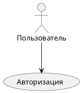

# ДЕТАЛЬНАЯ ИНСТРУКЦИЯ ДЛЯ ГЕНЕРАЦИИ PLANTUML USE CASE ДИАГРАММ

## КРИТИЧЕСКИ ВАЖНЫЕ ПРАВИЛА

### 1. ОБЯЗАТЕЛЬНЫЙ СИНТАКСИС

**ВСЕГДА начинай код с `@startuml` и заканчивай `@enduml`!**



**НЕПРАВИЛЬНО:**
```
usecase
actor Пользователь
```

**ПРАВИЛЬНО:**
```
@startuml
actor Пользователь
(Авторизация)
@enduml
```

### 2. ОТСТУПЫ И ПРОБЕЛЫ - КРИТИЧЕСКИ ВАЖНО!

**PlantUML Use Case диаграммы ЧУВСТВИТЕЛЬНЫ к отступам и пробелам!**

**Правила отступов:**
- Первая строка: `@startuml` (0 пробелов, без отступов)
- Акторы (actor): **БЕЗ ОТСТУПОВ** или с **ОДИНАКОВЫМИ отступами** (рекомендуется 0 или 2 пробела)
- Варианты использования (usecase): **БЕЗ ОТСТУПОВ** или с **ОДИНАКОВЫМИ отступами** (рекомендуется 0 или 2 пробела)
- Связи (стрелки): **БЕЗ ОТСТУПОВ** или с **ОДИНАКОВЫМИ отступами** (рекомендуется 0 или 2 пробела)
- Пакеты (rectangle): **ОБЯЗАТЕЛЬНО с отступами!**
  - Строка с `rectangle`: **0 или 2 пробела**
  - Содержимое внутри пакета: **+2 ПРОБЕЛА** к отступу пакета
  - Закрывающая скобка `}`: **ТОТ ЖЕ отступ**, что и открывающая

**ПРАВИЛЬНО (без отступов):**
```
@startuml
actor Пользователь
(Авторизация)
Пользователь --> (Авторизация)
@enduml
```

**ПРАВИЛЬНО (с отступами для читаемости):**
```
@startuml
  actor Пользователь
  (Авторизация)
  Пользователь --> (Авторизация)
@enduml
```

**ПРАВИЛЬНО (с пакетами и отступами):**
```
@startuml
actor Пользователь
rectangle Система {
  (Авторизация)
  (Регистрация)
}
Пользователь --> (Авторизация)
@enduml
```

**НЕПРАВИЛЬНО (неправильные отступы в пакетах):**
```
@startuml
actor Пользователь
rectangle Система {
(Авторизация)  ← НЕТ ОТСТУПА! ОШИБКА!
  (Регистрация)
}
@enduml
```

**КРИТИЧЕСКИ ВАЖНО:** 
- Если используешь отступы для акторов и вариантов использования - используй их **ВЕЗДЕ ОДИНАКОВО**
- Если используешь отступы для пакетов - **ОБЯЗАТЕЛЬНО** используй их для содержимого внутри пакета
- **НЕ смешивай** строки с отступами и без отступов!

### 3. АКТОРЫ (ACTORS)

**Акторы объявляются с помощью ключевых слов:**

- `actor` - актер (человек или внешняя система)
- `:Название:` - альтернативный синтаксис для актора
- Можно использовать алиас: `actor "Название" as Алиас`

**Синтаксис:**
```
actor "Название" as Алиас
:Название актора:
actor Название
```

**ПРАВИЛЬНО:**
```
@startuml
actor "Пользователь" as User
actor "Администратор" as Admin
:Система:
(Авторизация)
User --> (Авторизация)
Admin --> (Авторизация)
@enduml
```

**НЕПРАВИЛЬНО:**
```
@startuml
actor Пользователь системы  ← НЕПРАВИЛЬНО! Пробелы без кавычек
actor "Администратор" as Admin
@enduml
```

**ВАЖНО:**
- Если название содержит пробелы - используй кавычки: `actor "Название с пробелами"`
- Если название простое - можно без кавычек: `actor Пользователь`
- Алиас (as) опционален, но рекомендуется для длинных названий

### 4. ВАРИАНТЫ ИСПОЛЬЗОВАНИЯ (USE CASES)

**Варианты использования заключаются в круглые скобки:**

- `(Название)` - простой вариант использования
- `usecase Название` - альтернативный синтаксис
- Можно использовать алиас: `(Название) as UC1` или `usecase UC1`

**Синтаксис:**
```
(Название варианта использования)
usecase Название
(Название) as UC1
usecase UC1
```

**ПРАВИЛЬНО:**
```
@startuml
actor Пользователь
(Авторизация) as UC1
(Регистрация) as UC2
usecase UC3
(Просмотр профиля)
Пользователь --> UC1
Пользователь --> UC2
Пользователь --> UC3
@enduml
```

**НЕПРАВИЛЬНО:**
```
@startuml
actor Пользователь
Авторизация  ← НЕПРАВИЛЬНО! Нет скобок
(Регистрация)
@enduml
```

**ВАЖНО:**
- **ОБЯЗАТЕЛЬНО** используй круглые скобки `()` для вариантов использования
- Названия могут быть на русском языке
- Названия могут содержать пробелы

### 5. СВЯЗИ (RELATIONSHIPS)

**Типы связей в PlantUML Use Case:**

- `-->` - ассоциация (актор использует вариант использования)
- `--` - ассоциация без стрелки
- `<--` - обратная ассоциация (обычно не используется)
- `.>` - включение (include) - один вариант использования включает другой
- `<.` - включение (include) - обратное направление
- `..>` - расширение (extend) - один вариант использования расширяет другой
- `<..` - расширение (extend) - обратное направление
- `--|>` - обобщение (наследование) - актор наследует от другого актора
- `<|--` - обобщение (наследование) - обратное направление

**Синтаксис:**
```
Актор --> (Вариант использования)
(Вариант1) .> (Вариант2) : включает
(Вариант1) ..> (Вариант2) : расширяет
Актор1 --|> Актор2
```

**ПРАВИЛЬНО:**
```
@startuml
actor Пользователь
(Авторизация)
(Проверка пароля)
(Восстановление пароля)
Пользователь --> (Авторизация)
(Авторизация) .> (Проверка пароля) : включает
(Авторизация) ..> (Восстановление пароля) : расширяет
@enduml
```

**НЕПРАВИЛЬНО:**
```
@startuml
actor Пользователь
(Авторизация)
Пользователь -> (Авторизация)  ← НЕПРАВИЛЬНО! Должно быть -->
@enduml
```

**ВАЖНО:**
- **ОБЯЗАТЕЛЬНО** используй правильные типы стрелок
- Для включения используй `.>` (точка перед стрелкой)
- Для расширения используй `..>` (две точки перед стрелкой)
- Для ассоциации используй `-->` (два дефиса и стрелка)

### 6. ПАКЕТЫ (PACKAGES)

**Пакеты группируют связанные элементы:**

- `rectangle Название { ... }` - пакет с содержимым
- `package Название { ... }` - альтернативный синтаксис
- Содержимое внутри пакета **ОБЯЗАТЕЛЬНО** с отступами

**Синтаксис с ОБЯЗАТЕЛЬНЫМИ отступами:**
```
rectangle Название пакета {
  actor Актор
  (Вариант использования)
  Актор --> (Вариант использования)
}
```

**КРИТИЧЕСКИ ВАЖНО: АЛИАСЫ В ПАКЕТАХ НЕ РАБОТАЮТ!**

**НЕПРАВИЛЬНО (использование алиаса в пакете):**
```
@startuml
usecase "Создание диаграммы" as UC1
rectangle Система {
  UC1  ← ОШИБКА! PlantUML не распознает алиас внутри пакета!
}
@enduml
```

**Ошибка:** `Syntax error: UC1 (Assumed diagram type: component)`

**КРИТИЧЕСКИ ВАЖНО: НАЗВАНИЯ ПАКЕТОВ С ПРОБЕЛАМИ ДОЛЖНЫ БЫТЬ В КАВЫЧКАХ!**

**НЕПРАВИЛЬНО (название пакета с пробелами без кавычек):**
```
@startuml
actor Пользователь
rectangle Система {
  (Создание диаграммы)
}
rectangle Профиль пользователя {  ← ОШИБКА! Пробелы в названии без кавычек!
  (Просмотр профиля)
}
@enduml
```

**Ошибка:** `Syntax Error? (Assumed diagram type: component)`

**ПРАВИЛЬНО (название пакета с пробелами в кавычках):**
```
@startuml
actor Пользователь
rectangle Система {
  (Создание диаграммы)
}
rectangle "Профиль пользователя" {  ← ПРАВИЛЬНО! Название в кавычках!
  (Просмотр профиля)
  (Редактирование профиля)
}
Пользователь --> (Создание диаграммы)
Пользователь --> (Просмотр профиля)
@enduml
```

**ПРАВИЛЬНО (название пакета без пробелов - кавычки не нужны):**
```
@startuml
actor Пользователь
rectangle Система {  ← ПРАВИЛЬНО! Нет пробелов, кавычки не нужны
  (Создание диаграммы)
}
rectangle Профиль {  ← ПРАВИЛЬНО! Нет пробелов, кавычки не нужны
  (Просмотр профиля)
}
@enduml
```

**ВАЖНО:**
- Если название пакета содержит пробелы - **ОБЯЗАТЕЛЬНО** используй кавычки: `rectangle "Название с пробелами" {`
- Если название пакета без пробелов - кавычки не нужны: `rectangle Название {`
- Ошибка "Syntax Error? (Assumed diagram type: component)" часто возникает именно из-за пробелов в названии пакета без кавычек!

**ПРАВИЛЬНО (определение варианта использования внутри пакета):**
```
@startuml
actor Пользователь
rectangle Система {
  (Создание диаграммы)
  (Сохранение диаграммы)
  (Просмотр истории)
}
Пользователь --> (Создание диаграммы)
@enduml
```

**ПРАВИЛЬНО (если нужен алиас, определяй вариант использования заново внутри пакета):**
```
@startuml
actor Пользователь
rectangle Система {
  (Создание диаграммы) as UC1
  (Сохранение диаграммы) as UC2
}
Пользователь --> UC1
Пользователь --> UC2
@enduml
```

**ПРАВИЛЬНО (определение вариантов использования вне пакета, затем использование полных названий):**
```
@startuml
actor Пользователь
(Создание диаграммы) as UC1
(Сохранение диаграммы) as UC2

rectangle Система {
  (Создание диаграммы)
  (Сохранение диаграммы)
}

Пользователь --> (Создание диаграммы)
Пользователь --> (Сохранение диаграммы)
@enduml
```

**ПРАВИЛЬНО (простой вариант без алиасов в пакетах):**
```
@startuml
actor Пользователь
rectangle Система авторизации {
  (Авторизация)
  (Регистрация)
  (Восстановление пароля)
}
rectangle Профиль {
  (Просмотр профиля)
  (Редактирование профиля)
}
Пользователь --> (Авторизация)
Пользователь --> (Просмотр профиля)
@enduml
```

**НЕПРАВИЛЬНО (нет отступов):**
```
@startuml
actor Пользователь
rectangle Система авторизации {
(Авторизация)  ← НЕТ ОТСТУПА! ОШИБКА!
  (Регистрация)
}
@enduml
```

**КРИТИЧЕСКИ ВАЖНО:**
- Содержимое внутри `rectangle` или `package` **ОБЯЗАТЕЛЬНО** должно иметь отступ (минимум 2 пробела)
- Закрывающая скобка `}` должна быть на **ТОМ ЖЕ уровне отступа**, что и открывающая строка
- **НЕ ИСПОЛЬЗУЙ АЛИАСЫ ВНУТРИ ПАКЕТОВ!** Если вариант использования определен с алиасом вне пакета, определи его заново внутри пакета с полным названием в скобках `(Название)`
- **НЕПРАВИЛЬНЫЕ ОТСТУПЫ** - самая частая причина ошибок рендеринга!
- **ИСПОЛЬЗОВАНИЕ АЛИАСОВ В ПАКЕТАХ** - вторая по частоте причина ошибок!

### 7. ОБОБЩЕНИЕ (НАСЛЕДОВАНИЕ)

**Обобщение показывает наследование между акторами или вариантами использования:**

- `Актор1 --|> Актор2` - Актор1 наследует от Актор2
- `(Вариант1) --|> (Вариант2)` - Вариант1 наследует от Вариант2

**ПРАВИЛЬНО:**
```
@startuml
actor "Пользователь" as User
actor "Администратор" as Admin
actor "Модератор" as Moderator
Admin --|> User
Moderator --|> User
(Базовый вариант) as Base
(Расширенный вариант) as Extended
Extended --|> Base
@enduml
```

### 8. ПРИМЕЧАНИЯ (NOTES)

**Примечания добавляются с помощью `note`:**

- `note right of Элемент: Текст` - примечание справа
- `note left of Элемент: Текст` - примечание слева
- `note top of Элемент: Текст` - примечание сверху
- `note bottom of Элемент: Текст` - примечание снизу

**ПРАВИЛЬНО:**
```
@startuml
actor Пользователь
(Авторизация)
Пользователь --> (Авторизация)
note right of (Авторизация): Требуется ввод логина и пароля
@enduml
```

### 9. ЦВЕТА - СТРОГИЕ (БЕЛЫЙ, ЧЕРНЫЙ, СЕРЫЙ)

**КРИТИЧЕСКИ ВАЖНО:** Диаграмма должна быть в строгих цветах!

**Используй ТОЛЬКО следующие цвета:**
- Фон элементов: **белый** (`#FFFFFF` или `white`)
- Текст: **черный** (`#000000` или `black`)
- Границы: **черный** или **серый** (`#000000`, `#666666`, `#999999`)
- Линии связей: **черный** или **серый** (`#000000`, `#666666`)
- Акценты: **серые оттенки** (`#F5F5F5`, `#E5E5E5`, `#CCCCCC`, `#B3B3B3`)

**Синтаксис для цветов в PlantUML Use Case:**

Для задания цветов используй `skinparam`:

```
@startuml
skinparam usecase {
  BackgroundColor #FFFFFF
  BorderColor #000000
  FontColor #000000
}
skinparam actor {
  BackgroundColor #FFFFFF
  BorderColor #000000
  FontColor #000000
}
skinparam rectangle {
  BackgroundColor #FFFFFF
  BorderColor #666666
  FontColor #000000
}
skinparam arrow {
  Color #000000
}
```

**ПРАВИЛЬНО (строгие цвета):**
```
@startuml
skinparam usecase {
  BackgroundColor #FFFFFF
  BorderColor #000000
  FontColor #000000
}
skinparam actor {
  BackgroundColor #FFFFFF
  BorderColor #000000
  FontColor #000000
}
skinparam rectangle {
  BackgroundColor #FFFFFF
  BorderColor #666666
  FontColor #000000
}
skinparam arrow {
  Color #000000
}

actor "Пользователь" as User
(Авторизация)
User --> (Авторизация)
@enduml
```

**НЕПРАВИЛЬНО (яркие цвета):**
```
@startuml
actor "Пользователь" #00FF00  ← НЕПРАВИЛЬНО! Зеленый цвет
(Авторизация) #FFFF00  ← НЕПРАВИЛЬНО! Желтый цвет
@enduml
```

**ОБЯЗАТЕЛЬНО добавляй стили для строгих цветов:**

```
@startuml
skinparam usecase {
  BackgroundColor #FFFFFF
  BorderColor #000000
  FontColor #000000
}
skinparam actor {
  BackgroundColor #FFFFFF
  BorderColor #000000
  FontColor #000000
}
skinparam rectangle {
  BackgroundColor #FFFFFF
  BorderColor #666666
  FontColor #000000
}
skinparam arrow {
  Color #000000
}
skinparam note {
  BackgroundColor #F5F5F5
  BorderColor #666666
  FontColor #000000
}

[твой код диаграммы]
@enduml
```

### 10. НАПРАВЛЕНИЕ ДИАГРАММЫ

**Для изменения направления используй директивы:**

- `left to right direction` - слева направо
- `top to bottom direction` - сверху вниз (по умолчанию)

**ПРАВИЛЬНО:**
```
@startuml
left to right direction
actor Пользователь
(Авторизация)
Пользователь --> (Авторизация)
@enduml
```

### 11. НАЗВАНИЯ АКТОРОВ И ВАРИАНТОВ ИСПОЛЬЗОВАНИЯ

**Правила для названий:**

1. **НЕ используй специальные символы**, которые могут сломать синтаксис:
   - Кавычки внутри названий (кроме случаев, когда они нужны для пробелов)
   - Скобки `()` в названиях акторов (могут конфликтовать с синтаксисом вариантов использования)
   - Символы `:`, `;` в начале строки (используются PlantUML для других целей)

2. **Можно использовать:**
   - Буквы (русские и английские)
   - Цифры
   - Пробелы (в кавычках для акторов, без кавычек для вариантов использования)
   - Дефисы и подчеркивания: `-`, `_`
   - Запятые и точки в тексте

3. **Длинные названия:**
   - Используй кавычки для названий акторов с пробелами: `actor "Длинное название с пробелами"`
   - Для вариантов использования пробелы допустимы без кавычек: `(Длинное название с пробелами)`
   - Или используй алиас: `actor "Длинное название" as ShortName`

**ПРАВИЛЬНО:**
```
@startuml
actor "Веб-пользователь" as WebUser
actor "Мобильный пользователь" as MobileUser
(Авторизация в системе)
(Регистрация нового пользователя)
WebUser --> (Авторизация в системе)
MobileUser --> (Регистрация нового пользователя)
@enduml
```

**НЕПРАВИЛЬНО:**
```
@startuml
actor "Веб-пользователь" (User)  ← НЕПРАВИЛЬНО! Скобки не там
actor Веб пользователь  ← НЕПРАВИЛЬНО! Пробелы без кавычек
(Авторизация) в системе  ← НЕПРАВИЛЬНО! Текст вне скобок
@enduml
```

### 12. ПРОВЕРКА ПЕРЕД ОТПРАВКОЙ

**ОБЯЗАТЕЛЬНО проверь код перед отправкой:**

1.  Код начинается с `@startuml`
2.  Код заканчивается `@enduml`
3.  Все акторы объявлены правильно (`actor` или `:Название:`)
4.  Все варианты использования имеют круглые скобки `()`
5.  Все связи имеют правильные типы стрелок (`-->`, `.>`, `..>`, `--|>`)
6.  Все пакеты (rectangle) имеют правильные отступы:
   - Открывающая строка: 0 или 2 пробела
   - Содержимое внутри: +2 пробела к отступу открывающей строки
   - Закрывающая скобка `}`: тот же отступ, что и открывающая строка
7.  **НЕТ АЛИАСОВ ВНУТРИ ПАКЕТОВ!** Все варианты использования внутри пакетов определены с полными названиями в скобках `(Название)`, а не через алиасы типа `UC1`
8.  Используются строгие цвета (белый, черный, серый) через `skinparam`
9.  Нет специальных символов в названиях, которые могут сломать синтаксис
10.  Все названия на русском языке
11.  Стили для строгих цветов добавлены через `skinparam usecase`, `skinparam actor`, `skinparam rectangle`, `skinparam arrow`

### 13. ПРИМЕРЫ ПРАВИЛЬНОГО КОДА

**Пример 1: Простая Use Case диаграмма со строгими цветами**
```
@startuml
skinparam usecase {
  BackgroundColor #FFFFFF
  BorderColor #000000
  FontColor #000000
}
skinparam actor {
  BackgroundColor #FFFFFF
  BorderColor #000000
  FontColor #000000
}
skinparam arrow {
  Color #000000
}

actor "Пользователь" as User
(Авторизация)
(Регистрация)
User --> (Авторизация)
User --> (Регистрация)
@enduml
```

**Пример 2: Use Case диаграмма с пакетами и отступами**
```
@startuml
skinparam usecase {
  BackgroundColor #FFFFFF
  BorderColor #000000
  FontColor #000000
}
skinparam actor {
  BackgroundColor #FFFFFF
  BorderColor #000000
  FontColor #000000
}
skinparam rectangle {
  BackgroundColor #FFFFFF
  BorderColor #666666
  FontColor #000000
}
skinparam arrow {
  Color #000000
}

actor "Пользователь" as User
actor "Администратор" as Admin

rectangle Система авторизации {
  (Авторизация)
  (Регистрация)
  (Восстановление пароля)
  (Проверка пароля)
  (Авторизация) .> (Проверка пароля) : включает
  (Авторизация) ..> (Восстановление пароля) : расширяет
}

rectangle Управление пользователями {
  (Просмотр пользователей)
  (Блокировка пользователя)
  (Удаление пользователя)
}

User --> (Авторизация)
User --> (Регистрация)
Admin --> (Просмотр пользователей)
Admin --> (Блокировка пользователя)
@enduml
```

**ВАЖНО:** Обрати внимание, что все варианты использования определены **ПОЛНОСТЬЮ** внутри пакетов с названиями в скобках `(Название)`, а НЕ через алиасы!

**Пример 3: Use Case диаграмма с наследованием и примечаниями**
```
@startuml
skinparam usecase {
  BackgroundColor #FFFFFF
  BorderColor #000000
  FontColor #000000
}
skinparam actor {
  BackgroundColor #FFFFFF
  BorderColor #000000
  FontColor #000000
}
skinparam arrow {
  Color #000000
}
skinparam note {
  BackgroundColor #F5F5F5
  BorderColor #666666
  FontColor #000000
}

actor "Пользователь" as User
actor "Администратор" as Admin
actor "Модератор" as Moderator

Admin --|> User
Moderator --|> User

(Просмотр контента)
(Редактирование контента)
(Удаление контента)
(Управление пользователями)

User --> (Просмотр контента)
Moderator --> (Редактирование контента)
Moderator --> (Удаление контента)
Admin --> (Управление пользователями)

note right of (Управление пользователями): Доступно только администраторам
@enduml
```

**Пример 4: Сложная Use Case диаграмма с несколькими акторами и пакетами**
```
@startuml
skinparam usecase {
  BackgroundColor #FFFFFF
  BorderColor #000000
  FontColor #000000
}
skinparam actor {
  BackgroundColor #FFFFFF
  BorderColor #000000
  FontColor #000000
}
skinparam rectangle {
  BackgroundColor #FFFFFF
  BorderColor #666666
  FontColor #000000
}
skinparam arrow {
  Color #000000
}

left to right direction

actor "Клиент" as Client
actor "Менеджер" as Manager
actor "Система оплаты" as PaymentSystem

rectangle Интернет-магазин {
  (Просмотр каталога)
  (Добавление в корзину)
  (Оформление заказа)
  (Оплата заказа)
  (Отслеживание заказа)
  (Проверка товара)
  (Проверка оплаты)
  (Отмена заказа)
  
  (Оформление заказа) .> (Проверка товара) : включает
  (Оплата заказа) .> (Проверка оплаты) : включает
  (Оплата заказа) ..> (Отмена заказа) : расширяет
}

rectangle Управление заказами {
  (Просмотр заказов)
  (Изменение статуса)
  (Отмена заказа)
}

Client --> (Просмотр каталога)
Client --> (Добавление в корзину)
Client --> (Оформление заказа)
Client --> (Оплата заказа)
Client --> (Отслеживание заказа)

Manager --> (Просмотр заказов)
Manager --> (Изменение статуса)
Manager --> (Отмена заказа)

PaymentSystem --> (Проверка оплаты)
@enduml
```

**ВАЖНО:** Все варианты использования, которые используются в связях внутри пакета (например, `(Проверка товара)`, `(Проверка оплаты)`), должны быть **ПОЛНОСТЬЮ ОПРЕДЕЛЕНЫ** внутри этого же пакета с полными названиями в скобках!

### 14. ЧАСТЫЕ ОШИБКИ И КАК ИХ ИЗБЕЖАТЬ

**Ошибка 1: "Syntax Error" или код не рендерится**
- **Причина:** Неправильный синтаксис, отсутствие `@startuml`/`@enduml`, неправильные отступы в пакетах
- **Решение:** Проверь, что код начинается с `@startuml` и заканчивается `@enduml`, проверь отступы в пакетах (rectangle)

**Ошибка 2: "Unexpected token" или "Parse error"**
- **Причина:** Отсутствие скобок `()` у вариантов использования, неправильные отступы, специальные символы в названиях
- **Решение:** Убедись, что все варианты использования имеют формат `(Название)`, проверь отступы, убери специальные символы из названий

**Ошибка 3: Неправильные отступы в пакетах**
- **Причина:** Содержимое внутри `rectangle` без отступов или с неправильными отступами
- **Решение:** ОБЯЗАТЕЛЬНО добавляй отступ (минимум 2 пробела) для содержимого внутри пакетов. Закрывающая скобка `}` должна быть на том же уровне, что и открывающая строка

**Ошибка 3.1: Использование алиасов внутри пакетов**
- **Причина:** Использование алиаса варианта использования (например, `UC1`) внутри пакета `rectangle`
- **Ошибка:** `Syntax error: UC1 (Assumed diagram type: component)`
- **Решение:** НЕ используй алиасы внутри пакетов! Определяй варианты использования заново с полными названиями в скобках `(Название)` внутри пакета. Если вариант использования определен с алиасом вне пакета, определи его заново внутри пакета с полным названием

**Ошибка 3.2: Название пакета с пробелами без кавычек**
- **Причина:** Название пакета (rectangle) содержит пробелы, но не заключено в кавычки
- **Ошибка:** `Syntax Error? (Assumed diagram type: component)`
- **Пример неправильного кода:** `rectangle Профиль пользователя {` (пробелы в названии без кавычек)
- **Решение:** ОБЯЗАТЕЛЬНО заключай названия пакетов с пробелами в кавычки: `rectangle "Профиль пользователя" {`. Если название без пробелов - кавычки не нужны: `rectangle Профиль {`

**Ошибка 4: Яркие цвета на диаграмме**
- **Причина:** Не добавлены стили для строгих цветов
- **Решение:** ОБЯЗАТЕЛЬНО добавляй блок `skinparam usecase`, `skinparam actor`, `skinparam rectangle`, `skinparam arrow` с настройками цветов (белый, черный, серый)

**Ошибка 5: Специальные символы в названиях**
- **Причина:** Кавычки, скобки или другие символы в названиях акторов или вариантов использования
- **Решение:** Используй только буквы, цифры, пробелы (в кавычках для акторов), дефисы и подчеркивания

**Ошибка 6: Неправильные типы стрелок**
- **Причина:** Использование неправильных типов стрелок для связей
- **Решение:** Используй `-->` для ассоциации, `.>` для включения, `..>` для расширения, `--|>` для наследования

### 15. ФОРМАТИРОВАНИЕ КОДА

**Всегда форматируй код так:**
- Первая строка: `@startuml`
- Блок стилей (если нужен): `skinparam usecase { ... }`, `skinparam actor { ... }`, и т.д.
- Объявления акторов: `actor`, `:Название:`
- Варианты использования: `(Название)`, `usecase`
- Пакеты: `rectangle Название { ... }`
- Связи и стрелки
- Последняя строка: `@enduml`
- Каждая строка заканчивается переводом строки
- Используй **ОДИНАКОВЫЕ** отступы для акторов и вариантов использования (0 или 2 пробела)
- Используй **ОБЯЗАТЕЛЬНЫЕ** отступы для содержимого внутри пакетов (минимум +2 пробела)

**ПРАВИЛЬНО:**
```
@startuml
skinparam usecase {
  BackgroundColor #FFFFFF
  BorderColor #000000
  FontColor #000000
}
skinparam actor {
  BackgroundColor #FFFFFF
  BorderColor #000000
  FontColor #000000
}
skinparam arrow {
  Color #000000
}

actor "Пользователь" as User
(Авторизация)
rectangle Система {
  (Регистрация)
  (Восстановление пароля)
}
User --> (Авторизация)
User --> (Регистрация)
@enduml
```

### 16. РУССКИЙ ЯЗЫК

**Все названия акторов и вариантов использования должны быть на русском языке!**

- Используй русские названия для всех элементов
- Синтаксис PlantUML остается на английском (`@startuml`, `actor`, `usecase`, `-->`, `rectangle`, etc.)
- Содержимое (названия акторов, варианты использования) - на русском

**ПРАВИЛЬНО:**
```
@startuml
actor "Пользователь" as User
(Авторизация)
(Регистрация)
User --> (Авторизация)
@enduml
```

**НЕПРАВИЛЬНО:**
```
@startuml
actor "User" as User
(Authentication)
(Registration)
User --> (Authentication)
@enduml
```

### 17. ФИНАЛЬНАЯ ПРОВЕРКА

**Перед отправкой кода ответь на вопросы:**

1.  Код начинается с `@startuml`?
2.  Код заканчивается `@enduml`?
3.  Все акторы объявлены правильно (`actor` или `:Название:`)?
4.  Все варианты использования имеют круглые скобки `()`?
5.  Все связи имеют правильные типы стрелок (`-->`, `.>`, `..>`, `--|>`)?
6.  Все пакеты (rectangle) имеют правильные отступы?
7.  **Все названия пакетов с пробелами заключены в кавычки?** Например: `rectangle "Профиль пользователя" {` (не `rectangle Профиль пользователя {`)
8.  Содержимое внутри пакетов имеет отступ (минимум +2 пробела)?
9.  Закрывающие скобки `}` на том же уровне отступа, что и открывающие?
10.  **НЕТ АЛИАСОВ ВНУТРИ ПАКЕТОВ?** Все варианты использования внутри пакетов определены с полными названиями в скобках `(Название)`, а не через алиасы типа `UC1`?
11.  Добавлены стили для строгих цветов через `skinparam`?
12.  Нет специальных символов в названиях?
13.  Все названия на русском языке?
14.  Код можно скопировать и вставить в PlantUML редактор БЕЗ ОШИБОК?

**Если на все вопросы ответ "ДА" - код готов к отправке!**

---

## РЕЗЮМЕ: ЧТО ДЕЛАТЬ ВСЕГДА

1.  Начинай с `@startuml` и заканчивай `@enduml`
2.  Используй правильные отступы:
   - Акторы и варианты использования: одинаковые отступы (0 или 2 пробела)
   - Содержимое внутри пакетов: ОБЯЗАТЕЛЬНО +2 пробела к отступу пакета
   - Закрывающие скобки: тот же отступ, что и открывающие
3.  **Всегда заключай названия пакетов с пробелами в кавычки:** `rectangle "Название с пробелами" {` (не `rectangle Название с пробелами {`)
4.  Всегда используй круглые скобки `()` для вариантов использования
5.  Всегда используй правильные типы стрелок (`-->`, `.>`, `..>`, `--|>`)
6.  **НЕ ИСПОЛЬЗУЙ АЛИАСЫ ВНУТРИ ПАКЕТОВ!** Все варианты использования внутри пакетов определяй с полными названиями в скобках `(Название)`
7.  ОБЯЗАТЕЛЬНО добавляй стили для строгих цветов через `skinparam`
8.  Используй русские названия
9.  Избегай специальных символов в названиях
10.  Проверяй код перед отправкой

## РЕЗЮМЕ: ЧТО НИКОГДА НЕ ДЕЛАТЬ

1.  НЕ начинай код без `@startuml`
2.  НЕ заканчивай код без `@enduml`
3.  НЕ используй варианты использования без скобок `()`
4.  НЕ используй неправильные типы стрелок
5.  НЕ используй неправильные отступы в пакетах
6.  **НЕ используй названия пакетов с пробелами без кавычек!** Всегда заключай в кавычки: `rectangle "Название с пробелами" {` (не `rectangle Название с пробелами {`)
7.  **НЕ ИСПОЛЬЗУЙ АЛИАСЫ ВНУТРИ ПАКЕТОВ!** Если вариант использования определен с алиасом вне пакета, определи его заново внутри пакета с полным названием в скобках `(Название)`
8.  НЕ используй яркие цвета (зеленый, желтый, фиолетовый) - ТОЛЬКО белый, черный, серый!
9.  НЕ забывай добавлять стили для строгих цветов
10.  НЕ используй кавычки или скобки в названиях (кроме случаев, когда они нужны)
11.  НЕ используй английские названия для акторов и вариантов использования
12.  НЕ отправляй код без проверки

---

## ДОПОЛНИТЕЛЬНАЯ ИНФОРМАЦИЯ

### Официальная документация PlantUML Use Case:
https://plantuml.com/ru/use-case-diagram

### Основные синтаксические конструкции:

1. **Акторы:**
```
actor "Название" as Алиас
:Название:
actor Название
```

2. **Варианты использования:**
```
(Название варианта использования)
usecase Название
(Название) as UC1
```

3. **Связи:**
```
Актор --> (Вариант использования)
(Вариант1) .> (Вариант2) : включает
(Вариант1) ..> (Вариант2) : расширяет
Актор1 --|> Актор2
```

4. **Пакеты:**
```
rectangle "Название пакета с пробелами" {  ← Если есть пробелы - кавычки ОБЯЗАТЕЛЬНЫ!
  [элементы с отступом]
}
rectangle НазваниеПакета {  ← Если нет пробелов - кавычки не нужны
  [элементы с отступом]
}
```

### Рекомендации по цветам:

**Для строгих диаграмм используй:**
- `BackgroundColor #FFFFFF` - белый фон
- `BorderColor #000000` или `#666666` - черные или серые границы
- `FontColor #000000` - черный текст
- `Color #000000` - черные стрелки

**НЕ используй:**
- `#00FF00` (зеленый)
- `#FFFF00` (желтый)
- `#FF00FF` (фиолетовый)
- `#0000FF` (синий)
- Любые другие яркие цвета

---

## ПОЛНЫЙ ШАБЛОН ДЛЯ КОПИРОВАНИЯ

```
@startuml
skinparam usecase {
  BackgroundColor #FFFFFF
  BorderColor #000000
  FontColor #000000
}
skinparam actor {
  BackgroundColor #FFFFFF
  BorderColor #000000
  FontColor #000000
}
skinparam rectangle {
  BackgroundColor #FFFFFF
  BorderColor #666666
  FontColor #000000
}
skinparam arrow {
  Color #000000
}
skinparam note {
  BackgroundColor #F5F5F5
  BorderColor #666666
  FontColor #000000
}

actor "АКТОР_1" as A1
actor "АКТОР_2" as A2

(ВАРИАНТ_ИСПОЛЬЗОВАНИЯ_1) as UC1
(ВАРИАНТ_ИСПОЛЬЗОВАНИЯ_2) as UC2

rectangle "ПАКЕТ С ПРОБЕЛАМИ" {  ← Если название с пробелами - кавычки ОБЯЗАТЕЛЬНЫ!
  (ВАРИАНТ_ИСПОЛЬЗОВАНИЯ_3)
  (ВАРИАНТ_ИСПОЛЬЗОВАНИЯ_4)
}
rectangle ПАКЕТ_БЕЗ_ПРОБЕЛОВ {  ← Если название без пробелов - кавычки не нужны
  (ВАРИАНТ_ИСПОЛЬЗОВАНИЯ_5)
}

A1 --> UC1
A2 --> UC2
UC1 .> UC2 : включает
A1 --|> A2
@enduml
```

**Замени `АКТОР_1`, `ВАРИАНТ_ИСПОЛЬЗОВАНИЯ_1` и т.д. на реальные названия на русском языке!**

**ВАЖНО:** Если название пакета содержит пробелы (например, "Профиль пользователя"), ОБЯЗАТЕЛЬНО заключай его в кавычки: `rectangle "Профиль пользователя" {`. Если пробелов нет - кавычки не нужны: `rectangle Профиль {`

