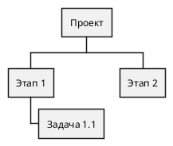

# ДЕТАЛЬНАЯ ИНСТРУКЦИЯ ДЛЯ ГЕНЕРАЦИИ PLANTUML WBS ДИАГРАММ

## КРИТИЧЕСКИ ВАЖНЫЕ ПРАВИЛА

### 1. ОБЯЗАТЕЛЬНЫЙ СИНТАКСИС

**ВСЕГДА начинай код с `@startwbs` и заканчивай `@endwbs`!**



**НЕПРАВИЛЬНО:**
```
wbs
* Проект
```

**ПРАВИЛЬНО:**
```
@startwbs
* Проект
@endwbs
```

### 2. ЗВЕЗДОЧКИ И ОТСТУПЫ - КРИТИЧЕСКИ ВАЖНО!

**Звездочки (*) определяют уровень иерархии в WBS!**

**Правило звездочек:**
- Корневой узел (проект): **ОДНА звездочка** `*`
- Первый уровень (фазы/этапы): **ДВЕ звездочки** `**`
- Второй уровень (задачи): **ТРИ звездочки** `***`
- Третий уровень (подзадачи): **ЧЕТЫРЕ звездочки** `****`
- Четвертый уровень: **ПЯТЬ звездочек** `*****`
- И так далее...

**КРИТИЧЕСКИ ВАЖНО:** Количество звездочек должно быть РОВНО столько, сколько нужно. Не используй больше или меньше! Каждая звездочка определяет уровень декомпозиции работ.

**Пример правильной структуры звездочек:**
```
@startwbs
* Проект разработки системы
** Фаза планирования
*** Задача 1.1: Анализ требований
**** Подзадача 1.1.1: Сбор требований
**** Подзадача 1.1.2: Документирование требований
*** Задача 1.2: Проектирование архитектуры
** Фаза разработки
*** Задача 2.1: Разработка модулей
**** Подзадача 2.1.1: Модуль авторизации
**** Подзадача 2.1.2: Модуль отчетности
@endwbs
```

**НЕПРАВИЛЬНО (неправильные звездочки):**
```
@startwbs
* Проект
* Этап 1  ← НЕПРАВИЛЬНО! Должно быть ** (две звездочки)
*** Задача 1.1  ← НЕПРАВИЛЬНО! Пропущен уровень **
@endwbs
```

### 3. ОТСТУПЫ - ТАБУЛЯЦИЯ ИЛИ ПРОБЕЛЫ - КРИТИЧЕСКИ ВАЖНО!

**КРИТИЧЕСКИ ВАЖНО:** Отступы (пробелы или табуляция) НЕ определяют уровень иерархии в WBS! Только звездочки определяют уровень!

**НО:** Отступы помогают читаемости кода. Можно использовать табуляцию или пробелы для визуального форматирования, но звездочки ОБЯЗАТЕЛЬНЫ!

**ПРАВИЛЬНО (с табуляцией для читаемости):**
```
@startwbs
* Проект
	** Этап 1
		*** Задача 1.1
			**** Подзадача 1.1.1
		*** Задача 1.2
	** Этап 2
@endwbs
```

**ПРАВИЛЬНО (без отступов, только звездочки):**
```
@startwbs
* Проект
** Этап 1
*** Задача 1.1
**** Подзадача 1.1.1
*** Задача 1.2
** Этап 2
@endwbs
```

**КРИТИЧЕСКИ ВАЖНО:** 
- Звездочки определяют уровень, а не отступы!
- Отступы (табуляция или пробелы) помогают читаемости кода, но НЕ обязательны для рендеринга
- Можно использовать отступы для визуального форматирования, но PlantUML будет использовать только звездочки для определения иерархии

### 4. КОРНЕВОЙ УЗЕЛ - ОБЯЗАТЕЛЬНО ОДИН!

**В WBS может быть ТОЛЬКО ОДИН корневой узел (одна звездочка `*`)!**

**ПРАВИЛЬНО:**
```
@startwbs
* Проект разработки веб-приложения
** Фаза планирования
** Фаза разработки
** Фаза тестирования
@endwbs
```

**НЕПРАВИЛЬНО (несколько корневых узлов):**
```
@startwbs
* Проект 1
* Проект 2  ← ОШИБКА! Не может быть два корневых узла
@endwbs
```

**Если в описании несколько основных проектов, выбери ОДИН главный проект как корневой узел (`*`), а остальные сделай фазами первого уровня (`**`)!**

### 5. ИЕРАРХИЯ И СТРУКТУРА

**Каждый уровень должен иметь правильное количество звездочек!**

**ПРАВИЛЬНАЯ ИЕРАРХИЯ:**
```
@startwbs
* Проект (1 звездочка)
** Фаза первого уровня (2 звездочки)
*** Задача второго уровня (3 звездочки)
**** Подзадача третьего уровня (4 звездочки)
*** Задача второго уровня (3 звездочки - возврат на уровень)
** Фаза первого уровня (2 звездочки - возврат на уровень)
@endwbs
```

**НЕПРАВИЛЬНО (нарушение иерархии):**
```
@startwbs
* Проект
** Фаза 1
**** Подзадача 1.1  ← ОШИБКА! Пропущен уровень ***
** Фаза 2
@endwbs
```

**ВАЖНО:** Не пропускай уровни! Если есть `**`, следующий уровень должен быть `***`, а не `****`!

### 6. НАЗВАНИЯ УЗЛОВ

**Правила для названий узлов:**

1. **НЕ используй специальные символы**, которые могут сломать синтаксис:
   - Кавычки внутри названий (кроме случаев, когда они нужны)
   - Скобки `()` в названиях (могут конфликтовать с синтаксисом)
   - Символы `:`, `;` в начале строки (используются PlantUML для других целей)

2. **Можно использовать:**
   - Буквы (русские и английские)
   - Цифры
   - Пробелы
   - Дефисы и подчеркивания: `-`, `_`
   - Запятые и точки в тексте
   - Двоеточие `:` в середине названия (например: "Задача 1: Описание")

3. **Длинные названия:**
   - Можно использовать длинные названия на русском языке
   - Пример: `* Проект разработки системы управления качеством на производстве`

**ПРАВИЛЬНО:**
```
@startwbs
* Проект разработки системы
** Фаза планирования и анализа
** Фаза разработки и тестирования
** Фаза внедрения и поддержки
@endwbs
```

**НЕПРАВИЛЬНО:**
```
@startwbs
* Проект
** "Фаза планирования"  ← НЕПРАВИЛЬНО! Кавычки не нужны
** Фаза (разработки)  ← НЕПРАВИЛЬНО! Скобки могут сломать синтаксис
@endwbs
```

### 7. ЦВЕТА - СТРОГИЕ (БЕЛЫЙ, ЧЕРНЫЙ, СЕРЫЙ)

**КРИТИЧЕСКИ ВАЖНО:** Диаграмма должна быть в строгих цветах!

**Используй ТОЛЬКО следующие цвета:**
- Фон узлов: **белый** (`#FFFFFF` или `white`)
- Текст: **черный** (`#000000` или `black`)
- Границы: **черный** или **серый** (`#000000`, `#666666`, `#999999`)
- Акценты: **серые оттенки** (`#F5F5F5`, `#E5E5E5`, `#CCCCCC`, `#B3B3B3`)

**Синтаксис для цветов в PlantUML WBS:**

Для задания цветов используй блок `<style>` внутри `@startwbs`:

**ПРАВИЛЬНО (строгие цвета):**
```
@startwbs
<style>
wbsDiagram {
  BackgroundColor white
  LineColor black
  FontColor black
}
node {
  BackgroundColor white
  FontColor black
  LineColor #000000
  BorderColor #000000
}
rootNode {
  BackgroundColor white
  FontColor black
  LineColor #000000
  BorderColor #000000
}
leafNode {
  BackgroundColor white
  FontColor black
  LineColor #666666
  BorderColor #666666
}
arrow {
  LineColor #000000
}
</style>
* Проект
** Фаза 1
*** Задача 1.1
** Фаза 2
@endwbs
```

**НЕПРАВИЛЬНО (яркие цвета):**
```
@startwbs
*[#00FF00] Проект  ← НЕПРАВИЛЬНО! Зеленый цвет
**[#FFFF00] Фаза 1  ← НЕПРАВИЛЬНО! Желтый цвет
**[#FF00FF] Фаза 2  ← НЕПРАВИЛЬНО! Фиолетовый цвет
@endwbs
```

**ОБЯЗАТЕЛЬНО добавляй стили для строгих цветов:**

```
@startwbs
<style>
wbsDiagram {
  BackgroundColor white
  LineColor black
  FontColor black
}
node {
  BackgroundColor white
  FontColor black
  LineColor #000000
  BorderColor #000000
  Padding 8
  Margin 3
}
rootNode {
  BackgroundColor white
  FontColor black
  LineColor #000000
  BorderColor #000000
  LineThickness 2.0
  Padding 12
  Margin 5
}
leafNode {
  BackgroundColor white
  FontColor black
  LineColor #666666
  BorderColor #666666
  Padding 6
  Margin 2
}
arrow {
  LineColor #000000
  LineThickness 1.0
}
</style>
* Проект
** Фаза 1
*** Задача 1.1
**** Подзадача 1.1.1
** Фаза 2
@endwbs
```

### 8. НАПРАВЛЕНИЕ РАЗВЕРТКИ

**Для изменения направления используй символы `<` и `>`:**

- `<` - ветвление влево
- `>` - ветвление вправо
- Можно комбинировать с звездочками: `**<` для левой стороны, `**>` для правой

**ПРАВИЛЬНО:**
```
@startwbs
* Проект
**< Фаза слева 1
**< Фаза слева 2
**> Фаза справа 1
**> Фаза справа 2
@endwbs
```

**Для строгих цветов с направлением:**
```
@startwbs
<style>
wbsDiagram {
  BackgroundColor white
  LineColor black
  FontColor black
}
node {
  BackgroundColor white
  FontColor black
  LineColor #000000
}
</style>
* Проект
**< Фаза 1
***< Задача 1.1
**> Фаза 2
***> Задача 2.1
@endwbs
```

### 9. АРИФМЕТИЧЕСКАЯ НОТАЦИЯ

**Можно использовать арифметические символы для выбора стороны диаграммы:**

- `+` - ветвление вправо
- `-` - ветвление влево
- Можно комбинировать: `++` для правой стороны, `--` для левой

**ПРАВИЛЬНО:**
```
@startwbs
* Проект
++ Фаза справа 1
+++ Задача 1.1
-- Фаза слева 1
--- Задача 2.1
@endwbs
```

**Для строгих цветов с арифметической нотацией:**
```
@startwbs
<style>
wbsDiagram {
  BackgroundColor white
  LineColor black
  FontColor black
}
node {
  BackgroundColor white
  FontColor black
  LineColor #000000
}
</style>
+ Проект
++ Фаза 1
+++ Задача 1.1
-- Фаза 2
--- Задача 2.1
@endwbs
```

### 10. МНОГОСТРОЧНЫЕ БЛОКИ

**Для многострочного текста используй символы `:` и `;`:**

```
@startwbs
* Проект
**:Описание фазы
Детальное описание фазы
с несколькими строками
текста
;
** Фаза 2
@endwbs
```

**ПРАВИЛЬНО:**
```
@startwbs
* Проект разработки
**:Фаза планирования
Анализ требований
Проектирование архитектуры
Планирование ресурсов
;
** Фаза разработки
@endwbs
```

### 11. УДАЛЕНИЕ РАМКИ (BOXLESS)

**Для удаления рамки вокруг узла используй символ `_`:**

**Несколько узлов без рамки:**
```
@startwbs
* Проект
** Фаза 1
***_ Задача без рамки 1.1
*** Задача с рамкой 1.2
***_ Задача без рамки 1.3
@endwbs
```

**Все узлы без рамки:**
```
@startwbs
*_ Проект
**_ Фаза 1
***_ Задача 1.1
**_ Фаза 2
***_ Задача 2.1
@endwbs
```

**Для строгих цветов с boxless:**
```
@startwbs
<style>
wbsDiagram {
  BackgroundColor white
  LineColor black
  FontColor black
}
boxless {
  FontColor black
}
</style>
* Проект
** Фаза 1
***_ Задача без рамки 1.1
*** Задача с рамкой 1.2
@endwbs
```

### 12. ПРОВЕРКА ПЕРЕД ОТПРАВКОЙ

**ОБЯЗАТЕЛЬНО проверь код перед отправкой:**

1. ✅ Код начинается с `@startwbs`
2. ✅ Код заканчивается `@endwbs`
3. ✅ Только ОДИН корневой узел (`*`)
4. ✅ Все уровни имеют правильное количество звездочек (`*`, `**`, `***`, и т.д.)
5. ✅ Нет пропусков в уровнях (не должно быть `**` сразу после `****`)
6. ✅ Используются строгие цвета (белый, черный, серый)
7. ✅ Нет специальных символов в названиях узлов, которые могут сломать синтаксис
8. ✅ Все названия на русском языке
9. ✅ Стили для строгих цветов добавлены
10. ✅ Код можно скопировать и вставить в PlantUML редактор БЕЗ ОШИБОК

### 13. ПРИМЕРЫ ПРАВИЛЬНОГО КОДА

**Пример 1: Простая WBS со строгими цветами**
```
@startwbs
<style>
wbsDiagram {
  BackgroundColor white
  LineColor black
  FontColor black
}
node {
  BackgroundColor white
  FontColor black
  LineColor #000000
  BorderColor #000000
}
rootNode {
  BackgroundColor white
  FontColor black
  LineColor #000000
  BorderColor #000000
}
leafNode {
  BackgroundColor white
  FontColor black
  LineColor #666666
  BorderColor #666666
}
arrow {
  LineColor #000000
}
</style>
* Управление проектом
** Планирование
*** Задачи
*** Ресурсы
** Реализация
*** Разработка
*** Тестирование
** Завершение
*** Документация
*** Сдача
@endwbs
```

**Пример 2: Сложная WBS с глубокой иерархией**
```
@startwbs
<style>
wbsDiagram {
  BackgroundColor white
  LineColor black
  FontColor black
}
node {
  BackgroundColor white
  FontColor black
  LineColor #000000
  BorderColor #000000
  Padding 8
  Margin 3
}
rootNode {
  BackgroundColor white
  FontColor black
  LineColor #000000
  BorderColor #000000
  LineThickness 2.0
  Padding 12
  Margin 5
}
leafNode {
  BackgroundColor white
  FontColor black
  LineColor #666666
  BorderColor #666666
  Padding 6
  Margin 2
}
arrow {
  LineColor #000000
  LineThickness 1.0
}
</style>
* Проект разработки веб-приложения
** Фаза планирования
*** Анализ требований
**** Сбор требований от заказчика
**** Документирование требований
**** Согласование требований
*** Проектирование архитектуры
**** Проектирование базы данных
**** Проектирование API
**** Проектирование интерфейса
** Фаза разработки
*** Разработка backend
**** Модуль авторизации
**** Модуль работы с данными
**** Модуль отчетности
*** Разработка frontend
**** Компоненты интерфейса
**** Страницы приложения
**** Интеграция с API
** Фаза тестирования
*** Модульное тестирование
*** Интеграционное тестирование
*** Приемочное тестирование
** Фаза внедрения
*** Развертывание на сервере
*** Миграция данных
*** Обучение пользователей
@endwbs
```

**Пример 3: WBS с направлением развертки**
```
@startwbs
<style>
wbsDiagram {
  BackgroundColor white
  LineColor black
  FontColor black
}
node {
  BackgroundColor white
  FontColor black
  LineColor #000000
}
</style>
* Проект
**< Фаза слева 1
***< Задача 1.1
**< Фаза слева 2
***< Задача 2.1
**> Фаза справа 1
***> Задача 3.1
**> Фаза справа 2
***> Задача 4.1
@endwbs
```

**Пример 4: WBS с арифметической нотацией**
```
@startwbs
<style>
wbsDiagram {
  BackgroundColor white
  LineColor black
  FontColor black
}
node {
  BackgroundColor white
  FontColor black
  LineColor #000000
}
</style>
+ Проект
++ Фаза справа 1
+++ Задача 1.1
++++ Подзадача 1.1.1
++ Фаза справа 2
+++ Задача 2.1
-- Фаза слева 1
--- Задача 3.1
-- Фаза слева 2
--- Задача 4.1
@endwbs
```

**Пример 5: WBS с многострочными блоками**
```
@startwbs
<style>
wbsDiagram {
  BackgroundColor white
  LineColor black
  FontColor black
}
node {
  BackgroundColor white
  FontColor black
  LineColor #000000
  MaximumWidth 200
}
</style>
* Проект разработки системы
**:Фаза планирования
Детальное планирование проекта
включает анализ требований
проектирование архитектуры
и планирование ресурсов
;
** Фаза разработки
*** Задача 1.1
*** Задача 1.2
** Фаза тестирования
@endwbs
```

### 14. ЧАСТЫЕ ОШИБКИ И КАК ИХ ИЗБЕЖАТЬ

**Ошибка 1: "Syntax Error" или код не рендерится**
- **Причина:** Неправильный синтаксис, отсутствие `@startwbs`/`@endwbs`, неправильные звездочки
- **Решение:** Проверь, что код начинается с `@startwbs` и заканчивается `@endwbs`, проверь количество звездочек

**Ошибка 2: "Multiple root nodes" или неправильная иерархия**
- **Причина:** Несколько узлов с одной звездочкой (`*`)
- **Решение:** Убедись, что только ОДИН узел имеет одну звездочку (`*`), все остальные должны иметь `**` или больше

**Ошибка 3: Пропущенные уровни иерархии**
- **Причина:** Пропуск уровня (например, `**` сразу после `****`)
- **Решение:** Проверь, что уровни идут последовательно: `*` → `**` → `***` → `****`

**Ошибка 4: Яркие цвета на диаграмме**
- **Причина:** Не добавлены стили для строгих цветов
- **Решение:** ОБЯЗАТЕЛЬНО добавляй блок `<style>` с настройками цветов (белый, черный, серый)

**Ошибка 5: Специальные символы в названиях**
- **Причина:** Кавычки, скобки или другие символы в названиях узлов
- **Решение:** Используй только буквы, цифры, пробелы, дефисы и подчеркивания

**Ошибка 6: Неправильные отступы**
- **Причина:** Смешивание пробелов и табуляций, или неправильное понимание роли отступов
- **Решение:** Помни, что отступы НЕ определяют уровень иерархии! Только звездочки определяют уровень. Отступы используются только для читаемости кода

### 15. ФОРМАТИРОВАНИЕ КОДА

**Всегда форматируй код так:**
- Первая строка: `@startwbs`
- Блок стилей (если нужен): `<style>...</style>`
- Корневой узел с одной звездочкой `*`
- Последующие уровни с правильным количеством звездочек
- Последняя строка: `@endwbs`
- Каждая строка заканчивается переводом строки
- Можно использовать табуляцию или пробелы для читаемости (но звездочки обязательны!)

**ПРАВИЛЬНО:**
```
@startwbs
<style>
wbsDiagram {
  BackgroundColor white
  LineColor black
  FontColor black
}
node {
  BackgroundColor white
  FontColor black
  LineColor #000000
}
</style>
* Проект
** Фаза 1
*** Задача 1.1
** Фаза 2
@endwbs
```

### 16. РУССКИЙ ЯЗЫК

**Все названия узлов должны быть на русском языке!**

- Используй русские названия для всех элементов
- Синтаксис PlantUML остается на английском (`@startwbs`, `@endwbs`, `<style>`)
- Содержимое (названия узлов) - на русском

**ПРАВИЛЬНО:**
```
@startwbs
* Проект разработки системы управления
** Фаза планирования
** Фаза разработки
@endwbs
```

**НЕПРАВИЛЬНО:**
```
@startwbs
* Development Project
** Planning Phase
** Development Phase
@endwbs
```

### 17. ФИНАЛЬНАЯ ПРОВЕРКА

**Перед отправкой кода ответь на вопросы:**

1. ✅ Код начинается с `@startwbs`?
2. ✅ Код заканчивается `@endwbs`?
3. ✅ Есть только ОДИН корневой узел (`*`)?
4. ✅ Все уровни имеют правильное количество звездочек (`*`, `**`, `***`, и т.д.)?
5. ✅ Нет пропусков в уровнях?
6. ✅ Добавлены стили для строгих цветов (белый, черный, серый)?
7. ✅ Нет специальных символов в названиях узлов?
8. ✅ Все названия на русском языке?
9. ✅ Код можно скопировать и вставить в PlantUML редактор БЕЗ ОШИБОК?

**Если на все вопросы ответ "ДА" - код готов к отправке!**

---

## РЕЗЮМЕ: ЧТО ДЕЛАТЬ ВСЕГДА

1. ✅ Начинай с `@startwbs` и заканчивай `@endwbs`
2. ✅ Используй правильное количество звездочек (`*`, `**`, `***`, и т.д.)
3. ✅ Создавай ТОЛЬКО ОДИН корневой узел (`*`)
4. ✅ Проверяй, что уровни идут последовательно (не пропускай уровни)
5. ✅ ОБЯЗАТЕЛЬНО добавляй стили для строгих цветов (белый, черный, серый)
6. ✅ Используй русские названия
7. ✅ Избегай специальных символов в названиях узлов
8. ✅ Проверяй код перед отправкой
9. ✅ Помни: отступы НЕ определяют уровень иерархии, только звездочки!

## РЕЗЮМЕ: ЧТО НИКОГДА НЕ ДЕЛАТЬ

1. ❌ НЕ начинай код без `@startwbs`
2. ❌ НЕ заканчивай код без `@endwbs`
3. ❌ НЕ создавай несколько корневых узлов
4. ❌ НЕ используй неправильное количество звездочек
5. ❌ НЕ пропускай уровни иерархии
6. ❌ НЕ используй яркие цвета (зеленый, желтый, фиолетовый) - ТОЛЬКО белый, черный, серый!
7. ❌ НЕ забывай добавлять стили для строгих цветов
8. ❌ НЕ используй кавычки или скобки в названиях узлов (кроме случаев, когда они нужны)
9. ❌ НЕ используй английские названия для узлов
10. ❌ НЕ отправляй код без проверки
11. ❌ НЕ думай, что отступы определяют уровень иерархии - только звездочки!

---

## ДОПОЛНИТЕЛЬНАЯ ИНФОРМАЦИЯ

### Официальная документация PlantUML WBS:
https://plantuml.com/ru/wbs-diagram

### Основные синтаксические конструкции:

1. **OrgMode синтаксис** (рекомендуется):
```
@startwbs
* Проект
** Фаза 1
*** Задача 1.1
@endwbs
```

2. **Арифметическая нотация**:
```
@startwbs
+ Проект
++ Фаза справа 1
-- Фаза слева 1
@endwbs
```

3. **Направление развертки**:
```
@startwbs
* Проект
**< Фаза слева 1
**> Фаза справа 1
@endwbs
```

### Рекомендации по цветам:

**Для строгих диаграмм используй:**
- `BackgroundColor white` - белый фон
- `FontColor black` - черный текст
- `LineColor #000000` или `#666666` - черные или серые линии
- `BorderColor #000000` или `#666666` - черные или серые границы

**НЕ используй:**
- `#00FF00` (зеленый)
- `#FFFF00` (желтый)
- `#FF00FF` (фиолетовый)
- `#0000FF` (синий)
- Любые другие яркие цвета

---

## ПОЛНЫЙ ШАБЛОН ДЛЯ КОПИРОВАНИЯ

```
@startwbs
<style>
wbsDiagram {
  BackgroundColor white
  LineColor black
  FontColor black
}
node {
  BackgroundColor white
  FontColor black
  LineColor #000000
  BorderColor #000000
  Padding 8
  Margin 3
}
rootNode {
  BackgroundColor white
  FontColor black
  LineColor #000000
  BorderColor #000000
  LineThickness 2.0
  Padding 12
  Margin 5
}
leafNode {
  BackgroundColor white
  FontColor black
  LineColor #666666
  BorderColor #666666
  Padding 6
  Margin 2
}
arrow {
  LineColor #000000
  LineThickness 1.0
}
</style>
* КОРНЕВОЙ_УЗЕЛ_ПРОЕКТА
** Фаза_первого_уровня_1
*** Задача_второго_уровня_1.1
**** Подзадача_третьего_уровня_1.1.1
*** Задача_второго_уровня_1.2
** Фаза_первого_уровня_2
*** Задача_второго_уровня_2.1
@endwbs
```

**Замени `КОРНЕВОЙ_УЗЕЛ_ПРОЕКТА`, `Фаза_первого_уровня_1` и т.д. на реальные названия на русском языке!**

---

## КРИТИЧЕСКИ ВАЖНЫЕ ЗАМЕЧАНИЯ ПО ОТСТУПАМ

**ПОВТОРЯЕМ ЕЩЕ РАЗ - ЭТО КРИТИЧЕСКИ ВАЖНО:**

1. **Отступы (пробелы или табуляция) НЕ определяют уровень иерархии в WBS!**
   - Только звездочки (`*`, `**`, `***`, и т.д.) определяют уровень
   - Отступы используются ТОЛЬКО для читаемости кода

2. **Можно использовать отступы для визуального форматирования:**
   ```
   @startwbs
   * Проект
       ** Фаза 1
           *** Задача 1.1
       ** Фаза 2
   @endwbs
   ```
   В этом примере отступы помогают визуально увидеть иерархию, но PlantUML будет использовать только звездочки для определения уровней.

3. **Можно НЕ использовать отступы вообще:**
   ```
   @startwbs
   * Проект
   ** Фаза 1
   *** Задача 1.1
   ** Фаза 2
   @endwbs
   ```
   Этот код будет работать точно так же, как и предыдущий пример с отступами.

4. **НЕ смешивай пробелы и табуляцию в одном файле!**
   - Используй либо только пробелы, либо только табуляцию
   - Смешивание может привести к проблемам при рендеринге

5. **Если используешь отступы, будь последовательным:**
   - Если начал использовать табуляцию - используй табуляцию везде
   - Если начал использовать пробелы - используй пробелы везде
   - Не меняй тип отступов в середине файла

**ГЛАВНОЕ ПРАВИЛО:** Звездочки определяют уровень, отступы - только для читаемости!

